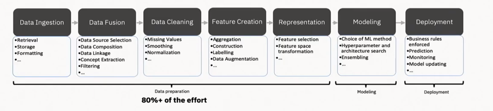
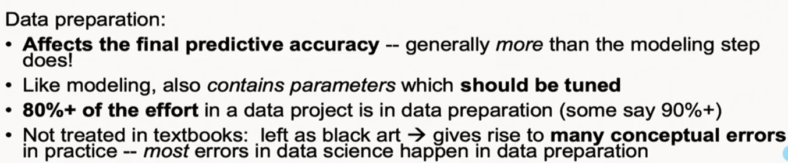

# The Motivation {.center}

## Networks Are Critical — and Not Self-Managing

The Internet is part of our **critical infrastructure**. Yet it is prone to
failures, misconfigurations, and attacks — and it does not fix itself.

**Network operators** must continually:

- Detect and respond to **performance degradation and failures**
- Counter **cyberattacks** in near-real time
- Provision and forecast **capacity** for changing demand

::: {.notes}
Open with the COVID-19 story from the book's intro: when the pandemic hit in
2020, Internet traffic patterns shifted overnight — enterprise to home, video
conferencing surged, CDN load spiked. The network held up, but only because
humans scrambled. That fragility — humans in the loop — is the entire
motivation for this course. See the Introduction chapter of "Machine Learning
for Networking."
:::

## Why Not Just Write Rules?

Networks were once modeled in **closed form**. Today:

- Systems are far too **complex** for closed-form analysis
- Traffic is **encrypted** — payload-inspection rules fail
- Attack patterns **evolve** faster than signatures can be written
- Demand patterns **drift** on timescales no static model captures

> "A computer program is said to learn from experience E, with respect to
> some task T and some performance measure P, if its performance on T, as
> measured by P, improves with experience E." — Tom Mitchell, 1997

::: {.notes}
Walk through the Mitchell definition carefully. Contrast it with a
traditional routing algorithm: OSPF always does the same thing for the same
input. An ML model improves as it sees more data. The distinction is subtle
but fundamental. The book's intro chapter distinguishes ML from "standard"
algorithms in exactly this way — it is worth dwelling on.
:::

## The ML Control Loop

::: {.columns}
::: {.column width="55%"}
Networks produce rich, continuous data:

- **Raw traffic** (packets, flows, payloads)
- **Flow records** (NetFlow, IPFIX)
- **Summary statistics** (counters, metrics)
- **User feedback** (QoE signals)

Machine learning sits between **measurement** and **control**.
:::
::: {.column width="45%"}

:::
:::

::: {.notes}
Figure s04-i01 shows the ML pipeline (data ingestion through deployment).
Walk through each box: data ingestion → fusion → cleaning → feature creation
→ representation → modeling → deployment. The key insight is that 80%+ of
the effort is in data preparation — not modeling. See Figure 1 (ml-loop) in
the book's Introduction chapter.
:::

## A 2025 Milestone: Self-Driving Networks Ship {.smaller}

::: {.vignette}
**August 2025 — HPE Juniper Mist AI:** HPE announced production-ready
"self-driving network" capabilities built on the Mist AI platform. Agentic AI
agents now autonomously resolve misconfigurations, capacity issues, and
non-compliant hardware — with a human-in-the-loop trust model that lets
operators dial up automation confidence over time. Gartner named Juniper a
Leader in its 2025 Magic Quadrant for Enterprise Wired and Wireless LAN
Infrastructure. Source: [HPE newsroom, Aug 26 2025](https://newsroom.juniper.net/news/news-details/2025/HPE-accelerates-self-driving-network-operations-with-new-Mist-agentic-AI-native-innovations-2025-Gw1M0nv_Oz/default.aspx)
:::

This is the **measure → infer → control** loop running in production.

::: {.notes}
The "self-driving network" framing maps directly to Feamster (2017) cited in
the textbook. Point out that this is no longer a research vision — it shipped
commercially. Ask students: what could go wrong when the loop closes without
a human? (Hint: feedback instability, adversarial drift.) This sets up the
entire course arc.
:::

# What ML Can Do for Networks {.center}

## Three Problem Families

::: {.columns}
::: {.column width="33%"}
**Security & Privacy**

- Intrusion detection
- Botnet / DDoS detection
- Malware traffic fingerprinting
- Spam and phishing filtering
:::
::: {.column width="33%"}
**Performance**

- Quality of Experience (QoE) inference
- Video rebuffering prediction
- Application identification
- Congestion forecasting
:::
::: {.column width="33%"}
**Resource Management**

- Traffic engineering (TE)
- Capacity provisioning
- Load balancing
- Job / cache placement
:::
:::

::: {.notes}
Each family is a multi-week block in the course. The book's intro sketches the
historical arc: security ML dates to 1990s spam filters and the DARPA KDD
challenge; performance ML emerged in the mid-2000s; resource management and
closed-loop control are the current frontier. Don't rush — ask students to
name one example from each column before revealing.
:::

## A Brief History

| Era | Milestone | What Changed |
|-----|-----------|--------------|
| 1990s | Spam filters; DARPA KDD challenge | First statistical classifiers on network data |
| Mid-2000s | Botnet detection; traffic classification | Offline ML on labeled traces becomes practical |
| Late 2000s–2010s | SDN; OpenFlow | Programmable control plane separates data from decisions |
| 2014–present | P4; streaming telemetry | Real-time, fine-grained measurement at line rate |
| 2020s | AutoML; Mist AI; LLM-assisted ops | Closed-loop, agentic, real-time ML in production |

::: {.notes}
The "Why Now?" section of the book's intro ties these eras together. Three
enablers created the current moment: (1) democratized ML libraries
(PyTorch, scikit-learn), (2) automated pipelines (AutoML), and (3)
programmable telemetry (P4/INT). All three are required simultaneously — none
of the earlier eras had all three.
:::

## The Gap: Where We Are vs. Where We Want to Be {.smaller}

::: {.columns}
::: {.column width="50%"}
**What exists today**

- Offline detection (security, traffic classification)
- Offline prediction (TE, provisioning)
- Low-level metric collection (counters, flow records)
- Increasingly programmable data planes
:::
::: {.column width="50%"}
**What we still need**

- Real-time, coupled inference + control
- High-level application properties from encrypted traffic
- Scalable, distributed, real-time control
- QoE inference without payload access
:::
:::

::: {.notes}
This "gap" slide is the research agenda for the field — and the motivation for
the course projects. The left column = what a good practitioner can do today.
The right column = open problems. Ask students which gap interests them most;
it often predicts their project direction. See the "State of the Art" material
in the source extract.
:::

# The Machine Learning Pipeline {.center}

## The Pipeline — 80% Is Not Modeling

::: {.notes}
Return to this figure throughout the course. The pipeline runs: Data
Ingestion → Data Fusion → Data Cleaning → Feature Creation → Representation
→ Modeling → Deployment. The key message: textbooks focus on the Modeling
box. This course focuses on the whole pipeline, especially data representation
— because in networking, *how* you represent traffic is often more important
than *which* model you choose.
:::

## Why Data Representation Matters

::: {.columns}
::: {.column width="50%"}
**The same traffic, many representations:**

- Packet bytes (raw)
- Flow five-tuple + counters
- DNS query sequences
- Timing histograms
- Graph of host interactions
:::
::: {.column width="50%"}
**Each enables different inferences:**

- Payload → DPI, malware detection
- Flow stats → port-scan, DDoS
- DNS → botnet C&C
- Timing → covert channels
- Graph → community / botnet structure
:::
:::

::: {.notes}
This is the central practical insight of the book. The choice of
representation constrains what the model can learn. A flow-level model can
never detect payload-level attacks, no matter how sophisticated. This idea
recurs in every application chapter.
:::

## The Data-Preparation Reality

::: {.columns}
::: {.column width="60%"}
From the ML pipeline in practice:

- **80%+ of effort** is data preparation
- Most errors in data science happen in **data preparation**, not modeling
- Data preparation contains **tunable parameters** just like models do
- Largely absent from textbooks — treated as a "black art"
:::
::: {.column width="40%"}

:::
:::

::: {.notes}
Image s04-i02 reinforces this point with text from the original slides. This
is a recurring theme throughout the course and the textbook. Emphasize that
students who become good at data preparation are more valuable than those who
only know how to tune hyperparameters.
:::

# Course Arc and Logistics {.center}

## Learning Objectives

By the end of this course you should be able to:

1. Explain what ML **can and cannot** do for a range of practical networking problems
2. Apply the **end-to-end ML pipeline** — from data acquisition to model deployment
3. Select appropriate **models and representations** for different network data types
4. Identify and navigate the **practical pitfalls**: overfitting, label scarcity,
   concept drift, deployment costs, and privacy constraints

::: {.notes}
Read these aloud and ask students to write down which one they feel least
prepared for. That's usually the most important one. Objective 4 (pitfalls)
consistently surprises students — most come in thinking the course is about
training better models.
:::

## Course Arc — What We Cover

::: {.columns}
::: {.column width="50%"}
**Data and Measurement**

- Network data types and representations
- Feature engineering for network data
- Data pipelines and cleaning

**Models**

- Supervised: classification, regression
- Unsupervised: anomaly detection, clustering
- Deep learning; state-space models; diffusion
:::
::: {.column width="50%"}
**Applications**

- Security: intrusion, botnet, DDoS detection
- Performance: QoE, traffic engineering
- Resource management and provisioning
- Generative models; synthetic traffic

**Deployment**

- Pitfalls: drift, bias, adversarial examples
- Privacy, legal, and ethical constraints
:::
:::

::: {.notes}
This two-column view maps to the book's chapter structure. Point students to
the companion textbook "Machine Learning for Networking" — chapters are
assigned readings throughout the course. The applications block is what
motivates everything; we teach models in service of the applications, not for
their own sake.
:::

## Assignments and Project

**Assignments** (~4–5, every two weeks):

- Setting up an ML pipeline
- Supervised learning: traffic classification
- Unsupervised learning: anomaly detection
- Deployment considerations

**Project** (choose one):

- **ML/Net Leaderboard** — reproduce or extend best-known results on
  nPrint/pcapML benchmark tasks
- **Research project** — independent open-ended project (requires proposal;
  better suited for grad students)

::: {.notes}
The leaderboard option is designed to give students a concrete, reproducible
baseline. nPrint is a packet representation library developed at this lab that
dramatically simplifies the data-ingestion step of the pipeline. Students who
have taken this course before consistently say the leaderboard projects
were the most educational experiences. Encourage teams of 2–3.
:::

## Course Mechanics

| Item | Detail |
|---|---|
| **Readings** | Textbook + papers; assigned before class; bring one question |
| **Assignments** | Out Fridays, due Fridays; ~biweekly cadence |
| **Late policy** | Late hours in the syllabus; no ad-hoc extensions |
| **Q&A** | Slack (public channel); post what you tried first |
| **Collaboration** | Encouraged on assignments; individual on midterm/final |

::: {.notes}
Stress the "bring one question about the reading" norm — it sets the tone that
class is a conversation, not a lecture. The late-hours policy is designed to
be fair to all students without requiring case-by-case judgment calls.
:::

## Tools and Setup — Do This Now

Before next class:

- Install **Jupyter** (Anaconda or VS Code + Python extension)
- Join course **Slack, Canvas, Gradescope**
- Clone the course repository and run the warm-up notebook

First hands-on session: simple Python/Jupyter notebook exploring real
network data — before we formalize any ML concepts.

::: {.notes}
The workflow check-in on Slack is deliberate: it forces students to verify
their environment is working before the first assignment drops. Past cohorts
have lost two days recovering from environment issues the night an assignment
was due.
:::

# Where This Course Takes You {.center}

## ML for Networks Is an Open Field

- Most production systems still rely on **rules, thresholds, and human judgment**
- The gap between what ML *can* do and what is *deployed* is enormous
- Careers at this intersection: network ML researcher, AIOps engineer,
  network security data scientist, infrastructure ML platform engineer

**The researchers, practitioners, and companies that close this gap will
define how the Internet is operated for the next decade.**

::: {.notes}
End with optimism and scope. Students should leave feeling that they are
walking into a field that is genuinely open — not one where all the good
problems are solved. The "self-driving network" vignette from earlier shows
the frontier is active right now. Close by asking: what network management
problem would you most want to automate, and why?
:::
