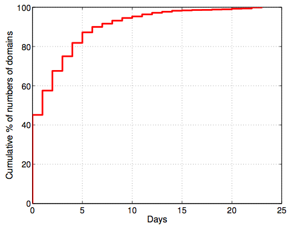
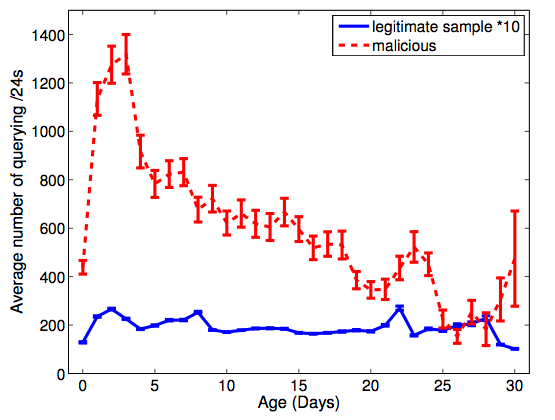
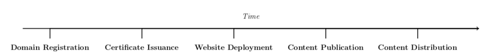
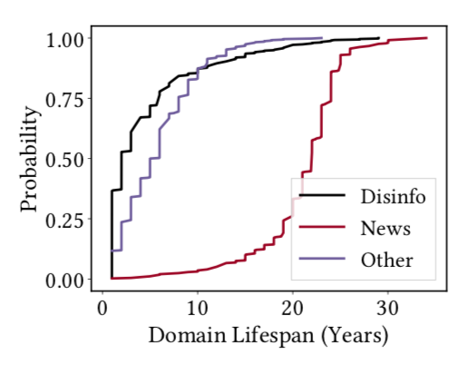
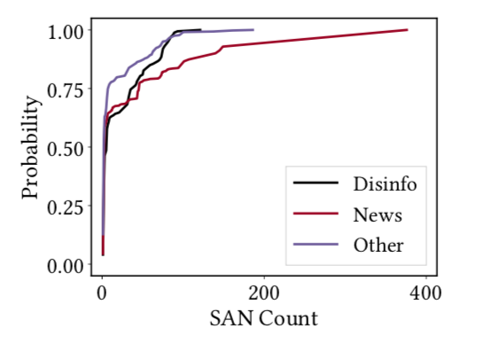

# ML for Security {.center}

> Networks generate signals. Attackers leave traces. **ML bridges the two.**

::: {.notes}
Open with the framing question: what does it mean for a network to be under attack, and what makes ML a natural tool here? Security problems are fundamentally prediction problems — can we distinguish malicious from benign behavior before harm occurs? This lecture covers two directions: ML *applied to* network security problems (spam, DNS abuse, anomaly detection) and attacks *against* ML systems deployed in security contexts. See the Security and Privacy chapter.
:::

## Two Directions: ML and Security

::: {.columns}
::: {.column width="50%"}
**ML for Security**

Using ML to detect, classify, and predict threats

- Spam and phishing detection
- Malware and intrusion detection
- DNS abuse and domain reputation
- Anomaly detection in traffic
:::
::: {.column width="50%"}
**Security of ML**

Protecting the ML models themselves

- Adversarial evasion attacks
- Poisoning and backdoor attacks
- Privacy attacks (membership inference, model inversion)
- Defenses and robustness
:::
:::

::: {.notes}
The book chapter is explicit that these two are often conflated. The same traffic classifier that detects malware *is itself* an attack target. Both directions matter for systems engineers.
:::

## Why Security Is Hard for ML {.smaller}

**Security problems are rare-event prediction at scale**

- **Class imbalance:** attacks are rare; false-positive cost is high
- **Concept drift:** adversaries adapt; yesterday's model fails tomorrow
- **Heterogeneous data:** flows, DNS, headers, payload, graph structure
- **Real-time constraints:** decisions must happen at line rate, not offline

::: {.vignette}
**CrowdStrike 2026 Global Threat Report** (released February 24, 2026): AI-enabled adversaries increased operations **89% year-over-year**. Average attacker breakout time — the window from initial compromise to lateral movement — fell to **29 minutes**, with the fastest observed intrusion completing lateral movement in **27 seconds**. ML-based detection that operates in batch mode is now too slow for the threat.

*Source: CrowdStrike 2026 Global Threat Report, crowdstrike.com/en-us/global-threat-report*
:::

::: {.notes}
The 29-minute breakout figure is from CrowdStrike's 2026 Global Threat Report, released February 24 2026. It directly motivates why real-time, network-level ML matters — by the time a human analyst reviews a log, the attacker may already have pivoted. Cold call: what kind of ML architecture could operate at line rate? (Hint: lightweight classifiers on flow features, not deep inference per packet.)
:::

# Part 1: ML Applied to Network Security {.center}

Spam · DNS · Anomaly Detection

## The Measure–Model–Control Loop

ML for security fits the same closed-loop architecture as network management:

| Stage | Security Instantiation |
|---|---|
| **Measure** | Flow records, DNS queries, BGP updates, payload fragments |
| **Model** | Classify / score / cluster for malicious behavior |
| **Control** | Block, rate-limit, redirect, quarantine, escalate |

::: {.notes}
Draw the connection to the general network control loop introduced in the first lecture. The three stages map cleanly onto security operations: a lightweight threshold triggers deep-packet inspection (measure escalation); a trained classifier scores each flow (model); a firewall rule or rate-limiter acts (control). The ML pipeline here is the same one the rest of the course covers — the domain-specific challenge is the adversarial environment.
:::

## Spam and Phishing: What's Different

Content filters and IP blacklists are the baseline — they fail predictably:

- **Content filters** are evaded by obfuscation: images, PDFs, Unicode tricks, AI-generated text
- **IP blacklists** age out: ~10% of spam senders use a previously unseen IP each day (dynamic allocation, new infections)
- **Behavioral signals persist** even when content and addresses change

**Key insight:** Filter based on *how* mail is sent, not only *what* it says.

::: {.notes}
The IP-novelty figure (10% unseen per day) comes from the Ramachandran & Feamster work that motivates behavioral blacklisting. Ask students: if you had to identify a spammer without reading the email at all, what signals would you look for? Lead toward: sending volume, time-of-day, IP-space clustering, connection patterns.
:::

## Behavioral Features for Spam Detection {.smaller}

Three behavioral invariants that spammers cannot easily hide:

::: {.columns}
::: {.column width="50%"}
**Agility** — Spammers constantly move to evade detection

- Rapid BGP prefix announcements and withdrawals
- Fast-flux DNS: IP changes every few minutes
- Feature: rate of IP / prefix churn per sending domain

**Exposure** — Sending behavior differs from legitimate mail

- Volume bursts, unusual hours, high recipient counts
- Feature: connection rate, recipients per session, session duration
:::
::: {.column width="50%"}
**Coordination** — Spammers behave like each other

- Many compromised hosts on the same network block
- k-nearest-neighbor analysis in IP space: spammer senders cluster tightly
- Feature: distance to k nearest senders in IP address space

**Result (SNARE, USENIX Security 2009):** network-level features alone achieve accuracy comparable to content filters, using a single packet from the SMTP handshake.
:::
:::

::: {.notes}
SNARE: Spatio-temporal Network-level Automatic Reputation Engine. Hao, Feamster, Gray, Krasser 2009. The key pedagogical point: features derived from the network layer (BGP, DNS, IP topology) are much harder for spammers to forge than application-layer content, because changing them has operational cost. The k-NN IP-space clustering finding is counterintuitive — why would botnets cluster in IP space? Because ISPs assign contiguous blocks to customers, so a single infected ISP creates a dense cluster.
:::

## Predictive Analytics and DNS {.smaller}

Spammers must register domains before they can send spam. DNS lookups precede attacks.

::: {.columns}
::: {.column width="48%"}

:::
::: {.column width="48%"}

:::
:::

::: {.notes}
Source: Hao, Feamster, Pandrangi. "Monitoring the Initial DNS Behavior of Malicious Domains." ACM IMC 2011. The registration-to-use gap is the detection window. The query-volume spike for malicious domains in the first few days is the signal. Ask: what are the features you would extract from DNS to detect malicious domains? (Registrar, nameserver AS, TTL, query burstiness, cohesion with concurrently registered domains.)
:::

## Domain Features at Registration Time {.smaller}

Detection before first use: features derived from the registration event itself.

::: {.columns}
::: {.column width="50%"}
**Domain name features**

- Character trigrams in the domain name
- Edit distance to known-malicious domains
- Presence of numeric characters, hyphens, keyword ("news", "herald")
- Top-level domain novelty (.xyz, .club, .news)

**Registration metadata**

- Registrar identity
- WHOIS privacy proxy (hiding registrant)
- Registration-to-expiration window
:::
::: {.column width="50%"}
**Batch correlation features**

- How many domains registered in the same time window?
- Name cohesiveness: edit distance among co-registered domains
  — cohesive batches (e.g., cheap-rx1.com, cheap-rx2.com) are a red flag
- Reuse patterns: drop-catch vs. re-registration of expired domains

These features fire at registration time — before the domain is ever used for an attack.
:::
:::

::: {.notes}
Walk through the edit-distance idea concretely: insertion (abcdef → abcHdef), deletion (abcHdef → abcdef), substitution (abCdef → abHdef). Spammers often create domain names that are slight misspellings of trusted brands. Batch cohesion is a property of individual domains — a domain that was registered in a cohesive batch is suspect even if its own name looks clean.
:::

## Disinformation Infrastructure Detection {.smaller}

The same infrastructure-analysis approach applies to disinformation websites.

**Dataset:** 769 disinformation sites vs. 533 authentic news sites (sources: FactCheck, Buzzfeed, Snopes, Politifact, Newsguard, AWIS).

Key infrastructure signals:

- **Domain lifespan:** disinformation domains are shorter-lived than legitimate news domains
- **Certificate SAN count:** disinformation sites use short SANs; legitimate news orgs have large SANs (multi-domain certificates)
- **CMS fingerprint:** 82% of disinformation sites use WordPress vs. ~20% of news sites; disinformation sites prefer cheap, generic themes

::: {.notes}
The disinformation infrastructure work extends the DNS/registration approach. The key pedagogical point: the *content* of disinformation is hard to evaluate automatically (what is "false"?), but the *infrastructure* used to host and distribute it differs measurably from legitimate news infrastructure. The two CDFs on the next slide make the lifespan and SAN findings concrete.
:::

## Infrastructure Signals: Lifespan and Certificates {.smaller}

::: {.columns}
::: {.column width="48%"}

:::
::: {.column width="48%"}

:::
:::

::: {.notes}
Walk through both CDFs. Left: domain lifespan separates the classes cleanly — news organizations register domains for decades; disinformation domains are short-lived commodities. Right: the SAN-count finding is counterintuitive — you might expect disinformation sites to pile many domains onto one cheap certificate, but it is the legitimate news organizations (with large multi-domain certificate management operations) that have the long tail of SAN counts. Ask students: which of these features could an adversary cheaply forge? (Registering a domain for 10 years costs money up front — the feature has adversarial cost, like the network-level spam features earlier.)
:::

# Part 2: Security of ML Systems {.center}

Threat Models · Evasion · Poisoning · Privacy

## Threat Model: Who Is the Attacker? {.smaller}

Before analyzing any ML system's security, define the **threat model** precisely.

**Attacker knowledge (what they can see):**

| Level | Access | Realistic When |
|---|---|---|
| **White-box** | Full model: architecture, weights, training data | Model on end-user device; published paper describes model exactly |
| **Gray-box** | Architecture known; weights or data unknown | Conference talk revealed "we use random forest" |
| **Black-box** | Observe outputs only; no internal access | Attacker sends traffic, watches whether it is blocked |

**Attacker capability (when they can act):**

- **Inference-time (evasion):** model is fixed; attacker crafts inputs to fool deployed model
- **Training-time (poisoning):** attacker injects data before or during training

::: {.notes}
The threat model framework is the first thing in the book's security chapter, and it is the right place to start. Without a threat model, security analysis is meaningless — you can claim any system is "secure" by assuming a sufficiently weak adversary. Ask students: which threat model applies to a traffic classifier run by an ISP? (Black-box, inference-time — the attacker can send traffic and observe whether it is blocked, but cannot access the classifier internals.) Which applies to a malware detector shipped on user laptops? (White-box is plausible — an attacker can buy a laptop and reverse-engineer the binary.)
:::

## The Feature–Problem Space Gap

A critical networking-specific constraint on adversarial attacks.

::: {.columns}
::: {.column width="55%"}
**In computer vision:**
Attacker modifies pixel values directly → feature vector is the artifact

**In networking:**
Attacker sends *packets* → network monitor extracts features → features enter model

The attacker **cannot set "packets per second" to an arbitrary value** — they must generate valid TCP sessions, correct checksums, plausible timing.

This makes network adversarial attacks **harder** than image attacks — but not impossible.
:::
::: {.column width="45%"}
**Problem-space perturbations that are feasible:**

- **Packet padding:** add bytes to change size features
- **Burst injection:** insert empty packets to alter timing features
- **Payload modification:** alter application-layer content (attacker controls the malware)
- **Blind perturbations:** craft inputs that transfer across unknown models without gradient access
:::
:::

::: {.notes}
The feature-space / problem-space gap is one of the most important networking-specific ideas in the book. In image classification, the image *is* the feature vector — you can add a tiny perturbation to each pixel and nothing physically constrains you. In networking, you have to produce actual packets that a real network will forward. Discuss: what protocol constraints does a TCP flow have to satisfy? (Sequence numbers, checksums, window sizes, handshake order.) Any adversarial perturbation that violates these will be dropped by the network before it reaches the classifier.
:::

## Adversarial Evasion: Gradient-Based Attacks

Given **white-box** access, the attacker exploits differentiability.

**Fast Gradient Sign Method (FGSM):**

$$x_{\text{adv}} = x + \epsilon \cdot \text{sign}(\nabla_x L(\theta, x, y))$$

Take the gradient of the loss w.r.t. the input; step in the direction that increases loss.

**Stronger variants:**

- **PGD (Projected Gradient Descent):** multiple smaller steps + project back onto allowed perturbation set
- **Carlini & Wagner (C&W):** jointly minimize perturbation size and maximize misclassification probability — the standard benchmark for evaluating robustness

**Black-box alternative:** craft adversarial examples against a *surrogate model*; exploit *transferability* to fool the unknown target.

::: {.notes}
Walk through the FGSM formula carefully. The sign function means every feature gets perturbed by exactly ±ε, making the attack cheap to compute. PGD is just iterated FGSM with a projection step — it generally finds stronger adversarial examples. C&W is the gold standard for evaluation: if a defense cannot withstand C&W, it is not robust. For networking applications, remind students of the problem-space constraint: FGSM may suggest setting "mean packet size" to a fractional value, which is meaningless in a real network.
:::

## Poisoning and Backdoor Attacks

**Data poisoning:** inject crafted examples into the training set.

- An ISP collects flow records from live traffic; an attacker who can send traffic during collection can influence labels
- Ground truth often assigned by heuristics (port numbers, DPI) — easy to subvert
- Even a small fraction of poisoned data can shift the decision boundary significantly (gradient-based training gives outsized weight to outliers near the boundary)

**Backdoor (trojan) attacks:**

- Plant a hidden *trigger* (e.g., a specific 3-packet size sequence: 64, 128, 256 bytes)
- Model behaves normally on all clean inputs; trigger causes misclassification as "benign"
- Model maintains normal accuracy → backdoor is undetectable by standard evaluation

**Federated learning amplifies the risk:** a single compromised ISP contributor can inject a backdoor into a shared model; other ISPs never see the raw data.

::: {.notes}
The backdoor attack example from the book is worth making concrete: a C2 traffic detector that is backdoored to misclassify any traffic containing the trigger sequence as "benign" traffic. From the attacker's perspective, this is ideal — the model passes all standard tests, and the evasion is guaranteed on any future detection attempt. The federated learning amplification is particularly insidious in the ISP context, where collaborative training is appealing precisely because ISPs cannot share raw traffic data.
:::

## Privacy Attacks: What Models Remember {.smaller}

ML models trained on network data implicitly memorize private information.

**Why network data is sensitive:**
- Traffic metadata reveals browsing habits, application usage, physical location — without payload
- Flow patterns can re-identify individuals even from supposedly anonymized datasets

**Membership inference:**
> Was this user's traffic in the training set?

The attacker trains *shadow models* on known datasets; exploits the **generalization gap** — models assign lower loss (higher confidence) to examples seen in training. A simple threshold on prediction loss can reveal membership.

**Model inversion:**
> What does the model's training data look like?

Optimization-based: initialize a candidate feature vector; query model for confidence; gradient-descend to increase confidence. Result: a "typical" example of each class — which reflects real training data patterns.

**Implication:** An ISP's traffic classifier may leak whether a specific user was active during the data collection window, and what their traffic looked like.

::: {.notes}
Membership inference is particularly relevant for network data because the "membership" signal has privacy implications: knowing that a user's traffic was in a training set tells you they were using the network during that period. For enterprise networks, this could be sensitive. The generalization gap is the fundamental leakage mechanism — overfitting is both a performance problem and a privacy problem.
:::

## Defenses: Raising the Cost of Attacks

No single defense provides permanent protection — this is an arms race.

::: {.columns}
::: {.column width="50%"}
**Adversarial training**

$$\min_\theta \; \mathbb{E}_{(x,y)} \left[ \max_{\|\delta\| \leq \epsilon} L(\theta, x + \delta, y) \right]$$

Generate adversarial examples during training (PGD); add to training set with correct labels. Forces the model to be robust to worst-case perturbations.

*Networking caveat:* adversarial examples must satisfy protocol constraints, not just feature-space bounds.
:::
::: {.column width="50%"}
**Ensemble methods (TIKI-TAKA)**

Train multiple diverse classifiers; use a meta-classifier to combine predictions. An adversarial example that fools one model is unlikely to fool all of them simultaneously.

**Protocol-level robustification**

Pad all packets to a fixed size → eliminates packet-size features as an attack surface. Randomize inter-packet delays → makes timing features unreliable.

*Tradeoff:* bandwidth and latency overhead.
:::
:::

::: {.notes}
The min-max formulation of adversarial training is the clearest way to state what "robust model" means: you want a model that minimizes loss even against the worst-case perturbation within the allowed budget ε. Protocol-level robustification is unique to networking and worth emphasizing — it does not require changing the ML model at all. It is also a privacy defense: the same packet padding that defeats size-based adversarial attacks also defeats size-based traffic analysis by a passive observer.
:::

## Federated Learning for Network Security {.smaller}

**The problem:** ISPs each have too little data to train robust classifiers alone; sharing raw traffic data raises privacy and legal concerns.

**Federated Averaging (FedAvg):**

1. Server broadcasts current global model to a subset of ISPs
2. Each ISP trains locally on their own traffic data for several epochs
3. ISPs return model parameter updates (not raw data) to the server
4. Server averages updates (weighted by local dataset size) → new global model
5. Repeat until convergence

**Benefits for network security:**
- Collaborative training without sharing traffic metadata
- Each ISP benefits from the collective diversity of traffic types

**Challenges:**
- **Non-IID data:** residential ISP traffic ≠ enterprise ISP traffic; local gradients may conflict
- **Poisoning vulnerability:** a compromised ISP can inject backdoors via manipulated model updates
- Differential privacy mechanisms can bound information leakage but reduce model accuracy

::: {.notes}
FedAvg is the foundational algorithm — McMahan et al. 2017. The non-IID challenge is the central technical difficulty for ISP collaboration: an ISP serving universities has very different traffic patterns (research, streaming, gaming) from one serving rural households or enterprise customers. The poisoning vulnerability is discussed earlier in the lecture; tie it back here: federated settings are worse than centralized settings because you cannot inspect participants' raw data.
:::

## Summary: Key Takeaways

::: {.columns}
::: {.column width="50%"}
**ML for Security**

- Behavioral features (agility, exposure, coordination) are more robust than content or IP-address features
- DNS and registration signals fire *before* an attack — enabling proactive detection
- Infrastructure analysis applies equally to spam, malware C2, and disinformation
:::
::: {.column width="50%"}
**Security of ML**

- Define the threat model first: knowledge (white/gray/black-box) × capability (evasion/poisoning)
- The feature–problem space gap makes network attacks harder — but not impossible
- Privacy attacks exploit the generalization gap; overfitting is a privacy risk
- No permanent defense exists: raise the cost, monitor continuously, retrain often
:::
:::

::: {.notes}
Close with the arms-race framing: every defense gets broken, every attack gets patched. The goal is not perfect robustness but making attacks costly enough that they are not worth attempting against your specific system. For students building production systems: (1) threat-model everything, (2) evaluate on adversarial inputs not just benign test sets, (3) treat training data provenance as a security-sensitive input, and (4) build in retraining pipelines for concept drift. See the Security and Privacy chapter for further reading suggestions.
:::
