# Why Performance Inference? {.center}

> Networks carry the **lived experience** of billions of users — yet operators
> are increasingly blind to what is actually happening inside those flows.

::: {.notes}
Open with the framing question: ISPs see bits, not experience. A customer complains
their Netflix is blurry — how does an operator diagnose that when the traffic is
encrypted? That blind-diagnosis problem is what this deck is about.
See the "Performance Inference" section of the Motivating Problems chapter.
:::

## The Dominant Traffic Is Video

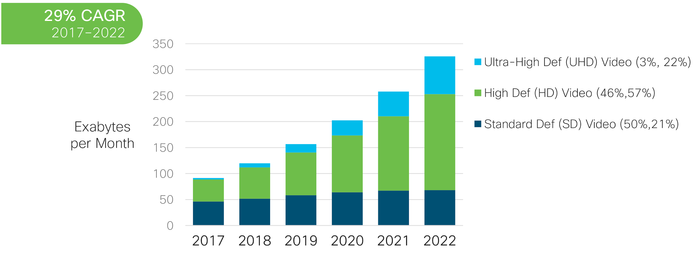{width=75%}

::: {.notes}
Video already dominates Internet traffic and was growing at a 29% CAGR through the
early 2020s. During COVID-19 lockdowns Netflix and YouTube publicly announced
voluntary quality reductions to avoid overrunning network capacity — a vivid
demonstration that "more bytes" doesn't automatically mean "better experience."
The figure is dated but the trend only accelerated; by 2025 video is estimated to
be over 80% of global IP traffic. The absolute numbers will be stale; the teaching
point (video dominance and operator pressure) remains.
:::

## More Speed Does Not Equal Better Experience {.smaller}

::: {.columns}
::: {.column width="55%"}

:::
::: {.column width="45%"}
**Key insight (Krishnan & Sitaraman 2013):**

- Performance–bandwidth relationship saturates quickly
- Bottlenecks shift from **access bandwidth** to
  server-side logic, CDN placement, and application protocol
- Measuring *raw throughput* does not tell you whether
  the user experience is good
- Operators need **application-level quality signals**,
  not just link statistics
:::
:::

::: {.notes}
This 2013 result was genuinely surprising at the time: above ~16 Mbps, buying more
speed did not improve page load time. The implication is that network engineers who
focus only on throughput KPIs will misdiagnose the problem. The same principle
applies to video: high link speed does not guarantee high resolution or low rebuffering.
:::

## The Encryption Wall

- **Before encryption:** ISPs could inspect video segment URLs, bitrate headers,
  and player state
- **After HTTPS/TLS:** operators see only **packet metadata** — sizes, timing,
  flow-level counts
- Active measurement (speed tests) is disruptive and measures a *different path*
  than real application traffic
- Need to **infer** quality from what remains observable

::: {.notes}
This is the central challenge for the whole deck. Draw the analogy: it's like trying
to diagnose a patient's health by measuring only their pulse and breathing rate, not
their blood composition. The traffic IS the signal — we just have to learn to read it.
See the "Quality of Experience Inference" section of the Motivating Problems chapter.
:::

## What We Want to Infer: Video QoE Metrics

| Metric | What It Measures | Why Users Care |
|---|---|---|
| **Startup delay** | Seconds from "play" click to first frame | Impatience; abandonment |
| **Resolution** | HD / FHD / 4K vs. SD | Perceived quality |
| **Resolution switches** | Frequency of quality changes | Jarring visual artifact |
| **Rebuffering** | Playback pauses while buffering | Most-hated QoE event |

::: {.notes}
These four metrics come directly from the QoE literature (see Krishnan & Sitaraman 2012,
and the book's "Quality of Experience Inference" section). Past work has confirmed
these are the proxies most correlated with user satisfaction and video abandonment.
If you have access to a player SDK (e.g., through a streaming partner) you can measure
these directly; without that access, ML inference is the only path.
:::

## What Encrypted Traffic Looks Like

{width=90%}

::: {.notes}
Walk through the plot. Each colored cluster is a different TCP flow. The initial
high-density burst at the left is the buffer fill. The red (audio) flow is
consistently low-bandwidth. We can see *structure*, but we cannot directly read
resolution or whether there is rebuffering. The ML task is to learn the mapping
from this pattern to the QoE metrics.
:::

# The Inference Pipeline {.center}

::: {.notes}
Transition slide. Now we go step by step: identify which service, extract features,
train and validate a model, deploy.
:::

## Step 1: Service Identification

- Match IP addresses to service using **passive DNS**:
  observe DNS responses to build an IP → hostname map
- Assign each observed flow to a service (Netflix, YouTube, etc.)
  *without* deep packet inspection
- Enables per-service model training and evaluation

::: {.notes}
Without knowing which service a flow belongs to, we cannot assign ground-truth labels
during training. Passive DNS monitoring (watching A/AAAA record responses on the home
router) is the practical approach — no cooperation from the CDN needed.
:::

## Step 2: Feature Extraction {.smaller}

::: {.columns}
::: {.column width="50%"}
**Network-layer features**
- Bytes per second (down + up)
- Packets per second
- Packet size statistics

**Transport-layer features**
- TCP retransmission counts
- RTT estimates from TCP timestamps
- Window size evolution
:::
::: {.column width="50%"}
**Application-layer features** *(no DPI)*
- **Segment size** estimates (gap-detection)
- Cumulative segment sizes
- Number of segment requests
- Inter-arrival times between segments

Key insight: upstream ACK/request packets reveal
**segment boundaries** even in encrypted traffic.
:::
:::

::: {.notes}
The application-layer features are the most powerful despite requiring no DPI.
The key insight (shown next slide) is that video uses DASH: the player requests
one segment at a time, and each request appears as a small upstream packet followed
by a burst of downstream data. We can detect those boundaries from TCP patterns.
Transport features are expensive to track at line rate; application features are
cheaper and more informative.
:::

## Segment Boundaries Are Visible in Encrypted Traffic

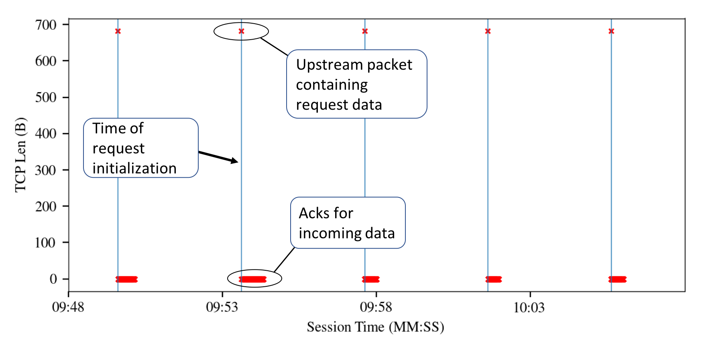{width=85%}

::: {.notes}
This is a key empirical finding: even in HTTPS traffic, the upstream request for
each video segment is visible as a small TCP packet. Downstream bursts are separated
by pauses (the player's buffer state allows it to wait). These segment boundaries
give us the most informative features — essentially the "receipt slips" for video data.
:::

## Step 3: Model Training — Design Choices {.smaller}

Four questions to resolve before training:

1. **Time granularity** — Infer every 10 s (good tradeoff: captures full segments,
   granular enough for real-time diagnosis)
2. **Feature set** — Net only vs. Net+Transport vs. Net+App vs. All
   (Net+App wins: high accuracy, avoids expensive transport tracking)
3. **Service scope** — One model per service vs. composite model for all
   (composite ≈ per-service; *excluded* model fails badly)
4. **Algorithm** — Random forest selected after comparison
   (classification for resolution; regression for startup delay)

Training corpus: **13 k lab video sessions** across Netflix, YouTube, Amazon, Twitch —
collected with controlled network conditions and a Chrome extension for ground truth.

::: {.notes}
Walk through each design question as a mini thought-experiment before showing results.
The "excluded model" finding (training on 3 services, testing on the 4th) is
practically important: you cannot just train once and deploy to a new service.
The training pipeline used tc for traffic shaping and Selenium WebDriver for automated
playback to get ground truth at scale.
See also: Bronzino et al. (2019), "Inferring Streaming Video Quality from Encrypted
Traffic: Practical Models and Deployment Experience," ACM POMACS.
:::

## Feature Importance: Segment Size Dominates

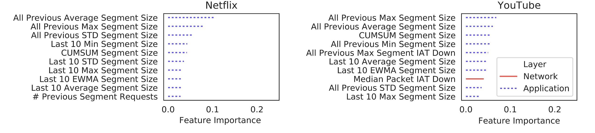{width=90%}

::: {.notes}
The Gini importance plot confirms the intuition: higher resolution = larger segments =
more bytes downloaded per unit time. Segment-size features dominate. This means a
lightweight model can be built using only application-layer features — no need to
track TCP state at line rate. The practical implication: a router or ISP monitor can
run inference with a small, efficient feature set.
:::

## Feature Layer Comparison: Net+App Wins

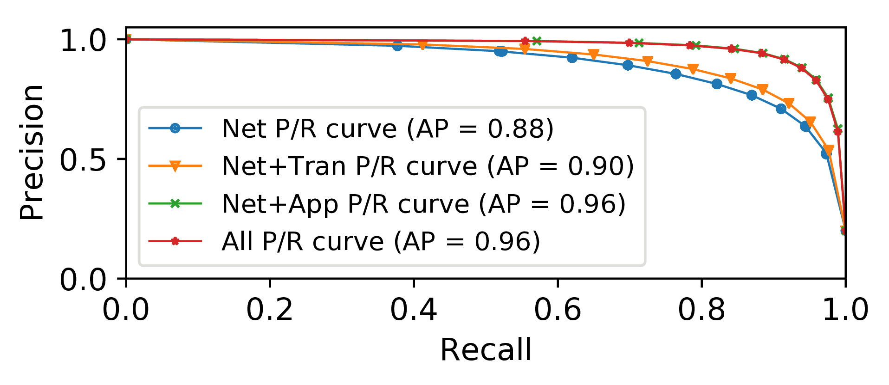{width=85%}

::: {.notes}
Key result: adding application-layer features (segment estimates) gets you most
of the way to the full-feature model. Adding expensive transport features on top
adds little. This validates the system design: deploy with Net+App features.
Contrasts with prior work that emphasized transport features — this paper shows
the app-layer features are both cheaper to collect *and* more informative.
:::

## Generality Across Services

::: {.columns}
::: {.column width="48%"}
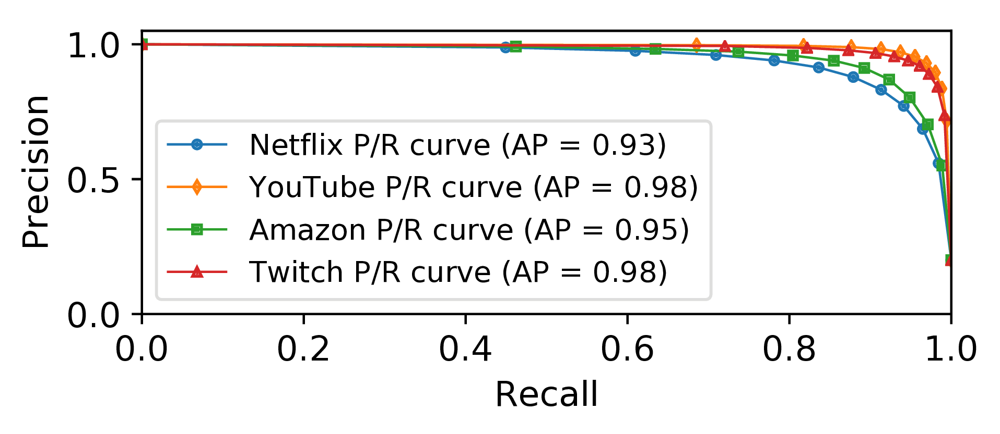
:::
::: {.column width="52%"}
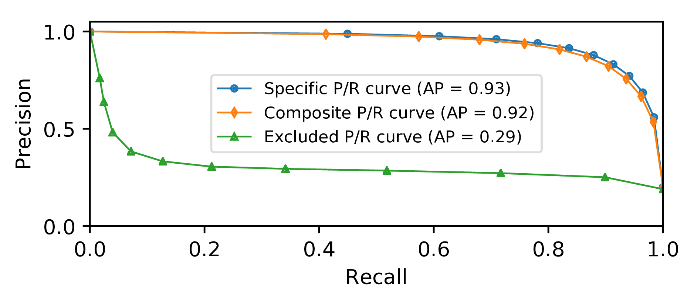
:::
:::

::: {.notes}
Left: per-service accuracy is high across all four services. YouTube and Twitch
hit AP=0.98; Netflix is slightly lower (more frequent resolution switches).
Right: the *excluded* model result (AP=0.29) is the most important practical
finding: training data must include every target service. A truly general
model remains an open problem. The composite model is useful but requires
labeled data from all services you care about.
:::

## Surprising Result: More Speed Doesn't Mean Better Video

::: {.columns}
::: {.column width="48%"}
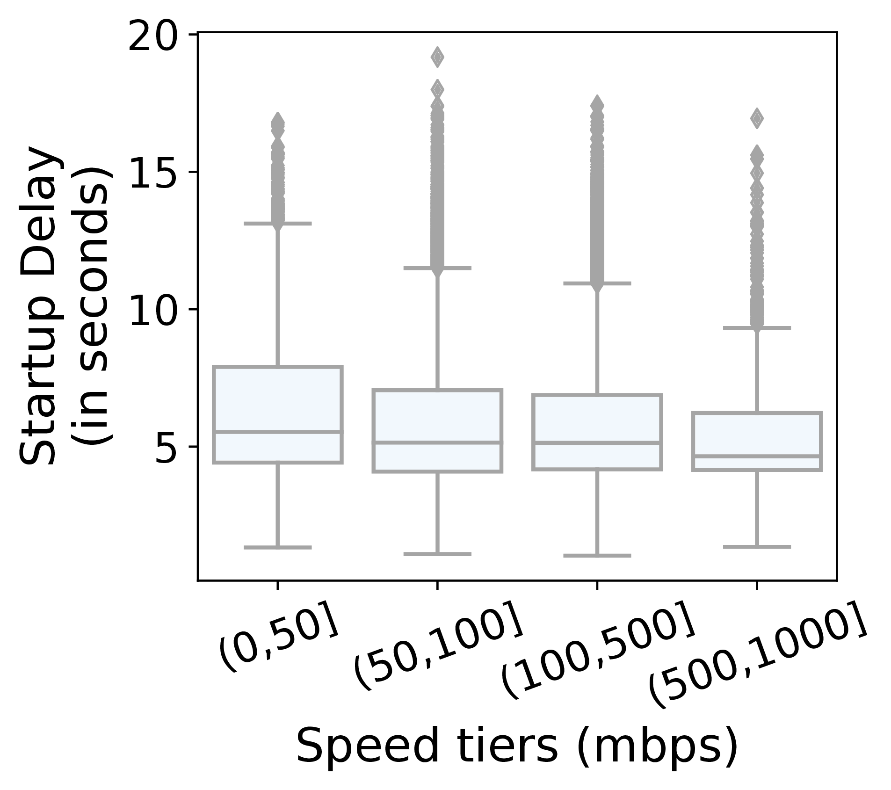
:::
::: {.column width="52%"}
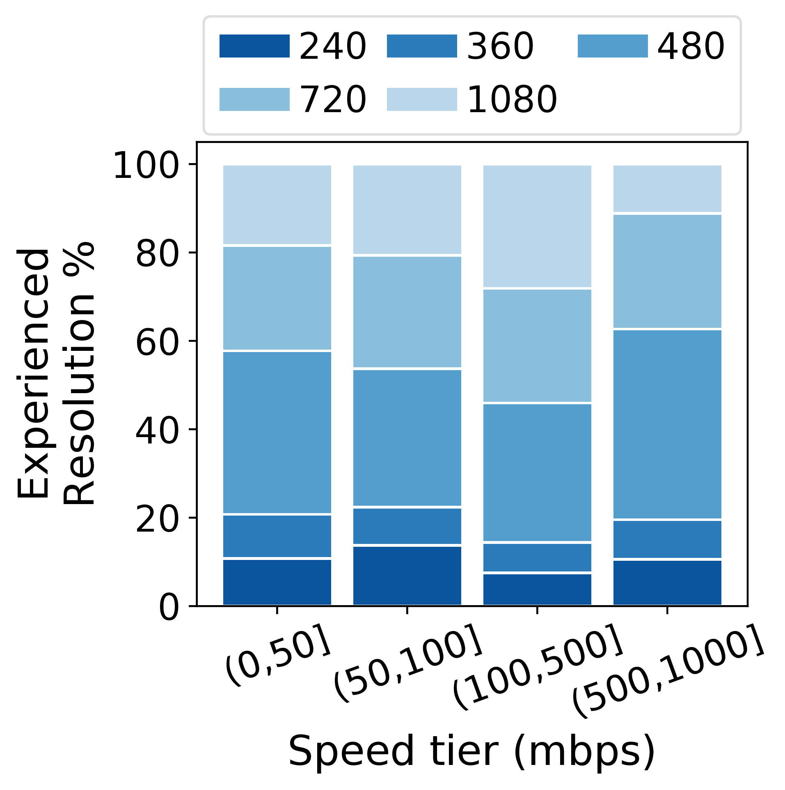
:::
:::

::: {.notes}
This is the key *deployment* finding from ~210,000 video sessions across 66 homes
in the US and France over 14 months. Even at 500–1000 Mbps, most sessions are not
in 1080p. Startup delay is nearly independent of subscription tier. Why? Device type,
CDN policy, and server-side ABR algorithms — not just access link — determine quality.
The practical message for network policy: simply upgrading broadband speed tiers
provides diminishing returns to video quality above roughly 50 Mbps.
:::

## The Finding Made Headlines

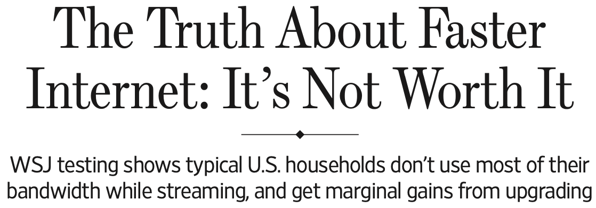{width=70%}

::: {.notes}
The deployment finding crossed over into the mainstream press: the Wall Street
Journal partnered with the researchers, and the article's front-page conclusion —
typical households don't use most of their bandwidth while streaming and get
marginal gains from upgrading — was based directly on the inference models from
this lecture. Nice concrete example of measurement research informing public
debate about broadband policy and ISP marketing claims.
:::

# Beyond Video-on-Demand {.center}

::: {.notes}
Pivot to video conferencing (VCA). Same core problem — encrypted traffic, need to
infer quality — but a very different traffic pattern (real-time, bidirectional,
RTP/WebRTC instead of DASH/HTTP).
:::

## Inferring Quality for Video Conferencing

**Target metrics** for VCAs (Meet, Teams, Webex):

- **Video bitrate** — overall encoding rate
- **Frame rate** — frames per second (FPS)
- **Frame jitter** — variation in frame delivery times
- **Resolution** — pixel dimensions

**Challenge:** VCA traffic is real-time and uses **RTP/UDP** (not HTTP DASH),
so segment-boundary detection does not apply.

::: {.notes}
The source material (slides 44–48) covers a parallel research thread on WebRTC-based
VCAs. The features and methods differ because VCA traffic is bidirectional and
real-time, not buffered and on-demand. This section provides the contrast that
reinforces the core lesson: you need to re-engineer features for each traffic type,
but the supervised-learning pipeline is the same.
:::

## Key Insight for VCA: Packet Size Differences Reveal Frame Boundaries

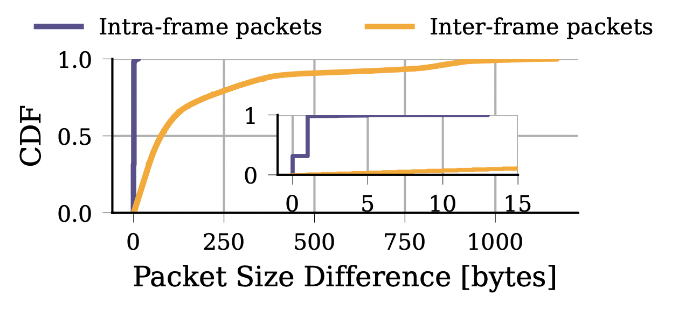{width=75%}

::: {.notes}
For WebRTC/RTP traffic, packets within the same video frame have similar sizes.
The *difference* in packet size between consecutive packets is small within a frame
and large across frame boundaries. This provides a heuristic for frame segmentation
without DPI — analogous to how upstream ACKs identified segment boundaries in DASH.
The insight generalizes: exploit protocol structure to create informative features.
:::

## VCA Feature Table and Inference Results {.smaller}

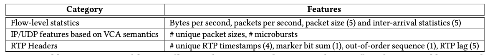{width=80%}

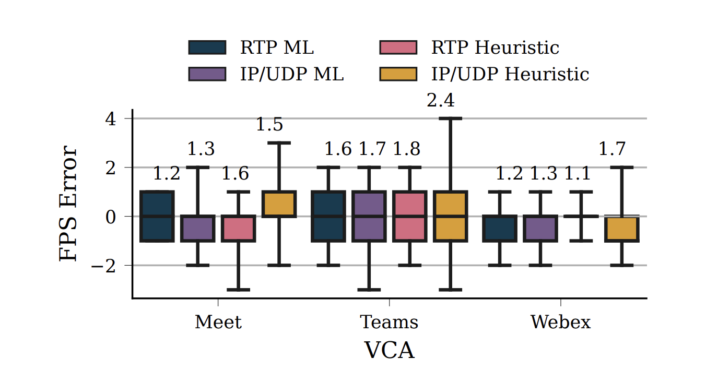{width=80%}

::: {.notes}
Top: the three feature categories for VCA inference. RTP header features (timestamps,
marker bits, sequence numbers) are the richest but require RTP visibility; IP/UDP
features are more widely available.
Bottom: ML models reduce FPS error compared to heuristics, with median error near 0
across all three VCA platforms. RTP ML slightly outperforms IP/UDP ML, but both
beat heuristics.
:::

## Current-Events Vignette: Application-Agnostic QoE from Encrypted Traffic (April 2025) {.smaller}

::: {.vignette}
Berger et al., "Video QoE Metrics from Encrypted Traffic: Application-agnostic
Methodology" (arXiv:2504.14720, April 2025) proposes an approach that works across
*arbitrary* proprietary video-call apps (WhatsApp, and other instant-messaging
video call applications) without service-specific engineering. Using features
derived solely from encrypted packet headers, their model achieves **85.2% accuracy
for FPS prediction** (within a 2-FPS margin) and **90.2% accuracy for quality
classification** on a 25,680-second WhatsApp video call dataset collected under
diverse emulated network conditions. The key advance over prior work: no per-app
training data collection or DNS-based service identification is required.
:::

**Thought question:** What does "application-agnostic" require that service-specific
models do not? What might it sacrifice?

::: {.notes}
Use this vignette to tie the lecture to an April 2025 primary source. The
application-agnostic framing directly addresses the "excluded model" problem we saw
earlier (AP=0.29 when the target service is unseen at training time). The WhatsApp
focus is also timely given the growth of IM-based video calling.
Cold-call: ask students to identify what a service-specific model can exploit that
an agnostic model cannot (e.g., DNS-to-IP mapping, known segment sizes, CDN patterns).
Source: https://arxiv.org/abs/2504.14720
:::

## Challenge: Fast Model Serving

{width=95%}

::: {.notes}
Inference has to run at line rate, and feature extraction cost varies enormously
(recall: transport-layer features require per-flow state). The AC-DC idea: instead
of one model, curate an ensemble of classifiers spanning the accuracy-vs-cost
frontier, then schedule among them dynamically based on system constraints
(traffic rate, memory). This previews the model-serving and systems lectures
later in the course — the "real-time inference at line rate" open problem on the
next slides.
:::

# Lessons and Open Problems {.center}

::: {.notes}
Synthesis section. Pull together the key lessons and point at the open problems that
frame the rest of the course.
:::

## Key Lessons from Performance Inference

1. **Encryption moves the feature space.** Classic DPI features disappear; metadata
   and traffic structure become the signal.
2. **Application-layer patterns leak quality.** Segment sizes and timing encode
   resolution even when payload is encrypted.
3. **More bandwidth ≠ better experience.** Device type, CDN policy, and ABR
   algorithm often dominate over access link speed.
4. **Training data scope limits generality.** A model trained on three services
   fails on a fourth — data must cover every target domain.
5. **Domain adaptation matters in deployment.** Time-bin misalignment between lab
   training data and operational monitoring degrades accuracy.

::: {.notes}
These five lessons are the take-home from this lecture. Each one maps to a design
decision students will face in their own work: feature engineering, data collection,
and the gap between lab evaluation and real-world deployment.
See the "Performance Inference" and "Quality of Experience Inference" sections in
the Motivating Problems chapter.
:::

## Open Problems and Future Directions

- **Truly general models:** composite models work well within the training set;
  *out-of-distribution* services remain challenging
- **Streaming protocol evolution:** QUIC/HTTP3 changes observable features;
  models need retraining or transfer learning
- **Adversarial padding:** services can deliberately pad packets to frustrate
  inference — how robust are these models?
- **Real-time inference at line rate:** model serving latency vs. accuracy
  tradeoffs (ensemble approaches with fast/slow paths)
- **Beyond video:** gaming QoE, interactive AR/VR, and real-time AI inference
  traffic all pose new inference challenges

::: {.notes}
These open problems directly connect to the rest of the course. QUIC features connect
to the data and feature engineering lectures; adversarial robustness connects to the
security lecture; real-time serving connects to the systems and pipeline lectures.
Frame these as invitations to research, not just gaps to fill.
:::

## Lab Assignment: Video Resolution Inference

**Problem Set 1 — what you'll do:**

1. **Clean** a labeled dataset of video streaming sessions
2. **Train** a simple resolution inference model from network traffic features
3. **Examine** feature importance (which features matter most?)
4. **Compare** inference accuracy across different feature-layer combinations

::: {.notes}
Point students to the hands-on notebook. The dataset mirrors the real deployment
data described in this lecture. The feature importance step will reproduce the
"segment size dominates" result from the slides. The cross-layer comparison
reproduces the Net vs. Net+App vs. All result.
:::
