# Resource Allocation: The Problem {.center}

> Networks must decide — in real time — **how much** to send, **where** to send it,
> and **at what quality**. ML is reshaping all three.

::: {.notes}
Open with the framing: resource allocation is not one problem but a family of problems
spanning milliseconds (congestion window) to months (capacity provisioning). The
thread connecting them is that the environment is too complex and dynamic for
hand-crafted rules. See the "Resource Allocation" section of the Motivating Problems
chapter in _Machine Learning for Networking_.
:::

## Two Timescales of Resource Allocation {.smaller}

::: {.columns}
::: {.column width="50%"}
**Short timescale (milliseconds to seconds)**

- Congestion control (sending rate)
- Adaptive bitrate (video quality)
- Packet scheduling
- Real-time routing

Goal: react faster than humans can and generalize across network conditions.
:::
::: {.column width="50%"}
**Long timescale (hours to months)**

- Network provisioning
- Capacity planning
- CDN configuration
- Data-center drain/migration

Goal: forecast demand and evaluate "what-if" infrastructure changes before committing.
:::
:::

::: {.notes}
This two-timescale framing comes directly from the book's Resource Allocation section.
Both scales share the same core challenge: the system is too complex and the data is
too rich for closed-form models. The rest of the deck develops one example from each
timescale in depth, then closes with a case study on what happens when both go wrong
simultaneously (COVID).
:::

# Short-Timescale: Video Streaming {.center}

## Adaptive Bitrate (ABR) Streaming

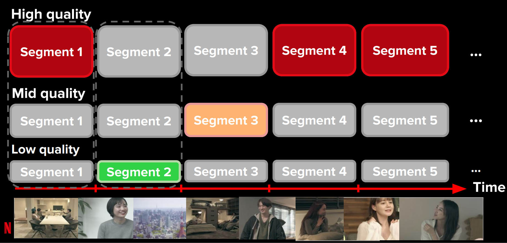

::: {.notes}
s03-i01.png is an excellent pedagogical diagram of ABR from what appears to be a
Netflix-era illustration. Show it here. Walk through: three quality tiers (High, Mid,
Low), each segment downloaded from a chosen tier, playback proceeds along the bottom
timeline. The job of the ABR algorithm is to pick the tier for each segment. See the
"Coding and Rate Control" section of the Motivating Problems chapter.
:::

## Why ABR Is Hard {.smaller}

The player must simultaneously optimize:

| Objective | Challenge |
|---|---|
| **High average quality** | Throughput fluctuates unpredictably |
| **No rebuffering** | Buffer can drain faster than segments arrive |
| **Smooth quality** | Sudden 4K → low jumps degrade experience |
| **Fairness** | Other users compete for shared capacity |

Rule-based heuristics (e.g., "drop quality if buffer < X seconds") fail to generalize across diverse network conditions.

::: {.notes}
Cold-call: "If you were writing a rule for the player, what would it be?" Then show
why any fixed rule breaks down: the right buffer threshold depends on whether you're
on a congested LTE cell or a quiet home Wi-Fi. The book lists these four trade-offs
explicitly. Reinforce that this is a sequential decision problem — the choice for
segment _k_ affects the buffer state for segment _k+1_.
:::

## Pensieve: RL for Adaptive Bitrate {.smaller}

**Pensieve** (Mao et al., SIGCOMM 2017) frames ABR as a **reinforcement learning** problem.

::: {.columns}
::: {.column width="55%"}
**State features fed to the policy network:**

- Past segment throughput (recent history)
- Past segment download time
- Next-segment sizes at each bitrate
- Current buffer occupancy
- Segments remaining in video
- Bitrate of the last segment
:::
::: {.column width="45%"}
**Action:**

Choose the bitrate for the next segment.

**Reward:**

A QoE function balancing quality, rebuffering penalty, and smoothness.

**Training:**

Asynchronous advantage actor-critic (A3C) over simulated traces.
:::
:::

::: {.notes}
Reference: Hongzi Mao, Ravi Netravali, Mohammad Alizadeh, "Neural Adaptive Video
Streaming with Pensieve," SIGCOMM 2017. See the book's "Coding and Rate Control"
section. Pensieve is the canonical RL-for-networking paper; it also introduced a
public dataset of network traces. Key teaching point: the state representation is
entirely local — the player cannot see what other users are doing, yet RL learns
to infer congestion from its own buffer behavior.
:::

## 2025 Update: Deep RL ABR Still Advancing {.smaller}

::: {.vignette}
**July 2025 — AIP Advances:** Zhang, Han, Cai, Feng, and Zhu (Zhengzhou University of
Light Industry) published "Deep Reinforcement Learning Enhanced Optimization Algorithm
for Adaptive Bitrate Video Streaming," introducing **PLL-ABR** — a PPO-based policy
that couples an LSTM module with real-time QoE feedback for dynamic optimization.
The paper reports significant gains in average QoE, generalization, and stability over
earlier RL baselines, and is available open-access at
doi:10.1063/5.0276888.
:::

Pensieve's core idea — treating ABR as an RL problem over local state — remains the
dominant paradigm, but modern variants add better credit assignment (PPO vs. A3C),
richer sequence models (LSTM), and meta-learning for fast adaptation to new networks.

::: {.notes}
Source verified: AIP Advances 15, 075042 (2025), DOI 10.1063/5.0276888. Published
July 1, 2025. The teaching point is that the Pensieve architecture from 2017 launched
an entire research line; as of 2025 the RL framing holds but the specific components
keep improving. Ask students: "What would you need to change about Pensieve to handle
Wi-Fi vs. LTE vs. 5G in the same model?"
:::

# Short-Timescale: Congestion Control {.center}

## Remy: Computer-Generated Congestion Control {.smaller}

**Remy** (Winstein and Balakrishnan, SIGCOMM 2013) uses **offline optimization** to
design congestion controllers automatically.

::: {.columns}
::: {.column width="50%"}
**State features:**

- Inter-ACK arrival time (EWMA)
- TCP sender timestamp spacing (EWMA)
- Ratio of most-recent RTT to minimum RTT

**Action (a RemyCC rule maps state → three outputs):**

- A multiplier on the current congestion window
- An additive increment/decrement to the window
- A lower bound on inter-packet send time
:::
::: {.column width="50%"}
**Key insight:**

Instead of hand-tuning rules, Remy *searches* the space of piecewise-constant
mappings from state to action, optimizing a utility function over a model of
the network.

**Result (15 Mbps dumbbell, 8 flows):**

Remy-designed controllers sit on the efficient frontier — no human-designed
protocol matches both throughput and delay simultaneously.
:::
:::

::: {.notes}
Reference: Keith Winstein and Hari Balakrishnan, "TCP ex Machina: Computer-Generated
Congestion Control," SIGCOMM 2013. The book discusses Remy under "Resource Allocation"
→ congestion control. Contrast with Pensieve: Pensieve uses online RL at run time;
Remy optimizes offline and then deploys a fixed lookup table. Ask: "What are the
trade-offs of offline optimization vs. online RL?" (offline: faster at run time, may
not generalize; online: adapts but has training cost in production).
:::

# Longer-Timescale: "What-If" Prediction {.center}

## Performance Prediction and "What-If" Scenarios {.smaller}

A network operator wants to know: **"If we change configuration X, what happens to
response time Y?"**

::: {.columns}
::: {.column width="50%"}
**Examples:**

- Deploy a new front-end server in Japan — will latency improve for India customers?
- Take a front-end offline for maintenance — how does the response-time distribution
  shift?
- Add capacity at one data-center tier — what is the return in user experience?

**Why closed-form analysis fails:**

Multi-tier services have complex, nonlinear dependencies that cannot easily be
written as equations.
:::
::: {.column width="50%"}
**ML approach:**

Learn the response-time function **rt = f(X)** from operational logs of the
*existing* deployment, then *transform* the learned distribution to answer
the what-if.

**Key insight from the book:**

Simpler regression models with good training data often outperform complex models.
Start simple; complexity is a last resort.
:::
:::

::: {.notes}
See the book's "Performance Prediction" section and "Example: Multi-Tiered Web
Services." The WISE system instantiates this idea. Point out: this is a case where
the problem structure (we have a rich operational baseline and are asking about small
perturbations from it) makes ML tractable. The baseline data is the training set;
the what-if transformation is the prediction task.
:::

## WISE: A What-If Scenario Evaluator {.smaller}

::: {.columns}
::: {.column width="55%"}
**WISE** (Tariq, Mukarram et al., SIGCOMM 2008) predicts response-time distributions
for hypothetical CDN deployments using:

1. **A learned response-time function** rt = f(X) from operational traces
2. **A causal structure** among system variables (learned as a DAG)
3. **A transformation** that propagates the hypothetical change through the DAG
:::
::: {.column width="45%"}
**Query language (WSL):**

```
USE WHERE AS==9498
    AND front_end==India
    AND backend==Taiwan
UPDATE SET front_end=Japan
```

*"For AS9498 customers whose traffic currently goes through the India front-end: predict
response time if we serve them from Japan instead."*
:::
:::

::: {.notes}
Reference: Tariq, Zeitoun, Valancius, Feamster, Ammar, "Answering What-If Deployment
and Configuration Questions with WISE," SIGCOMM 2008. This is the instructor's own
work — personal connection is appropriate here. The WISE Specification Language (WSL)
is shown in images/s12-i03.png. Walk through the USE/UPDATE syntax: USE anchors a
baseline population; UPDATE modifies a variable; WISE predicts the new distribution.
:::

## WISE Architecture: Learning Causal Structure

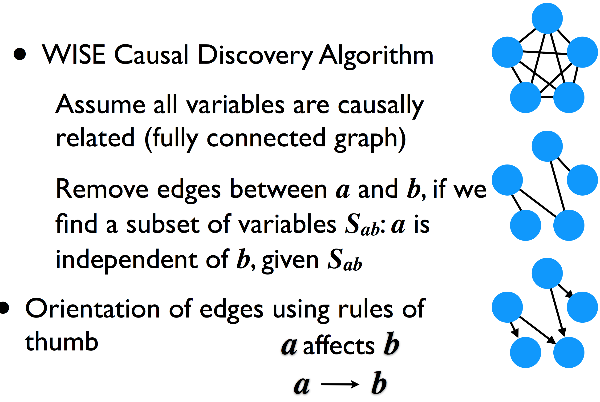

::: {.notes}
s13-i04.png shows the three-step causal discovery process. Teaching point: WISE uses
a data-driven causal graph rather than a hand-specified model. The algorithm removes
edges between variables a and b if a is independent of b given some subset of other
variables S_ab, then orients remaining edges. This is a form of constraint-based
causal discovery (PC algorithm). Students can see from the diagram that the procedure
progressively prunes a fully connected graph into a sparse DAG.
:::

## WISE: Propagating a Configuration Change

::: {.columns}
::: {.column width="50%"}
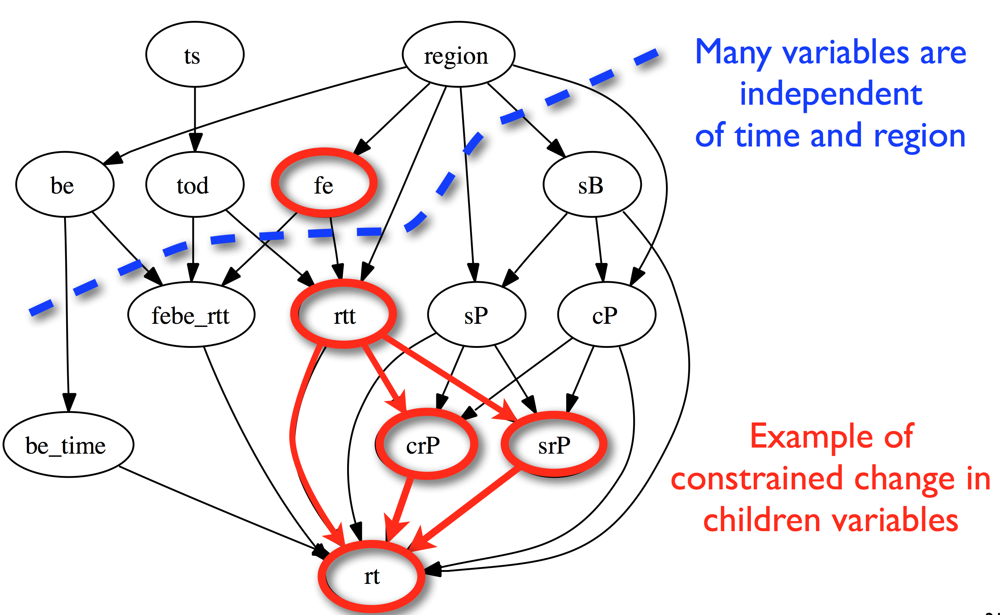
:::
::: {.column width="50%"}
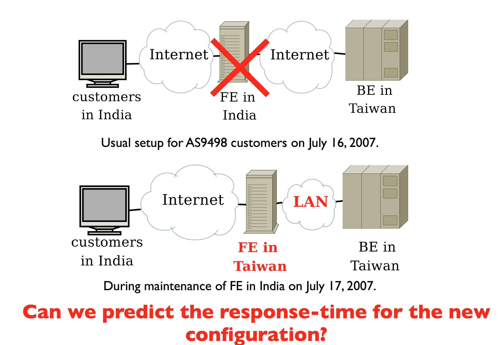
:::
:::

::: {.notes}
s16-i07.png: the learned causal DAG for Google's web service. Show how region affects
the front-end variable (fe), which then cascades through RTT and packet variables to
the final response time (rt). Variables outside the dashed region are independent of
region — they don't need to change when front_end changes. s17-i08.png: the concrete
India → Taiwan scenario from July 2007. Ask: "Which variables change when we move
from the top diagram to the bottom one?" Then show the prediction accuracy on the
next slide.
:::

## WISE Prediction Accuracy {.smaller}

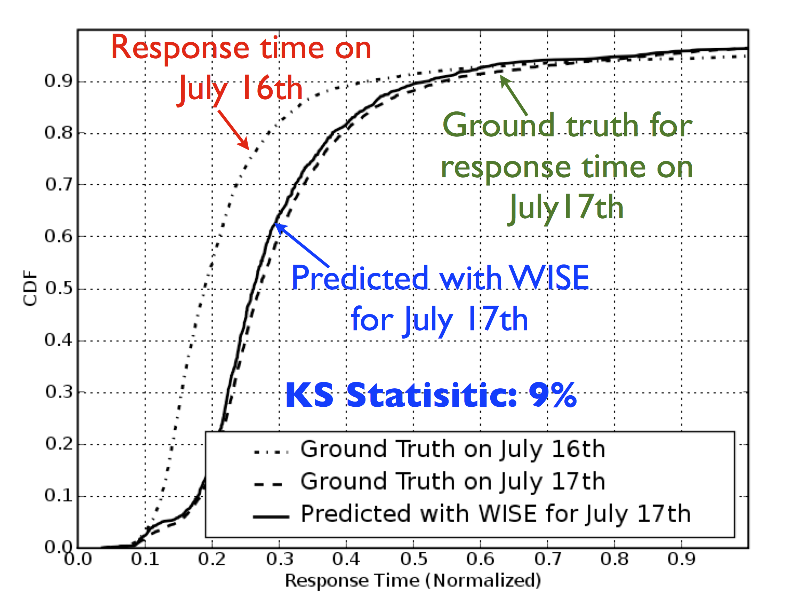

**Key result:** WISE predicts the shape of the entire response-time distribution (not
just the mean), with a Kolmogorov–Smirnov distance of only **9%** between predicted
and observed CDFs.

**Why this matters:** Operators care about **tail latency** (the 90th and 99th
percentile), not just the mean. A model that only predicts averages can mislead
capacity decisions.

::: {.notes}
s18-i09.png is a CDF plot showing three curves: ground truth July 16 (baseline),
ground truth July 17 (after drain), and WISE predicted for July 17. The predicted
curve almost perfectly overlaps the real July 17 curve — a 9% KS statistic is strong.
Reinforce the book's point: a regression-based approach (WISE used polynomial
regression on a learned feature set) sufficed here; you did not need deep learning.
:::

# Longer-Timescale: Network Provisioning {.center}

## Network Provisioning and Capacity Forecasting {.smaller}

**Problem:** ISPs and CDNs must decide *months in advance* how much capacity to
purchase, where to install it, and how to route around it.

::: {.columns}
::: {.column width="50%"}
**Inputs to a forecasting model:**

- Historical traffic volumes by link, region, time-of-day
- Subscriber count and demographic trends
- Application mix (streaming, gaming, video calls)
- Past provisioning decisions and their outcomes

**Common approaches:**

- Time-series regression (linear, polynomial)
- ARIMA / seasonal decomposition
- Gradient boosting over lagged features
:::
::: {.column width="50%"}
**Output:**

A traffic-volume forecast several months ahead — used to trigger "node splits"
(cable), spectrum purchases (wireless), or peering upgrades (backbone).

**Tight coupling with what-if:**

Once a forecast predicts demand D at location L, the operator asks: "If I add
capacity C at L, what happens to response time?" — exactly the WISE question.
:::
:::

::: {.notes}
Reference the book's "Network Provisioning" section (Motivating Problems chapter).
The book cites Papagiannaki et al. (2005) as an early example of traffic volume
forecasting for capacity planning. Cellular networks use similar models for tower-level
predictions. The key teaching point: provisioning is a two-step ML problem — forecast
demand, then evaluate proposed capacity changes.
:::

# Case Study: COVID-19 and Model Drift {.center}

## The Internet Under COVID-19 {.smaller}

**March 2020:** Nationwide lockdowns shifted traffic from enterprise networks to
residential broadband — an out-of-sample shock to every deployed forecasting model.

::: {.columns}
::: {.column width="50%"}
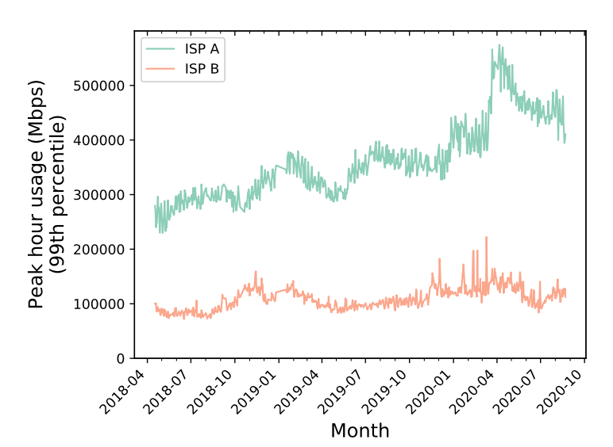
:::
::: {.column width="50%"}
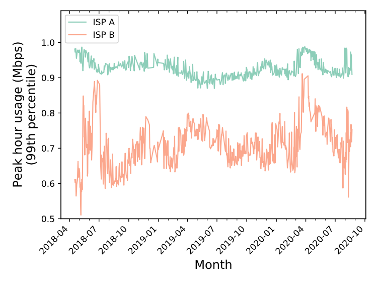
:::
:::

::: {.notes}
s20-i13.png and s20-i14.png are from a study of ISP traffic during COVID (likely
Feamster/collaborators). The left panel shows raw volume in Mbps; the right shows
normalized utilization. Draw attention to the spike beginning in March 2020. Ask:
"If your forecasting model was trained on 2018–2019 data, what would it predict for
April 2020?" The answer is far too low — this is a classic out-of-sample scenario.
:::

## Traffic Ratios Shifted, Not Just Volumes {.smaller}

::: {.columns}
::: {.column width="50%"}
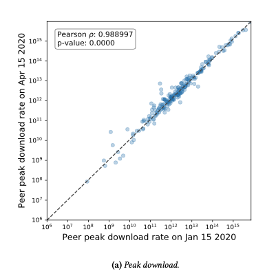
:::
::: {.column width="50%"}
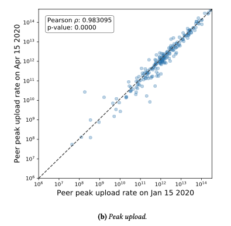
:::
:::

::: {.notes}
These scatter plots compare per-peer rates before and after lockdown. Download
(s21-i15.png) stayed proportional — the same peers that had high pre-COVID download
also led post-COVID. Upload (s21-i16.png) shows a systematic upward shift — video
conferencing and remote work drove upload demand above the diagonal. The implication
for provisioning models: the features that predicted download demand still work, but
upload models were specifically wrong. Different capacity bottlenecks.
:::

## ISPs Rapidly Augmented Capacity {.smaller}

::: {.columns}
::: {.column width="50%"}
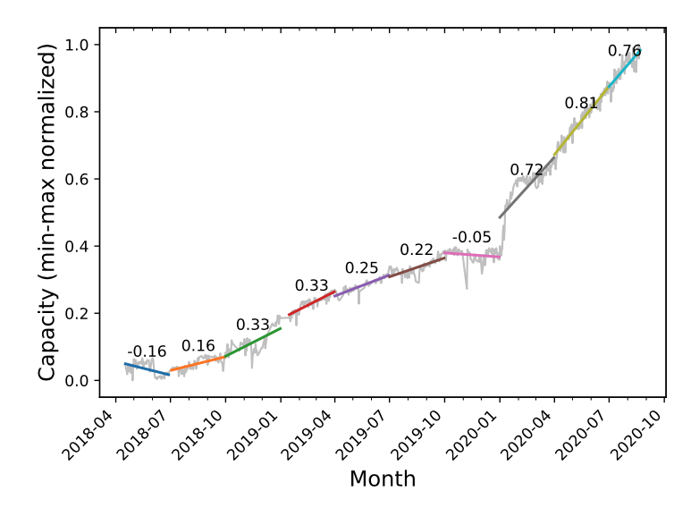
:::
::: {.column width="50%"}
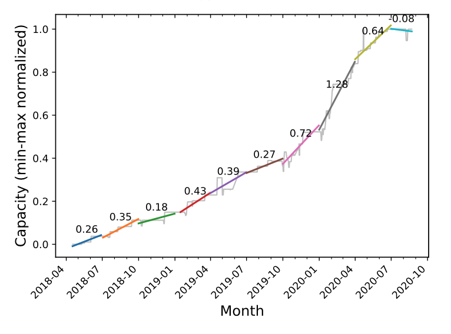
:::
:::

::: {.notes}
s22-i17.png and s22-i18.png show the capacity augmentation response from two ISPs.
The slope annotations quantify the provisioning rate in each period. ISP A was
running close to capacity and had to add aggressively (large slopes post-March 2020).
ISP B had more slack. Key teaching point: ISPs had to act much faster than their
normal planning cycles, and their ML forecasting tools — calibrated on slow,
predictable growth — had to be overridden by human judgment. This illustrates
the limits of data-driven provisioning models when the environment jumps.
:::

## Lessons: Model Drift {.smaller}

The COVID case crystallizes a general problem in ML for networked systems:

::: {.columns}
::: {.column width="50%"}
**What happened:**

- Traffic patterns shifted out-of-sample
- Models trained on 2018–2019 data were suddenly extrapolating, not interpolating
- Congestion control, ABR, and provisioning models all faced unexpected inputs
- Human operators had to override automated systems

**Term:** **model drift** (or **concept drift**) — the phenomenon where the
relationship between input features and output targets changes over time.
:::
::: {.column width="50%"}
**Mitigations:**

- **Online learning:** update model weights continuously as new data arrives
- **Drift detection:** statistical tests (e.g., ADWIN, Page-Hinkley) to trigger
  retraining when distribution changes
- **Ensemble hedging:** maintain models trained on different historical windows
- **Uncertainty quantification:** output confidence bounds, not just point estimates

None of these fully replace human judgment in a step-change event.
:::
:::

::: {.notes}
This is the "To be continued…" slide's key lesson. The book foreshadows this as a
general challenge: ML models assume the future looks like the past. COVID was a
"distribution shift" event. The concepts here (online learning, drift detection)
are covered in later lectures; seed the vocabulary now. See also the APNIC blog
post (January 2025) on reliable IoT traffic inference under concept drift for a
more recent treatment.
:::

# Putting It Together {.center}

## A Taxonomy of ML for Resource Allocation {.smaller}

| Problem | Timescale | ML Approach | Example System |
|---|---|---|---|
| Adaptive bitrate | Seconds | Reinforcement learning | Pensieve (SIGCOMM '17) |
| Congestion control | Milliseconds | Offline optimization / RL | Remy (SIGCOMM '13) |
| "What-if" prediction | Hours–days | Causal + regression | WISE (SIGCOMM '08) |
| Traffic forecasting | Months | Time-series regression | Papagiannaki et al. (2005) |
| Capacity provisioning | Months | Forecast + what-if | ISP planning tools |

**Common thread:** the environment is too complex and dynamic for analytical models;
ML lets us learn the response function from operational data.

::: {.notes}
This summary table is the take-away for the lecture. Students should be able to
place a networking resource-allocation problem in this taxonomy: what is the
timescale? what is the action space? what feedback is available? Those three
questions largely determine which ML approach is appropriate. The book's Resource
Allocation section closes with a similar synthesis.
:::

## What Makes Resource Allocation Different? {.smaller}

::: {.columns}
::: {.column width="50%"}
**Unlike classification / regression tasks:**

- The system's **own actions affect future observations** — ABR quality choice
  affects buffer, which affects next state
- **Multiple agents** share the same resource (fairness problem)
- **Feedback is delayed** — you don't know if your congestion window was too large
  until packets are dropped several RTTs later
- **Deployment constraints:** the algorithm must run in microseconds on commodity
  hardware
:::
::: {.column width="50%"}
**These properties motivate:**

- **Reinforcement learning** (sequential decisions with delayed reward)
- **Online learning** (model must adapt without a stop-the-world retrain)
- **Lightweight architectures** (not GPT-sized models — small MLPs that fit in
  a TCP stack)
- **Robustness / drift detection** (environment non-stationarity is the rule,
  not the exception)
:::
:::

::: {.notes}
This slide is the conceptual bridge to the next part of the course: the methods
section. Having seen the motivating problems, students now have a reason to care
about RL, online learning, and lightweight inference. Ask: "Which of these
constraints does a provisioning model NOT face?" (answer: real-time inference
speed — you have hours to run a forecasting job; but it does face drift).
:::

## Open Challenges {.smaller}

1. **Generalization across network conditions:** a Pensieve policy trained on one
   ISP's traces may not transfer to another topology or protocol mix.

2. **Sim-to-real gap:** RL policies trained on network simulators often degrade when
   deployed on real networks, where timing jitter, OS scheduling, and hardware
   effects were absent from training.

3. **Competing objectives:** efficiency vs. fairness is a multi-objective problem;
   RL typically optimizes a scalar reward that must encode the trade-off.

4. **Model drift at scale:** large ISPs run hundreds of forecasting models; detecting
   and recovering from drift in production at scale is an unsolved operational
   problem.

5. **Interpretability:** an operator who overrides an ABR or provisioning decision
   needs to understand *why* the model recommended what it did.

::: {.notes}
These challenges are worth returning to as the course progresses through specific
methods. Challenge 1 motivates domain adaptation and transfer learning. Challenge 2
motivates careful simulator design (e.g., Mahimahi for network emulation). Challenge
3 motivates multi-objective RL. Challenge 4 connects to the concept-drift literature.
Challenge 5 is the interpretability / explainability thread that runs through the
entire course.
:::
