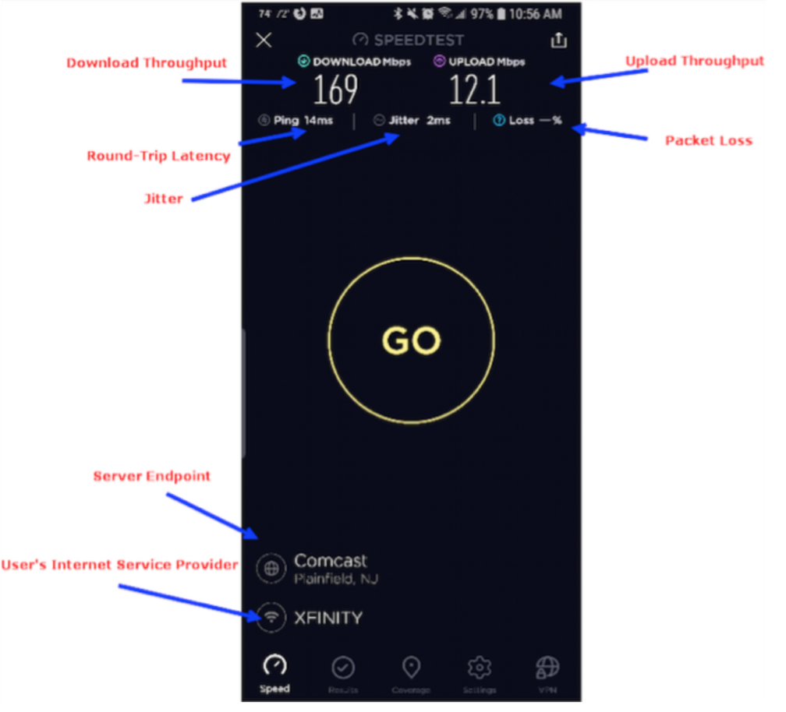
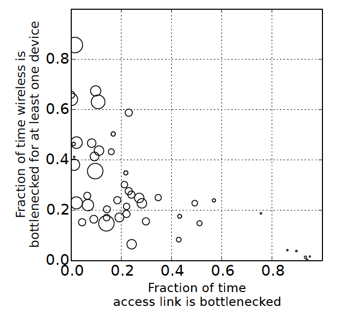
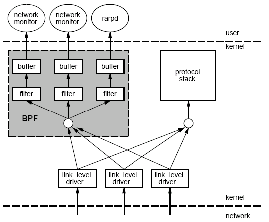
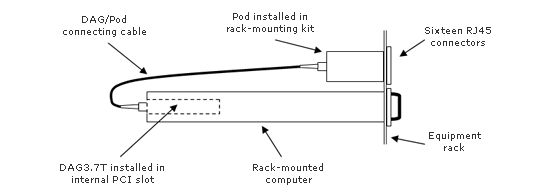
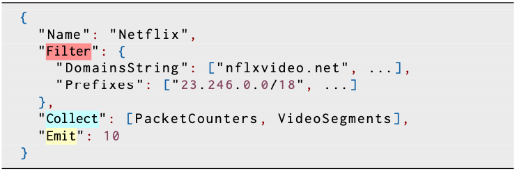

# Why Measurement Comes First {.center}

> **"You can't improve what you don't measure."**

Data acquisition is the first stage of every ML pipeline —
and in networking it is called **network measurement**.

::: {.notes}
Open with the framing: in most ML courses you start with algorithms, but in
networked systems the data gathering step is itself technically deep and
full of pitfalls. The rest of the course builds on the representations we
create here. See Chapter 3 ("Network Data") in *Machine Learning for
Networking* for the authoritative treatment.
:::

## Why We Measure Networks

::: {.columns}
::: {.column width="50%"}
**Performance & Operations**

- Diagnose bottlenecks and outages
- Generate reports for customers / SLAs
- Tune configurations to actual traffic
- Plan capacity and equipment rollouts
:::
::: {.column width="50%"}
**Security**

- Detect and attribute attacks
- Characterize anomalous behavior
- Fingerprint devices and services
- Feed ML models for intrusion detection
:::
:::

::: {.notes}
Ask the room: who has ever run a speed test or used Wireshark? That is
measurement. The same instinct — observing the network to answer a
question — underlies the entire ML pipeline for networking.
:::

## Two Fundamental Approaches

::: {.columns}
::: {.column width="50%"}
**Active Measurement**

Inject **synthetic traffic** ("probes") into the network; observe how
endpoints respond.

- Easy to deploy anywhere
- No privacy concerns (your own traffic)
- May not reflect real user experience
- Adds load to the network
:::
::: {.column width="50%"}
**Passive Measurement**

**Capture existing traffic** as it traverses the network; infer
properties from what you observe.

- Reflects actual user behavior
- Requires capture infrastructure
- Raises **privacy** considerations
- More faithful to real conditions
:::
:::

::: {.notes}
The book (Chapter 3) states the key tension clearly: active measurements
are easier to deploy but synthetic; passive measurements capture truth
but are harder and privacy-sensitive. Both have roles; most serious
deployments combine them.
:::

# Active Measurement {.center}

## Core Active Measurement Tasks

| Tool / Method | What It Measures |
|---|---|
| `ping` (ICMP) | Round-trip latency, packet loss |
| `traceroute` | Path topology, per-hop latency |
| Speed tests (NDT, Ookla) | Throughput (up & down) |
| DNS probes | Resolver performance, censorship |
| Internet scans (`zmap`, `nmap`) | Endpoint reachability, OS fingerprints |

::: {.notes}
Each of these injects traffic and waits for a response. The book
discusses all five categories; ping and traceroute are covered in detail
because of their measurement pitfalls. See the "Active Measurement"
section in Chapter 3.
:::

## The Many Faces of "Speed"

::: {.columns}
::: {.column width="55%"}

:::
::: {.column width="45%"}
A single "speed number" hides at least four distinct quantities:

- **Throughput** — bits per second delivered
- **Latency** — round-trip time (ms)
- **Jitter** — variation in inter-packet delay
- **Packet loss** — fraction of packets dropped

ML models often need all four as separate features.
:::
:::

::: {.notes}
Students instinctively collapse "fast" vs. "slow" into a single number.
Unpack the dimensions: a gaming application cares primarily about
jitter; a file-transfer application cares primarily about throughput.
Latency under load (bufferbloat) is a fifth dimension now included in
many modern tests.
:::

## Active Measurement Pitfall: Traceroute

::: {.columns}
::: {.column width="55%"}
How it works: send probes with increasing **TTL**; each router decrements
TTL to zero and returns an ICMP "time exceeded" message.

**Known limitations:**

- Failure to reach host ≠ forward failure (could be a broken *reverse* path)
- ICMP may be filtered or rate-limited at routers
- Reported IP address is the *outgoing* interface of the return packet
- Forward and reverse paths may differ (ECMP load balancing)
:::
::: {.column width="45%"}
::: {.callout-caution}
## Measurement Accuracy

Traceroute gives an **approximate** picture of the forward path, not a
ground truth. Paris-traceroute (Augustin et al., 2006) addresses the
ECMP problem.
:::
:::
:::

::: {.notes}
This is a canonical "accuracy pitfall" from the book. Cold-call: if
traceroute shows a hop with * * *, does that mean the router is down?
(No — it could just be rate-limiting ICMP.) See the Paxson (2004)
Strategies for Sound Internet Measurement paper for the broader list of
pitfalls.
:::

## When Speed Testing Gets Hard {.smaller}

::: {.columns}
::: {.column width="50%"}

:::
::: {.column width="50%"}
As link speeds grow, the **bottleneck moves**:

- Low-throughput users: often bottlenecked at the access link
- High-throughput users: bottleneck shifts to **home Wi-Fi**
- Very fast plans (>1 Gbps): device CPU can limit measured throughput

And the test itself gets more expensive:

- Conventional tests must transfer **more data** to saturate faster links
- Real applications rarely saturate access capacity — so "speed" matters
  less to user experience than the test implies

**Implication for ML:** the "measured speed" feature is not a property
of the ISP alone — it is a function of the entire measurement path and
the measurement tool itself.
:::
:::

::: {.notes}
Reference: Sundaresan, Feamster, Teixeira (2016), PAM. The FCC's MBA
program (13th report, 2024) still uses router-based SamKnows probes for
this reason — to get closer to the access link than a device test would.
See Chapter 3 for discussion of the MBA methodology.
:::

# Passive Measurement {.center}

## Two Main Passive Approaches

::: {.columns}
::: {.column width="50%"}
**Packet-level capture (pcap)**

- Capture every byte on the wire
- Tools: `tcpdump`, Wireshark, `libpcap`
- Complete visibility into headers
  (and payload, if unencrypted)
- Very **high volume** on fast links
- Can capture **headers only** to reduce cost
:::
::: {.column width="50%"}
**Flow-level records (IPFIX / NetFlow)**

- Aggregate packets into **flows** (5-tuple)
- Report counts, timestamps, flags per flow
- Implemented on routers (line card)
- Much lower volume than pcap
- Loses per-packet timing and sizes
:::
:::

::: {.notes}
The book (Chapter 3, passive measurement section) frames this as a
cost-information tradeoff. Packet captures are information-rich but
expensive; flow records are cheap but lossy. The right choice depends
on the ML task. See "Flow-level monitoring" vs. "Packet-level
monitoring" in the book.
:::

## What Is a Flow?

A **flow** is the set of packets sharing a common **5-tuple**:

| Field | Example |
|---|---|
| Source IP address | 192.168.1.10 |
| Destination IP address | 172.217.6.46 |
| Source port | 54321 |
| Destination port | 443 |
| Protocol | TCP (6) |

Plus a **time window** condition — packets separated by more than ~15–30
seconds become separate flows (or when the session ends).

::: {.notes}
Drill down on the time-window criterion because it trips up students when
they first implement flow extraction. Two TCP sessions from the same
client to the same server on the same port — same 5-tuple but different
time windows — become different flow records.
:::

## IPFIX Flow Records {.smaller}

::: {.columns}
::: {.column width="55%"}
**Each IPFIX record contains:**

- 5-tuple (src/dst IP, src/dst port, protocol)
- Packet and **byte counts**
- Flow start and end **timestamps**
- TCP flags (SYN, FIN, RST observed?)
- ToS / DSCP byte
- Router interface (ifIndex)
- Next-hop IP; source/destination AS and prefix

**Compact:** ~1500-byte UDP datagrams, 20–50 records each;
emitted more frequently under heavy traffic.
:::
::: {.column width="45%"}
::: {.callout-note}
## IPFIX vs. NetFlow

NetFlow is Cisco's proprietary format. **IPFIX** (RFC 7011) is the
IETF-standardized version. sFlow samples packets before aggregation.
All three are "flow-level" passive data sources.
:::

**What IPFIX *cannot* tell you:**

- Individual packet sizes or inter-arrival times
- Short-timescale bursts
- Application payload / protocol behavior
:::
:::

::: {.notes}
See Claise et al. (2013) for the IPFIX specification. The book
(Chapter 3) explains exactly which ML features cannot be derived from
IPFIX alone and why this matters for, e.g., QoE inference for video
streaming.
:::

## Packet Sampling: Sampled NetFlow {.smaller}

When flow records are still too voluminous, **sampling** is applied:

**Packet-level sampling (Sampled NetFlow)**
: Keep 1-of-N packets (e.g., N = 100). Create flow records from the
  sampled subset. Reduces overhead by (N−1)/N — but small flows may
  vanish entirely, and flow sizes follow a **binomial distribution**
  rather than the true size.

**Flow-level sampling (Stratified)**
: Evict all long ("heavy-hitter") flows, sample a fraction of short
  flows. Retains most of the traffic *volume* while dramatically reducing
  record count.

::: {.callout-warning}
Extrapolating original flow sizes from sampled data is error-prone. This
is an active research area — upcoming lectures will return to it.
:::

::: {.notes}
The binomial-distribution argument is important: the expected sampled
count is n/N but variance grows with n. For small flows (n < N) the
sampled count is very likely zero. ML models trained on sampled data
need to account for this or they will mis-estimate the importance of
small flows.
:::

## Packet Capture: tcpdump and BPF {.smaller}

::: {.columns}
::: {.column width="55%"}

:::
::: {.column width="45%"}
1. Put NIC in **promiscuous mode** (see all packets, not just addressed
   to this host)
2. Kernel **BPF filter** runs in-kernel — only matching packets are
   copied to user space
3. User-space program (tcpdump, Wireshark) reads the filtered stream

**Accuracy risk:** if tcpdump or the BPF filter cannot keep up with line
rate, packets are **silently dropped**. The capture log shows a gap but
not how many were lost.
:::
:::

::: {.notes}
The BPF diagram is architecturally important: filtering in the kernel
is what makes tcpdump practical — copying every packet to user space
at 10 Gbps would saturate the memory bus. Modern eBPF extends this to
arbitrary in-kernel programs for measurement and security tasks.
:::

## Packet Capture on High-Speed Links {.smaller}

::: {.columns}
::: {.column width="50%"}

:::
::: {.column width="50%"}
**Traditional hardware approach (DAG / Endace):**

- Rack-mounted PC + **optical splitter** (passive tap)
- Hardware **Data Acquisition and Generation (DAG)** card with precise
  hardware timestamps
- Designed for lossless capture on OC-3 → OC-48+ links

**Challenges:**
- Costly; requires optical fiber splitting
- Must filter or compress data before storage
- High-speed links (10–100 Gbps) push storage requirements to
  the limit
:::
:::

::: {.notes}
The Georgia Tech OC3Mon was a canonical 1990s-era example. Modern
equivalents use eBPF + XDP to approach similar lossless capture rates
in software on commodity hardware. The Endace DAG card in the image is
a real piece of measurement infrastructure still used in research.
:::

## The New Era: eBPF for Passive Monitoring

Traditional pcap is being superseded at the edge by **eBPF**
(extended Berkeley Packet Filter):

- Runs **arbitrary programs** in the kernel, safely verified before
  execution
- Can compute statistics, filter, and forward data — all without
  copying packets to user space
- Enables **40+ Gbps** lossless capture on commodity hardware
- Used in production at Meta, Netflix, Datadog, Cloudflare

::: {.vignette}
**2025: eBPF Becomes the Standard** — The eBPF Foundation's 2025 Year
in Review documented production deployments at scale: Meta orchestrates
thousands of eBPF programs across its fleet (via the NetEdit framework,
SIGCOMM 2024); Netflix reports 90% reduction in monitoring CPU overhead
vs. traditional packet capture; and the SIGCOMM 2025 eBPF workshop
drew researchers on next-generation measurement infrastructure.
Sources: eBPF Foundation (2025), ACM SIGCOMM 2024/2025.
:::

::: {.notes}
This is the current-events hook. eBPF is why the book's claim that
"packet capture at 40 Gbps is now possible" is true in practice, not
just theory. Ask students: does eBPF change the active vs. passive
tradeoff? (Somewhat — eBPF still observes existing traffic, so it is
passive, but it can also inject traffic for active tests.)
:::

# From Packets to Features {.center}

## The Accuracy–Cost Tradeoff

::: {.columns}
::: {.column width="50%"}
**More information → more cost**

| Representation | Info Content | Cost |
|---|---|---|
| Full pcap | Highest | Highest |
| Header-only pcap | High | High |
| IPFIX (NetFlow) | Medium | Medium |
| Sampled IPFIX | Low | Low |
| SNMP counters | Lowest | Lowest |

:::
::: {.column width="50%"}
**The ML tradeoff:**

- Richer data can yield **higher accuracy** models
- But richer data is harder to **collect, store, and train on**
- Traffic Refinery **profiles cost per feature group** (state, CPU) so
  you can weigh each feature's cost against its accuracy contribution
- *Domain knowledge* is essential: which features actually matter for
  your task?

The right choice depends on the specific ML task and the available
infrastructure.
:::
:::

::: {.notes}
This table is the key take-away from Chapter 3. The book (Bronzino et
al. 2022, Traffic Refinery) frames this as a joint optimization problem:
maximize model performance subject to a collection cost budget. The next
few slides show what features you can extract from each level.
:::

## DNS-Based Service Identification {.smaller}

Passive DNS observation enables **service-level traffic isolation**:

1. **Observe DNS queries** for domains associated with a service
   (e.g., `nflxvideo.net` for Netflix)
2. **Extract IP addresses** from the DNS response
3. **Filter subsequent packets** to/from those IPs



::: {.notes}
This is a concrete example of how passive measurement + DNS = service
labels, which is the basis for many QoE inference papers. The
limitations matter: geographic variation in DNS responses, cloud
shared-IP problems, and — critically for 2025 — **encrypted DNS (DoH)**
makes this approach fail when browsers bypass the local resolver. See
the "DNS-Based Service Identification" section in Chapter 3.
:::

## Limitations of DNS-Based Filtering

::: {.columns}
::: {.column width="50%"}
**Geographic variation**
: DNS returns different IPs by location; a static prefix list goes stale.

**Shared cloud infrastructure**
: AWS/GCP/Azure IPs host many services — filtering by IP alone captures
  unrelated traffic.

**Session IP changes**
: Long video sessions may shift to different CDN servers mid-session.
:::
::: {.column width="50%"}
**Encrypted DNS (DoH/DoT)**
: Browsers increasingly send DNS queries to Cloudflare or Google over
  HTTPS — the local observer never sees them.

::: {.callout-important}
## The Encrypted-DNS Challenge
When DNS is encrypted, **passive DNS-based service ID fails**.
You must instead classify traffic by **packet-level features alone** —
exactly the ML problem we return to in later lectures.
:::
:::
:::

::: {.notes}
This slide is motivation for the ML-based traffic classification lecture
coming later. When labeling disappears (encrypted DNS, TLS 1.3 SNI
padding), you need a model that classifies by behavior, not by name.
See the Chapter 3 discussion of DoH limitations.
:::

## Other Passive Data Sources

Beyond pcap and flow records, several other passive sources are
valuable for ML pipelines:

| Source | What It Reveals |
|---|---|
| **DHCP logs** | Device type, connection time, location by AP |
| **DNS logs / blocklists (RBL)** | Compromised hosts, botnet C&C, spam sources |
| **Wireless association logs** | Mobility patterns, connected device counts |
| **Syslog / router logs** | Interface errors, BGP events, configuration changes |
| **BGP updates / routing tables** | Path changes, prefix hijacks, AS topology |

::: {.notes}
The book groups these under "Other Passive Data Sources." DHCP logs are
particularly underused by students — they give free device labels
without any active probing. RBLs are a form of pre-labeled data for
security classification tasks.
:::

## From Packets to Pandas: netml

The `netml` library automates pcap → ML-ready feature matrix:

```python
from netml.pparser.parser import PCAP

pcap = PCAP('capture.pcap', flow_ptks_thres=2)
pcap.pcap2flows()          # segment into flows
pcap.flow2features('IAT')  # inter-arrival times
X = pcap.features          # numpy array, one row per flow
```

**Per-flow features extracted:**

- Flow duration, packets/second, bytes/second
- Packet size statistics: mean, std, IQR, min, max
- Inter-arrival time (IAT) statistics
- TCP flag counts

::: {.notes}
netml (Yang et al., 2021) is the hands-on tool used in the exercises
that accompany Chapter 3. Scapy is a good intro but too slow for
real-time analysis. dpkt and PF_RING have steeper learning curves.
netml is purpose-built for the ML-for-networking use case.
:::

## Representation Learning: nPrint {.smaller}

**Traditional pipeline:** collect pcap → hand-engineer features → train
model → *repeat for every new task*.

**nPrint approach:** convert each packet into a **fixed-width bitmap**
aligned to protocol header fields — one bit position = one protocol
field, always.

::: {.columns}
::: {.column width="55%"}
- **1** = bit set; **0** = bit not set; **−1** = field absent
- Alignment enables deep learning to find features automatically
- Same representation reused across tasks (app ID, attack detection,
  OS fingerprinting)
- Feature importance reveals *which header bits* drive predictions
:::
::: {.column width="45%"}
::: {.callout-caution}
## Pitfalls
- Representation is ~2× the size of raw headers
- Models may latch onto spurious correlations
  (e.g., a specific IP range, not genuine behavior)
- Temporal ordering not inherently encoded
- No "magic model" guarantee — data quality still matters
:::
:::
:::

::: {.notes}
Holland et al. (2021), nPrint: "A Standard Packet Representation for
Machine Learning with Network Traffic." This is covered in depth in a
later lecture (Lecture 14). The key idea here is representation learning
— instead of choosing features, let the model discover them. See the
nPrint section at the end of Chapter 3.
:::

## Sound Measurement: Cross-Validation and Pitfalls

**Paxson (2004) "Strategies for Sound Internet Measurement"** remains
the foundational reference:

::: {.columns}
::: {.column width="50%"}
**Cross-validation strategies:**

- Multiple overlapping measurements
- Consistency checks against known ground truth
- Longitudinal data (track changes over time)
- Database cross-checking (BGP, whois, RIPE)
:::
::: {.column width="50%"}
**Key pitfall categories:**

- **Precision:** at what granularity were measurements taken?
- **Accuracy:** does data capture the phenomenon of interest?
- **Context:** how was data collected — and does that context bias results?
:::
:::

::: {.notes}
This is the "methods" slide. Good measurement is not just about running
tcpdump — it requires thinking about what you are actually measuring and
whether your method has systematic biases. The eBGP multihop context
pitfall from the original slides is a concrete example: eBGP sessions
to route-reflectors can look like direct connections even when they are
not.
:::

## Key Takeaways

1. **Active measurement** injects probes; easy to deploy but synthetic —
   not representative of actual user experience.

2. **Passive measurement** observes real traffic; more faithful to
   reality but requires infrastructure and raises privacy concerns.

3. The **accuracy–cost tradeoff** governs which representation to use:
   full pcap is information-rich but expensive; IPFIX is cheap but lossy.

4. A **flow** (5-tuple + time window) is the fundamental unit of passive
   network measurement and the most common row in an ML training matrix.

5. Modern tools — **eBPF**, `netml`, nPrint — are expanding what is
   practically capturable and how it can be represented for ML.

::: {.notes}
Summarize the chapter arc: measurement problem → data representation →
ML features. The next two lectures (Features and Preparation) build
directly on the representations introduced today. Remind students that
Chapter 3 of *Machine Learning for Networking* is the reading for this
lecture.
:::
