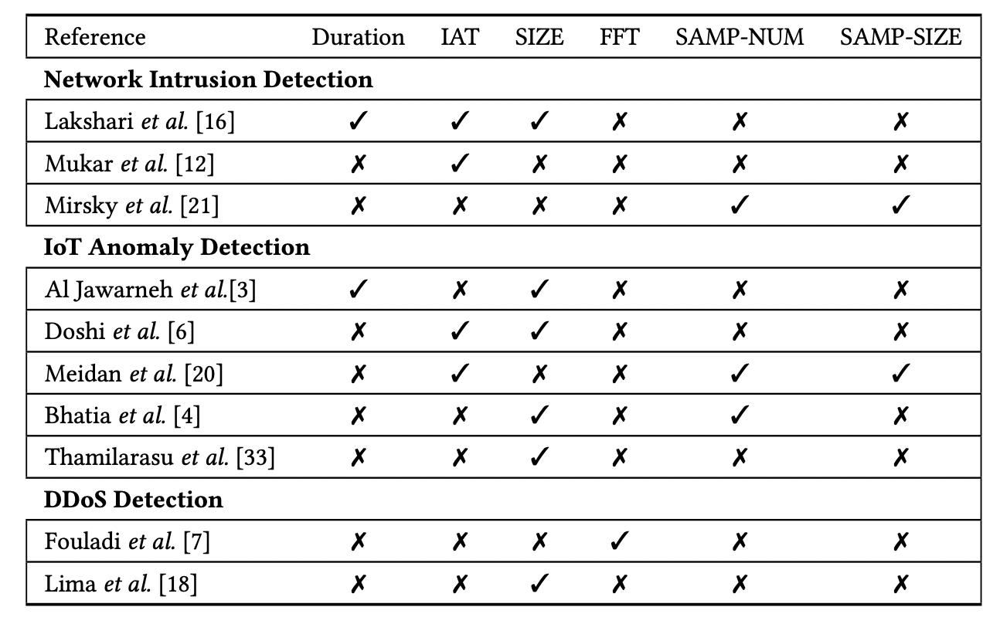
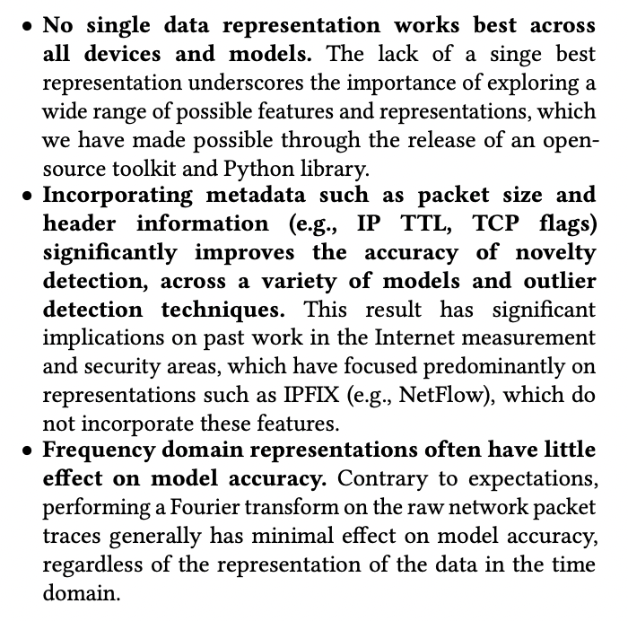

# Why Representation Matters {.center}

> The choice of **how you represent traffic** often matters more than the
> choice of model.

::: {.notes}
Open by asking: if you had a pcap of an hour of traffic, what would you
feed into a classifier? The raw bytes? A table? A time series? This lecture
is about the answer — and why it turns out to be surprisingly non-trivial.
See the "Network Data" chapter of *Machine Learning for Networking*.
:::

## The ML Pipeline Starts with Data

::: {.columns}
::: {.column width="55%"}
Every ML system for networking follows the same arc:

1. **Collect** raw traffic or measurements
2. **Represent** that data as a feature matrix **X**
3. **Train** a model on (X, y)
4. **Deploy** and re-measure

The focus of this lecture is step 2 — the step most often
done carelessly.
:::
::: {.column width="45%"}
**Why it's hard:**

- Raw pcaps are huge and unstructured
- Many transformations are possible
- The "best" representation is task-dependent
- Encryption hides payload content
:::
:::

::: {.notes}
Remind students that in the general ML framing, X is an (n × d) matrix:
n examples, d features. Every networking ML problem has to produce that
matrix from raw packets or flow records. That transformation is the topic
of today's lecture.
:::

# The Raw Material {.center}

## Active vs. Passive Measurement

::: {.columns}
::: {.column width="50%"}
**Active measurement**

- Inject probes; observe responses
- Examples: ping, traceroute, speed tests, ZMap scans
- Advantages: no privacy concerns; deploy anywhere
- Disadvantages: synthetic traffic; doesn't reflect real experience
:::
::: {.column width="50%"}
**Passive measurement**

- Capture existing traffic; observe it
- Examples: packet capture (pcap), NetFlow / IPFIX
- Advantages: reflects actual user/application behavior
- Disadvantages: requires capture infrastructure; privacy concerns
:::
:::

::: {.notes}
See the "Data Collection Strategies" section of the measurement chapter.
Emphasize the tradeoff: active measurement is easier to gather but may not
reflect real user experience; passive measurement directly reflects behavior
but requires access to live traffic.
:::

## Key Network Metrics

These metrics are measured directly and serve as building blocks for features:

| Metric | Definition | Measured by |
|---|---|---|
| **Throughput** | Bits transferred per second | Active & passive |
| **Latency** | Time for a packet to reach destination | Active (ping, traceroute) |
| **Jitter** | Variation in inter-packet delay | Active & passive |
| **Packet loss** | Fraction of packets dropped | Active & passive |
| **Flow stats** | Aggregate per-5-tuple (IPFIX) | Passive |

::: {.notes}
These are the "first principles" measurements. Remind students that a
flow is defined by the 5-tuple: source IP, destination IP, source port,
destination port, protocol. Flow-level records (IPFIX/NetFlow) aggregate
these metrics per flow and are far more compact than full pcaps.
See the "Types of Network Data" section of the measurement chapter.
:::

## From Packets to Features: The Pipeline {.smaller}

```
pcap (raw packets)
    │
    ▼
Parse → 5-tuple flows  (e.g., with netml / scapy / dpkt)
    │
    ▼
Aggregate per flow  →  Feature vectors (rows of X)
    │
    ▼
Feature matrix X  →  ML model
```

**Tools:**

- `scapy`, `dpkt`, `eBPF` — packet parsing
- `netml` (open-source, Python) — pcap → feature vectors in one call
- `pandas` — structure the resulting dataframe

::: {.notes}
Walk through the pipeline concretely. The netml library (Yang et al., 2021)
takes a pcap file and outputs a Pandas dataframe with per-flow features.
It is the primary tool for the course's feature extraction labs.
See the "Data Preparation" section and the netml activity in the measurement chapter.
:::

# Statistical Feature Representations {.center}

## STAT Features: The Baseline

For each **flow** (5-tuple + time window), compute summary statistics over
all packets in that flow:

- **Duration** — elapsed time from first to last packet
- **Packets per second** — packet rate for the flow
- **Bytes per second** — throughput for the flow
- **Packet-size statistics:** mean, std dev, IQR, min, max

These 8–12 numbers form the simplest useful feature vector for a flow.

::: {.notes}
The netml library (and the textbook's examples) extract exactly these
features. Ask students: which of these features would you expect to
distinguish a video stream from a DNS lookup? From a port scan?
This is the "STAT" representation from the source slides.
:::

## Beyond Summary Statistics

Summary statistics throw away structure. Richer representations retain it:

::: {.columns}
::: {.column width="50%"}
**SIZE** — time series of individual packet sizes (bytes), one entry per packet

**IAT** — time series of inter-arrival times (seconds) between consecutive packets

:::
::: {.column width="50%"}
**SAMP-NUM** — partition flow into equal time windows δt; count **packets** per window (a sampled rate)

**SAMP-SIZE** — partition flow into equal time windows δt; sum **bytes** per window
:::
:::

The parameter **δt** is a sampling rate choice. Small δt captures short-timescale bursts; large δt reduces dimensionality.

::: {.notes}
These representations come from the source slides (slide 5) and align with
the measurement chapter's discussion of aggregation granularity.
Emphasize the curse of dimensionality: SIZE and IAT produce variable-length
sequences proportional to the number of packets in the flow, which
creates problems for fixed-width ML models. SAMP-NUM and SAMP-SIZE trade
resolution for fixed dimensionality.
:::

## Which Representation for Which Task? {.smaller}



::: {.notes}
This table is from the source slides (slide 6). Key observations to draw out:
- No single representation dominates across all tasks.
- IAT (inter-arrival time) and SIZE are the most broadly used.
- SAMP-NUM appears in IoT anomaly detection (Meidan et al., Bhatia et al.).
- Duration is used in about half the systems.
The practical implication: picking a representation is a design decision
that requires thinking about the target task and what discriminative
information lives in the traffic.
:::

## What Representations Actually Capture

::: {.columns}
::: {.column width="60%"}
**What packet size and header info buy you:**

- IP TTL, TCP flags, window size → OS / device fingerprinting
- Payload length sequences → application identification
- Burst size + IAT → anomaly detection

**What they don't buy you (usually):**

- FFT of raw data rarely outperforms simpler statistics
- Payload bytes are encrypted — not useful for modern traffic
:::
::: {.column width="40%"}

:::
:::

::: {.notes}
The s07-i02.png image is a text excerpt from research on representation
effectiveness. The key insight: no single data representation dominates
across all models and security tasks. Domain knowledge about the
*task* should drive the representation choice.
:::

# The Encryption Problem {.center}

## Why Encryption Changes Everything

::: {.columns}
::: {.column width="55%"}
**Traditional deep packet inspection (DPI):**

- Read application-layer headers
- Match on HTTP methods, DNS names, TLS SNI
- Works on HTTP/1.1, early TLS

**Modern traffic (TLS 1.3, QUIC, DoH):**

- Payload fully encrypted; even SNI may be encrypted (ECH)
- Port numbers unreliable (QUIC over UDP 443)
- Traditional DPI largely blind
:::
::: {.column width="45%"}
**What's still observable:**

- Packet **sizes** and **timing** (side channels)
- **IP headers** (src/dst, TTL, DSCP)
- **TCP/QUIC** handshake metadata
- **Flow duration** and byte counts
- **Certificate** info (when visible)
:::
:::

::: {.notes}
This slide motivates why we can't just "read the packets" and why careful
feature engineering matters. QUIC in particular uses UDP, so port 443 is
shared across all QUIC traffic regardless of application. TLS 1.3 encrypts
much of the handshake. ECH encrypts the Server Name Indication.
Refer students to the "Encrypted DNS" and "DNS-Based Service Identification"
discussions in the measurement chapter for a concrete example of how
encryption complicates traffic identification.
:::

## Current-Events Spotlight: Encrypted Classifiers in Crisis

::: {.vignette}
**SoK: Decoding the Enigma of Encrypted Network Traffic Classifiers** (arXiv:2503.20093, March 2025; accepted S&P 2025).
Wickramasinghe et al. ran 348 feature-occlusion experiments on state-of-the-art ML classifiers for encrypted traffic and found that **the majority of published classifiers had been trained on unencrypted data** — using legacy datasets that predate widespread TLS 1.3 deployment. The paper shows that classifiers trained on such data overfit to payload features that are unavailable in encrypted traffic. Key take-away: the feature set must match the deployment environment, and most existing datasets need to be re-evaluated.
:::

**Thought question:** If port numbers and payload bytes are unavailable, which of the STAT/SIZE/IAT/SAMP representations still work? Which ones exploit what's left?

::: {.notes}
This is the freshest hook on the topic as of June 2026. Use it to motivate
why representation choices have real stakes: systems built on the wrong
features fail in production. The paper is freely available on arXiv.
Cold-call: "if you trained a classifier on traffic from 2015, what features
would it have used that are no longer available today?"
:::

# Representation Learning {.center}

## The Cost of Manual Feature Engineering

Traditional pipeline: for each new task, start over.

::: {.columns}
::: {.column width="55%"}
**Problems with hand-crafted features:**

- **Expensive:** requires domain expertise + iteration
- **Not reproducible:** subtle implementation differences
  cause large result differences (DARPA'98 example: same dataset,
  DoS packet counts differ by 10×)
- **Non-transferable:** features for intrusion detection
  don't help application identification
:::
::: {.column width="45%"}
**Goal:** one representation that works across tasks, applied once, reused everywhere.

> "If deep learning can classify images from pixels, why not classify
> packets from bits?"
:::
:::

::: {.notes}
The reproducibility failure on DARPA'98 is documented in McHugh (2000).
The "pixels → packets" analogy motivates nPrint.
See the "Traditional Pipeline Problem" section of the measurement chapter.
:::

## nPrint: Packet Bits as a Standard Representation {.smaller}

**Key idea:** convert each packet to a **fixed-width bitmap** aligned to
protocol field boundaries.

Each bit position always means the same thing:

| Value | Meaning |
|---|---|
| `1` | bit is set in that header field |
| `0` | bit is not set |
| `-1` | header field not present in this packet type |

The `-1` sentinel enables **alignment** — every packet type fits the same
d-dimensional vector, enabling consistent ML input regardless of protocol mix.

::: {.notes}
The alignment property is what makes nPrint work. Without it, bit 100 in
one packet might be the destination port, while in another packet it's
the TTL — the model can't learn any consistent pattern.
See the "nPrint Approach" section and the bitmap figure in the measurement chapter.
Holland et al., CCS 2021.
:::

## nPrint Workflow

```bash
# Convert pcap to nPrint CSV (IPv4 + TCP headers + 30 payload bytes)
nprint -P 30 -4 -t input.pcap > output.csv

# output.csv: one row per packet, hundreds of bit columns
# Feed directly to any sklearn / PyTorch classifier
```

Benefits:

- **Generalization:** same representation for application ID, OS fingerprinting, attack detection
- **Reproducibility:** identical output from identical input — no feature-engineering variance
- **Feature importance:** tree-based models reveal which header bits mattered

Limitations to keep in mind:

- ~2× storage overhead vs. raw headers
- Temporal relationships between packets not encoded by default
- May learn spurious IP-address correlations if data collection is not careful

::: {.notes}
Walk through the command-line example. The flags -4, -t select IPv4 and TCP
headers; -P 30 includes the first 30 bytes of payload. The output is directly
usable with scikit-learn.
The "spurious correlation" warning is important: if all training examples
for one class came from one IP range, the model learns the IP, not the
application. This is a real pitfall in practice.
See the "Benefits and Limitations" section of the measurement chapter.
:::

## Feature Engineering vs. Representation Learning

::: {.columns}
::: {.column width="50%"}
**Hand-crafted features (STAT, IAT, SIZE, SAMP)**

- Domain knowledge drives design
- Low dimensionality → faster training
- Interpretable by construction
- Must be redesigned for each task
- Can miss unknown patterns
:::
::: {.column width="50%"}
**Learned representations (nPrint, deep learning)**

- Model discovers structure from bits
- High dimensionality → more compute
- Feature importance analysis needed
- Reusable across tasks
- Can find unexpected patterns
- Still needs careful validation
:::
:::

**2026 note:** LLM-assisted feature engineering is now reducing the cost
of hand-crafting features — but nPrint still wins on reproducibility
and cross-task reuse.

::: {.notes}
The textbook's measurement chapter explicitly discusses how AI coding
assistants reduce (but don't eliminate) the cost of custom feature
extraction. Use this as a discussion point: if you can generate feature
extraction code with a prompt, does nPrint still matter? (Answer: yes,
for reproducibility and for tasks where you don't know which features
to ask for.)
See "The Role of AI-Assisted Feature Engineering" in the measurement chapter.
:::

# Practical Considerations {.center}

## The Granularity Tradeoff {.smaller}

Choosing how to **aggregate** is a key design decision:

::: {.columns}
::: {.column width="55%"}
**Finer granularity (per-packet):**

- Captures millisecond bursts
- Higher dimensionality → curse of dimensionality
- Expensive to store and process
- Needed for: real-time IDS, latency anomalies

**Coarser granularity (per-flow, IPFIX):**

- Compact; fast to process
- Misses short-timescale patterns
- Adequate for: throughput analysis, application classification
:::
::: {.column width="45%"}
**Key questions when choosing:**

1. What timescale does the phenomenon of interest operate on?
2. How much storage/compute is acceptable?
3. Is the feature observable in encrypted traffic?
4. Will this generalize across network conditions?
:::
:::

::: {.notes}
The curse of dimensionality appears here: higher-dimensional inputs often
require exponentially more training data to cover the feature space.
This is the core tradeoff articulated in the measurement chapter's
"Data Structures to Features" section.
The four questions are a practical checklist for students to apply in labs.
:::

## Privacy and Deployment Constraints

Features that are **informative** are sometimes **off-limits:**

| Feature | Why restricted |
|---|---|
| Full packet payload | User privacy; legal in many jurisdictions |
| DNS query contents | Encrypted by DoH/DoT in many networks |
| SNI / certificate CN | Encrypted by ECH in modern TLS |
| IP addresses | Privacy; GDPR; anonymization required |
| TCP sequence numbers | Not predictive; may vary per OS |

**Practical consequence:** production systems must be designed around
features that survive both encryption and legal/privacy constraints.

::: {.notes}
This slide connects feature choice to real deployment constraints — not
just academic design. Privacy regulations (GDPR, state privacy laws) limit
what operators can log and process. Encrypted DNS (DoH) makes a whole
class of DNS-based features unavailable.
See the "Encrypted DNS" discussion in the measurement chapter, and the
broader active/passive tradeoff section.
:::

## Summary: Choosing a Representation

**The representation pipeline:**

1. **Collect** raw traffic (pcap or flow records)
2. **Define** the unit of analysis: per-packet, per-flow, per-window
3. **Choose** representation: STAT, SIZE, IAT, SAMP, or nPrint bitmap
4. **Validate** that features survive the deployment environment (encryption, privacy)
5. **Iterate** — feature choice is empirical, not algorithmic

::: {.columns}
::: {.column width="50%"}
**When to use STAT/IAT/SIZE:**
- Interpretability required
- Low-dimensional model needed
- Task is well-understood
:::
::: {.column width="50%"}
**When to use nPrint / raw bits:**
- Multiple tasks from same data
- Reproducibility is a priority
- Unknown discriminating features
:::
:::

::: {.notes}
Summarize the lecture arc: we started with why raw pcaps are not directly
usable; covered the range of statistical representations; showed the
encryption problem making traditional features obsolete; and introduced
nPrint as a standardized alternative.
The five-step pipeline is a practical checklist for the lab assignments.
See the "Summary" section of the measurement chapter ("Network Data").
:::

# Lab Preview {.center}

## Lab: Extracting Features with netml

**Goal:** go from a pcap to a trained classifier in under 50 lines of Python.

```python
from netml.pparser.parser import PCAP
from netml.utils.tool import load_data

# 1. Parse pcap into flows
pcap = PCAP("traffic.pcap", flow_ptks_thres=2)
pcap.pcap2flows()

# 2. Extract STAT features
pcap.flow2features("STATS", fft=False, header=False)
X, y = load_data(pcap)

# 3. Train any sklearn classifier on X, y
```

*netml supports:* STATS, SIZE, IAT, SAMP-NUM, SAMP-SIZE — all the representations from today.

::: {.notes}
This is a preview of the lab assignment. Walk through each step:
- pcap2flows: groups packets into 5-tuple flows
- flow2features: applies the chosen representation
- The result is a standard sklearn-compatible (X, y) pair
Point out that switching between STAT, SIZE, IAT etc. is just changing
one string argument — making it easy to compare representations empirically.
See the netml activity in the measurement chapter appendix.
:::
