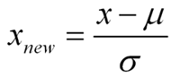
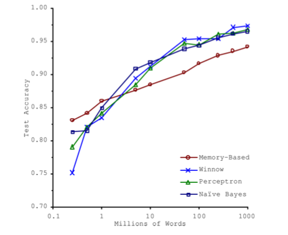
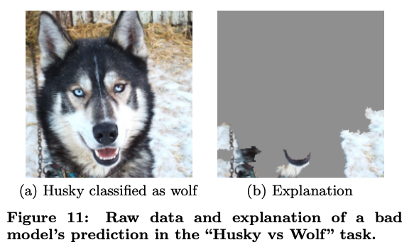

# The ML Pipeline {.center}

> Every step has a cost — and every step is a place where things go wrong.

::: {.notes}
Open with the pipeline framing from the book (Chapter 4: Machine Learning Pipeline). The goal
today is to understand what happens *before* the model sees a single byte. Garbage in,
garbage out — but what kinds of garbage, and how do we catch it?
:::

## Where We Are in the Pipeline {.smaller}

::: {.columns}
::: {.column width="60%"}
- **Data engineering** — today's focus
  - Understanding and exploring data
  - Cleaning and handling outliers
  - Feature generation and representation
  - Labeling examples
  - Splitting into train / validation / test
- Model training
- Model evaluation
:::
::: {.column width="40%"}
Each stage introduces its own failure modes. Data engineering errors are the hardest
to catch because they are silent — the model still trains and produces numbers.
:::
:::

::: {.notes}
See the "Data Engineering" section of the pipeline chapter. Emphasize that the pipeline
is sequential and that errors early propagate to every downstream stage.
:::

## Why Data Representation Matters {.smaller}

- Network data arrives as raw packets; models need **structured features**
- Many challenges particular to network traffic:
  - **Scale** — traffic is generated continuously
  - **Sequential dependencies** — handshakes, parameter negotiation
  - **Bursty timeseries** — inter-arrival times are highly non-uniform
  - **Cross-flow dependencies** — a single application uses many flows

| Representation | What It Captures | Cost |
|---|---|---|
| **Packet** | Full fidelity | Very high |
| **Event** | Anomalies, spikes | Medium |
| **Time bin** | Rate statistics | Depends on bin size |
| **Volume bin** | Standardizes events | Normalizes burstiness |

::: {.notes}
See "Modeling: Data Representation" in the source slides. Volume-based binning is
attractive for network ML because it removes the sensitivity to bursty inter-arrival
times — each bin always contains the same amount of traffic. The cost is that absolute
timing information is lost.

Cold call: which representation would you pick for DDoS detection vs. application
identification? Why might they differ?
:::

# Feature Engineering {.center}

> Features are the **domain knowledge** you encode for your model.

::: {.notes}
Transition: before we discuss how things go wrong (data pitfalls), we need to understand
what features are and how they are built. Good features let you use simpler, faster models.
:::

## What Are Features?

- Features are **hints** — rules of thumb you give the model
- They encode **domain knowledge** that a raw model cannot easily discover
- Better features → simpler models that are faster, easier to interpret, and easier to
  maintain

> Reducing complexity in features may allow us to use less complex models that are faster
> to run, easier to understand, and easier to maintain.

::: {.notes}
This is directly from slide 6 / the pipeline chapter. Stress the maintenance argument:
a feature-rich, simple model is often preferable to a complex neural net in production
networking systems where explainability matters.
:::

## A Taxonomy of Feature Operations {.smaller}

::: {.columns}
::: {.column width="50%"}
**Encoding**

- **One-hot / dummy encoding** — categorical → binary vectors
- **Ordinal encoding** — ordered categories → integers
- **Discretization** — equal-width, equal-size, entropy-based, or
  domain-specific bins

**Normalization**

- Scale features to similar range, e.g., \[0, 1\] or \[−1, 1\]
- **Standardize**: zero mean, unit variance
  ($x_\text{new} = (x - \mu) / \sigma$)
- Caution: outliers distort mean and variance
:::
::: {.column width="50%"}
**Transformations**

- **Log** — compresses heavy-tailed distributions (byte counts, flow durations)
- Square root, squared — different marginal-utility curves

**Aggregation and Interaction**

- Date / time deltas (days since last event)
- Aggregates over time windows or spatial locality
- **Interaction features** — products of two features capture non-linear
  relationships in linear models
:::
:::

::: {.notes}
See "Generating Features" and "Normalization" in source slides; the standardization
formula image (s10-i06.png) is the z-score formula.

Critical networking note: log transformation of packet byte counts and inter-arrival
times is almost always a good idea because these distributions are extremely heavy-tailed.
A raw 1 MB flow and a 1 GB flow look like a rounding error without log-scale.
:::

## Normalization Formula

{width=50%}

Always fit normalization parameters on the **training set only**, then apply them to the
test set — computing them on combined data leaks test-set statistics into training.

::: {.notes}
This is a concrete, early preview of data leakage. The formula itself is simple; the
lesson is *when* you fit it. This is one of the most common mistakes in production ML
pipelines. See the "Dividing Data" section of the pipeline chapter for the golden rule.
:::

## Discretization in Practice {.smaller}

- **Equal-width bins** — simple; sensitive to outliers
- **Equal-size bins** — uniform occupancy; better for skewed distributions
- **Entropy-based bins** — optimize for information content with respect to the label
- **Domain-specific bins** — encode discontinuities a generic algorithm would miss

*Network example:* port numbers have a well-known discontinuity at 1024 (privileged vs.
ephemeral). An entropy-based binner may discover this; a domain-informed binner
guarantees it.

::: {.notes}
The original slide mentions lead poisoning and education as domain-specific examples.
The networking equivalent is the port-number threshold — a model predicting service type
should almost always have a feature "is_privileged_port" rather than raw port number.
:::

# Data Pitfalls {.center}

> A model trained on bad data will confidently produce wrong answers.

::: {.notes}
Transition to the pathology section. The book's "Cleaning the Data" and "Irrelevant
Features and Overfitting to Spurious Correlations" sections are the primary references.
These are not exotic edge cases — they are the dominant cause of ML failure in practice.
:::

## Five Failure Modes {.smaller}

| Failure Mode | What Goes Wrong | Network Example |
|---|---|---|
| **Insufficient data** | Model can't generalize | Too few attack samples |
| **Non-representative data** | Model fails on new populations | Lab traffic ≠ campus traffic |
| **Poor quality data** | Errors and outliers corrupt training | Clock skew in packet timestamps |
| **Irrelevant features** | Model learns spurious correlations | TTL as attack proxy |
| **Overfitting** | Model memorizes training set | 95% train accuracy, 60% deploy |

::: {.notes}
See "Challenges with Machine Learning" (slide 15 source). Use this table as a quick
map; the next several slides go deep on the most dangerous ones.
:::

## Insufficient Training Data

::: {.columns}
::: {.column width="55%"}
- ML models learn from patterns in data — more data → better generalization, especially
  for deep models
- Classic result: accuracy scales roughly log-linearly with corpus size across many
  algorithms (Banko & Brill, 2001)
- Network implication: **rare attack classes** are chronically under-represented; class
  imbalance leads to degenerate classifiers
:::
::: {.column width="45%"}

:::
:::

::: {.notes}
The image is from Banko & Brill's 2001 ACL paper "Scaling to Very Very Large Corpora."
The key takeaway for networking: you can't buy your way out of class imbalance by
collecting more of the majority class. You need representative examples of attacks.
:::

## Non-Representative Training Data {.smaller}

- Training data must represent the **deployment distribution**
- Gaps appear along many dimensions: time period, network topology, user population,
  application mix
- Non-representativeness is a well-studied problem in statistics; in ML it has acute
  consequences for **algorithmic fairness**

::: {.columns}
::: {.column width="55%"}
A vivid real-world example: Google Translate's Finnish → English translation mapped the
gender-neutral pronoun *hän* to gendered English pronouns based on stereotyped contexts
in training data.
:::
::: {.column width="45%"}
{width=85%}
:::
:::

::: {.notes}
The Finnish pronoun example (slide 17 source) is memorable and travels well. The
networking parallel: a model trained only on enterprise traffic will fail on ISP traffic;
a model trained on daytime workday flows will fail on overnight bulk-transfer traffic.
:::

## The Husky–Wolf Problem: Spurious Correlations {.smaller}

::: {.columns}
::: {.column width="55%"}
Ribeiro et al. (LIME, KDD 2016) trained a classifier to distinguish huskies from wolves.
It achieved high accuracy by learning to detect **snow in the background** — not the
animal — because training wolves appeared in snowy scenes and training huskies did not.

**Network equivalent:** a model trained to detect port scans learned to use the **TTL
field** as the discriminative feature. Attackers in the training corpus happened to be a
fixed hop-count from the monitor. In production, attacks arrive from all distances.
:::
::: {.column width="45%"}

:::
:::

::: {.notes}
See the "Irrelevant Features and Overfitting to Spurious Correlations" section of the
pipeline chapter. The TTL example is from the book text and is a networking-native
version of the husky-wolf story. Both illustrate that high train/validation accuracy does
not mean the model has learned the right concept.

Solution: feature importance analysis + domain knowledge + diverse training data +
out-of-distribution test sets.
:::

## Cleaning Network Data {.smaller}

Reference: Vern Paxson, *Strategies for Sound Internet Measurement*, IMC 2004 — the
canonical guide to data quality in networking.

- Identify outliers with **box plots**, statistical tests, and domain knowledge
- *Not all outliers are errors:* small packets (TCP ACKs) are normal — removing them
  harms the model
- Remove outliers only when they represent **measurement errors or physically
  impossible values**:
  - Timestamps with clock skew
  - Packet lengths exceeding the MTU
- "Sound internet measurement" principles transfer directly to ML data engineering

::: {.notes}
See the "Cleaning the Data" section of the pipeline chapter, which cites Paxson's IMC
2004 paper extensively. Stress the domain-knowledge point: a generic outlier-removal rule
will remove valid TCP ACKs. You have to *know* the domain to know which outliers matter.
:::

# Data Leakage {.center}

> Leakage is when information about the **test set bleeds into training** — producing
> inflated accuracy that evaporates on deployment.

::: {.notes}
This is arguably the most important topic in the deck. The book calls it the "golden
rule": never train on the test set. But leakage is more subtle than just accidentally
passing test rows into training.
:::

## The Golden Rule of Supervised Learning

**Never train on the test set.**

Three common ways to break it:

1. **Normalization leakage** — computing mean / variance on the full dataset (including
   test) before splitting
2. **Temporal leakage** — shuffling chronological data, so future samples train on past
   labels (critical for network traffic)
3. **Feature leakage** — a feature encodes the label (e.g., using a flow's final byte
   count to predict whether it will be flagged)

::: {.columns}
::: {.column width="50%"}
Correct split order:
1. Split train / val / test first
2. Fit transforms on train
3. Apply to val and test
:::
::: {.column width="50%"}
Wrong order:
1. Normalize full dataset
2. Then split
→ Test accuracy is **not** a true estimate of generalization error
:::
:::

::: {.notes}
See "Training and Testing Sets" and "Dividing Data" sections of the pipeline chapter.
The normalization leakage is the most common classroom error; the temporal leakage is
the most common *production* error in networking.

For chronological data (flows, pcaps), the test set should be a *contiguous future
window*, not a random sample. Shuffling inter-mixes future with past.
:::

## Temporal Leakage in Network Data

Network traffic is **chronological**. Shuffling before splitting leaks future into the
past.

- Correct: train on traffic from **time window T₁**, test on **window T₂ > T₁**
- Wrong: randomly shuffle all flows, then 80/20 split — future flows train the model on
  attack traffic that hasn't happened yet in the test window
- Also: normalization on the full trace includes future statistics

This is why results on academic traffic datasets (CAIDA, PCAP repositories) often fail
to replicate on live campus deployments — the benchmark didn't respect temporal order.

::: {.notes}
This is a networking-specific elaboration of the golden rule. The book mentions that
chronological data requires a contiguous test subset. The networking consequence is
severe: a DDoS detector trained on shuffled CAIDA data may achieve 99% accuracy on the
held-out split but fail completely when deployed because the statistical fingerprint of
the test split was already visible during training.
:::

## Leakage at Scale: A Research Reproducibility Crisis {.smaller}

::: {.vignette}
Kapoor & Narayanan, *Leakage and the Reproducibility Crisis in ML-based Science*
(Patterns, September 2023; updated table May 2024): catalogued **41 papers across
30 research fields** where data-leakage errors were found — collectively affecting
**329+ papers** and generating wildly over-optimistic published results. Fields include
clinical prediction, NLP, computer vision, and network security. Their accompanying
2024 book *AI Snake Oil* (Princeton University Press) was named one of Nature's 10 best
books of 2024. The core finding: leakage is not a rare bug — it is a pervasive,
systematic failure mode that makes ML results look better than they are.

*Source: arxiv.org/abs/2207.07048; Princeton reproducibility project reproducible.cs.princeton.edu*
:::

::: {.notes}
This is the current-events hook for 2024–2026. The Kapoor & Narayanan paper is the most
comprehensive taxonomy of leakage types in the literature. The book "AI Snake Oil" has
broad reach and is accessible to students. The finding that leakage affects 30+ fields
makes it relevant regardless of the student's background.

Web-verified: Patterns vol. 4, issue 9 (September 2023). Running leakage table last
updated May 2024 at reproducible.cs.princeton.edu. "AI Snake Oil" published September
2024, Princeton University Press. Named Nature's best books of 2024.
:::

## Training, Validation, and Test Sets {.smaller}

Divide labeled data into **three** non-overlapping sets:

| Set | Purpose | Touch rules |
|---|---|---|
| **Training** | Fit model parameters | Used every epoch |
| **Validation** | Tune hyperparameters; catch overfitting | Used during development |
| **Test** | Report final generalization error | Touched **once**, at the very end |

- Modifying the model after seeing test error → you have tuned to your test set
- Practical splits: 60/20/20 or similar; less training data hurts complex models

**Cross-validation** (k-fold): rotate the validation set across k partitions;
average performance → more robust estimate; important when data are scarce.

::: {.notes}
See "Dividing Data," "Validation Sets," and "Cross Validation" in the pipeline chapter.
Stress the discipline of touching the test set only once. In network security settings,
the test set is often a future capture window; violating temporal ordering is the most
frequent form of leakage in the field.
:::

## Overfitting and the Bias–Variance Tradeoff {.smaller}

::: {.columns}
::: {.column width="55%"}
- **Underfitting (high bias):** model too simple to capture structure; fails on
  training *and* test data
- **Overfitting (high variance):** model memorizes training noise; great on train,
  poor on test and production
- The **bias–variance tradeoff:** find the complexity sweet spot

Detection: plot training error vs. validation error as training proceeds (or as dataset
size grows). Divergence → overfitting.

Remedies:
- More (or more diverse) training data
- **Regularization** — penalize parameter magnitude
- **Early stopping** — halt when val error starts rising
- **Ensemble methods** — bagging, boosting
:::
::: {.column width="45%"}
| | Train error | Test error |
|---|---|---|
| Underfit | High | High |
| Good fit | Low | Low |
| Overfit | Very low | High |

A model with 99% training accuracy and 65% test accuracy is not a good model — it has
memorized the training set.
:::
:::

::: {.notes}
See "Overfitting and Bias-Variance Tradeoff" in the pipeline chapter. Network ML
caveat: class imbalance can make training accuracy look deceptively high (always
predict "benign" → 99% accuracy if 1% of traffic is malicious). This is why precision,
recall, and F1 matter more than accuracy for security tasks.
:::

## Labeling Data for Supervised Learning {.smaller}

- Every supervised task requires a **label** for each example
- Labels distinguish **regression** (continuous) from **classification** (discrete)
  - *Binary classification:* 0/1 (benign / attack)
  - *Multi-class:* discrete integer or string labels (app type)
  - *Multi-label:* multiple independent binary labels per example

**Encoding choices matter:**

- **Ordinal encoding** — meaningful order, e.g., QoE: poor → 0, acceptable → 1,
  excellent → 2
- **One-hot encoding** — no implied order; each class is a binary vector

*Network labeling example:* load a benign pcap + a log4j-scan pcap, assign labels 0/1,
concatenate into a single dataframe, separate features (X) and labels (y) before
training.

::: {.notes}
See "Labeling Data" and "Labeling for Prediction Problems" in the pipeline chapter.
The log4j labeling code example from the book is a concrete and current example —
log4Shell was discovered December 2021 and scan traffic remains in research corpora.
Multi-label is less common in basic networking tasks but comes up in traffic
fingerprinting where a flow may be labeled by both application and user class.
:::

# Putting It Together {.center}

> Good data engineering is invisible when it works and catastrophic when it doesn't.

## The Data Engineering Checklist {.smaller}

Before you train any model, verify:

1. **Understand the data** — `describe()`, `shape`, `head()`, distribution plots;
   does the data make domain sense? (MTU < 1514, port ≤ 65535)
2. **Clean** — identify and handle outliers with domain knowledge; remove only
   measurement errors, not natural variation
3. **Remove irrelevant / leaky features** — TTL, IP ID, any field that proxies for
   label membership; run feature importance analysis before deployment
4. **Label carefully** — correct encoding for classification vs. regression; respect
   temporal order in network captures
5. **Split with discipline** — train / val / test; for network data use a *temporal*
   split, not a random shuffle
6. **Fit transforms on train only** — normalization, scaling, imputation: fit on train,
   apply to val/test
7. **Test set is sacred** — touch it once, at the very end

::: {.notes}
This checklist synthesizes the whole pipeline chapter. Use it as a review anchor at the
end of lecture. Students should be able to identify which step was violated when they
hear about a published result that failed to reproduce.

See the "Summary" section of the pipeline chapter for the book's own synthesis.
:::

## Thought Question

::: {.columns}
::: {.column width="60%"}
A team builds a network intrusion detector with the following pipeline:

1. Collect one week of campus traffic, label flows (benign / attack)
2. Normalize all features across the full week
3. Randomly shuffle and split 80/20 for train/test
4. Train a random forest — test accuracy: 97%

**What could go wrong? How would you redesign this pipeline?**
:::
::: {.column width="40%"}
Hints:

- What kind of leakage does step 2 introduce?
- What kind of leakage does step 3 introduce?
- Is 97% test accuracy a trustworthy number? Why or why not?
:::
:::

::: {.notes}
This is the cold-call / small-group discussion slide. Expected answers:

Step 2 → normalization leakage (future test stats leak into training parameters).
Step 3 → temporal leakage (future flows train the model on what hasn't happened yet in
the "test" window).
97% is not trustworthy for both of the above reasons, and possibly also because benign
traffic dominates (class imbalance).

Fix: normalize on train split only; use a temporal split (first 5 days train, last 2
days test); report precision/recall/F1 rather than accuracy.
:::

## Key Takeaways

- **Feature engineering** encodes domain knowledge; good features enable simpler, faster,
  more maintainable models
- **Data quality** failures — insufficient data, non-representativeness, noise,
  irrelevant features — are the dominant cause of ML failures in practice
- **Data leakage** produces inflated, non-reproducible results; it is pervasive across
  30+ research fields
- **Network-specific pitfalls:** temporal leakage from shuffling chronological traffic,
  spurious correlations in packet-header fields (TTL, IP ID)
- The **golden rule:** never train on the test set; for network data, always use a
  temporal split

::: {.notes}
Wrap-up. Ask students to name one form of leakage they've seen or could imagine
encountering in the project they're working on.

Reference: see the "Summary" section of the pipeline chapter for the book's own
synthesis of data engineering, model training, and model evaluation.
:::
