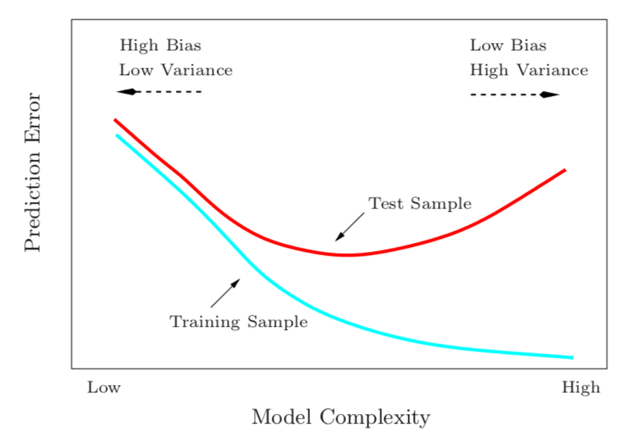
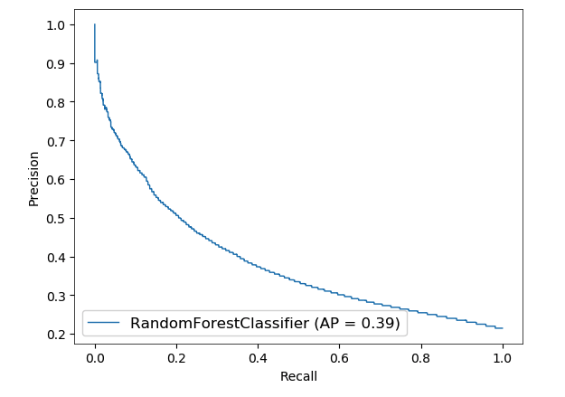
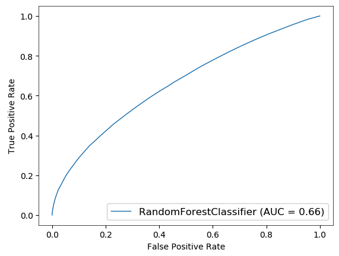

# Data Engineering {.center}

Building a labeled dataset from raw network measurements.

::: {.notes}
Set the stage: we have raw packets (or flows) from the previous chapter. Now we need to
turn them into something a model can learn from. This section covers the full journey from
raw data to a properly split, labeled dataset ready for training. See the "Machine
Learning Pipeline" chapter in *Machine Learning for Networking*.
:::

## The ML Pipeline: Three Stages

::: {.columns}
::: {.column width="50%"}
**Data Engineering**

- Understand and clean the data
- Label examples
- Split into train / validation / test

**Model Training**

- Minimize prediction error
- Tune **hyperparameters**
:::
::: {.column width="50%"}
**Model Evaluation**

- Measure generalization on held-out data
- Report accuracy, precision/recall, AUC
- Iterate — but never on the test set

> Each stage has costs; good design
> balances cost against accuracy.
:::
:::

::: {.notes}
This overview mirrors Figure 4.1 in the book. Emphasize that the three stages are not
independent: decisions in data engineering constrain what you can do in evaluation.
The pipeline applies to both supervised and unsupervised learning, but this lecture
focuses on supervised learning.
:::

## Understanding Your Data First

Before training anything, explore the dataset:

- **Shape** — how many examples? How many features?
- **Distributions** — min, max, mean, std (use `.describe()`)
- **Sanity checks** — are packet lengths in [60, 1514] bytes? Are port numbers < 65535?
- **Feature discrimination** — do packet-length distributions differ by application type?

::: {.notes}
This is the "understanding the data" step from the book. The `describe()` output example
in the book walks through a real pcap loaded via netml. Cold-call: what would an
unusually high minimum TTL value in your data tell you? (Possible clock skew, or all
traffic is from the same subnet distance.)
:::

## Cleaning the Data

Real network traces contain **outliers** — not all of them errors:

::: {.columns}
::: {.column width="55%"}
**Remove when:**

- Timestamps show clock skew
- Packet lengths exceed MTU (1514 bytes)
- Values are physically impossible

**Keep when:**

- Small TCP ACKs appear as minimum-length flows
- Valid but unusual traffic variations
:::
::: {.column width="45%"}
**Why it matters:**

If erroneous outliers remain, the model
may compensate by fitting impossible
values — degrading performance on
valid data.

Domain knowledge is irreplaceable
for distinguishing errors from signal.
:::
:::

::: {.notes}
Reference: Paxson, "Strategies for Sound Internet Measurement," SIGCOMM IMC 2004 —
still the canonical guide on cleaning network measurement data. The key lesson: a box
plot flags unusual values, but only domain knowledge decides whether to remove them.
:::

## Spurious Correlations: The TTL Trap

A model trained to detect port scans achieved 95% accuracy — then failed in production.

::: {.columns}
::: {.column width="55%"}
**What happened:**

The model learned **TTL** (Time-To-Live) as its
top discriminative feature. In the training data,
attack traffic happened to come from a consistent
network distance; TTL was a proxy.

**In production:** attacks arrived from varied
distances. The TTL signal disappeared.
:::
::: {.column width="45%"}
**General lesson:**

High accuracy on training + validation
does not guarantee the model learned
the **right** features.

Feature importance analysis and
diverse, representative data are
both essential.
:::
:::

::: {.notes}
This example comes directly from the book's "Irrelevant Features and Overfitting to
Spurious Correlations" section. The wolf/husky/snow example from computer vision
(Ribeiro et al., LIME, 2016) is a great analogous non-networking case to mention.
Ask students: what other network features might be spuriously correlated with a label
only in a particular collection environment?
:::

## Labeling Data

**Supervised learning requires labeled examples** — a vector *y* pairing each input *X*
with its correct output.

::: {.columns}
::: {.column width="50%"}
**Regression:** continuous labels

- Predicted throughput (Mbps)
- Round-trip latency (ms)

**Binary classification:** 0 / 1

- Benign traffic = 0, Attack = 1

**Multi-class:** discrete labels

- Application type: DNS, HTTP, HTTPS, …
- QoE tier: poor / acceptable / excellent
:::
::: {.column width="50%"}
**Encoding pitfall:**

Ordinal encoding (poor→0,
acceptable→1, excellent→2) implies
an ordering and distance.

One-hot encoding ([1,0,0], [0,1,0],
[0,0,1]) avoids that assumption
for nominal classes.
:::
:::

::: {.notes}
The book distinguishes single-label from multi-label tasks. For network traffic,
binary classification (malicious / benign) is the most common first problem. Multi-class
classification (application type) is the second most common. Remind students: the label
vector y must have the same number of rows as the feature matrix X.
:::

# Train / Test / Validation Splits {.center}

The golden rule: **never train on the test set.**

::: {.notes}
This section covers the "Dividing Data" and "Validation Sets" sections of the book.
The golden rule is stated explicitly in the book — worth reading the exact phrasing aloud.
:::

## Why Split at All?

**The problem:** after training, you have no labeled examples left to measure
whether the model generalizes to new data.

**The solution:** withhold some labeled examples before training — use them only to
measure final performance.

| Set | Purpose |
|---|---|
| **Training set** | Learn model parameters |
| **Validation set** | Tune **hyperparameters**; check generalization during development |
| **Test set** | Report final generalization error — touch only once |

::: {.notes}
Motivate this carefully. Students often ask: why not just use all the data for training
and evaluate on it? The answer: training error is optimistically biased — the model saw
all those examples. We need held-out data to get an unbiased estimate of generalization.
:::

## How to Split: Random vs. Temporal {.smaller}

::: {.columns}
::: {.column width="50%"}
**Random split**

- Appropriate when examples are i.i.d.
- Common rule of thumb: **80% train / 20% test**
- Error estimation accuracy ∝ 1 / √(test set size)

**When random split is wrong:**

Network flows have temporal ordering.
A random split mixes flows from
different days/conditions arbitrarily.
:::
::: {.column width="50%"}
**Temporal (chronological) split**

- Use earlier data for training, later data for test
- Preserves the internal structure of time-ordered data
- More realistic: the model sees only past data, just like in production

**Example:** train on January–October traffic,
test on November–December traffic.
:::
:::

::: {.notes}
This maps to the "Training and Testing Sets" section of the book. The i.i.d. caveat is
crucial for networking: traffic patterns drift over time (new applications, new attacks,
changing user behavior). A temporal split evaluates the model on data it would realistically
encounter after deployment.
:::

## The Bias-Variance Tradeoff

{width=70%}

::: {.notes}
This diagram from the slides shows the classic U-curve. As model complexity increases,
training error monotonically decreases; test error first decreases then increases as the
model starts fitting noise. The sweet spot is in the middle. Hyperparameter tuning is
essentially navigating this tradeoff. Reference the book's "Overfitting and Bias-Variance
Tradeoff" section.
:::

## Overfitting: Detection and Remedies

**Detecting overfitting:** training error much lower than validation error.

**Remedies:**

- **More training data** — the most reliable fix; harder to game
- **Early stopping** — halt training when training and validation errors diverge
- **Regularization** — penalize parameter magnitude during training (can induce bias if overdone)
- **Ensemble methods** — bagging and boosting reduce variance by combining models

::: {.notes}
The book covers all four remedies. Early stopping is particularly intuitive: watch
the learning curve; stop when validation error starts climbing while training error
still falls. Regularization (L1 / L2) is the "lambda" hyperparameter mentioned in the
source slides.
:::

# Cross-Validation {.center}

Getting the most out of limited labeled data.

::: {.notes}
See the book's "Validation Sets" section on cross-validation. The motivation is
practical: splitting 60/20/20 leaves only 60% for training. Cross-validation lets you
use more of the data for training while still getting a reliable generalization estimate.
:::

## K-Fold Cross-Validation

::: {.columns}
::: {.column width="55%"}
**Goal:** avoid overfitting to a single validation split.

**Procedure (K = 5):**

1. Partition non-test data into 5 equal folds.
2. For fold *k*: train on the other 4, validate on fold *k*.
3. Repeat for all 5 folds.
4. Report **average** validation performance.

**Test set is still held out throughout.**
:::
::: {.column width="45%"}
**Leave-One-Out CV:**

- Each fold = one example
- Best generalization estimate
- Impractical for large datasets
  or expensive models

**Common choices:** K = 5 or K = 10
for a balance of compute and accuracy.
:::
:::

::: {.notes}
Kohavi (1995) introduced the systematic study of cross-validation as a model selection
tool. Note that CV is usually used for tuning hyperparameters, not for selecting the
final test number — that still requires the held-out test set. For neural network models,
full K-fold CV is often impractical; a single train/validation/test split is common.
:::

## Overfitting Can Happen in Meta-Learning Too

Even when using a **validation set**, repeated hyperparameter tuning can overfit to that
validation set.

**Example:** trying 200 hyperparameter combinations and selecting the best — you've
effectively "trained" on the validation set.

**Cross-validation** distributes this risk across folds, reducing the chance of
selecting hyperparameters that happen to work on one specific validation partition.

::: {.notes}
This is the point of slides 10–11 in the original deck. The principle: any time you make
a decision based on data, that data becomes "used." Cross-validation is not a magic bullet
— it just spreads the risk more evenly. With very large hyperparameter search spaces,
you may still need a separate "test" set that is never used during any tuning.
:::

# Evaluation Metrics {.center}

What does "performance" actually mean?

::: {.notes}
See the book's "Model Evaluation" and "Performance Metrics" sections. The key insight:
accuracy alone is often misleading in network security contexts, where class imbalance
is the norm (99.9% of packets are benign).
:::

## The Confusion Matrix

::: {.columns}
::: {.column width="55%"}
Predictions are often **scores in [0, 1]**, mapped to classes by a **threshold**:

|  | Predicted Positive | Predicted Negative |
|---|---|---|
| **Actual Positive** | TP | FN |
| **Actual Negative** | FP | TN |

Threshold choice shifts TP, FP, FN, TN.
Varying it traces out a performance curve.
:::
::: {.column width="45%"}
**What the cells mean:**

- **TP** — attack detected correctly
- **TN** — benign traffic passed correctly
- **FP** — benign flagged as attack (false alarm)
- **FN** — attack missed (false negative)

Off-diagonal entries are the errors.
A perfect model has a diagonal matrix.
:::
:::

::: {.notes}
Confusion matrices are useful for debugging: by looking at which specific examples fall
in the off-diagonal, you can understand what the model is getting wrong and why.
For multi-class problems, the confusion matrix generalizes to N × N.
:::

## Core Metrics from the Confusion Matrix {.smaller}

::: {.columns}
::: {.column width="50%"}
**Accuracy**

(TP + TN) / (TP + TN + FP + FN)

- Simple; single number
- Misleading when classes are imbalanced
- "Always predict benign" gets 99.9% accuracy
  if 99.9% of traffic is benign

**Precision** (Positive Predictive Value)

TP / (TP + FP)

- Of all *predicted* positives, how many were real?
- High precision → few false alarms
:::
::: {.column width="50%"}
**Recall** (True Positive Rate / Sensitivity)

TP / (TP + FN)

- Of all *actual* positives, how many did we catch?
- High recall → few missed attacks

**Specificity**

TN / (TN + FP)

**F1 Score**

Harmonic mean of precision and recall

= 2 · (Precision · Recall) / (Precision + Recall)

- Single number; punishes low values of either
:::
:::

::: {.notes}
Walk through the formulas carefully. The harmonic mean is key: F1 = 0.5 if precision = 1
but recall = 0.33 (or vice versa), whereas arithmetic mean would give 0.67. This means
you cannot compensate for a very low recall with a very high precision. F1 does not
incorporate TN, so it is most useful when true negatives are hard to count (information
retrieval, rare event detection).
:::

## Precision-Recall: The Imbalance Problem

**Scenario:** 99% of traffic flows are benign; 1% are attacks.

Even a classifier with a **false positive rate of 0.5%** will flag ~50 benign flows for
every attack it catches correctly.

::: {.columns}
::: {.column width="60%"}
- Low **prevalence** of the positive class amplifies FP impact
- High **recall** does not imply high **precision** when classes are skewed
- For network IDS: even a "good" false positive rate can flood analysts
  with bogus alerts

**Always report precision and recall separately for imbalanced problems.**
:::
::: {.column width="40%"}

:::
:::

::: {.notes}
This is the most practically important point for students working on network security.
The IDS false alarm problem is real: SOC analysts are overwhelmed by alert fatigue.
A system with 99% recall but 10% precision will cry wolf nine times for every real alert.
:::

## ROC Curve and AUC

::: {.columns}
::: {.column width="55%"}
**Receiver Operating Characteristic** plots

- Y-axis: **True Positive Rate** (Recall)
- X-axis: **False Positive Rate** (1 − Specificity)

As the threshold decreases, both rates increase.
The ideal curve hugs the **top-left corner**.

**Area Under the Curve (AUC):**

- AUC = 1.0 → perfect classifier
- AUC = 0.5 → random guessing
- Higher AUC = better discrimination
:::
::: {.column width="45%"}

:::
:::

::: {.notes}
The example AUC of 0.66 is from the course lab using netml. It is only moderately better
than random — a good talking point: this is realistic for a first-pass model on raw
features without domain-specific engineering. Ask: what would you do to improve it?
(Feature engineering, more data, better split strategy, ensemble models.)
Reference: Fawcett (2006), "An Introduction to ROC Analysis," Pattern Recognition Letters.
:::

## ROC vs. Precision-Recall: When to Use Which

| | **ROC / AUC** | **Precision-Recall / AP** |
|---|---|---|
| Class balance | Works well | Better for **imbalanced** classes |
| TN in denominator | Yes (FPR uses TN) | No |
| Optimism with rare positives | Inflated AUC possible | More honest |
| Common domain | General classifier comparison | Information retrieval, IDS, medical |

**Guideline:** when the positive class is rare (attacks, fraud, faults), prefer
**precision-recall** curves over ROC. Both curves together give the fullest picture.

::: {.notes}
The book explicitly recommends looking at multiple metrics. The key insight: for a
dataset where positives are 1 in 10,000, you can have AUC = 0.95 but precision near
zero because TN dominates the denominator of FPR. PR curves do not have this problem.
:::

# Common Evaluation Pitfalls {.center}

Where pipelines go wrong.

## Data Leakage: The Silent Killer {.smaller}

**Data leakage** occurs when information that would not be available at prediction time
influences model training or evaluation — making a model appear better than it is.

::: {.columns}
::: {.column width="55%"}
**Classic leakage patterns:**

- Including the ground truth (or a proxy) as an input feature
- **Standardizing the entire dataset** before splitting — test mean leaks into training
- Using future data to predict the past
- Any preprocessing fit on combined train + test
:::
::: {.column width="45%"}
**The correct order:**

1. Split into train / test *first*
2. Fit any transformers (scalers, encoders) **only on training data**
3. Apply those same transformers to validation and test sets
4. Never touch the test set until final evaluation
:::
:::

::: {.notes}
The standardization pitfall is extremely common. scikit-learn Pipelines are designed
to prevent it: fit_transform on train, transform on test. Show students the sklearn
common pitfalls documentation. The book's "Training and Testing Sets" section gives
a clear walkthrough.
:::

## Current Events: Leakage at Scale

::: {.vignette}
**Kapoor & Narayanan, "Leakage and the Reproducibility Crisis in ML-based Science,"
*Patterns* (Cell Press), September 2023** — a systematic audit of 294 published ML
studies across 17 scientific fields found that data leakage is pervasive and causes
reproducibility failures. In one striking case, correcting leakage in civil-war
prediction ML models showed they performed **no better than older baseline methods**.
The authors introduce a taxonomy of leakage types and propose "model info sheets"
as a remedy. Ongoing: a 2026 arXiv paper (2603.25826) shows the same gap between
near-perfect training accuracy and degraded real-world performance persists in
network intrusion detection when models face shifted traffic distributions.
:::

**Takeaway:** a clean pipeline is not a formality — it is the difference between
a model that works and one that only appears to work.

::: {.notes}
Kapoor & Narayanan (2023) is a landmark paper. The civil war example is memorable and
cross-domain: it shows the problem is not limited to ML practitioners — it affects the
scientists who use ML as a tool. Ask students: which leakage patterns are hardest to
detect without code review? (Temporal leakage is the trickiest in network data.)
Source: https://www.cell.com/patterns/fulltext/S2666-3899(23)00159-9
arXiv preprint: https://arxiv.org/abs/2207.07048
:::

## Summary: The ML Pipeline

::: {.columns}
::: {.column width="50%"}
**Data Engineering**

- Understand and clean data; use domain knowledge
- Beware spurious correlations (TTL trap)
- Label correctly; choose encoding wisely
- Split before any preprocessing

**Train / Validation / Test**

- Never train on the test set
- Use chronological splits for network data
- Use cross-validation to avoid overfitting to one validation partition
:::
::: {.column width="50%"}
**Model Evaluation**

- Accuracy is misleading for imbalanced classes
- Use **precision, recall, F1** for imbalanced data
- **ROC / AUC** for general discrimination
- **PR / AP** when positives are rare
- Report multiple metrics; examine confusion matrix

**Leakage**

- Split first; fit transformers on train only
- Never use test set feedback to modify the model
:::
:::

::: {.notes}
These three bullets map directly to the chapter summary in the book. A good closing
question: ask students to find one leakage risk in a hypothetical pipeline where they
normalize all features, split 80/20, train an SVM, then report test accuracy. (Answer:
the normalization used test-set statistics.)
:::
