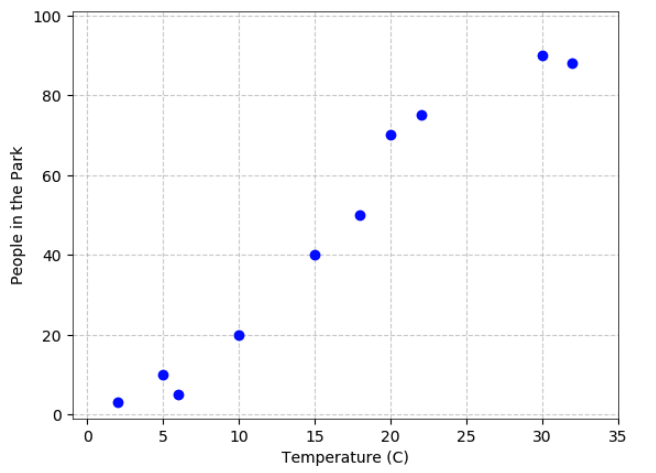
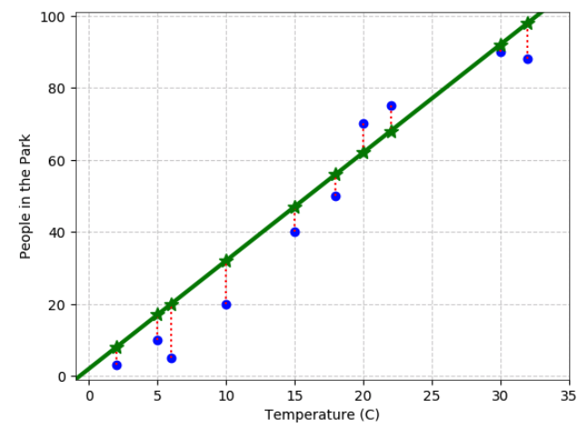
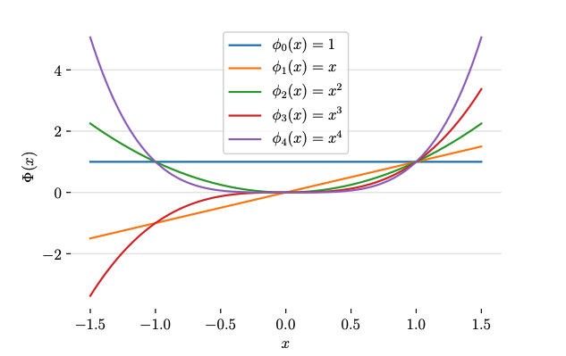
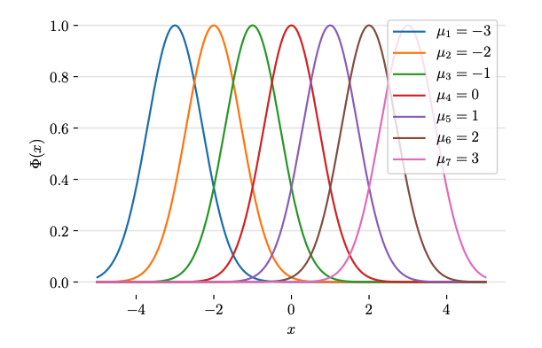

# Linear Regression {.center}

From a scatter plot to a prediction function — and why it matters for networks.

## What Is a Linear Model?

A **linear regression** model predicts a continuous output as a weighted sum of input features:

$$\hat{y} = b + w_1 x_1 + w_2 x_2 + \cdots + w_N x_N = \mathbf{w}^T \mathbf{x}$$

- **weights** $w_j$ — how much each feature shifts the prediction
- **bias** $b$ — the intercept (absorbed into $\mathbf{w}$ when $x_0 = 1$)
- For the whole dataset: $\hat{\mathbf{y}} = \mathbf{w}^T \mathbf{X}$

::: {.notes}
Walk students through the dot-product form. The "bias" plays the same role as the intercept in $y = mx + b$. Stress that this extends naturally to N dimensions — the same line idea, but in higher-dimensional space. See the "Linear Models" section of the supervised learning chapter.
:::

## A Concrete Example: Scatter and Fit

::: {.columns}
::: {.column width="50%"}
**Raw data** — temperature vs. park attendance:

:::
::: {.column width="50%"}
**Fitted line** — residuals shown in red:

:::
:::

::: {.notes}
The red dotted lines are the residuals — the gap the model is trying to shrink. Intuition before math: a good fit places the line so the residuals are as small as possible on average. The park/temperature example is deliberately non-network so the math stands out; we will move to network examples shortly.
:::

## Training: Minimizing Residual Sum of Squares

Find $\hat{\beta}$ that minimizes the **residual sum of squares (RSS)**:

$$\text{RSS}(\beta) = \sum_{i=1}^{N}(y_i - x_i^T \beta)^2 = (\mathbf{y} - \mathbf{X}\beta)^T(\mathbf{y} - \mathbf{X}\beta)$$

Set the derivative to zero: $\mathbf{X}^T(\mathbf{y} - \mathbf{X}\beta) = 0$

**Closed-form (normal equation):**

$$\hat{\beta} = (\mathbf{X}^T\mathbf{X})^{-1}\mathbf{X}^T\mathbf{y}$$

::: {.notes}
This derivation is the "mainstay of statistics for 30 years" (speaker note from source slides). Walk through the algebra once: expand RSS, differentiate, set to zero. The result is a direct matrix solve — no iteration needed. Contrast with neural networks, which require gradient descent because there is no closed form. See the "Linear Regression" subsection of Chapter 5.
:::

## Key Assumptions {.smaller}

For the normal equation to give a *good* estimate:

| Assumption | What breaks if violated |
|---|---|
| **Full-rank** design matrix $\mathbf{X}^T\mathbf{X}$ | No inverse exists; redundant features |
| **Independent** training samples | Variance estimates are wrong |
| **Conditional independence** of $y$ given $\mathbf{x}$ | Biased coefficients |
| **Linear** conditional mean $E[y \mid \mathbf{x}]$ | Model is systematically wrong |

Regression libraries detect rank deficiencies and remove redundant columns automatically. **Regularization** (covered later) is another fix.

::: {.notes}
The rank condition is violated frequently in network data — e.g., if you include both "bytes per packet" and "total bytes" and "total packets" simultaneously, one is a linear combination of the others. Regularization (Ridge, Lasso) shrinks the problem gracefully rather than failing on near-singular matrices.
:::

## Coefficient Significance

How confident are we that a coefficient is non-zero?

- **Z-score** (single coefficient): $z_j = \hat{\beta}_j / \hat{\sigma}\sqrt{v_j}$, where $v_j$ is the $j$-th diagonal of $(\mathbf{X}^T\mathbf{X})^{-1}$
- **F-test** (group of coefficients): compares RSS of a full model vs. a restricted model:

$$F = \frac{(\text{RSS}_0 - \text{RSS}_1)/(p_1 - p_0)}{\text{RSS}_1/(N - p_1 - 1)}$$

Use these to prune **irrelevant features** before deploying a model.

::: {.notes}
The Z-score is testing the null hypothesis $H_0: \beta_j = 0$. In network traffic contexts, this tells you which flow features (packet size, inter-arrival time, port number) actually predict the target — very useful for feature selection. Good video on F-tests: https://www.youtube.com/watch?v=ie-MYQp1Nic
:::

## Networking Pitfall: The ACK Packet Problem

**Predicting bytes from packets** — a natural task, until you look at the data:

::: {.columns}
::: {.column width="55%"}
Two clusters appear:

- **Data packets** — high byte counts, variable packet counts
- **ACK packets** — low byte counts, few packets

MSE amplifies large errors, so the fit skews toward data packets and **ignores ACKs**.
:::
::: {.column width="45%"}
**Solutions:**

1. Normalize / scale targets before training
2. Use absolute error instead of squared error
3. **Classify first** (data vs. ACK), then fit separate models — a pipeline approach
:::
:::

::: {.notes}
This is the "Practical Pitfall: The Acknowledgement Packet Problem" from the book. It is a perfect illustration of why one-size-fits-all models fail with multi-modal data. The pipeline (classify → regress) is a recurring pattern in networking ML. See the corresponding section in Chapter 5.
:::

# Basis Expansion and Polynomial Regression {.center}

When the relationship is not linear — but you still want to use linear regression.

## The Problem: Non-Linear Relationships

Linear models may not capture the **wide variety of functions** we need in practice:

- Packet arrivals at a router — often **bursty and nonlinear**
- Throughput vs. signal strength in wireless — **concave**
- RTT vs. congestion window — **step-like**

And data is not always numeric vectors: molecules, text, graphs all require **representation first**.

**Goal:** Extend linear regression to handle non-linear relationships — *without abandoning its nice properties*.

::: {.notes}
Ask students: what does a scatter plot of throughput vs. distance from a 5G base station look like? It drops steeply — not linear. This motivates the need for something beyond a straight line. See "Polynomial Basis Expansion" in Chapter 5.
:::

## Key Idea: Transform the Features

Replace raw inputs $\mathbf{X}$ with **basis functions** $h_m(\mathbf{X})$:

$$f(X) = \sum_{m=1}^{M} \beta_m h_m(X)$$

The model is still **linear in $\beta$** — so the same closed-form solution applies. Only the *data representation* changes, not the *fitting procedure*.

::: {.notes}
This is the central insight of basis expansion: we change the form of the data, not the form of the function. After transforming X into a new feature matrix, you hand the result to the exact same linear regression solver. The model is linear in parameters even though it is nonlinear in the original inputs. Emphasize this point clearly — it is what makes polynomial regression not a separate algorithm.
:::

## Common Basis Functions

::: {.columns}
::: {.column width="50%"}
**Polynomial** — captures smooth curves:

:::
::: {.column width="50%"}
**Radial basis functions (RBF)** — symmetric "bumps" around centers $\mu_i$:

**Others:** Fourier series (periodic signals), piecewise linear (splines)
:::
:::

::: {.notes}
Polynomial bases are the easiest to understand: add $x^2$, $x^3$, etc., to the feature matrix. RBFs are useful for modeling functions that have localized effects (e.g., a latency spike when the network load crosses a particular threshold). Fourier bases are natural for traffic that has daily or weekly periodicity. See "Examples of Basis Functions" in the source slides.
:::

## Polynomial Regression in Practice

A **degree-$d$ expansion** replaces $X$ with $[X, X^2, \ldots, X^d]$ (plus cross-terms for multivariate data):

- **Degree 2** → quadratic model: learns $w_1 x + w_2 x^2 + b$
- **Degree 3** → cubic, and so on
- Number of features grows quickly, but **training is unchanged** — still minimizing RSS

**Hyperparameter:** the polynomial degree $d$ — tuned with cross-validation.

Higher $d$ → fits training data better → higher **risk of overfitting**.

::: {.notes}
Polynomial regression is not a new algorithm. It is linear regression applied to a pre-processed feature matrix. sklearn's `PolynomialFeatures` transformer does exactly this: it generates the expanded matrix, then you pipe it into `LinearRegression`. Choosing d is the key modeling decision; we will see why next.
:::

## Representing Structured Data as Features {.smaller}

For non-vector data, basis functions *create* the feature vector:

| Data type | Common representations |
|---|---|
| **Images** | DCTs, wavelets, CNN feature maps |
| **Speech / time series** | Fourier / wavelet transforms |
| **Text** | Counts, n-grams, TF-IDF, word embeddings |
| **Network flows** | Packet-size histograms, inter-arrival stats |

Once you have a feature vector, linear models apply as before — making basis expansion the **bridge** from raw data to supervised learning.

::: {.notes}
Network flows are not vectors by default. You need to decide: average packet size? Standard deviation of inter-arrival times? nPrint (a fixed byte-level representation)? The choice of representation is a design decision that dramatically affects model quality. This connects to the representation-learning lectures later in the course.
:::

# Overfitting, Bias-Variance Tradeoff, and Regularization {.center}

Fitting the data well is not the same as generalizing to new data.

## Inductive Bias

Every learning algorithm must **make assumptions** about unseen data:

- **Restriction bias** — only some hypotheses are possible (e.g., only degree-2 polynomials)
- **Preference bias** — among all consistent hypotheses, prefer the simpler one

**No Free Lunch Theorem:** No single inductive bias works best across *all* problems. A model that does well on one class of functions will do poorly on its complement.

::: {.notes}
The NFL theorem is not just a theoretical curiosity — it explains why no one algorithm is always best. In networking, a model trained on daytime enterprise traffic will likely fail on overnight backup traffic. You are always making assumptions; the question is whether those assumptions are justified for your specific dataset. See "Inductive Bias" in the source slides.
:::

## Underfitting vs. Overfitting

::: {.columns}
::: {.column width="55%"}

:::
::: {.column width="45%"}
- **Underfitting** — model too simple; high training *and* test error (high bias)
- **Overfitting** — model too complex; low training error, high test error (high variance)
- **Sweet spot** — the U-curve minimum on test error

Training error alone **hides overfitting**.
:::
:::

::: {.notes}
The classic bias-variance diagram. Ask: if you use a degree-15 polynomial on 10 data points, what happens? The model interpolates every point (zero training error) but is wildly wrong between points. In network contexts, overfitting on traffic traces means the model learns the quirks of a single measurement period and fails to generalize to live traffic. See "Underfitting and Overfitting" in the source slides.
:::

## Bias-Variance Tradeoff (Formal)

For a regression estimator $\hat{f}$, the **mean squared error decomposes** as:

$$\text{MSE} = \underbrace{\text{Var}[\hat{f}(x)]}_{\text{variance}} + \underbrace{(\mathbb{E}[\hat{f}(x)] - f(x))^2}_{\text{bias}^2}$$

- **Variance** — how much does the prediction fluctuate across different training sets?
- **Bias** — how far is the average prediction from the truth?

Reducing one typically **increases the other**. This tradeoff is universal across all ML models.

::: {.notes}
This is a key result to derive or at least sketch. Walk through: a constant predictor (mean of y) has zero variance but potentially large bias. A polynomial that passes through every training point has zero bias on training data but enormous variance. The optimal model sits between these extremes. The same tradeoff reappears in neural networks as the tension between depth/width and regularization.
:::

## Two Sources of Model Complexity

1. **Number of basis functions** — e.g., the polynomial degree $d$
2. **Number of non-zero parameters** — how many coefficients are non-zero

**Regularization** controls both by penalizing large or numerous coefficients — *coefficient shrinkage*.

::: {.notes}
Students sometimes think more features always help. This slide establishes that complexity has two dimensions. Ridge and Lasso attack dimension 2 (parameter magnitude / sparsity), while cross-validating the degree attacks dimension 1. See "Two Sources of Model Complexity" in the source slides.
:::

## Ridge Regression (L2 Regularization)

Add an L2 penalty on coefficient magnitude to the RSS:

$$\hat{\beta}^{\text{ridge}} = \underset{\beta}{\text{argmin}} \left\{ \sum_{i=1}^{N}(y_i - \beta_0 - \sum_{j=1}^{p} x_{ij}\beta_j)^2 + \lambda \sum_{j=1}^{p} \beta_j^2 \right\}$$

Closed-form solution: $\hat{\beta}^{\text{ridge}} = (\mathbf{X}^T\mathbf{X} + \lambda\mathbf{I})^{-1}\mathbf{X}^T\mathbf{y}$

- **$\lambda$ large** → small coefficients → simpler, more biased model
- **$\lambda = 0$** → ordinary least squares
- Called **weight decay** in neural networks
- **Important:** standardize inputs before fitting

::: {.notes}
The $\lambda\mathbf{I}$ term also fixes the singularity problem: even if $\mathbf{X}^T\mathbf{X}$ is not full rank, adding a positive diagonal makes it invertible. In sklearn, the hyperparameter is named `alpha` (not `lambda`). This concept reappears in neural-network weight decay, so students will see it again. See "Coefficient Shrinkage: Ridge Regression" in the source slides and "Ridge Regression" in Chapter 5.
:::

## Lasso Regression (L1 Regularization)

Replace the L2 penalty with an L1 penalty (sum of *absolute* values):

$$\hat{\beta}^{\text{lasso}} = \underset{\beta}{\text{argmin}} \left\{ \frac{1}{2}\sum_{i=1}^{N}(y_i - \beta_0 - \sum_{j=1}^{p} x_{ij}\beta_j)^2 + \lambda \sum_{j=1}^{p} |\beta_j| \right\}$$

- **Induces sparsity** — many coefficients are driven to exactly zero
- No closed-form solution — requires iterative optimization
- **Advantage:** automatic **feature selection** (zero-out irrelevant features)
- **Disadvantage:** struggles when features are highly correlated

::: {.notes}
The key difference from Ridge: the L1 penalty has a "corner" at zero, which geometrically means it can set coefficients to exactly zero. This is powerful for network feature selection — you might start with 50 flow features and end with 8 that genuinely matter. See "Coefficient Shrinkage: Lasso Regression" and "Lasso Regression" in Chapter 5.
:::

## Ridge vs. Lasso vs. Elastic Net {.smaller}

| | Ridge (L2) | Lasso (L1) | Elastic Net |
|---|---|---|---|
| **Penalty** | $\lambda \sum \beta_j^2$ | $\lambda \sum |\beta_j|$ | $\lambda \sum (\alpha\beta_j^2 + (1-\alpha)|\beta_j|)$ |
| **Closed form?** | Yes | No | No |
| **Sparsity?** | No (shrinks, keeps all) | Yes (zeros out) | Partial |
| **Prediction accuracy** | Often slightly better | Slightly lower | Balanced |
| **Interpretability** | Lower | Higher (fewer features) | Balanced |
| **When to use** | Many small correlated effects | Few large independent effects | Both |

::: {.notes}
In practice: if you want a model that generalizes well, try Ridge first. If you also need to know *which* features matter (common in network monitoring), try Lasso. ElasticNet combines both and adds a second hyperparameter alpha that you tune. The book note: "if your dataset is simple enough that one of these approaches performs well, any of the others will likely also perform well." See "Ridge vs. Lasso" and "ElasticNet" in Chapter 5.
:::

## Current Application: ML for 5G Performance

::: {.vignette}
A September 2025 paper in *Electronics* (DOI: 10.3390/electronics14193817), "A Machine Learning Approach to Investigating Key Performance Factors in 5G Standalone Networks," built a 5G testbed using srsRAN and Open5GS, then trained and compared **Linear Regression, Decision Tree, Random Forest, Gradient Boosting, and XGBoost** to predict key performance indicators (KPIs) such as throughput and latency. Linear regression served as the interpretable baseline — its coefficients directly identified which physical-layer and service factors (channel bandwidth, inter-arrival time, deployment environment) most influenced 5G performance. The study demonstrates that even simple linear models remain a *first step* in any ML pipeline for network performance prediction.
:::

**Thought question:** When would you choose the interpretable linear baseline over the higher-accuracy tree ensemble?

::: {.notes}
This is a real, verified, primary-source paper from September 2025. The teaching point: linear regression as a baseline is not just a homework exercise — it is standard practice in network engineering research. The comparison with tree-based methods sets up later lectures on ensembles. Ask: if your goal is to *explain* to a network operator why throughput dropped, which model do you use?
:::

## Summary: Linear and Polynomial Regression

::: {.columns}
::: {.column width="50%"}
**Linear regression**

- Predict continuous output: $\hat{y} = \mathbf{w}^T\mathbf{x}$
- Closed-form solution via normal equations
- Coefficient Z/F tests → feature significance
- Watch for ACK-packet-style multi-modal data

**Basis expansion**

- Replace $X$ with $h(X)$ — same fitting procedure
- Polynomial, Fourier, RBF, piecewise linear
- Degree $d$ is a hyperparameter → cross-validate
:::
::: {.column width="50%"}
**Bias-variance tradeoff**

- Underfitting ↔ overfitting
- MSE = variance + bias$^2$
- No free lunch: no model is best everywhere

**Regularization**

- Ridge (L2): shrinks all coefficients, closed form
- Lasso (L1): zero-out irrelevant features, no closed form
- Elastic net: combines both
- Simpler models are more interpretable *and* avoid overfitting
:::
:::

::: {.notes}
Close by asking: which technique would you use to predict flow size from flow duration and packet count in live network traffic? Walk through: start with linear regression, check residuals for non-linearity, try polynomial expansion, measure train vs. validation error to pick degree, then add Ridge regularization if features are correlated. This is the real workflow. See Chapter 5 of Machine Learning for Networking.
:::
