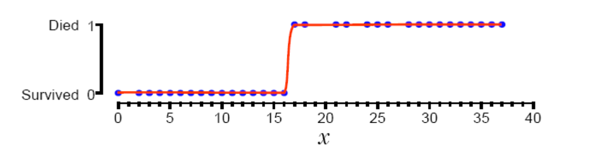
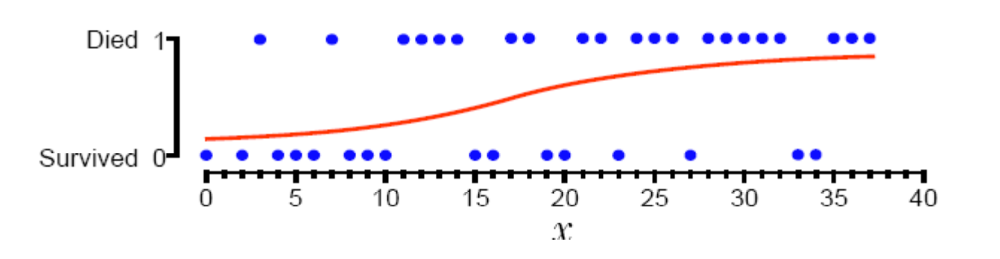

# From Regression to Classification {.center}

> Linear models predict *numbers*; classification predicts *categories*.
> The trick is mapping a linear score to a probability.

::: {.notes}
Open with the motivating question: how do we adapt regression — which produces
any real number — to answer binary yes/no questions? That pivot is the entire
point of logistic regression. Good cold-call: "Give me a yes/no question you'd
want to answer about a network flow." See the Linear Models section of the
Supervised Learning chapter in *Machine Learning for Networking*.
:::

## Why Binary Classification Matters in Networking

::: {.columns}
::: {.column width="55%"}
Real network tasks are often **binary decisions**:

- Is this flow **malicious or benign**?
- Is this packet a **DNS query or response**?
- Is this host a **bot or legitimate user**?
- Is this email **spam or not spam**?

A simple threshold on a continuous feature is often not enough — we need a
principled way to estimate **P(class = 1 | features)**.
:::
::: {.column width="45%"}
**Why not just use linear regression?**

- Linear regression output is unbounded ($-\infty$ to $+\infty$)
- Binary labels (0 / 1) violate the Gaussian noise assumption
- Minimizing squared error on 0/1 labels produces poorly calibrated probabilities

We need a model purpose-built for **categorical outcomes**.
:::
:::

::: {.notes}
Walk through each networking example to make the abstract concrete. The
DNS query/response example comes directly from the book: queries are typically
smaller than responses, so packet size alone gives linear separability. This
is a great motivating dataset because students can reason about it from first
principles. See *Machine Learning for Networking*, Chapter 5: Supervised Learning.
:::

## Recap: Maximum Likelihood and Linear Regression

**Probabilistic framing of linear regression:**

- Assume observations $y$ are drawn i.i.d. from a **Gaussian** centered at
  $\hat{y} = \mathbf{w}^T \mathbf{x}$
- Goal: find $\mathbf{w}$ that **maximizes likelihood** of the observed data
- Gaussian log-likelihood → **minimizing mean squared error**

$$\hat{y} = \mathbf{w}^T \mathbf{x}, \quad \text{Loss} = \frac{1}{m}\sum_{i=1}^{m}(\hat{y}_i - y_i)^2$$

**For binary labels**, a Gaussian is the wrong noise model:

- Outputs must lie in $[0, 1]$ — Gaussian is unbounded
- Labels are 0 or 1, not real-valued residuals

::: {.notes}
This slide connects logistic regression back to the maximum-likelihood framing
students saw for linear regression. The key insight is that the choice of
noise model determines the loss function. Changing from Gaussian to Bernoulli
noise gives us the cross-entropy loss and the sigmoid function. See the
*Machine Learning for Networking* book, Chapter 5, Linear Models subsection.
:::

## The Bernoulli Distribution for Binary Labels {.smaller}

For binary observations ($y \in \{0, 1\}$), the natural distribution is
**Bernoulli** — a biased coin with parameter $\mu \in [0,1]$:

$$P(y \mid \mu) = \mu^{y}\,(1-\mu)^{1-y}$$

| $y$ | Probability |
|-----|-------------|
| 1   | $\mu$       |
| 0   | $1 - \mu$   |

**Key idea:** Let $\mu$ be a *function of the input*: $\mu = f(\mathbf{x})$

**Problem:** $\mathbf{w}^T\mathbf{x}$ ranges over all reals — we need $\mu \in [0,1]$

**Solution:** Compose the linear score with a function that squashes it into $[0,1]$

::: {.notes}
The Bernoulli PMF is familiar to students who've seen coin-flip probability.
Make the connection: each training label is like a coin flip with a
bias that we're trying to estimate. The parameter μ has to depend on the
input features — that's what makes this a *model* rather than just a
marginal distribution. See *Machine Learning for Networking*, Chapter 5.
:::

## The Sigmoid Function: Squashing to [0,1]

$$\sigma(z) = \frac{1}{1 + e^{-z}}, \quad z = \mathbf{w}^T\mathbf{x}$$

Key properties of the sigmoid:

- $\sigma(z) \to 1$ as $z \to +\infty$ — confident **Class 1**
- $\sigma(z) \to 0$ as $z \to -\infty$ — confident **Class 0**
- $\sigma(0) = 0.5$ — **decision boundary**, maximum uncertainty
- Smooth, differentiable S-curve

The **logistic regression model** is then:

$$P(y=1 \mid \mathbf{x}) = \sigma(\mathbf{w}^T\mathbf{x}) = \frac{1}{1 + e^{-\mathbf{w}^T\mathbf{x}}}$$

::: {.notes}
Draw the S-curve and walk through the three regimes. Emphasize that the sigmoid
is doing two things simultaneously: it enforces a valid probability range *and*
provides a smooth transition useful for gradient-based optimization. Compare
to linear regression where the output was unconstrained. See *Machine Learning
for Networking*, Chapter 5, "The Sigmoid Function: Mapping Lines to Probabilities."
:::

## Decision Boundaries

::: {.columns}
::: {.column width="50%"}
**Logistic regression** classifies by finding a **linear decision boundary**
in feature space.

Predict Class 1 when $\sigma(\mathbf{w}^T\mathbf{x}) \geq 0.5$,
i.e. when $\mathbf{w}^T\mathbf{x} \geq 0$.

The boundary $\mathbf{w}^T\mathbf{x} = 0$ is a
**hyperplane** in the input feature space.

**When it works:** classes are **linearly separable** (or close to it)

**When it fails:** non-linear boundaries — need basis expansion, trees, or deep nets
:::
::: {.column width="50%"}

:::
:::

::: {.notes}
The top image (s06-i02) shows the sigmoid fitting cleanly to separable binary
data: survived=0 up to ~x=16, died=1 above. The bottom image (s06-i03) shows
a straight linear regression line — it never quite hits 0 or 1 and gives
nonsensical probabilities outside that range. This contrast is the whole
motivation. Ask students: what's the decision boundary for the top plot?
(x ≈ 16, where σ = 0.5.) See *Machine Learning for Networking*, Chapter 5,
"When Logistic Regression Works (and When It Doesn't)."
:::

## Networking Example: DNS Query vs. Response {.smaller}

::: {.columns}
::: {.column width="55%"}
**DNS packets** make a natural logistic regression problem:

- **DNS queries** are typically **small** (requesting a name lookup)
- **DNS responses** are typically **larger** (returning IP addresses, records)
- A single feature — **packet size** — provides approximate **linear separability**

$$P(\text{response} \mid \text{size}) = \sigma(w \cdot \text{size} + b)$$

The book's activity uses packet size to classify queries vs. responses —
logistic regression achieves high accuracy with a single feature.
:::
::: {.column width="45%"}
**Pipeline extension:**

Recall from linear regression: ACK packets form a distinct cluster. One approach:

1. Use **logistic regression** to classify: data packet or ACK?
2. Apply a **separate linear model** to each group

Classification as a *preprocessing step* for better regression — a common
pattern in network traffic analysis.

See the appendix activity for a hands-on implementation.
:::
:::

::: {.notes}
This example is taken directly from the book (Chapter 5, "Practical Applications
and Extensions"). The DNS example is ideal because: (1) students understand
the protocol, (2) the feature selection is obvious, (3) it works. Use this
to bridge from theory to the actual activity in the appendix. The pipeline
example reconnects to the ACK packet problem from the linear regression
lecture — show how logistic regression is the glue between the two models.
:::

## Expressing the Loss: Cross-Entropy

**Maximum likelihood with Bernoulli targets** gives us the **cross-entropy loss**:

$$\mathcal{L}(\mathbf{w}) = -\frac{1}{m}\sum_{i=1}^{m}\Big[y_i \log \hat{\mu}_i + (1-y_i)\log(1-\hat{\mu}_i)\Big]$$

where $\hat{\mu}_i = \sigma(\mathbf{w}^T\mathbf{x}_i)$.

**Log-likelihood interpretation:**

- When $y_i = 1$: penalize if $\hat{\mu}_i$ is small (model says "probably 0" but truth is 1)
- When $y_i = 0$: penalize if $\hat{\mu}_i$ is large (model says "probably 1" but truth is 0)

**Good news:** the cross-entropy loss is **convex** in $\mathbf{w}$ → gradient descent
finds the **global optimum**.

::: {.notes}
Derive the log-likelihood step by step: take the log of the Bernoulli
likelihood, simplify using y and (1-y) as indicator selectors, negate to
get a minimization problem. The convexity result is important — it distinguishes
logistic regression from neural networks and means we're guaranteed to converge.
See *Machine Learning for Networking*, Chapter 5, "The Price of Non-Linearity."
:::

## Solving Logistic Regression: Gradient Descent {.smaller}

Unlike linear regression, **no closed-form solution** exists for logistic regression.
We use iterative optimization.

**Gradient of the cross-entropy loss:**

$$\frac{\partial \mathcal{L}}{\partial \mathbf{w}} = \frac{1}{m}\sum_{i=1}^{m}(\hat{\mu}_i - y_i)\mathbf{x}_i$$

This has the same form as the linear regression gradient — only $\hat{\mu}$ differs.

**Update rule (gradient descent):**

$$\mathbf{w} \leftarrow \mathbf{w} - \alpha \cdot \nabla_\mathbf{w}\mathcal{L}$$

| Variant | Description |
|---|---|
| **Batch GD** | Full dataset per step; exact but slow for large $m$ |
| **Stochastic GD (SGD)** | One example per step; fast but noisy |
| **Mini-batch SGD** | Subset per step; balances speed and stability |

::: {.notes}
The gradient formula looks identical to linear regression — this is not a
coincidence. It's a consequence of the choice of loss and the exponential
family structure of both models. In practice, sklearn uses a more efficient
solver (L-BFGS or liblinear), but the gradient descent framing is useful for
intuition. Newton's method (second-order) also works and converges faster
but requires computing the Hessian. See *Machine Learning for Networking*,
Chapter 5, and the source extract's notes on SGD.
:::

## Relationship to Linear Regression {.smaller}

::: {.columns}
::: {.column width="50%"}
**Similarities:**
- Both use a linear combination $\mathbf{w}^T\mathbf{x}$
- Both trained by minimizing a loss derived from maximum likelihood
- Both have gradients with the same form: $(\hat{y}_i - y_i)\mathbf{x}_i$
- Both support **regularization** (Ridge / Lasso / ElasticNet)

**Differences:**

| | Linear | Logistic |
|---|---|---|
| Output | real-valued | probability in [0,1] |
| Loss | MSE | cross-entropy |
| Solution | closed-form | iterative |
| Convexity | yes | yes |
:::
::: {.column width="50%"}
**Regularized logistic regression:**

Adding a penalty to the loss shrinks weights toward zero:

- **L2 (Ridge):** $\mathcal{L} + \lambda\|\mathbf{w}\|_2^2$ — shrinks all weights
- **L1 (Lasso):** $\mathcal{L} + \lambda\|\mathbf{w}\|_1$ — sparsity, feature selection

In `sklearn`, the `C` parameter is the *inverse* of $\lambda$:
larger `C` = less regularization.

Regularization is especially important for high-dimensional
feature sets (e.g., per-packet byte features).
:::
:::

::: {.notes}
This comparison table is a quick exam-prep anchor. Point out that the gradient
formula being the same is a deep result from exponential families in statistics.
The regularization discussion connects to the book's regularization subsection
and to later lectures on deep learning where weight decay (L2 regularization)
appears again. See *Machine Learning for Networking*, Chapter 5, "Regularization."
:::

## Extending to Multi-Class: Softmax Regression {.smaller}

Logistic regression is binary ($K = 2$). For $K > 2$ classes, use **softmax regression**:

$$P(y = k \mid \mathbf{x}) = \frac{e^{\mathbf{w}_k^T\mathbf{x}}}{\sum_{j=1}^{K} e^{\mathbf{w}_j^T\mathbf{x}}}$$

- Outputs a **probability distribution** over all $K$ classes (sums to 1)
- Reduces to sigmoid when $K = 2$
- Trained with **categorical cross-entropy** loss

**Networking examples:**

- Traffic classification: HTTP, DNS, TLS, QUIC, video streaming, ...
- Malware family classification: ransomware, botnet, spyware, ...
- Application identification from flow statistics

::: {.notes}
Softmax is the natural generalization. The denominator is a normalizing constant
that forces probabilities to sum to 1. In sklearn, this is
`LogisticRegression(multi_class='multinomial')` or the default OvR
(one-vs-rest) strategy. OvR trains K binary classifiers; multinomial trains
all K classes jointly. For networking traffic classification with many classes,
softmax (multinomial) is usually more coherent. See *Machine Learning for
Networking*, Chapter 5, "Practical Applications and Extensions."
:::

# Current Events {.center}

> Logistic regression continues to anchor real-world network security
> classifiers — even in 2026, alongside deep learning.

::: {.notes}
Transition: before summarizing, show a live example of logistic regression
being deployed in practice. This counters the student assumption that simple
models have been superseded by neural networks for all tasks.
:::

## Vignette: Lightweight DDoS Detection in IoT (2026) {.smaller}

::: {.vignette}
A January 2026 study in *Scientific Reports* ("A lightweight machine learning
approach for DDoS detection and classification," doi:10.1038/s41598-026-48535-x)
benchmarks logistic regression against Random Forest and Naïve Bayes for
**multiclass DDoS detection** across a universal minimal feature subset.
Logistic regression achieved **91.61% accuracy** — behind Random Forest (99.88%)
but dramatically faster to train and deploy on resource-constrained IoT nodes.
The authors argue that for latency-sensitive edge deployments, logistic regression's
interpretability and low compute cost make it a practical first-line classifier.
:::

**Teaching point:** The tradeoff is not accuracy alone —
**computational cost, interpretability, and deployment constraints matter**.

- Logistic regression: fast inference, interpretable coefficients, convex training
- Random Forest: higher accuracy, but heavier; coefficients not directly interpretable
- In practice, logistic regression often serves as the **baseline to beat**

::: {.notes}
Walk through why this paper is pedagogically useful: it pits logistic
regression against more complex models in a real networking context (IoT DDoS).
The result — LR loses on accuracy but wins on practical deployment criteria —
illustrates the model selection tradeoff that runs through the whole course.
Source: Nature/Scientific Reports, doi:10.1038/s41598-026-48535-x, published 2026.
Cold-call: "Why would you choose the less accurate model?"
:::

## Summary and Key Takeaways

::: {.columns}
::: {.column width="55%"}
**Logistic regression in one sentence:**
Apply the sigmoid function to a linear score to get a calibrated probability
for binary classification, then train with cross-entropy loss via gradient descent.

**Key results:**
- Decision boundary is a **hyperplane** (linear)
- Loss is **convex** → guaranteed global optimum
- No closed-form solution → iterative optimization
- Extends to $K$ classes via **softmax**
- Can be regularized (L1 / L2) to prevent overfitting
:::
::: {.column width="45%"}
**When to use it in networking:**

- Classes are **approximately linearly separable** in feature space
- Need **fast inference** or **interpretable** coefficients
- Serving as a **baseline** before trying complex models
- DNS classification, flow type detection,
  binary anomaly flags

**Next:** Tree-based models and ensembles — when the
decision boundary is **not** linear.
:::
:::

::: {.notes}
Final summary slide — use it to consolidate. Ask: "What is the one thing
logistic regression can do that linear regression can't?" (Produce a valid
probability for a categorical outcome.) Preview: if the data is not linearly
separable, we need decision trees or ensembles (next lecture). Reiterate the
book pointer: see Chapter 5 of *Machine Learning for Networking* for the full
logistic regression activity using DNS packet sizes.
:::
