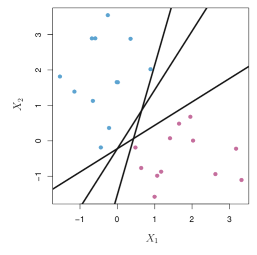
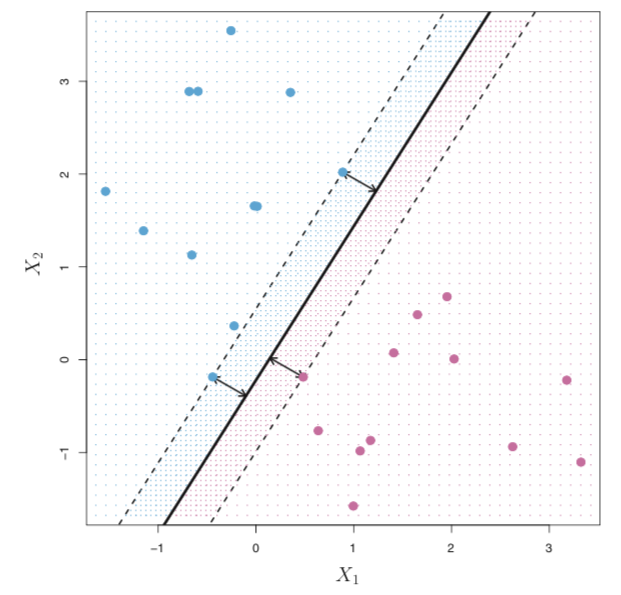
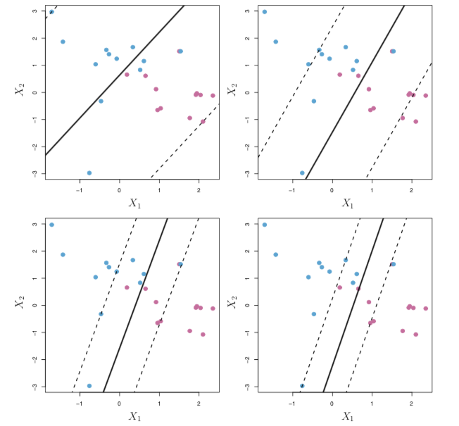
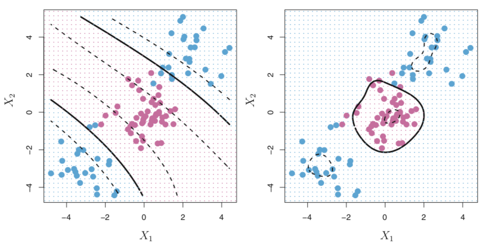

# From Separating Lines to Maximal Margins {.center}

> When infinitely many decision boundaries exist, which one should you trust?

::: {.notes}
Open with the core puzzle: logistic regression (last lecture) finds *a* decision boundary, but not necessarily the *best* one. SVMs answer the question of which separator will generalize best to unseen data. The key insight is maximum margin — keep as much space as possible between the decision boundary and the training examples. See the "Support Vector Machines" section in the Supervised Learning chapter.
:::

## The SVM Family: Three Related Classifiers

SVMs are a family, not a single algorithm:

| Classifier | Key Idea |
|---|---|
| **Maximal Margin Classifier** | Perfect separation; widest gap possible |
| **Support Vector Classifier** | Soft margin; tolerates some misclassifications |
| **Support Vector Machine** | Kernel trick; handles non-linear boundaries |

Each builds on the previous. Real data usually requires the third.

::: {.notes}
Walk through the table left to right: the simplest case (perfectly linearly separable data) motivates the maximal margin classifier; then acknowledge that real data almost never satisfies perfect separability, so we relax to the support vector classifier; finally, real traffic data has non-linear structure, motivating kernels. This is the exact progression in James et al. ISL and echoed in the Supervised Learning chapter.
:::

## Hyperplanes: The Decision Boundary {.smaller}

A **hyperplane** in $d$ dimensions is a flat, affine subspace of dimension $d - 1$:

- In 2D: a line $\beta_0 + \beta_1 X_1 + \beta_2 X_2 = 0$
- In 3D: a plane
- In $d$ dimensions: $\beta_0 + \beta_1 X_1 + \cdots + \beta_d X_d = 0$

A hyperplane divides $d$-dimensional space into two half-spaces:

$$\beta_0 + \boldsymbol{\beta}^\top \mathbf{x} > 0 \quad \text{vs.} \quad \beta_0 + \boldsymbol{\beta}^\top \mathbf{x} < 0$$

Assign class labels based on which half-space a point falls in.

::: {.notes}
Emphasize that the hyperplane itself has measure zero — the interesting action is on either side. For networking: think of a flow feature vector $\mathbf{x}$ (packet rates, byte counts, inter-arrival times). The hyperplane is a threshold rule in that feature space. For two features this is literally a line on a scatterplot.
:::

## Many Hyperplanes Exist: Which Is Best?

::: {.columns}
::: {.column width="50%"}

:::
::: {.column width="50%"}
All three black lines perfectly separate the blue and pink classes.

- Any of them could be "correct" on training data.
- They disagree on test points near the boundary.
- We need a principled criterion to choose.

**Answer:** pick the one that is **farthest from all training points** — the maximal margin hyperplane.
:::
:::

::: {.notes}
This is the motivating figure. Each line is a valid logistic-regression-style separator, but they would make different predictions for a new point that lands near the middle. The intuition for maximum margin is that the farther the boundary is from any training point, the more "room" we have before a new point crosses the boundary incorrectly.
:::

## Maximal Margin: The Widest Gap

::: {.columns}
::: {.column width="50%"}

:::
::: {.column width="50%"}
The **margin** is the total width of the gap between the two classes.

- **Maximal margin hyperplane**: the separator that maximizes this width.
- The dashed lines define the margin boundaries (the "band").
- The points *on* the dashed lines are the **support vectors** — they alone determine the hyperplane's position.

All other training points are irrelevant once support vectors are identified.
:::
:::

::: {.notes}
Point out the arrows in the figure indicating the perpendicular distance from each support vector to the solid decision boundary. Stress the key robustness property: if you collected more data but none of it fell within the margin band, the hyperplane would not move. This is why SVMs generalize well on small datasets — a common scenario in network security research where labeled traffic datasets are expensive to collect. See the "Max-Margin Classifiers" section in the Supervised Learning chapter.
:::

## Finding the Maximum Margin: The Optimization {.smaller}

Maximize the margin $M$ subject to the constraint that every training point falls outside the margin band:

$$\max_{\boldsymbol{\beta}, M} \; M \quad \text{subject to} \quad \|\boldsymbol{\beta}\| = 1$$

$$y_i(\beta_0 + \boldsymbol{\beta}^\top \mathbf{x}_i) \geq M \quad \forall \; i$$

where $y_i \in \{-1, +1\}$ is the class label.

- The constraint ensures each point is at least $M$ away from the hyperplane, on the correct side.
- The problem is **convex** — it has a unique global optimum, solvable efficiently via quadratic programming.
- Only the **support vectors** (points closest to the boundary) have non-zero influence on the solution.

::: {.notes}
The $\|\boldsymbol{\beta}\| = 1$ normalization is what makes the inner product equal the signed perpendicular distance. You don't need to derive the dual form here, but note that the quadratic program is solved reliably even for thousands of features — relevant for high-dimensional flow feature vectors. Cold call: what happens to the margin if we move a non-support-vector point further away from the hyperplane? (Answer: nothing — the support vectors already determine the margin.)
:::

## The Problem with Hard Margins

The maximal margin classifier assumes data is **perfectly linearly separable** — almost never true in practice:

- A single outlier can make the data non-separable (no valid hyperplane exists).
- Even when separable, the margin may be vanishingly thin.
- A tiny margin overfits: the hyperplane is hypersensitive to individual training points.

**Solution:** relax the constraint. Allow some training examples to be on the wrong side of the margin (or even the wrong side of the decision boundary). This is the **support vector classifier** (soft margin).

::: {.notes}
This slide is the pivot from the theoretically clean to the practically useful. In network traffic datasets, mislabeled flows, transient anomalies, and feature noise routinely produce a few points on the "wrong" side. Insisting on hard separation would either fail completely or produce a razor-thin margin that generalizes poorly.
:::

## Support Vector Classifier: Soft Margins {.smaller}

Add **slack variables** $\xi_i \geq 0$ that allow violations:

$$\max_{\boldsymbol{\beta}, \xi_i, M} \; M \quad \text{subject to} \quad \|\boldsymbol{\beta}\| = 1$$

$$y_i(\beta_0 + \boldsymbol{\beta}^\top \mathbf{x}_i) \geq M(1 - \xi_i) \quad \forall \; i, \quad \sum_i \xi_i \leq C$$

- $\xi_i = 0$: point correctly classified, outside the margin.
- $0 < \xi_i \leq 1$: point inside the margin (on the correct side of the boundary).
- $\xi_i > 1$: point on the **wrong side** of the decision boundary.
- **$C$**: budget for total violation — the key tuning parameter.

::: {.notes}
Note (from the original speaker notes): C is a tuning parameter typically chosen by cross-validation. The slack variables let us pose a single convex program even when the data aren't separable. Emphasize the physical meaning of the slack: $\xi_i$ measures how far inside the margin (or how far on the wrong side) observation $i$ falls. The sum $\sum \xi_i \leq C$ caps the total amount of misbehavior allowed.
:::

## Tuning C: Bias–Variance Tradeoff

::: {.columns}
::: {.column width="55%"}

:::
::: {.column width="45%"}
**Large $C$** → more violations tolerated → wider margin → higher bias, lower variance

**Small $C$** → fewer violations → narrower margin → lower bias, higher variance

Key property: **points far from the boundary do not affect the hyperplane** — only support vectors matter. This is very different from logistic regression where every point influences the fit.
:::
:::

::: {.notes}
The four panels show increasing C from top-left to bottom-right. Top-left has a very tight margin (small C, low bias, overfits to training set); bottom-right has a wide margin (large C, higher bias, better generalization). In networking: if your traffic dataset has a few mislabeled flows (common in practice), a larger C will prevent those outliers from distorting the decision boundary. This is the bias-variance tradeoff concrete and visual.
:::

# Beyond Linear Boundaries: Kernel Methods {.center}

> What if no line (or plane) can separate the classes at all?

::: {.notes}
Now shift gears. Linear SVMs work when classes are linearly separable in the feature space. Many real network traffic classification problems are not. The standard fix — polynomial basis expansion — works in principle but explodes in dimensionality. The kernel trick is the elegant solution.
:::

## Non-Linear Boundaries: Why Kernels? {.smaller}

::: {.columns}
::: {.column width="55%"}

:::
::: {.column width="45%"}
Polynomial basis expansion would project $\mathbf{x}$ to a high-dimensional space — expensive and unwieldy.

**The kernel trick**: reformulate SVM training to depend only on **inner products** between pairs of training examples, then replace those inner products with a **kernel function** $K(\mathbf{x}_i, \mathbf{x}_j)$.

The kernel implicitly computes inner products in a very high-dimensional space **without ever constructing that space**.
:::
:::

::: {.notes}
The left panel of the figure shows a polynomial kernel producing curved decision boundaries; the right panel shows the RBF kernel producing a tight circular boundary that would be impossible for any linear classifier. In networking terms: traffic from a specific application might cluster in a non-convex region of feature space — the RBF kernel can capture that shape where a linear SVM cannot.
:::

## Common Kernel Functions

| Kernel | Formula | Use Case |
|---|---|---|
| **Linear** | $K(\mathbf{x}_i, \mathbf{x}_j) = \mathbf{x}_i^\top \mathbf{x}_j$ | Linearly separable features |
| **Polynomial (degree $d$)** | $K(\mathbf{x}_i, \mathbf{x}_j) = (1 + \mathbf{x}_i^\top \mathbf{x}_j)^d$ | Feature interactions up to degree $d$ |
| **Radial Basis (RBF)** | $K(\mathbf{x}_i, \mathbf{x}_j) = \exp(-\gamma \|\mathbf{x}_i - \mathbf{x}_j\|^2)$ | General non-linear; good default |
| **Sigmoid** | $K(\mathbf{x}_i, \mathbf{x}_j) = \tanh(\kappa \mathbf{x}_i^\top \mathbf{x}_j + c)$ | Neural-network analogy |

**In practice:** the **RBF kernel** is the standard default — it can model a wide range of non-linear boundaries with a single hyperparameter $\gamma$.

::: {.notes}
Emphasize the RBF kernel rule-of-thumb: start with RBF, tune $\gamma$ and $C$ via cross-validation. The RBF has infinite implicit dimensionality — it is equivalent to an inner product in an infinite-dimensional Hilbert space (Mercer's theorem). For students who have seen Gaussian distributions, the RBF kernel measures similarity as a function of Euclidean distance: close points get kernel value near 1, distant points near 0. See the "Kernel Methods" section in the Supervised Learning chapter.
:::

## Regularization: The Role of C (Revisited)

In the SVM literature, **C** also controls regularization directly:

- **High C** → model penalizes misclassification heavily → tries to classify all training points correctly → can overfit.
- **Low C** → model tolerates more misclassifications → larger margins → more regularization → may underfit.

This mirrors the penalty hyperparameter in ridge/lasso regression from the Linear Models section of the same chapter.

**Multiclass SVMs**: two standard approaches:
- **One-vs-Rest**: train $N$ classifiers; each predicts "class $k$ vs. all others."
- **One-vs-One**: train $\binom{N}{2}$ classifiers; majority vote. Typically performs better; most libraries default to this.

::: {.notes}
The regularization reframing of C is important: it connects SVMs to the broader L2-regularization story the students saw in ridge regression. High C → low regularization → tight fit to training data. Most SVM libraries (scikit-learn) parameterize it exactly this way. The multiclass note is practically important: traffic classification often has many application classes (HTTP, DNS, P2P, streaming, etc.), so students need to know how SVMs extend beyond binary.
:::

## SVMs for Network Traffic Classification

SVMs are particularly well-suited to network traffic analysis:

- **Small labeled datasets**: SVMs generalize well when labeled examples are scarce (labeling traffic is expensive and error-prone).
- **High-dimensional feature spaces**: packet sizes, inter-arrival times, flow duration, byte counts — SVMs handle many features without the curse of dimensionality affecting them as severely as $k$-NN.
- **Non-linear traffic patterns**: RBF kernel captures complex application fingerprints.

Classic applications (Nguyen & Armitage 2008):
- **Traffic classification**: HTTP vs. FTP vs. P2P from flow features — without payload inspection.
- **Intrusion detection**: distinguish benign vs. malicious flow patterns.

::: {.notes}
Ground this in the book's "Networking Applications" section. The key selling point for networking practitioners: you don't need millions of labeled examples (unlike deep learning), and you can achieve strong performance with carefully engineered flow-level features. Traffic classification without payload inspection is increasingly important as encryption becomes universal (TLS, QUIC). Cold call: why can't you use deep packet inspection on encrypted traffic?
:::

## Current Events: SVMs in Active Network Defense

::: {.vignette}
**September 2025 — Kernel-Based IDS for ICMPv6 DDoS (Results Engineering)**

Alsadhan et al. evaluated nine kernel functions across SVM, random forest, and logistic regression for detecting ICMPv6 flood attacks — a persistent threat as IPv6 deployment accelerates. An SVM with the **RBF kernel** achieved **92.67% detection accuracy** with 93% weighted precision and recall, outperforming other kernel choices and confirming that classical SVM methods remain competitive for real-time intrusion detection in 2025.

*Source: Alsadhan et al., "Kernel-based machine learning intrusion detection systems for ICMPv6 DDoS detection," Results Engineering, 2025 (doi: 10.1016/j.rineng.2025.106940-series)*
:::

**Teaching point:** The paper directly instantiates this lecture's theory — maximal margin, RBF kernel choice, and C tuning — in a live deployment context.

::: {.notes}
This is a primary-source verified result from Results Engineering, a peer-reviewed Elsevier journal. The ICMPv6 attack context is timely: IPv6 adoption passed 45% of global Google traffic by early 2025, and ICMPv6 is the new ICMP — unavoidable in modern networks. The 92.67% accuracy figure is from the SVM-RBF model specifically, matching the kernel discussion from the previous slide. Good cold-call question: why might the RBF kernel outperform polynomial or sigmoid kernels for ICMPv6 traffic?
:::

## SVM Strengths and Limitations {.smaller}

::: {.columns}
::: {.column width="50%"}
**Strengths**

- **Robust to overfitting** on small datasets — only support vectors matter
- Effective in **high-dimensional feature spaces**
- Well-defined, unique global optimum (convex optimization)
- Works for **classification and regression** (SVR)
- Interpretable support vectors as "decision examples"
:::
::: {.column width="50%"}
**Limitations**

- Does **not scale well** to very large datasets (quadratic programming grows with $n$)
- Choosing the right kernel and tuning $C$ and $\gamma$ requires **cross-validation**
- Does not naturally produce **calibrated probabilities** (Platt scaling needed)
- Sensitive to **feature scaling** — always normalize inputs
- Limited interpretability beyond the support vectors themselves
:::
:::

::: {.notes}
The scaling limitation is practically important for network operators: SVMs are excellent for research prototypes with thousands to tens-of-thousands of labeled flows, but are poor choices for online classification of millions of flows per second. In those contexts, gradient boosting or lightweight neural networks are preferred. Feature scaling is a recurring theme — SVMs use distance-based kernel functions, so unscaled features (e.g., byte counts in millions vs. packet counts in tens) will distort distances. Always standardize.
:::

## Summary: The SVM Progression

| Classifier | Problem Solved | Key Parameter |
|---|---|---|
| **Maximal Margin** | Linearly separable data | Geometry (no tuning) |
| **Support Vector Classifier** | Non-separable data; soft margin | $C$ (violation budget) |
| **Support Vector Machine** | Non-linear boundaries | $C$ + kernel + kernel params |

Core insight: **maximize the margin between classes** while allowing controlled violations.

Only the **support vectors** — the training points closest to the boundary — determine the final classifier. Points far from the margin have zero influence.

::: {.notes}
Close with the conceptual arc: from the elegant geometric idea of maximum margin to the practical flexibility of kernel methods. SVMs are not the dominant method for large-scale production systems (that's gradient boosting and neural networks), but they remain the method of choice when you have a small, carefully labeled dataset and you need a classifier that won't overfit — exactly the scenario in network security research. Pointer for reading: see the "Support Vector Machines" section in Chapter 5 (Supervised Learning) of the course textbook.
:::
