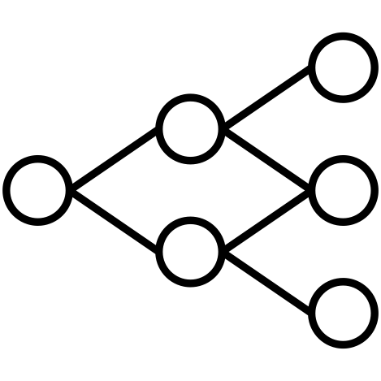
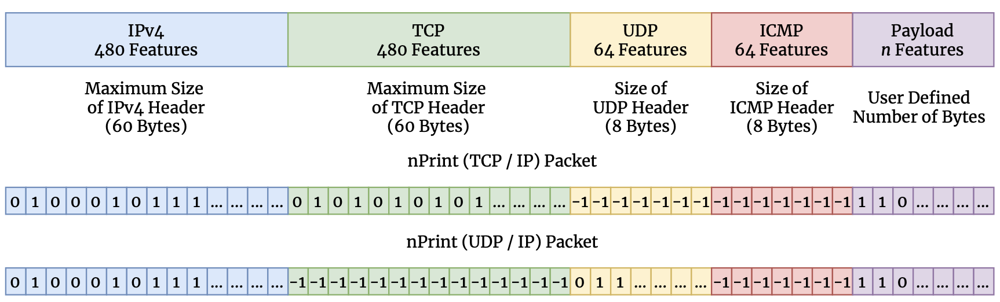
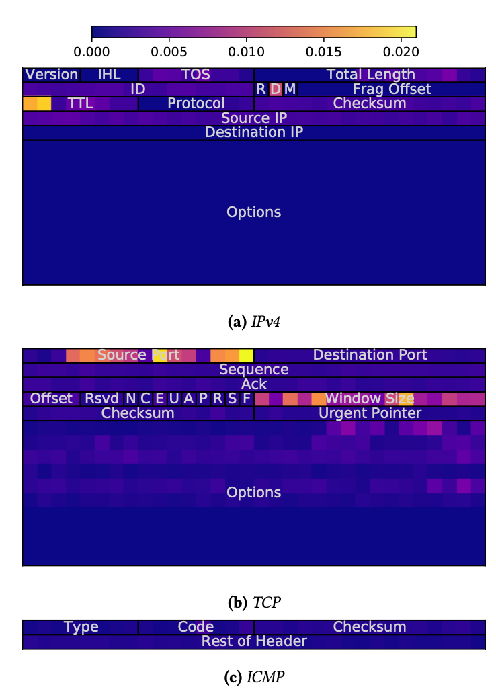
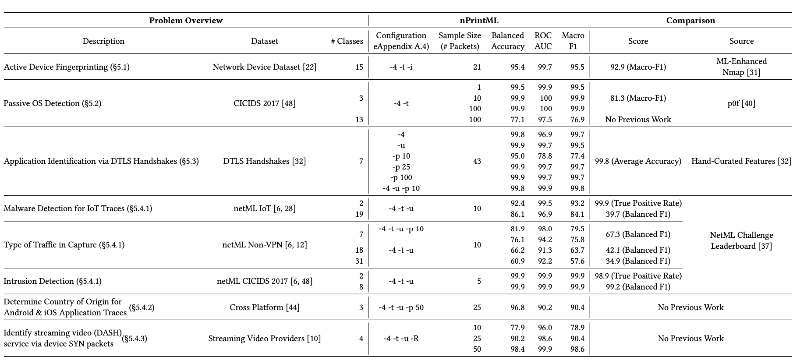
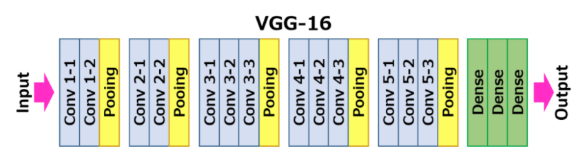

# From Features to Representations {.center}

> Earlier models expected you to hand-craft features.
> Deep learning learns the *best representation* from raw data.

::: {.notes}
Open with the key shift: traditional ML requires a human expert to decide
which features matter (e.g., packet size, flow duration). Deep learning
lets the model discover that representation itself. Ask the class: what
features would you hand-craft to classify encrypted traffic? Then flip
the question — what if you didn't have to decide? See the Deep Learning
section of Chapter 5 ("Supervised Learning") in *Machine Learning for
Networking*.
:::

## The Limitations of Linear Models

::: {.columns}
::: {.column width="55%"}
Linear and logistic regression find **hyperplane decision boundaries**.
When classes are not linearly separable, accuracy degrades.

**Two classic workarounds:**

- **Polynomial / kernel basis expansion** — transform features manually;
  feature explosion at high degree
- **Tree ensembles** — partition space; hard to apply to raw sequences or images

**The deep learning alternative:**
*Learn* a hierarchy of transformations that makes classes linearly
separable in the final layer.
:::
::: {.column width="45%"}
**Why this matters for networking:**

Raw network data — packet bytes, header fields, timing — is high-dimensional
and structured. Manual feature engineering is:

- **Time-consuming** — domain expertise required
- **Brittle** — features may not transfer across protocols or tasks
- **Incomplete** — relevant patterns the engineer didn't think of are missed

See book Chapter 5, "Deep Learning" subsection.
:::
:::

::: {.notes}
Connect back to the logistic regression and trees lectures. The punchline
is that the previous methods all required humans to specify the input
representation. Deep learning removes that requirement — at the cost of
more data and compute. See *Machine Learning for Networking*, Chapter 5.
:::

## The Artificial Neuron

**The basic unit:** multiply, sum, activate.

$$\text{output} = f\!\left(\sum_{i} w_i x_i + b\right)$$

- $x_i$ — input features
- $w_i$ — learned **weights** (one per input)
- $b$ — **bias** term (like the intercept in linear regression)
- $f(\cdot)$ — **activation function** (the critical non-linearity)

A single neuron with a sigmoid activation $\Rightarrow$ logistic regression.

Stack many neurons into layers → **neural network**.

::: {.notes}
The analogy to logistic regression is exact: one neuron with sigmoid
activation is logistic regression. The power comes from stacking neurons
and using non-linear activations. Draw a circle for the neuron, label the
weighted inputs, and show the activation box. See the "Artificial Neuron"
subsection of Chapter 5 in *Machine Learning for Networking*.
:::

## Activation Functions {.smaller}

::: {.columns}
::: {.column width="50%"}
**Why activations matter:**
Without a non-linear activation, stacking layers collapses to a single
linear transformation — no expressivity gain.

| Activation | Range | Use |
|---|---|---|
| **Sigmoid** $\sigma(z)=\tfrac{1}{1+e^{-z}}$ | (0, 1) | Output: binary classification |
| **Softmax** | (0, 1), sums to 1 | Output: multi-class |
| **Tanh** | (−1, 1) | Occasional hidden layers |
| **ReLU** $\max(0, z)$ | (0, ∞) | **Default for hidden layers** |
| **Leaky ReLU** $\max(0.01z, z)$ | ℝ | Fixes dying-ReLU |
:::
::: {.column width="50%"}
**ReLU dominates because:**

- No saturation for positive inputs → gradient stays non-zero
- Fast to compute ($\max$ operation)
- Produces **sparse activations**

**Sigmoid / tanh problems:**

- Gradient → 0 at extremes (**vanishing gradient**)
- Sigmoid output not zero-centered → slow optimization
- Both rarely used in hidden layers today
:::
:::

::: {.notes}
ReLU was the architectural change that unlocked training of deep networks.
The intuition: sigmoid squashes everything into (0,1), so after a few
layers the gradient signal shrinks to nothing. ReLU keeps the gradient
at exactly 1 for all positive inputs. Cold-call: "What is the gradient of
ReLU at z = −2?" (Zero — that's the dying ReLU problem.) See *Machine
Learning for Networking*, Chapter 5, "Activation Functions."
:::

## Multi-Layer Perceptron (Feedforward Neural Network)

::: {.columns}
::: {.column width="50%"}
Layers of neurons, data flowing **one direction** (input → output):

- **Input layer** — raw features
- **Hidden layers** — learned transformations
- **Output layer** — sigmoid (binary), softmax (multi-class), linear (regression)

The architecture — number of layers, neurons per layer — is a
**design hyperparameter** (not learned).

Each hidden layer computes:
$$\mathbf{h}^{(l)} = f\!\left(\mathbf{W}^{(l)}\mathbf{h}^{(l-1)} + \mathbf{b}^{(l)}\right)$$
:::
::: {.column width="50%"}

The book's recommendation: **start small**, add layers only when
simpler architectures underperform. Use an existing architecture
proven on a similar task rather than designing from scratch.
:::
:::

::: {.notes}
Walk through the diagram: data flows left to right. Each hidden layer
is a matrix multiply followed by element-wise activation. The output
layer configuration (sigmoid vs. softmax vs. linear) is determined by
the task. See *Machine Learning for Networking*, Chapter 5, "Feedforward
Neural Networks" and "Multi-Layer Perceptron."
:::

## Training: Forward and Backward Propagation {.smaller}

::: {.columns}
::: {.column width="50%"}
**Forward pass:**

1. Push data through the network layer by layer
2. Compute prediction at output
3. Compute loss: MSE (regression) or cross-entropy (classification)

**Backward pass (backpropagation):**

Apply the **chain rule** to propagate the loss gradient back through all
layers, computing $\frac{\partial \mathcal{L}}{\partial w}$ for every weight.

**Weight update (gradient descent):**
$$w \leftarrow w - \eta \cdot \frac{\partial \mathcal{L}}{\partial w}$$

$\eta$ = **learning rate** — critical hyperparameter.
:::
::: {.column width="50%"}
**Mini-batch training:**

- Full-dataset gradient descent: accurate but slow and memory-heavy
- Per-example (stochastic): fast but noisy
- **Mini-batch** (32–128 examples): balance — the default

**Epoch:** one complete pass through all training data.
Networks often need **hundreds or thousands of epochs**.

**Adam optimizer** (adaptive learning rates per parameter) is a
reliable default; avoids hand-tuning the global learning rate.
:::
:::

::: {.notes}
Backpropagation was a key insight that made deep learning feasible:
one backward pass computes gradients for *all* weights simultaneously
via the chain rule. Without it, training even modestly deep networks
would require separate computation for each weight. The mini-batch
framing also ties directly to GPU parallelism. See *Machine Learning
for Networking*, Chapter 5, "Training Neural Networks."
:::

## Challenges in Training Deep Networks {.smaller}

::: {.columns}
::: {.column width="50%"}
**Vanishing gradient:**
Repeated multiplication of small values (saturated sigmoid/tanh)
→ early-layer gradients → 0 → those layers stop learning.

*Solutions:* ReLU activations; batch normalization; residual connections.

**Exploding gradient:**
Repeated multiplication of large values → weight updates → NaN.

*Solutions:* gradient clipping; careful weight initialization.

**Overfitting:**
Millions of parameters memorize the training set.

*Solutions:*
- **Dropout** — randomly zero neurons during training
- **L1/L2 regularization** — penalize large weights
- **Early stopping** — halt when validation loss rises
- More data / data augmentation
:::
::: {.column width="50%"}
**When deep learning is worth it:**

- Large labeled datasets available
- Raw data is hard to featurize manually (raw packets, audio, images)
- Complex, high-dimensional patterns

**When to use simpler models instead:**

- Small datasets
- Interpretability required
- Limited compute
- Domain features are well-understood

*Random forests often match deep learning on tabular data with
clear, hand-crafted features.*
:::
:::

::: {.notes}
This is the "honest" slide. Students often assume deep learning always
wins. The book is explicit: for tabular network features (flow duration,
bytes, packets) with a small dataset, a random forest will frequently
match or beat an MLP with far less effort. See *Machine Learning for
Networking*, Chapter 5, "Challenges in Training Deep Networks" and
"Practical Training Considerations."
:::

## Output Activation and Loss Functions

| Task | Output activation | Loss function |
|---|---|---|
| **Binary classification** | Sigmoid → single neuron | Binary cross-entropy |
| **Multi-class classification** | Softmax → one neuron per class | Categorical cross-entropy |
| **Regression** | None (linear) | Mean squared error |

**Networking examples:**

- Binary: malicious vs. benign traffic
- Multi-class: application identification (HTTP, DNS, TLS, QUIC, P2P…)
- Regression: predict flow size, latency, throughput

::: {.notes}
Output configuration is one of the most common sources of student
confusion. Drill: if I have 5 traffic classes, what's the output layer?
(5 neurons, softmax, categorical cross-entropy.) What if I'm predicting
download throughput? (1 neuron, linear, MSE.) See *Machine Learning for
Networking*, Chapter 5, "Feedforward Neural Networks."
:::

# Representation Learning in Network Traffic {.center}

> The classic ML pipeline requires you to invent features.
> Can we eliminate that bottleneck?

::: {.notes}
Pivot from theory to the networking application of representation
learning. The argument: the classic pipeline (hypothesize → gather
traffic → engineer features → train model) is brittle because feature
engineering is the hardest, most domain-specific step. A common
representation that works across problems would be transformative.
:::

## The Classic ML Pipeline for Traffic Analysis

**Every new problem requires a bespoke pipeline:**

1. **Hypothesize** the problem
2. **Gather** traffic samples
3. **Engineer features** — packet sizes, inter-arrival times, flags, port numbers, …
4. **Preprocess** — normalization, encoding, padding
5. **Train** a model

**Pain point:** Step 3 restarts from scratch for each new task.

- Application identification needs different features than OS fingerprinting
- Malware detection features may not carry over to DDoS detection
- Feature engineering encodes human assumptions that may be wrong

::: {.notes}
This framing motivates nPrint. Draw the pipeline as a flowchart on the
board, then circle "Engineer features" to show where the brittleness
lives. The argument from the nPrint paper: if you had a universal,
normalized, machine-learnable packet representation, you could re-use
it across every downstream task. See the nPrint / nPrintML papers and
slides 14–30 of the source extract.
:::

## nPrint: A Universal Packet Representation

**Core idea:** encode every packet as a fixed-length bit vector that
maps each header field to its exact bit position in the protocol.

- **Complete** — every bit of every protocol header is represented
- **Constant size** — pad absent fields with −1 (not applicable)
- **Inherently normalized** — binary / ternary values throughout
- **Aligned** — field positions are fixed across packets and protocols

::: {.notes}
nPrint is a hybrid between a semantic representation and a binary one —
best of both worlds. The diagram shows how IPv4 headers become 480
features, TCP headers 480 features, UDP 64, ICMP 64, plus user-defined
payload bytes. Absent fields (e.g., UDP fields in an IPv4/TCP packet)
are encoded as −1. This is a crucial design choice: −1 ≠ 0 (field is
absent vs. field is set to zero). See Holland et al., "New Directions in
Automated Traffic Analysis," CCS 2021, and the nPrint source extract.
:::

## nPrint Enables Interpretable Features {.smaller}

Because nPrint positions each feature at a **fixed protocol field offset**,
a trained model's learned feature importances map directly back to header semantics.

The model **automatically discovers** that:

- IP **TTL** distinguishes OS families
- TCP **window size** and **options** fingerprint operating systems
- **Source port ranges** separate IoT devices from routers

::: {.notes}
This is one of the most compelling results from the nPrint paper: you
don't just get a black-box classifier — you get interpretable feature
importances that align with what network engineers already know (TTL ≈
OS fingerprint) plus things they didn't know (which TCP option bits
matter). Show the heatmap and ask: "What does a bright cell mean?"
(That feature bit has high importance for the classification task.)
See Holland et al., CCS 2021.
:::

## nPrintML: Combining nPrint with AutoML {.smaller}

::: {.columns}
::: {.column width="55%"}
**nPrintML pipeline:**

1. **nPrint** transforms raw packets into fixed-size feature vectors
2. **AutoML** (AutoGluon) handles:
   - Model selection across 7 classes (RF, DNN, k-NN, …)
   - Hyperparameter search
   - Model ensembling

**Key result:** same representation, same pipeline, across
**many different traffic classification tasks** — no per-task
feature engineering.

Problems addressed:
- Active device fingerprinting
- Passive OS detection
- Malware detection
- Application & video service identification
- Country of origin detection
:::
::: {.column width="45%"}

nPrintML achieves results **competitive with task-specific, hand-engineered**
feature pipelines — sometimes exceeding them.
:::
:::

::: {.notes}
AutoGluon's model ensembling achieves higher performance than other AutoML
techniques. The table (s28-i39) shows accuracy / F1 across active device
fingerprinting, passive OS detection, malware detection, application
identification, video service identification, and country-of-origin
detection — all from the same nPrint representation. Walk through a few
rows and highlight where nPrintML matches or exceeds prior bespoke work.
See Holland et al., CCS 2021, and the nPrint/nPrintML GitHub.
:::

# Convolutional Neural Networks {.center}

> CNNs were built for images. For networking, they're built for
> **sequences of packets**.

::: {.notes}
Transition to CNNs. The key motivation: MLPs treat all features as
exchangeable — there's no notion of "these two features are neighbors."
But in a sequence of packets, adjacent packets are more related than
distant ones. CNNs exploit that spatial / sequential locality. See
*Machine Learning for Networking*, Chapter 5, "Convolutional Neural
Networks."
:::

## How Convolutions Work

**Core operation:** a small matrix of **learned weights** (a *filter*
or *kernel*) slides across the input, computing a dot product at each
position.

- Each filter detects a **local pattern** — a specific byte sequence,
  a sudden size spike, a flag combination
- **Parameter sharing**: the same filter weights are applied everywhere
  → far fewer parameters than a fully connected layer
- Multiple filters → multiple **feature maps**, each detecting a different pattern

**For 1D data** (packet sequences): the filter slides along the packet axis.

**Pooling layers:** after convolution, **max pooling** downsamples by
selecting the largest value in each window — reduces dimensions, adds
translational invariance.

::: {.notes}
Draw the 1D case on the board: a sequence of packet-size values, a
small filter sliding over it, producing an output that highlights
"spikes." Then show how max pooling compresses the output. The key
insight is parameter sharing: the filter that detects "SYN burst" is
the same weights applied to every position, not a separate set of
weights per position. See *Machine Learning for Networking*, Chapter 5,
"How Convolutions Work."
:::

## CNN Architecture: Layers and Hierarchy {.smaller}

::: {.columns}
::: {.column width="55%"}
**Typical CNN structure (from input to output):**

1. **Convolution + ReLU** — detect local patterns
2. **Max pooling** — reduce dimensions, spatial invariance
3. Repeat multiple times → **hierarchy of representations**
4. **Flatten** — convert feature maps to a vector
5. **Fully connected layers** — combine learned features
6. **Output layer** — classification / regression

**Early layers** → simple patterns (edges, short byte runs)

**Deeper layers** → complex patterns (multi-packet behaviors, protocol sequences)

Also common:

- **Dropout** after pooling — reduce overfitting
- **Batch normalization** — stabilize gradients
:::
::: {.column width="45%"}

VGG-16 (image classification) illustrates the principle: repeated
conv+pool blocks build progressively more abstract representations.

The same pattern applies to 1D CNNs for packet sequences.
:::
:::

::: {.notes}
VGG-16 is a computer-vision benchmark, but it illustrates the design
pattern perfectly: multiple conv blocks, each followed by pooling, then
fully connected layers at the top. For networking, the input is 1D
(sequence of packets or bytes) and 1D convolutions slide along the
packet/time axis. The hierarchy is the same: early filters detect local
byte patterns, later filters detect multi-packet behavioral signatures.
See *Machine Learning for Networking*, Chapter 5, "Convolutional Neural
Networks" and the VGG-16 figure in the source extract (s39-i42/43).
:::

## CNNs for Network Traffic

CNNs exploit the **sequential structure of network data**:

- Two packets arriving in sequence are more related than packets far apart in time
- CNNs learn this locality automatically — no manual feature design
- **1D CNNs** (filter slides along packet or byte axis) are standard for flows

**Advantages over MLPs for sequences:**

- **Far fewer parameters** (parameter sharing) → less overfitting risk
- Detects the same pattern regardless of **position in sequence**
- Works with variable-length inputs (via pooling / global average pooling)

**Networking applications:**

- Encrypted traffic classification (no payload inspection needed)
- Intrusion detection from raw flow features
- IoT device fingerprinting from packet-header sequences

::: {.notes}
The nPrint representation feeds naturally into 1D CNNs: each packet
is a row of bits (1088+ features), and a sequence of packets forms a 2D
array. A 1D CNN sliding across the packet dimension detects patterns
that span multiple consecutive packets. The book cites Wang et al. 2017,
Lotfollahi et al. 2020, and Holland et al. 2021 (nPrint) as key
networking CNN papers. See *Machine Learning for Networking*, Chapter 5,
"CNNs for Network Traffic."
:::

## Recurrent Neural Networks and LSTMs

**For variable-length sequences with long-range dependencies:**

::: {.columns}
::: {.column width="50%"}
**RNN basic idea:**
Process one timestep at a time; maintain a **hidden state** that
carries information forward.

**Problem:** vanilla RNNs suffer from **vanishing gradients** over
long sequences — they forget early context.

**LSTM solution:** gating mechanism with a dedicated **cell state**:

- **Forget gate** — what to discard
- **Input gate** — what new info to write
- **Output gate** — what to expose as output

**GRU** (Gated Recurrent Unit): simpler, fewer parameters, similar
performance to LSTM in most cases.
:::
::: {.column width="50%"}
**Networking applications:**

- Flow volume **prediction** (future bandwidth)
- **Anomaly detection** in time-series metrics
- Classifying flows from **variable-length** packet sequences

**Caveat:**
LSTMs and GRUs are largely **supplanted by foundation models**
(transformers / attention-based architectures) for most sequence
tasks — but remain a useful building block.

See *Machine Learning for Networking*, Chapter 5, "Recurrent Neural
Networks" and the pointer to Chapter 7 on foundation models.
:::
:::

::: {.notes}
LSTMs were the dominant sequence model for 2014–2020 in networking.
The key insight vs. CNNs: RNNs can model dependencies across the entire
sequence, not just within a local window. For network time-series
(per-minute byte counts over days), an LSTM can learn daily periodicities
that a short CNN filter would miss. The book notes that LSTMs are now
largely superseded by transformers / foundation models, but they remain
important conceptually and for lightweight deployments. See *Machine
Learning for Networking*, Chapter 5, "LSTM and GRU Architectures."
:::

# Current Events {.center}

> Deep learning is now embedded in production network security systems —
> not just research benchmarks.

## Vignette: Hybrid Attention-CNN-LSTM for Intrusion Detection (2025) {.smaller}

::: {.vignette}
A July 2025 paper in *Scientific Reports* (Nature) — "Deep learning for
network security: an Attention-CNN-LSTM model for accurate intrusion
detection" — proposes a hybrid architecture combining **CNN** (spatial
feature extraction), **LSTM** (temporal sequence modeling), and a
**self-attention layer** (highlighting informative features). Evaluated
on Bot-IoT and NSL-KDD benchmarks, it achieves **97.5% accuracy on
Bot-IoT** and **94.8% on NSL-KDD**, with real-time inference at
**sub-35 ms latency** — fast enough for inline deployment.
The paper is open-access at
[doi:10.1038/s41598-025-07706-y](https://www.nature.com/articles/s41598-025-07706-y).
:::

**Teaching points:**

- Real production systems **combine CNN + RNN + attention** rather than using a single architecture
- Accuracy gains from deep learning must be weighed against **latency and compute costs**
- The self-attention layer mirrors ideas from transformer models — a preview of
  foundation models (see Chapter 7 of the book)

::: {.notes}
This is a verified 2025 paper (July 1, 2025, Scientific Reports, open access).
The architecture is a good synthesis of everything from this lecture:
convolution for local feature extraction, LSTM for temporal context,
attention for global feature salience. Cold-call: "Why would you add an
attention layer on top of CNN+LSTM?" (Lets the model learn which timesteps
or features to focus on, regardless of sequence position.) The 35ms latency
result is what makes it deployable inline; purely batch-mode deep learning
systems have appeared in research for years but rarely hit this target.
:::

## Deep Learning vs. Simpler Models: When to Use Which {.smaller}

::: {.columns}
::: {.column width="50%"}
**Prefer deep learning when:**

- Large labeled dataset (thousands to millions of flows)
- Raw data is hard to featurize: raw packets, payload bytes, images
- Performance ceiling of simpler models is too low
- You have GPU compute available

**Prefer simpler models (RF, SVM, logistic regression) when:**

- Small or medium dataset
- Interpretability is required (regulatory, forensics)
- Latency or compute is constrained (edge / IoT)
- Features are well understood and hand-engineerable
:::
::: {.column width="50%"}
**Practical strategy:**

1. Start with a **random forest** baseline on hand-crafted features
2. If performance is insufficient, try an **MLP** on the same features
3. If raw data is available, try a **1D CNN** on packet sequences (e.g., nPrint)
4. If temporal context matters, add an **LSTM** or attention layer
5. Monitor **training vs. validation loss curves** at every step

*Deep learning is not always the right tool — and the book is explicit about that.*
:::
:::

::: {.notes}
This slide is the practical synthesis. It directly mirrors the advice in
*Machine Learning for Networking*, Chapter 5: "Deep learning is not always
the best solution. It tends to excel when large amounts of training data are
available... Traditional ML methods may be preferable when datasets are small,
interpretability is critical, or domain features are well understood." Use the
nPrintML result as evidence: even with a universal deep-learning-friendly
representation, AutoGluon often picks a random forest over a DNN for
smaller datasets.
:::

## Summary {.smaller}

::: {.columns}
::: {.column width="55%"}
**Deep learning = representation learning through layers:**

- **Neuron:** weighted linear combination + non-linear activation
- **MLP:** stacked layers, forward pass + backpropagation
- **CNN:** local pattern detection via parameter sharing; ideal for sequences
- **LSTM/GRU:** gated memory for variable-length sequences

**Training essentials:**
- ReLU activations avoid vanishing gradients in hidden layers
- Mini-batch gradient descent + Adam optimizer are reliable defaults
- Dropout, early stopping, and weight decay prevent overfitting

**For networking specifically:**
- nPrint / nPrintML removes feature-engineering bottleneck
- 1D CNNs exploit packet-sequence locality
- Hybrid CNN+LSTM+attention matches task-specific pipelines
:::
::: {.column width="45%"}
**Key tradeoffs:**

| Dimension | Deep Learning | Simpler Models |
|---|---|---|
| Data need | High | Low/medium |
| Compute | High | Low |
| Interpretability | Low | High |
| Feature engineering | Minimal | Required |
| Performance ceiling | High | Moderate |

**Next:** Unsupervised methods — clustering and dimensionality reduction
when labels are absent.

See *Machine Learning for Networking*, Chapter 5, "Deep Learning" section.
:::
:::

::: {.notes}
Close by reinforcing the design checklist from the "When to use which"
slide. The summary table gives students a quick reference for the exam.
Reiterate the book pointer: Chapter 5 has activities for training an MLP
on IoT attack traffic and comparing to simpler models. The nPrint/nPrintML
case study is the cleanest example in the course of representation learning
solving a real systems problem at scale.
:::
