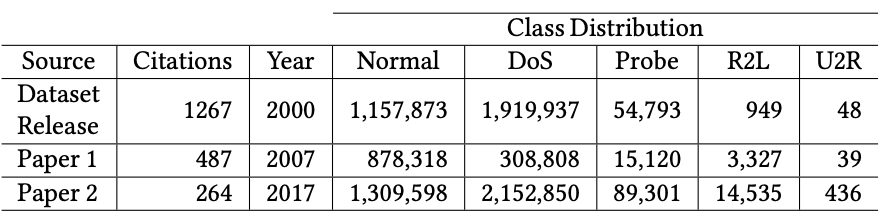
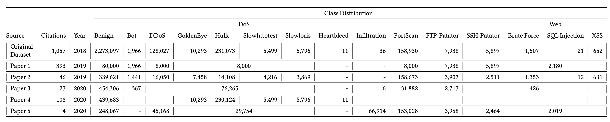
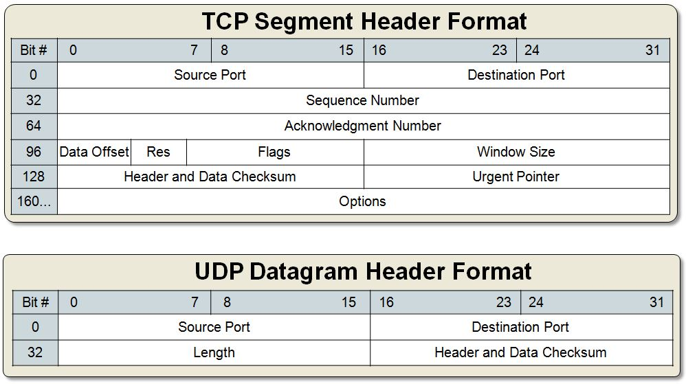

## Why Representations Matter {.center}

> "The way you represent your data is just as important as the model you choose."

Every network ML pipeline lives or dies by the quality of its
**input representation** — not just its algorithm.

::: {.notes}
Open with the framing question: if you had raw packets and unlimited compute,
how would you turn bytes into model inputs? Walk students through the intuition
that representation is not a detail — it *is* the science. See the "Network Data"
chapter (Chapter 3) of *Machine Learning for Networking* for the full framing.
:::

# Part I: The Bespoke-Pipeline Problem {.center}

## The Classic ML Pipeline for Traffic

::: {.columns}
::: {.column width="50%"}
For each new problem:

1. Collect labeled traffic (pcap)
2. **Hand-engineer features** (flow stats, packet sizes, timing, …)
3. Train a model
4. Deploy — then repeat for the next problem
:::
::: {.column width="50%"}
**Two canonical problems:**

- **Application identification** — Netflix vs. Zoom vs. web
- **Attack detection** — port scans, DoS, exploitation attempts

Each requires a different feature set, different code, different expertise.
:::
:::

::: {.notes}
Ask students: what features would you pick for application ID? For DoS detection?
Point out that the answers differ — and that is exactly the problem nPrint is solving.
:::

## Feature Engineering Is Expensive

- **Time** — iterative experimentation with domain experts
- **Domain expertise** — you need to know TCP/IP cold to know which bits matter
- **Human effort** — custom code written for each task, often not reused
- **Fragility** — even small preprocessing differences produce wildly different results

::: {.notes}
Concrete example from the book: two research teams analyzed the DARPA'98 intrusion
detection dataset and reported DoS packet counts differing by a factor of ten
(McHugh 2000). Not fraud — just undocumented preprocessing choices. This is the
reproducibility crisis hiding in plain sight inside networking ML.
:::

## The Reproducibility Crisis in Traffic Datasets {.smaller}



::: {.notes}
KDD'98 was released in 2000 with 1.26 M normal and 1.92 M DoS samples. By 2007
and 2017, published papers using the "same" dataset report completely different
counts because each team applied undocumented filters and flow definitions.
This table is the most vivid single argument for standardizing representation
*before* anyone writes a classifier.
:::

## The Same Problem in CICIDS2017 {.smaller}



::: {.notes}
CICIDS2017 is from 2018, not "old." Five papers, five different class distributions.
Cold-call: if reproducibility requires publishing code and data, why is this still
happening? Answer: feature extraction code is rarely published or pinned.
:::

## The Packet-Level Representation Challenge {.smaller}

::: {.columns}
::: {.column width="55%"}


:::
::: {.column width="45%"}
Three fundamental obstacles:

1. **Different protocols** — TCP, UDP, ICMP each have distinct header layouts
2. **Different values** — TCP has flags; UDP has none
3. **Variable length** — TCP options push headers from 20 to 60 bytes

A naive concatenation of raw bytes is **unaligned** — bit 50 means something
different in a TCP packet vs. a UDP packet.
:::
:::

::: {.notes}
This is the "pixel alignment" argument from computer vision applied to packets.
If pixel (3,4) of every image means "the red channel at that location," CNNs work.
If bit 50 is sometimes a TCP flag and sometimes a UDP checksum, no model can
learn anything consistent. Alignment is the prerequisite for representation learning.
:::

# Part II: nPrint — A Standardized Packet Representation {.center}

## The nPrint Insight

> If deep learning can classify images directly from pixels, why not classify
> network traffic directly from packet bits?

**nPrint** (Holland et al., CCS 2021) converts raw packets into a
**fixed-width, aligned bitmap** that any ML model can consume without custom feature code.

::: {.notes}
The analogy to computer vision is the headline. Emphasize that the key innovation
is not the bitmap encoding per se — it is the *alignment* guarantee: every bit
position always maps to the same protocol field, across every packet, regardless
of protocol combination. See the "Learning Traffic Representations with nPrint"
section of Chapter 3 in *Machine Learning for Networking*.
:::

## The nPrint Bitmap Representation


::: {.notes}
Walk through the two rows slowly: the TCP/IP row fills IPv4 and TCP columns with
real bits; UDP and ICMP columns are all −1. The UDP/IP row fills IPv4 and UDP
columns; TCP and ICMP columns are all −1. Because both rows have *the same
number of columns in the same order*, a model can learn that "column 481–960 is
always the TCP destination port" and apply that knowledge consistently.
:::

## nPrint Properties: Complete and Aligned {.smaller}

::: {.columns}
::: {.column width="50%"}
**Complete**

- All possible header fields included, even if not present in a given packet
- The −1 sentinel preserves the column structure while signaling absence
- No information is silently dropped
:::
::: {.column width="50%"}
**Aligned**

- Bit 0 always = IPv4 version field, across every packet
- Bit 481 always = TCP source port (or −1 for non-TCP)
- A model trained on TCP flows *transfers* to mixed-protocol captures
:::
:::

**Consequence:** the same feature matrix format works for OS fingerprinting,
application ID, malware detection, and scan detection — no re-engineering.

::: {.notes}
Contrast with IPFIX/NetFlow: aggregated, lossy, and task-specific. nPrint
goes the other direction — raw and complete — and lets the model decide what
to aggregate.
:::

## Using nPrint: A Typical Workflow

```bash
# Generate nPrint bitmap: IPv4 + TCP headers + 30 payload bytes
nprint -P 30 -4 -t input.pcap > output.csv
```

1. **Convert pcap to nPrint CSV** — one row per packet, ~1,000+ columns
2. **Attach labels** — benign / scan, app name, OS, device type, …
3. **Train any ML model** — random forests, CNNs, gradient boosting
4. **Inspect feature importance** — which bit positions drive the decision?

::: {.notes}
The command-line flags: -4 includes IPv4 headers, -t includes TCP, -P 30 includes
first 30 payload bytes. The output CSV has as many rows as packets and as many
columns as bits in the chosen header set. Emphasize that step 3 is deliberately
model-agnostic — nPrint decouples representation from model choice.
:::

## Feature Importance Reveals What the Model Learned

After training a random forest on nPrint scan-detection data, the top features
tend to be:

- **Destination port** (TCP bits 0–15) — expected for scan behavior
- **TCP flags** (SYN, ACK, FIN bits) — handshake pattern
- **Window size** — OS-specific quirk exploited by some scanners
- **Certain TCP options fields** — possibly spurious

**Key lesson:** nPrint surfaces *candidates* for explanation; domain expertise
still validates whether a feature is genuine or an artifact.

::: {.notes}
This is the "power and peril" slide. The model found the right features without
being told — that's the win. But "certain TCP options fields" raises a red flag:
are those genuinely distinguishing scans, or are they an artifact of one scanner
tool? Students should understand that automation reduces feature-engineering labor
but does *not* eliminate the need for domain knowledge.
:::

## Benefits and Limitations of nPrint {.smaller}

::: {.columns}
::: {.column width="50%"}
**Benefits**

- **Generalizable** — one representation, many tasks
- **Reproducible** — identical output from the same pcap, every time
- **Automated** — paired with AutoML (nprintML), eliminates manual model tuning
- **Interpretable** — feature importance maps back to protocol fields
:::
::: {.column width="50%"}
**Limitations**

- **Size** — ~2× the original header bytes; millions of packets → large matrices
- **Spurious correlations** — IP address range in training → model may memorize it
- **No temporal encoding** — each packet is independent; sequences need RNNs or attention
- **Not magic** — bad training data still yields bad models
:::
:::

::: {.notes}
Emphasize the spurious correlation point: if all training examples of "Netflix"
happen to come from one CDN IP range, nPrint will faithfully include those IP
address bits, and the model will latch onto them. This is not a bug in nPrint —
it is a reminder that garbage-in still means garbage-out.
:::

# Part III: pcapML — Standardizing Datasets {.center}

## The Dataset Labeling Problem

Even with a standardized representation, two researchers can still get different
results if they **define their samples differently**:

- What counts as one "sample" — a flow? a connection? N packets?
- How are labels attached — in a sidecar CSV? encoded in filenames?
- Which packets belong to which label?

**pcapML** solves this by encoding metadata *directly into the pcap file* using
the built-in `opt_comment` field of the PCAPNG format.

::: {.notes}
The PCAPNG opt_comment field is just a UTF-8 string attached to each packet.
pcapML standardizes what goes into that string: a sampleID, a label, and
optional metadata. Because the metadata travels *with* the capture, it cannot
be lost, misaligned, or misread by a different tool.
:::

## pcapML: How It Works

::: {.columns}
::: {.column width="55%"}
Each packet in a pcapML-encoded file carries:

- **sampleID** — which traffic sample this packet belongs to
- **label** — the ground-truth class
- **metadata** — optional task-specific annotations

pcapML files remain readable by **Wireshark, tcpdump, scapy**, and every
other pcap-compatible tool.
:::
::: {.column width="45%"}
**Result: shareable, self-describing datasets**

Researchers share one file. The label scheme is unambiguous.
The pcapML benchmarks leaderboard tracks progress across tasks:

- OS detection
- Malware detection
- Application identification
:::
:::

::: {.notes}
The key design choice is backward compatibility: using opt_comment instead of
inventing a new file format means the ecosystem does not break. Any tool that
knows PCAPNG can open the file; tools that understand pcapML can also parse
the structured metadata.
:::

## Current Events: Real-Time Encrypted Traffic Classification (2025) {.smaller}

::: {.vignette}
**Akem et al., "Real-Time Encrypted Traffic Classification in Programmable
Networks with P4 and Machine Learning," *International Journal of Network
Management*, 2025** — deployed tree-based classifiers directly onto P4
programmable switches, achieving **line-rate** inference on encrypted flows
with sub-microsecond delay and less than 10% hardware resource usage.
The study demonstrates that the representation challenge does not disappear
with encryption: feature selection for P4 hardware must be even more
deliberate because only a small fixed set of header fields is accessible
in the data plane.
:::

**Thought question:** If you cannot read payload bytes in an encrypted flow,
which nPrint columns are still informative? Which become −1?

::: {.notes}
This is the connection between nPrint and the real deployment world. On P4
hardware, you have nanoseconds and kilobits of SRAM. You cannot run a 1,000-column
random forest at line rate. But the insight from nPrint — that alignment matters —
directly informs which fields to expose in the P4 match-action tables.
Cold-call: what survives encryption? TCP flags, window size, packet lengths,
timing, IP TTL. What disappears? Application-layer payload and any L7 protocol
header. This maps directly to the −1 columns in the nPrint bitmap.
:::

# Part IV: The Bigger Picture {.center}

## From Bespoke to Generalizable {.smaller}

::: {.columns}
::: {.column width="50%"}
**Old world (bespoke)**

- Task 1: build pcap parser → extract flow stats → train RF
- Task 2: rebuild pcap parser → extract different stats → train CNN
- Datasets: label CSV lives in a separate file, format undocumented
- Reproducibility: "works on my machine"
:::
::: {.column width="50%"}
**New world (nPrint + pcapML)**

- One `nprint` command produces the same matrix, every time
- Labels travel inside the pcap file
- nprintML runs AutoML over the bitmap, no model tuning needed
- Different researchers → identical starting point
:::
:::

::: {.notes}
Emphasize the shift is cultural as much as technical. The networking ML community
is catching up to the norm in computer vision (ImageNet, CIFAR) and NLP (GLUE)
where standardized benchmarks allow direct comparison of methods. pcapML
benchmarks is an attempt to build that infrastructure for traffic analysis.
:::

## The Role of AI-Assisted Feature Engineering

- LLMs can generate feature-extraction code from natural language in seconds
- Does this obsolete nPrint and pcapML?

**Not entirely:**

- **Reproducibility** — LLM-generated code varies run-to-run and person-to-person
- **Standardization** — nPrint output is bit-identical for the same pcap
- **Discovery** — nPrint can surface features a human (or LLM) would not think to specify
- **Benchmarking** — pcapML leaderboards need a fixed starting point

::: {.notes}
This is an honest engagement with the current moment. AI coding assistants are
genuinely useful for feature extraction — a student can ask Copilot to write
code that extracts mean inter-arrival time from a pcap and get working code
in under a minute. The argument for nPrint is not that feature engineering is
impossible; it is that nPrint is *more reproducible* and *more general*. Use
both where appropriate.
:::

## What Can Go Wrong: Data Collection Matters Too

Even a perfect representation cannot fix bad training data:

- **TTL artifacts** (CIC-IDS2017): all attackers had TTL 63/127, all victims TTL 64/128 — the classifier learned network topology, not attack patterns
- **Connection artifacts** (Heartbleed): TCP connections were never closed, creating unusually large inter-arrival times — the classifier learned a data-collection bug

**netUnicorn** (a companion tool) addresses *data collection* modularity so that
collection experiments can be iterated and deployment conditions varied.

::: {.notes}
These two examples are from slides 27 and 31 of the original deck. They are
among the most vivid examples of how a classifier can achieve F1 = 0.99 on a
dataset and fail completely in deployment. The lesson: representation is one
piece; the data it is derived from must also be representative.
See the "Data Collection Strategies" section of Chapter 3.
:::

## Key Takeaways

- **Feature engineering is expensive, error-prone, and hard to reproduce** — the DARPA'98
  and CICIDS2017 divergence examples are not anomalies
- **nPrint** provides a fixed-width, aligned bitmap that separates representation from modeling,
  enabling the same pipeline to serve many tasks
- **pcapML** standardizes dataset labeling so that two researchers starting from the same
  capture get the same samples and labels
- **Representation learning is not magic** — domain expertise remains essential for
  validating features and diagnosing spurious correlations
- The field is moving toward **benchmarks** (pcapML leaderboard) analogous to ImageNet/GLUE

::: {.notes}
Closing synthesis. If students remember one thing, it should be the alignment
property: bit N always means the same protocol field. Everything else follows
from that invariant.
:::

## Discussion: Design a Traffic Study

You want to classify **IoT device types** from home-network traffic using nPrint.

1. Which protocol headers would you include (`-4`, `-6`, `-t`, `-u`)? Why?
2. How many packets per sample? (Hint: more packets = richer pattern but
   slower inference)
3. What spurious features might the model latch onto in a lab-collected dataset?
4. How would pcapML help you share your labeled dataset with a collaborator?

::: {.notes}
Good cold-call sequence. For (1): IPv4 + TCP + UDP are standard; IPv6 optional.
For (2): 10–100 packets is a common range; more packets → more temporal signal.
For (3): IP addresses of the lab's DHCP server, specific MAC prefixes visible
in L2 headers, lab-specific timing patterns. For (4): pcapML encodes the
device label and sampleID into each packet's opt_comment; the collaborator
opens one file and gets both traffic and labels.
:::
