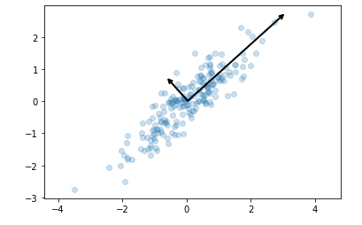
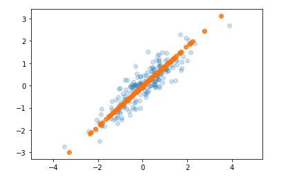
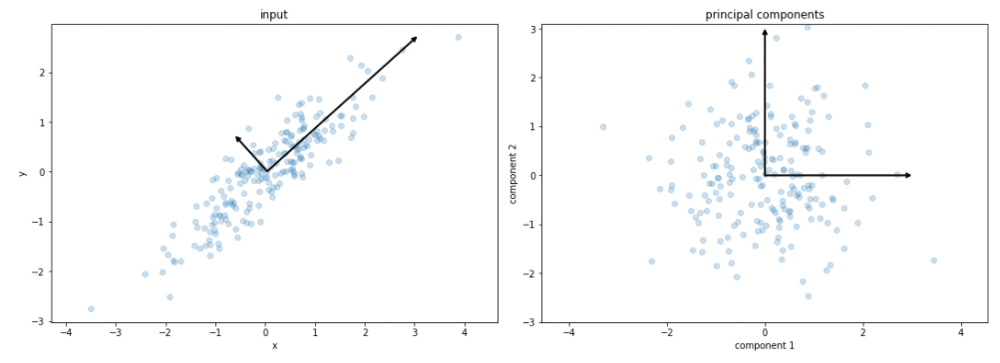
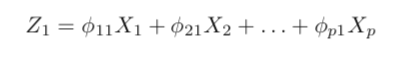
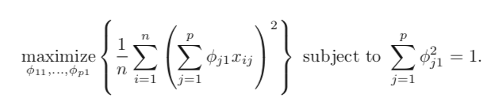
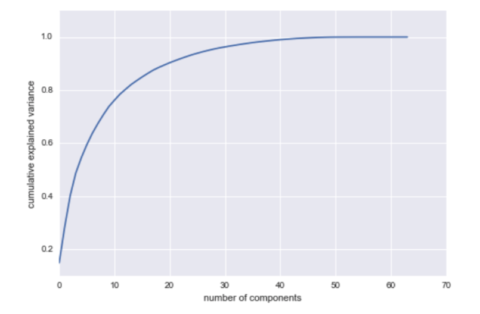
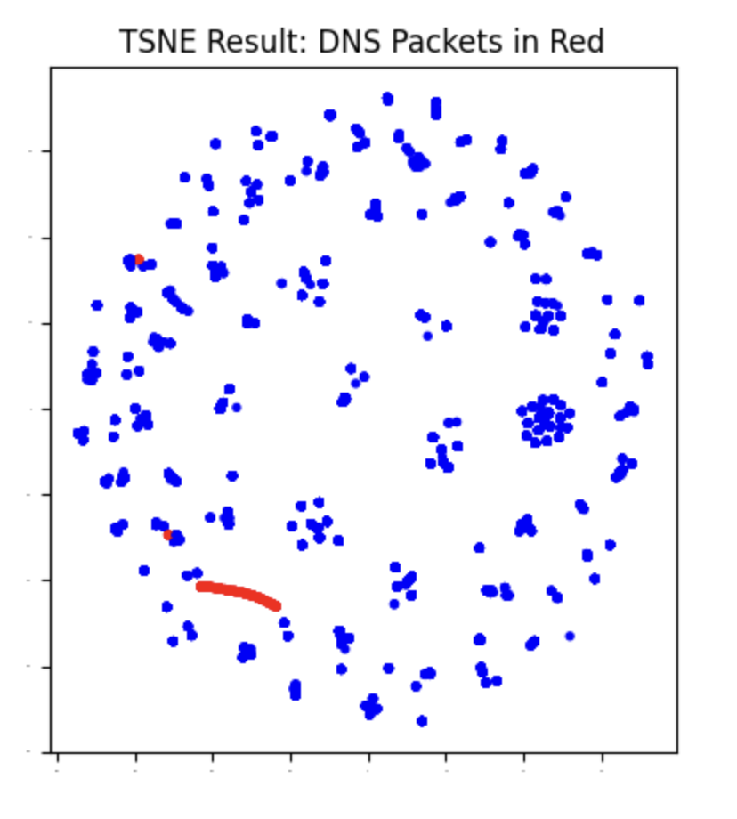
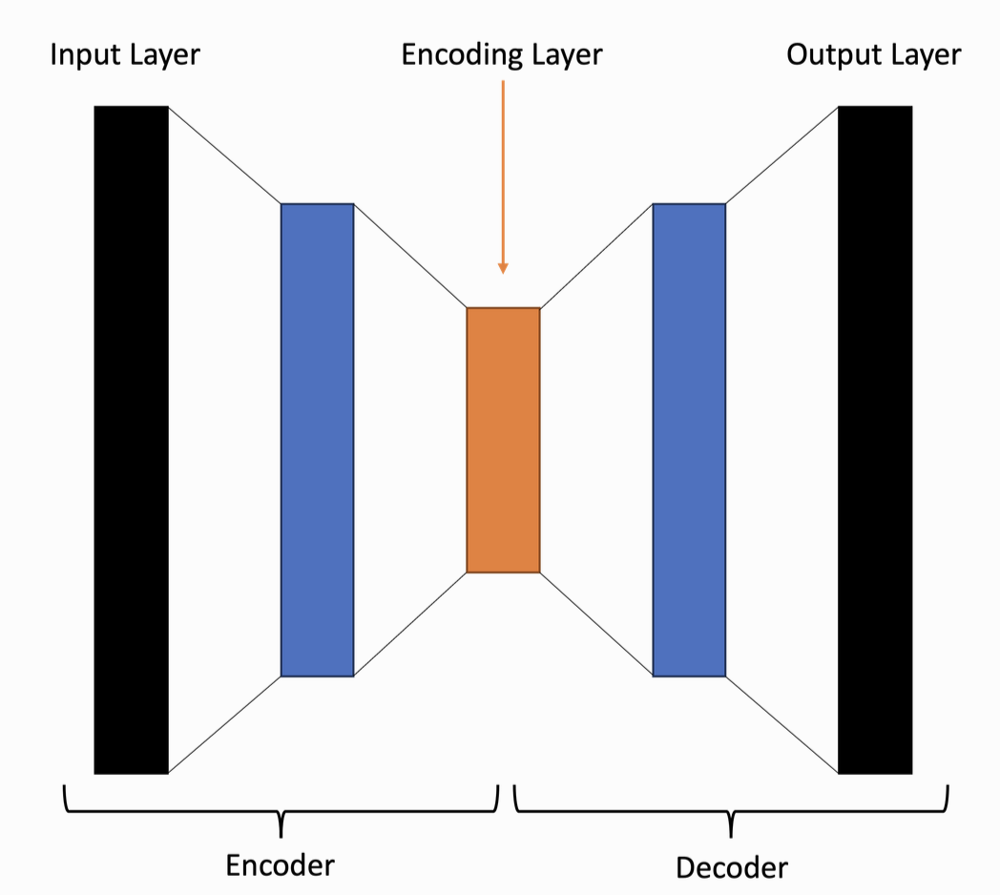

# The Curse of High Dimensions {.center}

> Network data is inherently high-dimensional. The challenge is not
> collecting it — it is *understanding* it.

::: {.notes}
Open with the fundamental problem: packet captures, flow records, and scan
results all produce tens to hundreds of features per example. Ask students:
"How many features does a single IPFIX record have?" The answer is 50+. How
do you visualize that? How do you cluster it? Dimensionality reduction is
the prerequisite step for almost everything else in unsupervised learning.
See the Dimensionality Reduction section of Chapter 6 (Unsupervised Learning)
in *Machine Learning for Networking*.
:::

## Why Dimensionality Reduction?

::: {.columns}
::: {.column width="50%"}
**Visualization**

- Human perception is 2D/3D
- Plotting all feature pairs is prohibitive at high dimensions
- Must compress before you can explore visually

**Computational Feasibility**

- Training time grows with the number of features
- Preprocessing to reduce dimensionality makes downstream models tractable
:::
::: {.column width="50%"}
**Noise Reduction**

- Many features carry little signal
- Retaining only high-variance directions filters noise

**Preprocessing for Clustering**

- Clustering in 100 dimensions is harder than in 5
- Dimensionality reduction often improves cluster quality

> **Key caveat:** all dimensionality reduction is **inherently lossy** —
> patterns visible after reduction are a *subset* of those in the full data.
:::
:::

::: {.notes}
Emphasize the lossy nature early and return to it throughout. Students often
mistakenly trust 2D t-SNE plots as complete pictures of the data. A cluster
that looks clean in 2D may be hiding sub-structure that was projected away.
The two challenges — visualization and computational feasibility — map
directly to the two sections in the book. See Chapter 6 of
*Machine Learning for Networking*.
:::

# Principal Component Analysis {.center}

> PCA answers: "Given high-dimensional data, can I find fewer derived
> features that capture most of the meaningful variation?"

::: {.notes}
Introduce PCA as the workhorse linear technique. It is deterministic,
fast, and produces interpretable axes. See the PCA subsection of Chapter 6
in *Machine Learning for Networking*.
:::

## Two Views of PCA

::: {.columns}
::: {.column width="50%"}
**Maximum Variance**

Find the direction along which the projected data spreads out the most.

- First **principal component**: direction of maximum variance
- Second PC: maximum variance *orthogonal* to the first
- And so on...

Each PC captures a **loading vector** — a linear combination of original features.
:::
::: {.column width="50%"}
**Minimum Projection Distance**

Find the projection that minimizes the sum of squared distances from each
point to the projection line.

These two goals are **mathematically equivalent** — two ways to see the same
linear algebra.

> In linear algebra terms: PCA is a **change of basis** aligned to the
> directions of maximum variance.
:::
:::

::: {.notes}
Spend time on both perspectives. The variance perspective is intuitive
for information-retention; the reconstruction perspective shows why PCA
minimizes information loss. They are provably equivalent — the eigenvectors
of the covariance matrix satisfy both conditions simultaneously. Challenge
students: "Why does maximizing spread minimize reconstruction error?"
See Chapter 6 of *Machine Learning for Networking*.
:::

## PCA in Pictures

::: {.columns}
::: {.column width="50%"}
**Original Space: Principal Axes**

Arrows indicate the two PCs; longer arrow = more explained variance.
:::
::: {.column width="50%"}
**Projected Onto First PC**

Orange points are projections — the 1D "shadow" preserving maximum spread.
:::
:::

::: {.notes}
Walk through these two panels carefully. The first shows the PC arrows
overlaid on raw 2D data — the long arrow is PC1, short arrow is PC2. The
second shows what happens when you project: orange dots are the 1D
reduction. Students often ask: "Why is the data now on a line?" That IS the
dimensionality reduction. See the worked example in Chapter 6 of
*Machine Learning for Networking*.
:::

## Input vs. Principal Component Space

After rotation the two PCs become the coordinate axes. The data "rotates"
rather than changes shape — it is the same information in a new **orthogonal
basis**.

::: {.notes}
Stress that PCA does not remove data points; it re-expresses them. After
the change of basis, PC1 explains the most variance (the long axis of the
cloud), PC2 the next most. To reduce dimensionality, you simply discard the
lower-variance components. This is the "change of basis" that the book
describes. See Chapter 6 of *Machine Learning for Networking*.
:::

## How to Compute Principal Components {.smaller}

**Given** an $n \times p$ dataset $X$. **Want** $n \times m$ vectors ($m \ll p$) that
capture most variance.

**Algorithm:**

1. **Center** each feature: subtract the column mean
2. **Covariance matrix:** $\Sigma = \frac{1}{n} X^T X$
3. **Eigendecomposition:** $\Sigma = V \Lambda V^T$
   — eigenvectors $V$ are the PC directions
   — eigenvalues $\Lambda$ give the variance each PC captures
4. **Sort** eigenvectors by eigenvalue (descending)
5. **Project:** $Z = X V_m$, where $V_m$ keeps the top $m$ eigenvectors

::: {.columns}
::: {.column width="50%"}
**First PC loading equation:**

:::
::: {.column width="50%"}
**Optimization objective:**

:::
:::

::: {.notes}
Walk through each step. Centering is essential — un-centered PCA picks up
the mean as a "component." The eigendecomposition of the covariance matrix
is equivalent to SVD of $X$ (mention SVD for students who prefer that route).
The loading images come directly from the source slides. See Chapter 6 of
*Machine Learning for Networking*; see also the sklearn PCA documentation for
a hands-on reference.
:::

## Choosing the Number of Components: Scree Plot

::: {.columns}
::: {.column width="55%"}

Look for the **"elbow"** — the point where adding more components yields
diminishing returns.
:::
::: {.column width="45%"}
**Rules of thumb:**

- Retain components up to **80–95%** cumulative explained variance
- Use **domain knowledge** when you know the latent structure
  (e.g., 2 traffic types → try 2 PCs)
- Visualize results at different $m$ and check whether meaningful
  structure persists

**PCA properties:**
- **Non-parametric** — no learned parameters
- **Deterministic** — same result every run
:::
:::

::: {.notes}
The scree plot shown here is from a generic high-dimensional dataset. The
first two PCs capture a large fraction; adding more gives diminishing
returns. The "elbow" heuristic is the main practical guide. Mention that
for networking data, the first two PCs often correspond to interpretable
traffic types (scan vs. web, TCP vs. UDP), which makes domain-guided
selection tractable. See Chapter 6 of *Machine Learning for Networking*.
:::

## PCA for Network Traffic Visualization

**Example:** packet capture → 5 features (src IP, dst IP, src port, dst port, length) → 2 PCs

::: {.columns}
::: {.column width="60%"}
Even a simple 5-feature packet capture projected to 2D can reveal:

- **Distinct clusters** of traffic by protocol or application
- **Outlier flows** that fall far from the main mass
- **Structural patterns** invisible in raw tables

PCA is often the **first step** before clustering (e.g., K-means on the
top-$m$ PCs instead of the raw features).
:::
::: {.column width="40%"}
**Kernel PCA** extends the idea to non-linear relationships:

- Uses a **kernel function** (RBF, polynomial) to map data to a higher
  dimensional space before PCA
- Captures curved structure that linear PCA misses
- Required when clusters are not linearly separable

*Common choice:* RBF (Gaussian) kernel as the default starting point.
:::
:::

::: {.notes}
Tie back to the networking dataset the book uses throughout Chapter 6. The
5-feature example (src/dst IP, src/dst port, length) is a minimal but
realistic set. Students from nPrint-based assignments may have 100+ features;
PCA is a natural first pass before handing off to any classifier or anomaly
detector. Kernel PCA is important for cases where traffic classes form
curved manifolds in feature space. See Chapter 6 of *Machine Learning for
Networking*.
:::

# T-SNE {.center}

> T-SNE trades interpretability for visual fidelity:
> it is the tool of choice when you want to *see* cluster structure.

::: {.notes}
Transition: PCA is linear and deterministic. T-SNE is non-linear and
stochastic. They are complementary — use PCA when you need a preprocessing
step or a reproducible transformation; use T-SNE when you want a rich
2D/3D visualization for exploration. See Chapter 6 of *Machine Learning
for Networking*.
:::

## How T-SNE Works

**T-Distributed Stochastic Neighbor Embedding (T-SNE)** — van der Maaten & Hinton, 2008

::: {.columns}
::: {.column width="55%"}
**Three-step algorithm:**

1. **High-dimensional similarities:** fit a **Gaussian** distribution to
   pairwise distances among all points in the original space
2. **Low-dimensional mapping:** find a **t-distribution** in 2D/3D that
   minimizes KL divergence with the high-dimensional distribution
3. **Placement:** draw point locations from this t-distribution

**Why t-distribution?** Its heavier tails push *dissimilar* points far
apart while keeping *similar* ones close — producing clean cluster gaps.
:::
::: {.column width="45%"}
**Key properties:**

- **Non-linear** — can preserve curved structure PCA cannot
- **Non-parametric** — no learned parameters
- **Stochastic** — different runs may give different layouts
  (fix random seed for reproducibility)
- Primarily useful for **visualization / exploration**, not as a
  preprocessing step for classifiers

> Clusters visible in T-SNE are genuine patterns — but the distances
> *between* clusters are not directly interpretable.
:::
:::

::: {.notes}
Stress the stochastic nature: two T-SNE runs on the same data may look
different. This is why T-SNE should not be used as a preprocessing step
for downstream classifiers — the mapping is not reproducible by default
and can't be applied to new data. For classifier preprocessing, PCA or
autoencoders are preferred. See Chapter 6 of *Machine Learning for
Networking*.
:::

## T-SNE on Network Packet Data

::: {.notes}
Walk through this carefully. The dataset is a packet capture reduced from
4 dimensions (src IP, dst IP, src port, dst port) to 2D. DNS packets (red)
form a distinct arc/cluster separate from the main mass of blue points.
This is exactly the kind of structure T-SNE excels at revealing — protocol
homogeneity causes DNS packets to cluster because they share ports (53),
small packet sizes, and similar IP patterns. Ask: "What does it mean that
DNS points cluster? What features are driving this?" See Chapter 6 of
*Machine Learning for Networking*.
:::

## Evaluating T-SNE Results {.smaller}

Without labels, it is hard to know if T-SNE output is **meaningful** or an
**artifact of the algorithm**.

::: {.columns}
::: {.column width="50%"}
**Questions to ask about a T-SNE plot:**

- Do discovered clusters correspond to known categories (if any labels are
  available for spot-checking)?
- Does the structure align with **domain knowledge** about the data?
- Does the same structure appear across multiple runs (different random seeds)?
- Does the structure appear in PCA too, or only in T-SNE?
:::
::: {.column width="50%"}
**Common pitfalls:**

- Choosing a very small or very large **perplexity** can create false
  clusters or merge real ones
- T-SNE **cannot** be applied to new/unseen data — there is no
  "transform" step after fit
- The **global structure** (distances between clusters) is unreliable;
  only local neighborhood relationships are preserved
- 2D/3D visualizations may hide real sub-structure in the original
  high-dimensional data
:::
:::

::: {.notes}
Perplexity (default 30 in sklearn) is the key hyperparameter — it
controls the neighborhood size used in the Gaussian similarity. Too small
(5) and each point is its own island; too large (100) and everything
merges. The book's guidance: experiment with 5–50 and check stability.
Cold-call: "You run T-SNE twice and get different layouts — does that mean
the clusters are not real?" No — it means the global layout is unstable
but local neighborhoods are still preserved if the structure is real.
See Chapter 6 of *Machine Learning for Networking*.
:::

# Autoencoders {.center}

> Autoencoders learn to compress and reconstruct — the bottleneck
> *forces* the network to discover essential structure.

::: {.notes}
Third dimensionality reduction method. Unlike PCA and T-SNE, autoencoders
are parametric (they have learned weights) and can capture non-linear
relationships through deep layers. They are the bridge between
dimensionality reduction and deep learning. See Chapter 6 of *Machine
Learning for Networking*.
:::

## Autoencoder Architecture

::: {.columns}
::: {.column width="50%"}
**Encoder:** compresses input through progressively narrower layers to the
**bottleneck** (latent representation)

**Bottleneck:** the dimensionality reduction — e.g., 100 features → 10
neurons forces the network to find the essential structure
:::
::: {.column width="50%"}
**Decoder:** mirrors the encoder in reverse, reconstructing the original
input from the bottleneck representation

**Training objective:** minimize **reconstruction loss**
(typically mean squared error between input and output)

After training, discard the decoder — use the **encoder alone** for
dimensionality reduction.
:::
:::

::: {.notes}
The hourglass diagram is the clearest possible illustration of how
autoencoders enforce compression. Compare to PCA: PCA's "bottleneck" is
just choosing $m < p$ eigenvectors; an autoencoder's bottleneck is a
neural network layer that learns *non-linear* projections. The training
trick is elegant: no labels needed — the input is its own target. See
Chapter 6 of *Machine Learning for Networking*.
:::

## Why Autoencoders for Networking

::: {.columns}
::: {.column width="55%"}
**Advantages over PCA and T-SNE:**

- **Non-linear representations** — captures multiplicative and exponential
  feature interactions (e.g., packet size × inter-arrival time)
- **Scalable to very high dimensions** — handles nPrint's 100+ features
  without the memory cost of an $n \times n$ covariance matrix
- **Anomaly detection built-in** — after training on *normal* traffic,
  unusual flows produce high reconstruction error
- **Parametric** — the learned encoder can be applied to new, unseen data

**Anomaly detection:** set a threshold on reconstruction error.
Anomalous traffic the model hasn't learned to compress → high error →
flag for investigation.
:::
::: {.column width="45%"}
**Practical considerations:**

- Requires significantly more **training data** and compute than PCA
- **Bottleneck size** is a design choice: start at 10–20% of input
  dimensionality
- **Architecture:** 3–5 layers in encoder and decoder, each layer ~halfway
  between adjacent sizes
- **Parametric nature:** the encoder is dataset-specific; traffic
  distribution shift requires retraining

**Variants:** Variational (VAE), Sparse, Denoising, Convolutional — each
adding different inductive biases.
:::
:::

::: {.notes}
The anomaly detection use case is perhaps the most important for
networking. Kitsune (Mirsky et al., 2018) is the canonical example: an
autoencoder trained on normal traffic that flags novel intrusion patterns
by reconstruction error. This connects directly to the book's discussion of
zero-day and never-before-seen attacks. See Chapter 6 of *Machine Learning
for Networking*.
:::

## Autoencoders + Clustering: Deep Embedding

The key insight: **the autoencoder bottleneck layer is a learned feature space
tailored to your data** — often better for clustering than raw features.

::: {.columns}
::: {.column width="55%"}
**Workflow:**

1. Train an autoencoder on raw network data
2. Extract **bottleneck activations** (embeddings) for all examples
3. Apply K-means, DBSCAN, or GMM to the embeddings
4. Evaluate: do discovered clusters correspond to meaningful traffic types?

This combination is sometimes called **deep clustering** when the two
steps are trained jointly.
:::
::: {.column width="45%"}
**Why this helps:**

- High-dimensional raw data contains **irrelevant and redundant features**
  that confuse clustering algorithms
- The autoencoder's compression discards noise and emphasizes pattern
- Result: tighter, more separable clusters in the embedding space

**Raw data → autoencoder → embeddings → K-means**
often outperforms
**Raw data → K-means directly**
:::
:::

::: {.notes}
The workflow here is the standard pipeline used in production network
monitoring systems. Students doing the clustering lab should think about
applying PCA or an autoencoder first before running K-means. The book
explicitly recommends this combination. See the "Connection to Clustering"
subsection of Chapter 6 in *Machine Learning for Networking*.
:::

## Comparing the Three Methods {.smaller}

| | **PCA** | **T-SNE** | **Autoencoder** |
|---|---|---|---|
| **Transformation** | Linear | Non-linear | Non-linear (deep) |
| **Parametric** | No | No | Yes (learned weights) |
| **Deterministic** | Yes | No (fix seed) | No (random init) |
| **Applies to new data** | Yes | No | Yes |
| **Best for** | Preprocessing, noise reduction | Visualization / exploration | Anomaly detection, high-dim compression |
| **Compute cost** | Low | Medium | High |
| **Interpretability** | High (loadings) | Low | Low |

::: {.notes}
This comparison table is a useful exam anchor. Cold-call: "Which method
would you use as the first step before training a traffic classifier?"
PCA or autoencoder (both can transform new data). "Which would you use to
decide how many clusters are present?" T-SNE for exploration, then PCA
scree plot for a quantitative guide. See Chapter 6 of *Machine Learning
for Networking*.
:::

# Networking Applications {.center}

> Dimensionality reduction is not an end in itself — it is the gateway
> to visualization, clustering, and anomaly detection on network data.

::: {.notes}
Tie everything together with concrete networking use cases. The goal is for
students to understand when to reach for each tool. See Chapter 6 of
*Machine Learning for Networking*.
:::

## Where Dimensionality Reduction Appears in ML Pipelines

::: {.columns}
::: {.column width="55%"}
**As a visualization step:**

- Apply T-SNE or PCA to network flow features → 2D scatter plot
- Color by known labels (if available) to validate that structure exists
- Use before labeling to decide what questions to ask

**As a preprocessing step:**

- PCA → reduce 50+ IPFIX features to top 5–10 PCs
- Feed PCs to a supervised classifier (reduces overfitting, speeds training)
- Autoencoder embeddings → K-means for unsupervised traffic typing

**For anomaly detection:**

- Train an autoencoder on normal traffic
- Flag flows with high reconstruction error as anomalous
- Effective for **zero-day attacks** (no labeled examples required)
:::
::: {.column width="45%"}
**Real-world settings:**

- **Intrusion detection systems:** PCA and autoencoders reduce feature space
  before classification; T-SNE validates that attack traffic is separable

- **IoT traffic analysis:** autoencoders handle the heterogeneous, unlabeled
  traffic from thousands of device types

- **5G network monitoring:** combined PCA + T-SNE + UMAP visualization
  pipelines used for real-time intrusion analysis

- **nPrint-based pipelines:** 100–1600 bit features per flow → PCA or
  autoencoder compression before any classifier
:::
:::

::: {.notes}
Connect each use case back to the tools. nPrint is the system discussed in
the previous lecture (Meeting 14): it produces very high-dimensional
per-packet bit vectors. Any downstream task requires dimensionality
reduction or careful feature selection. The autoencoder anomaly detection
case maps directly to Kitsune, a well-known intrusion detection system the
book cites. See Chapter 6 of *Machine Learning for Networking*.
:::

## Current Research: Guided Autoencoders for Intrusion Detection {.smaller}

::: {.vignette}
**February 2026 — Scientific Reports (Nature):** Researchers published
"Feature importance-guided autoencoder for dimensionality reduction in
intrusion detection systems," proposing **FI-AE**: an autoencoder that
incorporates **random-forest feature-importance scores** into the
reconstruction loss function. Instead of treating all input features
equally during compression, the bottleneck is penalized more for losing
high-importance features. On standard IDS benchmarks with highly
imbalanced, high-dimensional datasets, FI-AE outperformed vanilla
autoencoders and PCA-based dimensionality reduction.
*Source: Nature Scientific Reports, Feb 2026 — DOI:
10.1038/s41598-026-36695-9*
:::

**Teaching point:** this paper illustrates that dimensionality reduction is
not just a preprocessing nuisance — the *design* of the compression step
directly affects downstream security outcomes.

::: {.notes}
This is a verified 2026 paper in a peer-reviewed journal. The key insight
for students: the standard autoencoder treats all features equally, but
in IDS settings, some features (e.g., packet rate, SYN/ACK ratio) are far
more informative than others. Guiding the bottleneck via feature importance
is a principled hybrid of supervised signal and unsupervised compression.
Cold-call: "What feature importance method does FI-AE use?" Random forest
OVA (one-versus-all). "What does the weighted loss function penalize?" Losing
high-importance features in the bottleneck. Refresh this vignette annually —
check for follow-up papers or competing methods.
:::

## Summary

::: {.columns}
::: {.column width="50%"}
**PCA**

- Linear change of basis; directions of maximum variance
- Deterministic, fast, interpretable
- Scree plot guides component selection
- Use for preprocessing, noise reduction, and initial visualization

**T-SNE**

- Non-linear neighborhood embedding
- Produces clean 2D/3D visualizations of cluster structure
- Stochastic; cannot transform new data
- Use for exploration, not as a classifier input
:::
::: {.column width="50%"}
**Autoencoders**

- Learned non-linear compression through an encoder-bottleneck-decoder
- Parametric: applies to new data; also detects anomalies via reconstruction error
- Use for high-dimensional compression, anomaly detection, and deep clustering

**Key principle:** all dimensionality reduction is **lossy**. The visible
structure after reduction is a *subset* of the true structure.

**Key choice:** match method to task — PCA for preprocessing, T-SNE for
exploration, autoencoder for anomaly detection.
:::
:::

::: {.notes}
Close by returning to the key principle: lossy reduction means you can never
be certain you've seen all the structure. The practical implication is to
try multiple methods, compare outputs, and validate against domain knowledge.
The "right" dimensionality is rarely obvious without experimentation. See the
Summary section of Chapter 6 of *Machine Learning for Networking*.
:::
