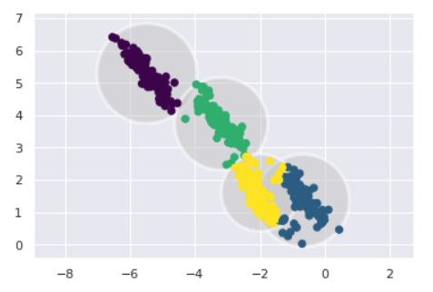
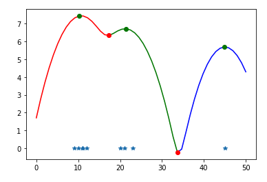

# Why Clustering? {.center}

> Most network data arrives **unlabeled**. Clustering lets us discover structure without a single ground-truth label.

::: {.notes}
Open with the observation that clustering is the entry point to unsupervised learning in networking. Packet captures, flow records, BGP tables — none carry automatic labels. The question is: can we find meaningful groups anyway? See the *Clustering* section of Chapter 6 (Unsupervised Learning) in "Machine Learning for Networking."
:::

## What Is Unsupervised Learning?

- **No labels / no target variable** — the algorithm sees only features
- Goal: discover **structure**, **groups**, or **patterns** in the data
- Key tasks in this course:
  - **Clustering** — group similar data points
  - Dimensionality reduction — compress to essential features (Lecture 15)
  - Anomaly detection — flag points that don't fit

::: {.notes}
Unsupervised learning is the dominant paradigm in networking because labeled datasets are scarce and expensive. The three bullet tasks all appear in the Chapter 6 framing; this deck focuses on clustering. Cold-call: "Name one network dataset you've heard of — does it come with labels?"
:::

## Clustering in Networking: Motivating Examples

::: {.columns}
::: {.column width="50%"}
**Traffic characterization**

- Separate **elephant flows** from **mouse flows**
- Identify application protocol groups from raw flow features
- Detect **port-scan** patterns vs. normal web traffic
:::
::: {.column width="50%"}
**Security & anomaly detection**

- Find anomalous host behavior without labeled attack data
- Cluster BGP routing updates to spot instability
- Group packets in a capture to separate attack vs. benign
:::
:::

::: {.notes}
The book (Chapter 6) gives two concrete examples: elephant/mouse flow separation and a TCP flood dataset where two clusters map cleanly to attack vs. benign traffic. Use these as the running thread through the lecture. Key point: you do not need to know the labels in advance to get value from the clusters.
:::

## The Four Algorithms We Cover

| Algorithm | Needs K? | Cluster shape | Handles outliers? |
|---|---|---|---|
| **K-Means** | Yes | Spherical | No (distorts) |
| **GMM** | Yes | Elliptical | No (soft) |
| **DBSCAN** | No | Arbitrary | Yes (marks noise) |
| **Hierarchical** | No (cut later) | Hierarchical | Sensitive |

::: {.notes}
This table is the lecture roadmap. Return to it after each algorithm and fill in intuition. The book (Chapter 6) covers all four; the ordering here follows the book: K-Means → GMM → DBSCAN → Hierarchical.
:::

# K-Means {.center}

## How K-Means Works

1. Choose **K** — the number of clusters
2. Randomly place **K centroids** in feature space
3. **E-step:** assign each point to its nearest centroid
4. **M-step:** move each centroid to the **mean** of its assigned points
5. Repeat steps 3–4 until centroids stop moving (**convergence**)

**Convergence criterion:** no re-assignments, or SSE below threshold

$$\text{SSE} = \sum_{j=1}^{K} \sum_{x \in C_j} \text{dist}(x,\, m_j)^2$$

::: {.notes}
The "means" in K-means literally refers to step 4 — moving each centroid to the arithmetic mean of its cluster. The algorithm always converges (SSE is non-increasing) but may reach a local minimum. See book Chapter 6, K-Means section. Ask: "What happens to SSE as K increases?"
:::

## Choosing K: The Elbow Method

- Run K-means for K = 1, 2, 3, …
- Plot **SSE vs. K**
- Look for the "**elbow**" — the point of diminishing returns
- Analogous to the **scree plot** in PCA (Lecture 15)

::: {.columns}
::: {.column width="60%"}
> At K = N (one cluster per point): SSE = 0
> At K = 1 (one cluster): SSE is maximum
> Sweet spot: the elbow trades off compactness vs. complexity
:::
::: {.column width="40%"}
**Domain shortcut:** if you know two protocols (TCP/UDP), start with K = 2 and check whether clusters match
:::
:::

::: {.notes}
This is the most practical advice for practitioners. The elbow heuristic is the same logic as the PCA scree plot. Emphasize: you have to run it multiple times anyway because of random initialization — so you're already getting SSE curves "for free." Book Chapter 6, K-Means section.
:::

## K-Means: Failure Modes {.smaller}

::: {.columns}
::: {.column width="55%"}
**When K-Means struggles**

- **Non-spherical shapes** — assumes convex, roughly equal clusters; fails on donuts, boomerangs, elongated shapes
- **Outlier sensitivity** — a few distant points can hijack a centroid
- **Varying density** — equal-weight centroids can't represent dense + sparse clusters fairly
- **Categorical features** — Euclidean distance is undefined for protocol type, day-of-week, etc.
- **Local minima** — random initialization can yield poor stable solutions
:::
::: {.column width="45%"}

:::
:::

::: {.notes}
The image (s22-i01.png) shows a K-means result on data with elongated, diagonally-oriented clusters. The spherical assumption causes the four centroids to split clusters incorrectly. This is a teaching moment: K-means is not wrong — it's doing its best under its assumptions. The fix is to use GMM or DBSCAN. Standardize features before running K-means; forgetting this is the most common practical mistake.
:::

# Gaussian Mixture Models {.center}

## GMM: Beyond Centroids

- K-means tracks **center only**; GMM tracks **center + spread (covariance)**
- Assumes data is drawn from a **mixture of Gaussians** — one per cluster
- Each point is assigned a **probability** of belonging to each cluster ("soft" assignment)

::: {.columns}
::: {.column width="50%"}
**Expectation-Maximization**

- **E-step:** compute P(cluster | point) using current parameters
- **M-step:** update means, variances, and mixing weights
:::
::: {.column width="50%"}
**Networking example**

- Scan traffic: short packets → narrow Gaussian at ~60 bytes
- Web traffic: full-size packets → Gaussian at ~800 bytes
- Observe a new packet: which distribution is more likely?
:::
:::

::: {.notes}
The book's packet-length example is excellent: model packet length as a mixture of two Gaussians, one for scans and one for legitimate traffic. Then P(scan | length=64) is high, P(web | length=64) is low. This is a generative model — you can also *sample* from it to augment a dataset. See Chapter 6, GMM section.
:::

## GMM vs. K-Means

| | K-Means | GMM |
|---|---|---|
| Assignment | Hard (one cluster) | Soft (probability) |
| Cluster shape | Spherical | Elliptical |
| Parameters | Centroids only | Means + covariances |
| Speed | Faster | Slower |
| Data generation | No | Yes — sample from learned distributions |

> Both require specifying **K** in advance; use the elbow method for both.

::: {.notes}
The key insight: K-means is a special case of GMM where all covariances are equal and spherical and assignments are hard (0/1). Emphasize data generation — GMMs can produce synthetic traffic samples that look like real traffic, which is useful for augmenting small labeled datasets. Book Chapter 6.
:::

# DBSCAN {.center}

## DBSCAN: Density-Based Clustering

**Core idea:** a region with high density belongs to the same cluster; sparse regions are **noise**

::: {.columns}
::: {.column width="55%"}
**Algorithm ("eating breadcrumbs")**

1. Pick a random unvisited point
2. If it has ≥ **minPts** neighbors within **ε**: start a cluster
3. Recursively expand — visit each neighbor and grow the cluster
4. Repeat from step 1 for remaining unvisited points
5. Points that never join a cluster → **outliers/noise**

**Parameters:** ε (distance), minPts (density threshold), distance metric
:::
::: {.column width="45%"}

:::
:::

::: {.notes}
The image (s24-i02.png) shows a KDE density curve with three peaks (colored clusters) and sparse outlier points marked as stars. This illustrates the density-based intuition: peaks → clusters, valleys/sparse areas → noise. In networking, outlier points might be novel attack traffic. Book Chapter 6, DBSCAN section.
:::

## DBSCAN Advantages and Disadvantages {.smaller}

::: {.columns}
::: {.column width="50%"}
**Advantages**

- **No need to specify K** — discovers however many clusters exist
- **Arbitrary shapes** — handles donuts, boomerangs, elongated clusters
- **Automatic outlier detection** — sparse points become noise; useful for anomaly detection in network security
- **Interpretable** — core points, border points, noise are meaningful categories
:::
::: {.column width="50%"}
**Disadvantages**

- **Non-deterministic** — results depend on the order points are visited
- **Varying density** — a single ε cannot capture both dense and sparse clusters well; addressed by **HDBSCAN**
- **High dimensions** — curse of dimensionality makes Euclidean distance unreliable
- **Parameter sensitivity** — ε and minPts require experimentation
:::
:::

::: {.notes}
The varying-density problem is DBSCAN's biggest practical limitation in networking. Production networks often have a dense cluster of "normal" web traffic and sparse clusters of rare but legitimate traffic. HDBSCAN (Hierarchical DBSCAN) addresses this. Mention that standardizing features helps with the dimensionality issue. Book Chapter 6, DBSCAN section.
:::

# Hierarchical Clustering {.center}

## Hierarchical Clustering and Dendrograms

- Builds a **dendrogram** (tree diagram) showing progressive groupings
- **No need to specify K** in advance — "cut" the tree at any height
- **Agglomerative (bottom-up):** start with N singletons, merge closest pairs
- **Divisive (top-down):** start with one cluster, split recursively

**Linkage — how to measure distance between clusters:**

| Linkage | Distance used |
|---|---|
| **Complete** | Maximum pairwise distance (most compact clusters) |
| **Single** | Minimum pairwise distance (chaining risk) |
| **Average** | Mean pairwise distance (balanced) |
| **Centroid** | Distance between cluster centers |

::: {.notes}
The dendrogram is the output, not a parameter. You inspect it and decide where to cut based on domain knowledge. The book's networking example: hierarchical clustering by IP address using Hamming distance naturally reflects topological containment (room → building → campus). Where containment doesn't hold (IP prefix AND protocol), use a different method. Book Chapter 6, Hierarchical Clustering section.
:::

## When to Use Hierarchical Clustering

- **Works well:** data has **strict containment** relationships
  - IP topology: room ⊂ building ⊂ campus ⊂ AS
  - Protocol hierarchy: application → transport → network
- **Works poorly:** categories **cross-cut** each other
  - "Source IP prefix" and "Protocol" don't nest — not all packets from one /24 use the same protocol

> Cutting the dendrogram at different heights gives **nested clusters** — a property K-means and DBSCAN lack

::: {.notes}
The containment requirement is often overlooked. The book gives a useful counter-example: gender vs. nationality — if K=2, gender may dominate; if K=3, nationality may dominate. The clusters are not hierarchically nested, so hierarchical clustering is not the right tool. Push students to think: "Does my network data actually have hierarchical structure?" Book Chapter 6.
:::

# Clustering for Anomaly Detection {.center}

## Using Clustering to Detect Unknown Attacks

**The problem:** supervised classifiers need labeled attack examples — but zero-day attacks have no labels

**The clustering solution:**
1. Collect traffic and cluster it into "normal" groups
2. Monitor whether new traffic **fits** existing clusters
3. Points far from all cluster centers → **anomalous** → investigate

::: {.columns}
::: {.column width="50%"}
**Why this works**

- You don't need to know *what* the attack is — just that it's **unlike anything you've seen**
- DBSCAN directly marks outliers as noise
- K-means: flag points with high distance to nearest centroid
:::
::: {.column width="50%"}
**Limitations**

- Only detects traffic that **differs structurally** from normal
- Adversaries who mimic normal traffic evade it
- Cluster drift: "normal" changes over time
:::
:::

::: {.notes}
This is the key applied motivation for the whole lecture. Reference the TCP flood dataset from the book: K-means and DBSCAN both cleanly separate attack traffic from benign traffic without any labels. Contrast with supervised IDS: you can't train on Log4j before Log4j exists. Book Chapter 6, "Applications of Clustering to Network Security" section.
:::

## Current Event: GMM for Unknown Attack Discovery (2025) {.smaller}

::: {.vignette}
A 2025 network intrusion detection system (published in *Frontiers in Artificial Intelligence*, March 2025) combines a **BERT encoder** — trained to distinguish benign from malicious flows — with a **Gaussian Mixture Model** that clusters the high-dimensional BERT embeddings. The GMM component dynamically identifies *new* attack clusters as they arrive, without retraining the encoder. Even after integrating previously unknown attack types, the system reports **95.6% classification accuracy and recall**. The key insight echoes what this lecture teaches: clustering after embedding turns an open-world anomaly problem into a tractable GMM inference problem. (Source: Frontiers in AI, doi:10.3389/frai.2025.1625891)
:::

**Thought question:** which limitation of GMM does this system inherit — and how might DBSCAN have been used instead?

::: {.notes}
This is a real, dated 2025 paper (doi:10.3389/frai.2025.1625891). Do not embellish the numbers — 95.6% is what the abstract reports. The teaching point: GMM is still live research, not just a textbook exercise. Cold-call on the thought question: students should note GMM still requires specifying K (number of attack types), whereas DBSCAN would auto-discover K but struggle with high-dimensional BERT embeddings.
:::

# Evaluation and Practical Guidance {.center}

## How Do You Know If Your Clustering Is Good? {.smaller}

::: {.columns}
::: {.column width="50%"}
**Internal evaluation** (no labels needed)

- **Intra-cluster similarity** — points within a cluster should be close
- **Inter-cluster separation** — clusters should be far from each other
- Silhouette score, Davies-Bouldin index
- SSE (K-means) / log-likelihood (GMM)
:::
::: {.column width="50%"}
**External evaluation** (requires ground-truth labels)

- Compare discovered clusters to known labels (e.g., attack vs. benign)
- Adjusted Rand Index, Normalized Mutual Information
- Use sparingly — if you have labels, supervised learning may be better
:::
:::

**Practical checklist:**

1. **Standardize features** before running K-means or GMM
2. Run K-means **multiple times** with different random seeds
3. Visualize with PCA or t-SNE before interpreting clusters (Lecture 15)
4. Ask: do discovered clusters correspond to **meaningful categories**?

::: {.notes}
The "do clusters mean something?" question is the hardest. The book stresses that clustering is an exploratory tool — the algorithm always produces output, but the output is only useful if it maps onto something real. For the TCP flood dataset, the two clusters happen to match attack/benign almost perfectly. For a dataset with no inherent structure, K-means will still produce K clusters — they just won't mean anything useful. Book Chapter 6, evaluation discussion.
:::

## Choosing the Right Algorithm

| Situation | Recommended algorithm |
|---|---|
| You know K; clusters are compact | **K-Means** |
| Clusters vary in size, shape, or density | **GMM** |
| Unknown K; need outlier detection | **DBSCAN** |
| Data has strict containment structure | **Hierarchical** |
| High-dimensional data | PCA/autoencoder first, then cluster |
| Labeled data available | Consider supervised classification instead |

::: {.notes}
This decision table is a practical takeaway. Emphasize the last row: clustering is best when labels are absent or expensive to obtain. If you have labeled data, a supervised approach almost always outperforms clustering for classification. The "PCA first" row reflects the book's recommendation that dimensionality reduction before clustering often yields better-defined clusters.
:::

## Summary

- **K-Means:** fast, intuitive, requires K; assumes spherical clusters; use the elbow method to choose K
- **GMM:** K-means with covariance; soft assignments; can generate synthetic data; still needs K
- **DBSCAN:** density-based; arbitrary shapes; automatic outlier marking; no K needed; struggles with varying density
- **Hierarchical:** builds a dendrogram; no K needed up front; requires strict containment relationships

**Unifying application:** unsupervised clustering detects **novel anomalies** in network traffic without labeled attack data — critical when labeled examples of zero-day threats don't yet exist

::: {.notes}
Close with the anomaly detection framing — it ties every algorithm back to the practical networking motivation. Remind students that the choice of algorithm depends on what they know about the data structure in advance. Assignment hook: the appendix activity in the book applies all four algorithms to a packet capture with mixed attack and benign traffic. Book Chapter 6, Summary section.
:::
