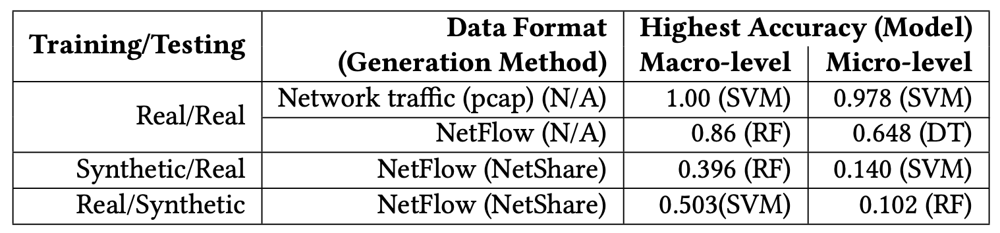
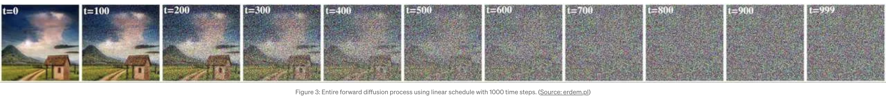
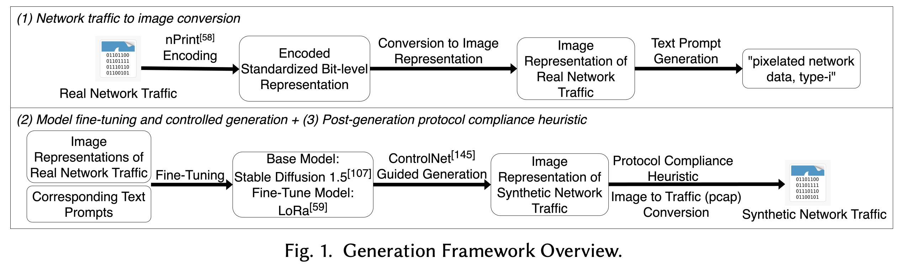
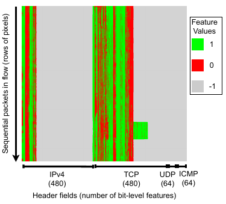
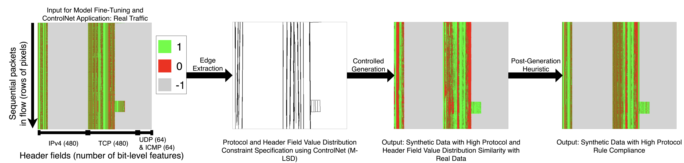
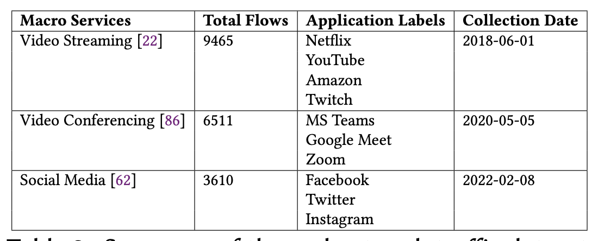
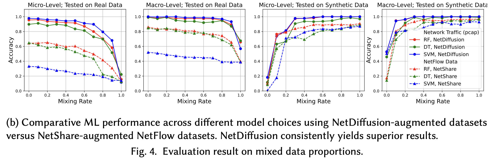
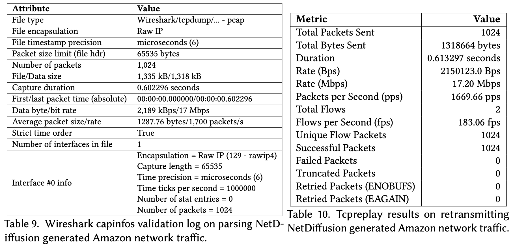
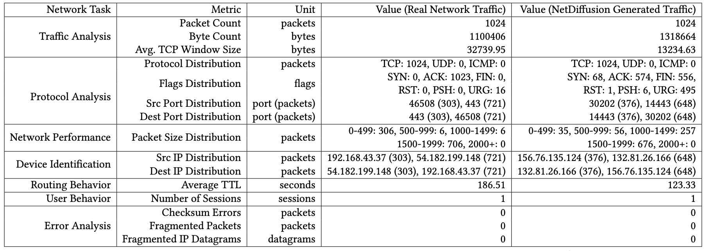

# Why Synthetic Network Data? {.center}

> Labeled network data is **scarce**. Generative models let us learn from what we have
> and produce realistic synthetic examples.

::: {.notes}
Open with the central tension: ML for networking needs labeled data, but labeled
network data is expensive to collect, privacy-sensitive, and often missing rare events
like attacks. Today we explore whether generative models — and diffusion models in
particular — can close that gap. See the "Generative Models" chapter (Chapter 7) of
the course textbook.
:::

## The Network Data Problem {.smaller}

::: {.columns}
::: {.column width="55%"}
Network trace datasets fall into two types:

- **Flow-level statistics** (NetFlow/IPFIX) — duration, byte counts, packet counts
- **Raw packet captures** (pcap / tcpdump) — full headers and payload

Both types are needed for downstream tasks:

- Training ML models for anomaly detection and traffic classification
- Hardware and software testing
- Protocol interoperability validation
:::
::: {.column width="45%"}
**Why are datasets scarce?**

- **Privacy / confidentiality** — real traffic reveals user behavior
- **Maintenance costs** — continuous collection infrastructure
- **Collection errors** — labeling and alignment challenges
- **Rare events** — attacks, failures are under-represented by definition
:::
:::

::: {.notes}
See the "Generative Models" chapter introduction. Ask students: what are the risks of
sharing a pcap from a corporate network? Name three specific classes of sensitive
information that could be inferred. The scarcity argument sets up *why* we need
synthetic generation before we can explain *how* to do it.
:::

## What Synthetic Data Buys Us

- **Traffic augmentation** — synthesize examples of rare classes; improve
  classifier performance on minority classes
- **Simulation and testing** — feed synthetics into network simulators,
  test devices and protocols without live traffic
- **Privacy-preserving sharing** — preserve statistical properties while
  removing real user data
- **What-if analysis** — generate hypothetical attack patterns or new
  protocol variations not yet observed in the wild

::: {.notes}
These four use cases come directly from the Chapter 7 motivation. Stress that each
use case has different fidelity requirements: a simulator test needs protocol-valid
packets; a class-balancing augmentation needs statistically realistic features but
not necessarily bit-perfect headers.
:::

# Generative Architectures {.center}

> GANs came first. Diffusion models changed the game.

::: {.notes}
This section motivates the architecture progression: GAN → diffusion → SSM/transformer.
Each step addresses a limitation of the previous one. The book structures the chapter
the same way.
:::

## Early Approach: GAN-Based Traffic Synthesis {.smaller}

::: {.columns}
::: {.column width="50%"}
**How GANs work:**

- A **generator** creates synthetic data
- A **discriminator** tries to distinguish real from fake
- Adversarial training continues until the generator fools the discriminator

**Networking applications:**

- **DoppelGANger** and **NetShare** — generate synthetic NetFlow-style
  flow-level attributes
- High statistical resemblance to real traffic
- Introduce realistic variation (unlike simulators)
:::
::: {.column width="50%"}
**GAN limitations for networking:**

- **Mode collapse** — generator learns a narrow subset of realistic outputs
- **Training instability** — generator and discriminator can oscillate
- **Flow-level only** — aggregated statistics, not raw packets
- **Low ML accuracy** — synthetic NetFlow data yields poor downstream
  classification accuracy when models are trained on it and tested on real
  traffic

:::
:::

::: {.notes}
The table image (s07-i05.png) shows the accuracy collapse: real pcap SVM achieves
~1.0 macro-accuracy; NetShare-trained models top out around 0.4. This is the gap
NetDiffusion is designed to close. See the "Early Approaches" section of Chapter 7.
:::

## Why Raw Packets Matter

Training on **raw packet captures** (pcap) rather than flow-level statistics yields
significantly higher ML accuracy because:

- Headers carry rich **protocol semantics** (sequence numbers, flags, checksums)
- **Inter-packet timing** and payload patterns encode application behavior
- Flow aggregation loses distinguishing features that classifiers rely on

The goal: an **interactive, text-prompted generator** — ask it for "Netflix TCP traffic"
and receive a valid, analyzable pcap.

::: {.notes}
This is the key motivating gap from Slides 7–9 of the source. Contrast with how a
text-to-image model (ChatGPT/DALL-E) can produce a specific image on demand. The
vision for network traffic synthesis is the same kind of controlled, on-demand
generation.
:::

# How Diffusion Models Work {.center}

> Destroy structure step by step, then learn to rebuild it.

::: {.notes}
Before introducing NetDiffusion, give students the underlying diffusion model mechanics.
The two-phase process is elegant and worth explaining in detail. See the "Diffusion
Models" section of Chapter 7 and the DDPM paper (Ho et al., 2020).
:::

## The Forward Process: Adding Noise {.smaller}

::: {.columns}
::: {.column width="55%"}
**Phase 1 — Forward (diffusion):**

Starting from a real data sample $x_0$, add small Gaussian noise at each
of $T$ timesteps:

$$q(x_t | x_{t-1}) = \mathcal{N}(x_t;\, \sqrt{1-\beta_t}\, x_{t-1},\, \beta_t I)$$

- By step $T$, the original signal is completely destroyed
- The forward process is **fixed** — the model never learns it
- Noise schedule $\beta_t$ controls how fast structure is erased

The model only needs to learn the **reverse** direction.
:::
::: {.column width="45%"}

Each strip shows the same image at increasing noise levels (t=0 to t=999).
:::
:::

::: {.notes}
The image (s13-i08.png) is a good intuition pump: by t≈300 the image is already barely
recognizable; by t≈900 it is pure noise. The key pedagogical point: the forward process
is deterministic and cheap; all the learning happens in the reverse process.
:::

## The Reverse Process: Denoising to Generate

**Phase 2 — Reverse (denoising):**

A neural network $\epsilon_\theta$ is trained to predict the noise added at
each step. During generation:

1. Sample $x_T \sim \mathcal{N}(0, I)$ (pure noise)
2. Subtract predicted noise at each step: $x_{t-1} \leftarrow x_t - \epsilon_\theta(x_t, t)$
3. Repeat until $x_0$ is recovered

**Why this beats GANs:**

- **No adversarial training** — stable, predictable convergence
- **No mode collapse** — each denoising step is an independent supervised task
- **High diversity** — stochastic noise at each step introduces variation

::: {.notes}
The training objective is a simple mean-squared-error loss: predict the noise that was
added. The elegance is that each training iteration picks a *random* timestep and a
*random* real sample, so the model sees a huge variety of partially-noised images.
Compare with GAN training where the two networks must be carefully balanced.
:::

## Conditional Generation with Text Prompts

**Unconditional diffusion** generates realistic but uncontrolled samples.

**Conditioning** steers generation toward a specific output:

1. Encode a text prompt (e.g., "Netflix TCP traffic") via a language model (CLIP, T5)
   into an embedding vector
2. During each denoising step, the network uses **cross-attention** to "look at"
   the embedding
3. The model learns the mapping: prompt → corresponding data pattern

**Examples in practice:**

- Image generation: "a cat wearing sunglasses" → DALL-E / Stable Diffusion
- **Network traffic: "type-0, Amazon traffic"** → NetDiffusion

::: {.notes}
Cross-attention is the same mechanism used in transformers. The embedding acts as
a soft constraint on every denoising step. For networking, the prompt encodes traffic
type and protocol class. This is the key mechanism that makes text-prompted traffic
generation possible.
:::

# NetDiffusion {.center}

> A text-to-traffic synthesis pipeline built on Stable Diffusion.

::: {.notes}
NetDiffusion (Liu et al., SIGMETRICS 2024) is the concrete application of diffusion
models to network traffic. See the "NetDiffusion" section of Chapter 7 and the paper
at https://dl.acm.org/doi/10.1145/3673660.3655071. The four-step pipeline maps
cleanly onto the diffusion model concepts just introduced.
:::

## Pipeline Overview

Four steps: **(1)** traffic-to-image conversion, **(2)** LoRA fine-tuning of Stable Diffusion 1.5,
**(3)** ControlNet-guided generation, **(4)** protocol-compliance post-processing.

::: {.notes}
This figure (s17-i09.png) is the key architecture diagram from the NetDiffusion paper.
Walk through each component from left to right. The central insight is that existing
powerful text-to-image infrastructure can be repurposed for network traffic once you
have a good image representation of packets.
:::

## Step 1: Traffic-to-Image Conversion {.smaller}

::: {.columns}
::: {.column width="50%"}
**nPrint encoding:**

Each packet is encoded at the **bit level** into a fixed-size vector:

- `1` = bit is set
- `0` = bit is unset
- `-1` = field absent (e.g., no TCP header in a UDP packet)

Encoded packets become **rows** in an image:

- Each row = one packet
- Each column = one protocol header field
- 1024 × 1088 px image → up to 1024 packets per flow
:::
::: {.column width="50%"}

:::
:::

**Why images?** Leverages high-resolution text-to-image models; preserves
**inter-packet spatial relationships**; enables controlled generation techniques
developed for vision.

::: {.notes}
The image (s22-i14.png) shows a real TCP flow encoded this way. Note the gray regions
corresponding to absent UDP/ICMP fields — this is a TCP-only flow. The spatial
structure is what ControlNet will later use to constrain generation. Unlike tabular
data, the image format makes neighboring-packet relationships visible to the model.
:::

## Step 2: LoRA Fine-Tuning {.smaller}

**Why fine-tune rather than train from scratch?**

- Training Stable Diffusion from scratch requires billions of images and enormous compute
- **LoRA (Low-Rank Adaptation)** updates only a *small subset* of model parameters
  while freezing the rest
- Resembles **few-shot learning**: a small number of network traces adapts the model
  to the specific domain

**Training procedure:**

- Each traffic image is paired with a **text prompt** from its label
  (e.g., "type-0, Netflix traffic")
- The model learns the mapping between prompt tokens and visual traffic patterns
- Fine-tuning inherits Stable Diffusion 1.5's ability to produce high-resolution,
  structured images

::: {.notes}
LoRA (Hu et al., 2022) is a parameter-efficient fine-tuning technique that was
originally developed for adapting large language models. The key idea is to represent
weight updates as low-rank matrix products, dramatically reducing the number of
trainable parameters. For NetDiffusion, this makes fine-tuning feasible on a single
GPU with a few hundred example flows.
:::

## Step 3: ControlNet-Guided Generation {.smaller}

::: {.columns}
::: {.column width="55%"}
**The problem:** diffusion models are "inherently creative" — they may generate
plausible-looking but protocol-invalid traffic.

**ControlNet solution:**

1. Take one **example** image of the target traffic type
2. Apply **Canny edge detection** — identifies boundaries between protocol field regions
3. During denoising, use these edges as structural constraints
4. Generated traffic is forced into the correct protocol field layout

**Effect:** constrains generation to produce only TCP + IP header fields for a TCP flow,
leaving UDP/ICMP columns empty.
:::
::: {.column width="45%"}

:::
:::

::: {.notes}
ControlNet (Zhang et al., 2023) was developed for image generation but maps naturally
to the protocol-structure problem. The edges encode *where* data should appear in the
image, not *what* values it should have. The diffusion model respects these
structural boundaries during generation.
:::

## Step 4: Protocol-Compliance Post-Processing {.smaller}

Even with ControlNet, some generated traffic violates specific rules.
**Dependency trees** encode both intra- and inter-packet protocol rules:

::: {.columns}
::: {.column width="50%"}
**Intra-packet rules** (within one packet):

- Checksum fields must be consistent with payload
- Field lengths must match header length fields
- Reserved bits must be zero

**Traversal:** bottom-up — fix individual packets first.
:::
::: {.column width="50%"}
**Inter-packet rules** (across packets in a flow):

- TCP sequence and acknowledgement number progression
- Three-way handshake ordering (SYN → SYN-ACK → ACK)
- FIN/RST sequencing for connection teardown

**IP/port consistency:** majority voting across generated values.
:::
:::

**Goal:** minimal modifications — preserve as much of the model's creative output
as possible while ensuring Wireshark and TCPreplay compatibility.

::: {.notes}
The dependency-tree approach is a hybrid of model output and deterministic rule
enforcement. The key design choice is to correct only the "low-tolerance" fields —
those where any deviation breaks protocol compliance — while allowing flexibility
in "high-tolerance" fields like TTL or window size. This limits post-processing
impact on downstream ML tasks.
:::

# Evaluation {.center}

> Does it work for traffic classification, data augmentation, and non-ML tools?

::: {.notes}
The evaluation covers three axes: statistical similarity to real data, ML task accuracy,
and compatibility with standard network analysis tools. Each axis corresponds to a
different downstream use case. See the "Evaluation and Results" subsection of Chapter 7.
:::

## Evaluation Setup

**Dataset:** 3 macro-service types × 10 applications:

- **Video Streaming:** Netflix, YouTube, Amazon, Twitch (9,465 flows)
- **Video Conferencing:** MS Teams, Google Meet, Zoom (6,511 flows)
- **Social Media:** Facebook, Twitter, Instagram (3,610 flows)

**Baseline:** NetShare — a time-series GAN generating NetFlow-style attributes.

::: {.notes}
This is the same dataset shown in the paper's Table 2. The diversity of applications
within each macro-service is important: Netflix and YouTube are both video streaming
but have different protocol behaviors. A good generative model should learn
application-level patterns, not just macro-service-level patterns.
:::

## Statistical Similarity Results

**NetDiffusion vs. NetShare:**

| Metric | Improvement |
|---|---|
| **Common fields** (fields both methods generate) | **> 30% higher** similarity (JSD, EMD) |
| **All fields** (full pcap header fields) | **> 70% higher** similarity |

The improvement on all fields is larger because NetShare generates only NetFlow-style
summary attributes — it cannot produce the full header field distributions that
NetDiffusion captures.

::: {.notes}
JSD = Jensen-Shannon Divergence; EMD = Earth Mover's Distance. Both are lower-is-better
metrics for measuring how different two distributions are. NetDiffusion's advantage
on "all fields" is partly definitional: NetShare does not generate those fields at all,
so its similarity score is very low. The "common fields" comparison is fairer.
:::

## ML Accuracy: Train-on-Synthetic, Test-on-Real {.smaller}

::: {.columns}
::: {.column width="55%"}
**Scenario:** train a traffic classifier *entirely* on synthetic data, test on real data.

- NetDiffusion synthetic data → **> 65% higher accuracy** than NetShare synthetic data
- NetDiffusion approaches the accuracy of real-data training

**Why the gap?**

- NetShare's flow-level statistics lose distinguishing per-packet features
- NetDiffusion's pcap-level fidelity preserves the fine-grained patterns
  classifiers rely on

**Class balancing:** populating under-represented classes with synthetic data
*improves* per-class accuracy — especially for rare classes like Facebook Meet
and Zoom.
:::
::: {.column width="45%"}

:::
:::

::: {.notes}
The mixing-rate plot (s30-i19.png) shows what happens as you replace increasing
fractions of real training data with synthetic data. NetDiffusion-augmented models
degrade gracefully; NetShare-augmented models collapse quickly. This is the practical
story for data augmentation: if you can't collect enough real labeled traffic, can you
replace it with synthetic? For NetDiffusion, largely yes.
:::

## Non-ML Compatibility {.smaller}

A key advantage of raw pcap generation: the output works with standard networking tools.

::: {.columns}
::: {.column width="50%"}
**Wireshark validation:**

- Generated pcaps open without errors
- File encapsulation: Raw IP (129 — raw/p4)
- Capture length: 65,535 bytes
- Average data rate: 1,287.76 bytes / 1,700 packets/second

:::
::: {.column width="50%"}
**Feature extraction for network analysis:**

Essential metrics are successfully extractable from NetDiffusion data for:

- Traffic analysis (packet counts, byte counts, TCP window size)
- Protocol analysis (distribution of flags, ports)
- Network performance (packet size distribution)
- Routing behavior (average TTL)

:::
:::

::: {.notes}
This is a critical differentiator vs. GAN-based methods. NetShare data cannot be
opened in Wireshark because it does not produce valid pcap binary format. NetDiffusion
data can be replayed with TCPreplay and analyzed with Wireshark — this enables the
"hardware/software testing" use case described at the start of the lecture.
:::

## Current Limitations

**Where NetDiffusion still falls short:**

- **Sequence length** — image size limits generation to ~1,024 packets; long flows
  or multi-flow sessions are truncated
- **External compliance mechanism** — ControlNet and the dependency tree are
  post-hoc fixes, not integrated into the diffusion process itself
- **No explicit state modeling** — TCP state machines are implicit in spatial patterns,
  not in model state; complex state transitions (retransmission recovery) are
  error-prone
- **Fidelity vs. diversity tradeoff** — generating traffic too similar to training
  data risks memorization; too diverse risks uselessness for downstream ML

::: {.notes}
These four limitations are taken directly from the "Limitations of Diffusion Models"
section of Chapter 7. Each limitation motivates the next architecture in the book:
the sequence-length and state-modeling problems motivate state space models (SSMs),
covered in the next lecture.
:::

# What Comes Next? {.center}

> NetDiffusion shows the paradigm works. The limitations motivate the next generation.

::: {.notes}
This transition slide sets up the connection to the SSMs lecture. The key message is
that diffusion models are powerful but have structural limitations that other
architectures address differently.
:::

## Diffusion vs. Alternatives {.smaller}

| | **Diffusion (NetDiffusion)** | **Transformers** | **State Space Models (NetSSM)** |
|---|---|---|---|
| **Fidelity** | High (pcap-level) | High | High |
| **Sequence length** | ~1,024 packets | ~1,000s tokens (quadratic cost) | 8–78× longer than transformers |
| **State modeling** | Implicit (spatial) | Implicit (attention) | **Explicit (hidden state)** |
| **Protocol compliance** | Post-hoc (ControlNet + trees) | Post-hoc | More natural |
| **Compute** | Fine-tunable on GPU | Expensive | Linear scaling |

**NetSSM** (Chu et al., arXiv 2503.22663, ACM CoNEXT 2025) uses the **Mamba** selective
state space architecture to generate multi-flow sessions up to 78× longer than
transformer baselines, with explicit protocol state tracking.

::: {.notes}
See the Chapter 7 summary table and the "State Space Models" section. The key insight
is that no architecture dominates all dimensions. For short, high-fidelity samples,
diffusion is attractive. For long, state-rich flows, SSMs are more natural. Future
work on hybrid architectures is an open research direction.
:::

## Open Challenges {.smaller}

::: {.columns}
::: {.column width="50%"}
**Technical challenges:**

- **Context transfer** — can a model trained on plain TLS traffic synthesize
  VPN-encrypted traffic it has never seen?
- **Variable-length generation** — real flows span anywhere from 3 to 100,000+ packets
- **Privacy guarantees** — synthetic data is not automatically private; membership
  inference attacks apply; formal differential privacy degrades data quality
- **Foundation model** — can we build a Stable Diffusion for networking, fine-tunable
  to any downstream task?
:::
::: {.column width="50%"}
**Evaluation challenges:**

- No consensus benchmark dataset for traffic generation
- The **fidelity–diversity tradeoff**: similar enough to be realistic,
  diverse enough to add new information
- Downstream task accuracy is a proxy metric — what is the "right" metric?

**Near-term opportunities:**

- Combining diffusion image fidelity with SSM state-tracking
- Payload generation (headers are addressed; payloads remain hard)
- Attack-traffic synthesis for IDS evaluation
:::
:::

::: {.notes}
The "context transfer" challenge (source Slide 34) is particularly interesting for
a research course: it frames synthesis as a form of domain adaptation. The privacy
discussion connects to the "Privacy-Preserving Models" section of Chapter 7, which
students should read.
:::

## Current Events: NetSSM at ACM CoNEXT 2025 {.smaller}

::: {.vignette}
**March 2025 — NetSSM published (arXiv:2503.22663; ACM on Networking / CoNEXT 2025)**

Andrew Chu, Xi Jiang, Shinan Liu, Arjun Bhagoji, Francesco Bronzino, Paul Schmitt, and
Nick Feamster released **NetSSM**, a follow-on to NetDiffusion built on the Mamba
selective state-space architecture. NetSSM generates raw packet traces at the
packet-level, capturing interactions across multiple interleaved flows — something
neither NetDiffusion nor transformer-based generators could do. It learns from and
produces traces **8× to 78× longer** than transformer baselines, with high protocol
compliance and session-level fidelity. The work was accepted to Proceedings of the
ACM on Networking (PACMNET), appearing at CoNEXT 2025.
:::

**Thought question:** NetSSM explicitly models TCP state; NetDiffusion relies on
spatial image patterns. For which networking task would you choose each, and why?

::: {.notes}
Verified source: arxiv.org/abs/2503.22663 (submitted March 28, 2025) and
dl.acm.org/doi/abs/10.1145/3786289. This is a direct follow-up from the same
research group (Feamster et al.), making it a natural bridge between this lecture
and the next. The thought question is a good cold-call: a student who says
"NetSSM for IDS, NetDiffusion for device testing" is on the right track.
:::

## Key Takeaways

- **Synthetic network data** addresses scarcity, privacy, and class-imbalance problems
  that limit real-world ML for networking
- **Diffusion models** — forward noise destruction + learned reverse denoising — are
  more stable than GANs and produce higher-fidelity outputs
- **NetDiffusion** maps the diffusion paradigm to networking via image representations
  of pcap data, LoRA fine-tuning, ControlNet constraints, and protocol-compliance
  post-processing
- **Limitations** (sequence length, external compliance, no explicit state) motivate
  next-generation architectures like state space models
- The field is moving fast: **evaluate claims empirically**, consider the
  fidelity–diversity–privacy tradeoff, and look for consensus benchmarks

::: {.notes}
See the Chapter 7 summary. End with a preview: the next lecture covers state space
models (Mamba / NetSSM), which address the sequence-length and state-modeling
limitations highlighted today. Students should read the "State Space Models" section
of Chapter 7 before that session.
:::
