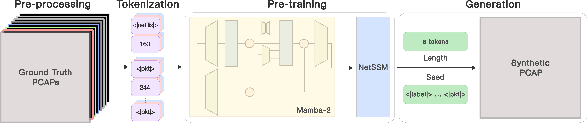
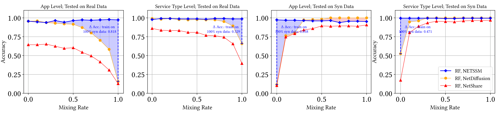
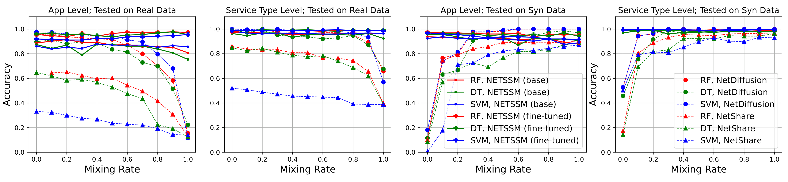
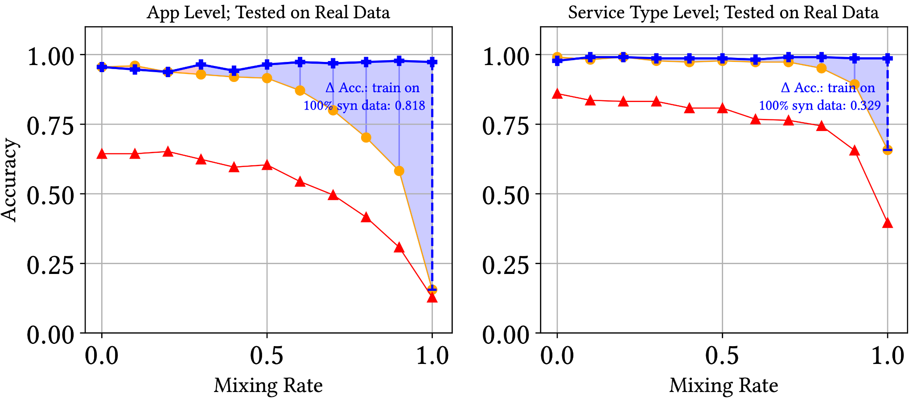
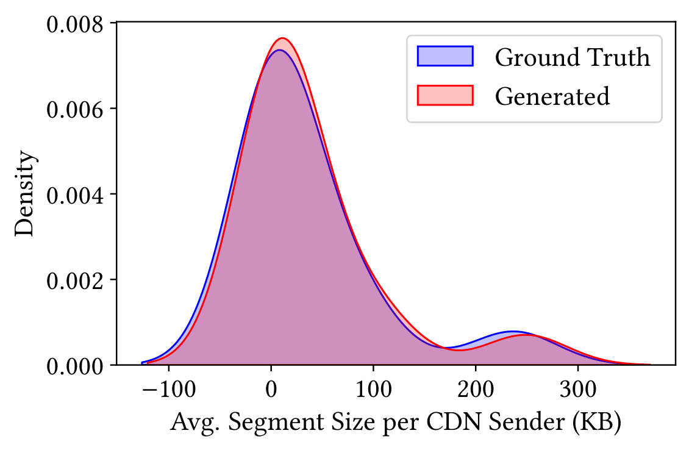

# NetSSM: Multi-Flow and State-Aware Network Trace Generation using State-Space Models

Andrew Chu, Xi Jiang, Shinan Liu, Arjun Bhagoji, Francesco Bronzino, Paul Schmitt, **Nick Feamster**

University of Chicago

---

## The Challenge: Network Data Scarcity

**Why do we need synthetic network data?**

- **Security analysis**, traffic modeling, and performance evaluation require representative, scalable network data
- **Reality**: Acquiring large-scale, high-fidelity network data is difficult
  - Data governance rules and legal restrictions
  - High collection costs
  - Privacy concerns

**Solution**: Generate synthetic network data that accurately replicates real networks

---

## Limitations of Current Approaches

**Traffic attribute generators** (e.g., NetShare)
- Output flow statistics, packet headers, metadata
- Cannot reason about raw contents of stateful protocols (TCP)
- Require retraining for new targets

**Raw packet generators** (e.g., NetDiffusion)
- Limited trace length for training and generation
- May not capture meaningful communication beyond initial setup
- **Critical gap**: Neither can reliably produce multi-flow sessions

---

## NetSSM: Bridging the Gap

**Built on state-space models (Mamba architecture)**

- Combines length-scaling capabilities with packet-level detail
- Captures inter- and intra-packet dependencies across protocols
- Sequential, stateful learning enables multi-flow generation

**Key advantage**: Learns and generates substantially longer traces than transformer-based approaches

---

## Background: What is a State Space Model?

**Intuition**: A compressed memory that summarizes everything seen so far

Think of it like a **running summary**:
- As each token arrives, update a fixed-size "state" vector
- The state captures what's important from the past
- Output depends only on this compressed state

**Analogy**: Reading a book and keeping mental notes
- You don't remember every word (that would be O(L²) like attention)
- You maintain a summary that evolves as you read

---

## Background: SSMs vs Transformers

**Transformer attention**: "Look back at everything"
- Every token attends to every previous token
- Perfect memory, but cost grows quadratically: O(L²)
- 10× longer sequence = 100× more computation

**State Space Model**: "Compress as you go"
- Fixed-size state updated at each step: O(L)
- 10× longer sequence = 10× more computation
- Can handle sequences of 100K+ tokens

---

## Background: The Selectivity Problem

**Traditional SSMs have a fatal flaw**: They treat all inputs the same

**Example**: Copy the marked tokens
- Input: `a b [c] d e [f] g h`
- Expected: `c f`

**The problem**: Old SSMs use fixed rules for what to remember/forget
- Can't decide "this token matters" based on content
- Like a camera with fixed focus—can't adapt to the scene

---

## Background: Mamba's Key Insight

**Solution**: Let the input control what gets remembered

**Selective State Spaces**:
- "How much to remember" depends on **what** we're seeing
- Each token influences how the state gets updated
- Model learns when to **store**, **ignore**, or **retrieve**

**Analogy**: Smart note-taking
- See an important fact → write it down (update state heavily)
- See filler words → skim past (minimal state change)
- Need to recall → state provides the answer

---

## Background: Why Mamba for Network Traffic?

| Challenge | Why Mamba Helps |
|-----------|-----------------|
| Long sessions | Linear scaling handles 100K+ tokens |
| Protocol state | Recurrent structure tracks TCP state naturally |
| Multi-flow | Selective memory distinguishes between flows |
| Efficiency | 5× faster than transformers, less memory |

**Perfect fit**: Network traffic is inherently sequential and stateful

---

## Innovation 1: Multi-Flow Sessions

**First generator to reliably produce multi-flow sessions**

- Real-world traffic involves interleaved, multi-flow communication
  - Distributed systems
  - IoT devices
  - Video streaming (CDN setup + segment downloads)

- NetSSM's recurrent structure captures flow interactions
- Replicates behavior of standalone and interleaved flows with high fidelity

**Previously unexplored or unreliable in prior generators**

---

## Innovation 2: Capturing Flow-State-Dependent Events

**Unprecedented context and generation length**

- **8× longer** training context than transformer-based generators
- **78× longer** trace generation than existing methods
- Context window: 100,000 tokens (~943 packets)

**Why this matters**:
- Captures events occurring later in sessions
- Depends on early connection setup
- Models multiple interactions between flows/packets
- Essential for realistic multi-step protocols

---

## NetSSM Architecture

**Three-stage pipeline**: Pre-processing → Training → Generation

---

## Method: Token-Based Sequence Generation

**Preprocessing**
- Custom tokenizer: one-to-one mapping of raw bytes to token IDs [0, 255]
- Special tokens for labels (`<|netflix|>`, `<|facebook|>`) and packet boundaries (`<|pkt|>`)
- Processes raw PCAP data at packet-level granularity

**Training**
- Unsupervised sequence generation with cross-entropy loss
- Batch size of 1, maximum 100,000 token sequences
- Learns semantics of packets, flows, and sessions

---

## Evaluation Framework

**Three-dimensional assessment**:

1. **Statistical Similarity**: Byte-wise matching to ground truth
2. **Downstream ML Utility**: Performance of models trained on synthetic data
3. **Semantic Similarity**: NEW metric
   - Protocol adherence (TCP compliance)
   - Application-specific behavioral patterns
   - Functional and application-oriented perspective

---

## Results: Statistical Similarity

**Dataset**: 10 applications across video streaming, conferencing, and social media

**NetSSM outperforms state-of-the-art**:
- Jensen-Shannon Divergence: **0.02** (NetSSM) vs. 0.16 (NetShare) vs. 0.04 (NetDiffusion)
- 8× better than traffic attribute generators
- 2× better than raw packet generators

**High fidelity at content level across all tested applications**

---

## Results: Downstream ML Performance

**Random forest classifier trained entirely on synthetic data**:
- NetSSM: **0.97 accuracy** on held-out ground truth
- NetDiffusion: 0.16 accuracy
- NetShare: 0.13 accuracy

---

## Results: Detailed Comparison

**NetSSM demonstrates superior performance across multiple metrics and applications**

---

## Results: Synthetic Data Mixing Rate

**Training with varying ratios of synthetic to real data**:
- NetSSM maintains **~0.97 accuracy** even when trained on 100% synthetic data
- NetDiffusion and NetShare degrade significantly as synthetic ratio increases
- Demonstrates NetSSM's synthetic data is a viable substitute for real data

---

## Results: Statistical Distributions

**NetSSM accurately captures packet size distributions matching real traffic patterns**

---

## Results: Semantic Similarity - TCP Compliance

**NetSSM generates protocol-adherent traffic**

**Robust session-level compliance**:
- Correct stateful behavior (handshakes, sequence progression)
- Advanced TCP options
- Captures real-world anomalies (partial teardowns, conflicting flags)

**Validation**: Generated traces pass TCP protocol validators

---

## Results: Application-Specific Patterns

**Complex multi-flow traffic replication**

**Example: Video streaming sessions**
- CDN endpoint setup phase
- Video segment download phase
- Interleaved control and data flows

**NetSSM faithfully replicates**:
- Multi-step protocol interactions
- Application-specific traffic characteristics
- Timing and sequencing patterns

---

## Impact and Applications

**Immediate applications**:
- **Security research**: Training intrusion detection systems without sensitive data
- **Performance evaluation**: Testing network systems at scale
- **Traffic modeling**: Understanding network behavior patterns
- **Protocol development**: Validating new protocols

**Key benefit**: Enables research and testing without privacy/governance concerns

---

## Comparison to Prior Work

| Method | Type | Multi-Flow | Max Context | Max Generation |
|--------|------|------------|-------------|----------------|
| NetShare | Attributes | No | N/A | N/A |
| NetDiffusion | Raw packets | No | ~12K tokens | ~1.3K tokens |
| **NetSSM** | **Raw packets** | **Yes** | **100K tokens** | **~100K tokens** |

**NetSSM is the only method capable of generating multi-flow PCAP sessions**

---

## Key Takeaways

**NetSSM advances synthetic network data generation in three ways**:

1. **First reliable multi-flow session generator** - addresses critical gap for real-world scenarios
2. **Superior statistical and ML performance** - outperforms all existing methods
3. **Protocol-adherent and behaviorally accurate** - introduces semantic similarity evaluation

**Result**: Synthetic data that is both statistically similar and functionally useful

---

## Future Directions

**Research opportunities**:
- Extending to UDP and other protocols
- Incorporating payload generation for encrypted traffic patterns
- Adaptive generation for specific network conditions
- Integration with network simulation frameworks

**Broader impact**:
- Standardizing semantic similarity metrics
- Building synthetic datasets for ML-for-networking benchmarks
- Enabling privacy-preserving network research

---

## Summary

**NetSSM**: State-space model approach to network trace generation

**Innovations**:
- Multi-flow session generation (first of its kind)
- 8× longer training, 78× longer generation
- Semantic similarity evaluation framework

**Results**: Outperforms all prior methods in statistical, ML, and semantic metrics

**Open questions welcome**

