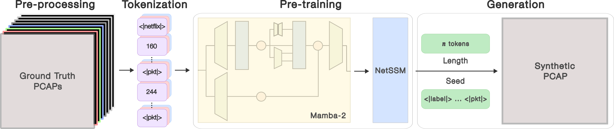
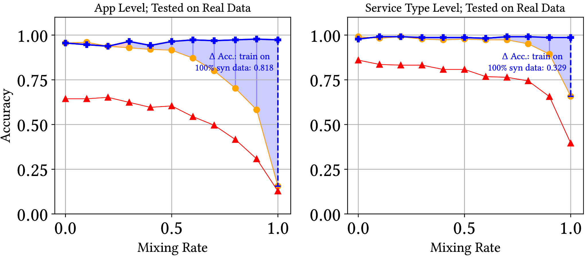
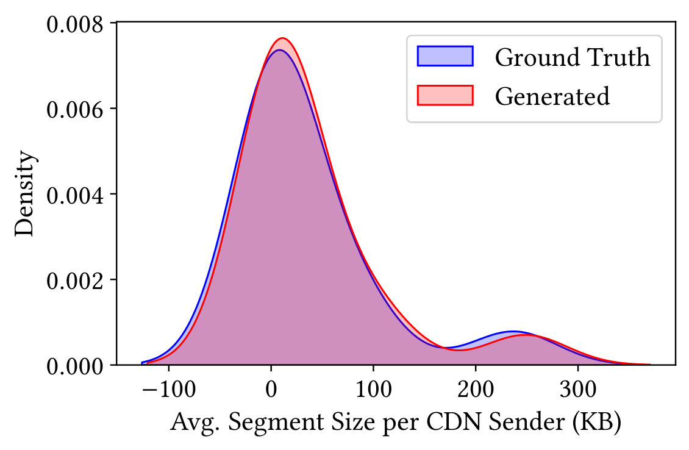

# The Data Scarcity Problem {.center}

> Network ML needs data — but data is hard to get.

::: {.notes}
Open by connecting to the data acquisition lecture (Lecture 5). Ask: if you wanted to train
an intrusion detection system on real attack traffic, what would stop you? Lead them to:
privacy law (GDPR/CCPA), governance policies, collection cost, and rarity of labeled attack events.
This motivates the entire generative-models thread. See the Generative Models chapter.
:::

## Why Synthetic Network Data?

**Labeled network data is scarce** :cite:`sommer2010outside`

::: {.columns}
::: {.column width="50%"}
**Why real data is hard to acquire**

- **Privacy laws** (GDPR, CCPA) restrict sharing
- Data governance and legal restrictions
- High collection cost
- Rare events (attacks, failures) are under-represented
:::
::: {.column width="50%"}
**What synthetic data enables**

- **Traffic augmentation** for minority classes
- **Simulation and testing** without production access
- **Privacy-preserving sharing** between organizations
- **What-if analysis** for scenarios not yet observed
:::
:::

::: {.notes}
The book's Generative Models chapter opens with exactly these four motivations. Hold students
to the vocabulary: augmentation, simulation, privacy-preserving sharing, what-if analysis.
Ask: which of these is most pressing for a university research lab vs. a carrier?
:::

## The Generative Model Landscape

Three architectures — each with a different strength/weakness tradeoff:

| Architecture | Representative System | Strength | Key Weakness |
|---|---|---|---|
| **GAN / flow stats** | NetShare | Fast, flow-level | No packet-level detail |
| **Diffusion model** | NetDiffusion | High-fidelity packets | Short sequences only |
| **State-space model** | **NetSSM** | Long, stateful traces | Newer, less explored |

**Progression**: GANs → Diffusion → SSMs, each addressing the prior's limitations.

::: {.notes}
This table is the spine of the whole chapter. GANs (DoppelGANger, NetShare) gave flow-level
stats; diffusion (NetDiffusion) added packet fidelity but capped at ~1K packets; SSMs
(NetSSM) get both length and fidelity. The chapter in the book covers all three in order —
this deck focuses on the third column. See the Generative Models chapter, "Background"
section.
:::

# Background: From Transformers to State-Space Models {.center}

::: {.notes}
Transition: before diving into NetSSM, we need the SSM intuition. Most students know
transformers from the deep-learning lecture (Lecture 13). This section is "why not
just use a transformer?"
:::

## Transformers: Review and Scaling Problem

**Self-attention**: every token attends to every other token

- **Computational cost**: O(n²) in sequence length
- 1 K tokens → 1 M comparisons; 100 K tokens → 10 B comparisons
- Memory also grows quadratically

**Network traffic problem**: even a few seconds of a TCP session can span
thousands of packets; a full session can easily exceed 100 K tokens.

::: {.callout-note}
Transformers are powerful — GPT-4, Claude, Gemini all use them — but their
quadratic cost makes them impractical for generating long network traces.
:::

::: {.notes}
Reference the Transformer Architecture section of the Generative Models chapter. The book
notes that "even a few seconds of communication between hosts can generate hundreds or
thousands of packets." Prompt class: at what sequence length does O(n²) become the
bottleneck on a modern GPU? (Roughly 10–50 K tokens, depending on hardware.)
:::

## State Space Models: The Intuition

**Core idea**: maintain a compact **state vector** that summarizes everything seen so far

::: {.columns}
::: {.column width="55%"}
**How it works**

1. Each input token updates a **fixed-size state** $h_t$
2. Output is generated from $h_t$, not from the full history
3. Cost is **O(n)** — linear in sequence length

**Analogy**: reading a book and keeping mental notes — you don't memorize
every word verbatim; you maintain a running summary.
:::
::: {.column width="45%"}
| Property | Transformer | SSM |
|---|---|---|
| Memory | Full history | Compressed state |
| Complexity | O(n²) | O(n) |
| 10× longer seq. | 100× compute | 10× compute |
| Max length | ~100 K | 100 K+ |
:::
:::

::: {.notes}
The book's State Space Models section uses the same compressed-state framing. Draw the
state-update box on the board: input token → update function → new state → output.
Compare to RNNs: SSMs are more principled and can be parallelized during training via
a convolution view.
:::

## Mamba: Selective State Spaces

**Problem with classical SSMs**: fixed update rules treat all inputs equally — cannot
decide "this token matters" based on content.

**Mamba's key insight** (Gu & Dao, 2024): make the state-update parameters **input-dependent**

::: {.columns}
::: {.column width="50%"}
**Classical SSM**

- Same $A$, $B$, $C$ matrices for every input
- Can't selectively remember or forget
- Like a camera with fixed focus
:::
::: {.column width="50%"}
**Mamba (selective SSM)**

- $A$, $B$, $C$ computed from the current input token
- Model learns *when* to store, skip, or retrieve
- Hardware-aware parallel scan keeps cost O(n)
:::
:::

**Result**: content-aware memory with linear scaling.

::: {.notes}
The selective copy task is a good intuition pump: given input "a b [c] d e [f] g h" where
brackets mark important tokens, classical SSMs fail to copy only the marked tokens because
they use fixed rules. Mamba succeeds because its update gates are input-dependent.
Reference: Gu & Dao, "Mamba: Linear-Time Sequence Modeling with Selective State Spaces,"
arXiv 2312.00752. See the book's SSM section.
:::

## Why SSMs Fit Network Traffic

::: {.columns}
::: {.column width="50%"}
**Network traffic is inherently**:

- **Sequential** — packets arrive in order
- **Stateful** — TCP maintains SYN/ESTABLISHED/FIN state machine
- **Long** — sessions span thousands to millions of packets
- **Multi-flow** — sessions interleave multiple flows
:::
::: {.column width="50%"}
**Mamba addresses each challenge**:

| Challenge | Why Mamba Helps |
|---|---|
| Long sessions | Linear O(n) scaling |
| Protocol state | Recurrent state tracks TCP naturally |
| Multi-flow | Selective memory distinguishes flows |
| Efficiency | ~5× faster than transformers |
:::
:::

::: {.notes}
The book makes this mapping explicit: "A TCP connection progresses through well-defined
states (SYN_SENT, ESTABLISHED, FIN_WAIT...). An SSM generating a TCP flow can learn to
track this progression." The recurrent hidden state IS a learned protocol state machine.
Compare to diffusion models, which rely on spatial image patterns to implicitly encode
state — far less natural.
:::

# NetSSM: Design and Method {.center}

::: {.notes}
Now apply the SSM theory to the concrete system. Walk students through the three-stage
pipeline in the architecture figure.
:::

## NetSSM Overview

**Built on the Mamba-2 architecture** — applied to raw network packet bytes

**Three key innovations**:

1. **Multi-flow session generation** — first generator to reliably produce
   interleaved, multi-flow sessions
2. **Unprecedented context length** — 8× longer training context and 78× longer
   generation than transformer-based generators
3. **Semantic similarity evaluation** — a new metric for protocol adherence and
   application-specific behavior

::: {.notes}
The paper (Chu et al., Proc. ACM Networking, March 2025, arXiv:2503.22663) uses the term
"multi-flow" to distinguish session-level generation from single-flow generation. Emphasize
that prior work simply never addressed multi-flow; it was a gap, not a failed attempt.
:::

## The NetSSM Pipeline

::: {.notes}
Walk left to right: (1) PCAP files are tokenized byte-by-byte; (2) the Mamba model is
trained with a cross-entropy next-token objective; (3) at generation time, a label token
(<|netflix|>, etc.) seeds the model and it autoregressively produces raw bytes that are
reassembled into PCAP. No separate post-processing step needed for TCP compliance —
unlike NetDiffusion's ControlNet + dependency trees.
:::

## Tokenization and Training {.smaller}

::: {.columns}
::: {.column width="50%"}
**Tokenization**

- **One-to-one** byte → token ID mapping (0–255)
- Special tokens for application labels:
  `<|netflix|>`, `<|facebook|>`, …
- Special token for packet boundaries: `<|pkt|>`
- No hand-crafted feature engineering needed
:::
::: {.column width="50%"}
**Training**

- Objective: **next-token prediction** (cross-entropy)
- Unsupervised — no per-packet labels required
- Batch size 1, sequences up to **100,000 tokens**
- ~943 packets per training sequence
- Mamba-2 backbone with selective state spaces
:::
:::

**Key design choice**: treating raw bytes as tokens means the model must learn
protocol structure entirely from data — and it does.

::: {.notes}
Compare to NetDiffusion's tokenization: nPrint encodes packets as bit-level image rows.
NetSSM's approach is simpler and generalizes across protocols without redesigning the
representation. The 100,000-token context vs. ~12,000 for transformer-based generators
is the core scaling advantage. See the book's NetSSM section.
:::

# Evaluation {.center}

::: {.notes}
The evaluation framework is itself a contribution. Introduce the three-dimensional
assessment before showing results so students understand why each metric matters.
:::

## A Three-Dimensional Evaluation Framework

Prior work evaluated only **statistical similarity**. NetSSM adds two more dimensions:

1. **Statistical similarity** — does the byte-level distribution match real traffic?
   (Jensen-Shannon Divergence on packet-size distributions)

2. **Downstream ML utility** — can you train a classifier on synthetic data and
   deploy it on real data? (Random forest accuracy on held-out ground truth)

3. **Semantic similarity** *(new)* — does generated traffic obey protocol rules
   and reproduce application-level behavioral patterns?

::: {.notes}
Ask students: why isn't statistical similarity enough? (A model could perfectly reproduce
the marginal byte distribution while generating syntactically invalid TCP packets.)
Why isn't ML utility enough? (A classifier might achieve high accuracy for spurious
reasons unrelated to protocol fidelity.) Semantic similarity is the hardest to fake and
the most practically meaningful.
:::

## Results: Statistical and ML Performance

::: {.columns}
::: {.column width="50%"}
**Statistical similarity** (Jensen-Shannon Divergence — lower is better)

| Method | JSD |
|---|---|
| NetShare | 0.16 |
| NetDiffusion | 0.04 |
| **NetSSM** | **0.02** |

NetSSM is 8× better than NetShare, 2× better than NetDiffusion.
:::
::: {.column width="50%"}
**Downstream ML utility**

Random forest trained **entirely on synthetic data**, tested on real data:

| Method | Accuracy |
|---|---|
| NetShare | 0.13 |
| NetDiffusion | 0.16 |
| **NetSSM** | **0.97** |

97% accuracy using only synthetic training data.
:::
:::

::: {.notes}
The 0.97 accuracy result is the "money slide" — it directly answers the practitioner's
question: "can I use this synthetic data to train my IDS?" The comparison baseline (0.16
for NetDiffusion) shows that prior art, despite generating raw packets, was not actually
useful for training real classifiers. See the evaluation figures for application-level
breakdowns.
:::

## Results: ML Utility vs. Synthetic Data Mix Rate

**NetSSM maintains ~0.97 accuracy even at 100% synthetic training data.**

NetDiffusion and NetShare degrade significantly as the synthetic fraction increases —
their synthetic data actively degrades classifier performance.

::: {.notes}
The mixing-rate experiment directly addresses the "but can it fully replace real data?"
question. Students should notice the flat line for NetSSM vs. the steep drops for
competitors. The implication: an organization with no access to real traffic could train
a production-grade classifier using only NetSSM output.
:::

## Results: Packet Size Distributions

NetSSM accurately captures the full packet-size distribution — including the bi-modal
structure typical of mixed ACK + data packets.

::: {.notes}
KDE plots provide visual confirmation of statistical fidelity. Point out what the
distribution shape tells us about the traffic: the left peak is ACKs and small control
packets; the right peak is MTU-sized data packets. A model that only gets the mean right
would produce a single-mode distribution and fail this test.
:::

## Results: Semantic Similarity — TCP Compliance

**NetSSM generates protocol-adherent traffic without external correction**

- Correct TCP three-way handshake (SYN → SYN-ACK → ACK)
- Valid sequence number and acknowledgment number progression
- Advanced TCP options (timestamps, window scaling, SACK)
- Faithfully replicates real-world anomalies: partial teardowns,
  conflicting flags seen in the wild

**Generated traces pass standard TCP protocol validators.**

::: {.notes}
Contrast with NetDiffusion: NetDiffusion needed ControlNet + dependency trees as external
post-processing to fix protocol violations. NetSSM's protocol compliance emerges naturally
from the recurrent hidden state tracking the TCP state machine. This is the key argument
in the book's SSM section: "the generated packets are more likely to be consistent with
protocol semantics without requiring extensive post-processing."
:::

## Results: Multi-Flow Sessions

**NetSSM is the first generator to reliably produce multi-flow PCAP sessions.**

Example — video streaming session:

1. **CDN endpoint setup** flows (HTTP/HTTPS negotiation)
2. **Video segment download** flows (large data bursts)
3. Correct **interleaving** of control and data flows
4. Accurate timing and sequencing across flows

**Why it matters**: real-world traffic (web browsing, IoT, streaming) is always
multi-flow. Single-flow generators produce traces no network system would ever see.

::: {.notes}
Ask: what real-world systems would break if you only had single-flow synthetic traces?
IDS signatures that rely on cross-flow correlations; load balancers tested with realistic
session patterns; video streaming QoE models that require CDN setup + segment download
sequences. This is the gap that motivates NetSSM's main claim.
:::

# Comparison and Context {.center}

## Comparison to Prior Work {.smaller}

::: {.columns}
::: {.column width="60%"}
| Method | Type | Multi-Flow | Max Context | Max Generation |
|---|---|---|---|---|
| NetShare | Flow stats | No | N/A | N/A |
| NetDiffusion | Raw packets | No | ~12 K tokens | ~1.3 K tokens |
| **NetSSM** | **Raw packets** | **Yes** | **100 K tokens** | **~100 K tokens** |
:::
::: {.column width="40%"}
**Key gaps closed by NetSSM**:

- Multi-flow sessions: first of its kind
- 8× longer training context
- 78× longer trace generation
- No external post-processing for protocol compliance
:::
:::

::: {.notes}
The 78× longer generation is the headline number from the abstract. Emphasize what
78× means in practice: NetDiffusion generates ~1,300 tokens (~12 packets); NetSSM
generates ~100,000 tokens (~943 packets). An entire TCP session, not just the
handshake.
:::

## Privacy Caveat: Synthetic ≠ Automatically Private {.smaller}

::: {.vignette}
**March 2025 — arXiv:2511.20497, "Quantifying the Privacy Implications of High-Fidelity Synthetic Network Traffic":** as models like NetSSM produce increasingly realistic traces, researchers demonstrated that *membership inference attacks* can determine whether a specific user's flows were in the training data. The paper introduces network-specific privacy metrics covering identifier memorization, sensitive property leakage, and topology extraction. The takeaway: fidelity and privacy exist in tension — stronger privacy guarantees (e.g., differential privacy) degrade synthetic data quality.
:::

**The fidelity–diversity–privacy trilemma**: synthetic traffic must be

- *similar enough* to train real classifiers,
- *diverse enough* to add information beyond training data, and
- *private enough* not to leak individual flows.

Balancing all three remains an open research problem.

::: {.notes}
This vignette (arxiv 2511.20497) is directly cited in the book's Privacy-Preserving Models
section. It grounds the abstract trilemma in a concrete result. Cold-call: "If you were
deploying NetSSM to share data with a university partner, what would you do before
releasing the synthetic traces?" (Differential privacy training, membership inference
audit, redaction of rare/unique patterns.)
:::

## Limitations and Open Problems

::: {.columns}
::: {.column width="50%"}
**Current limitations**

- **Protocol coverage**: tested primarily on TCP; UDP and QUIC are future work
- **Encrypted payloads**: byte-level modeling may not generalize to TLS-encrypted
  sessions without adaptation
- **Training cost**: single-flow batch size limits throughput
- **Privacy**: no differential-privacy guarantee in the base model
:::
::: {.column width="50%"}
**Open research directions**

- Extending SSMs to UDP, QUIC, and application-layer protocols
- Hybrid architectures: SSM for long-range state + diffusion for local fidelity
- Foundation models for networking (NetFound)
- Standardizing semantic similarity benchmarks
- Privacy-utility tradeoff for network generative models
:::
:::

::: {.notes}
The book's Limitations section on diffusion models lists the same issues (sequence length,
protocol compliance, state modeling) and argues these motivate SSMs. Flip the logic:
what might motivate a *fourth* architecture that addresses SSM's remaining gaps?
Hybrid SSM+diffusion is one active direction. Foundation models (NetFound) are another.
:::

# Summary {.center}

## Key Takeaways

**Three contributions of NetSSM** (Chu et al., ACM Networking 2025):

1. **First reliable multi-flow session generator** — addresses the critical gap for
   real-world traffic scenarios (streaming, IoT, web)
2. **Superior performance** — 0.97 downstream accuracy vs. 0.16 for prior art;
   JSD of 0.02 vs. 0.04–0.16
3. **Semantic similarity evaluation** — new framework: statistical + ML utility +
   protocol adherence

**Broader lesson**: architecture choice matters for long, stateful sequences —
Mamba's linear scaling and selective state align naturally with network protocols.

::: {.notes}
Close by connecting back to the course arc: we've now seen GANs (flow stats), diffusion
(short raw packets), and SSMs (long, multi-flow, protocol-compliant). Each fixed a prior
gap but introduced new ones. The field is still moving fast — the trilemma (fidelity,
diversity, privacy) will drive research for years. Ask: which of the three evaluation
dimensions matters most for your intended application?
:::

## Discussion Questions

1. **Multi-flow necessity**: for which networking applications is single-flow synthetic
   data sufficient? For which is multi-flow generation essential?

2. **Architecture tradeoffs**: when would you choose NetDiffusion over NetSSM, or
   vice versa? What does each sacrifice?

3. **Privacy-utility tradeoff**: how would you audit a synthetic dataset before
   sharing it outside your organization? What properties would you test?

4. **Benchmark gap**: NetSSM introduces semantic similarity metrics. What other
   domain-specific metrics might be needed for, say, intrusion detection?

::: {.notes}
These questions are suitable for a breakout (5 min groups, 5 min debrief). Question 1
will surface who has thought about systems vs. ML applications. Question 3 connects to
the privacy vignette. Question 4 is open-ended and good for a cold-call on the last few
minutes of class.
:::
