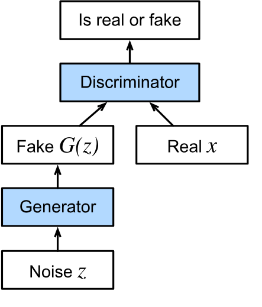
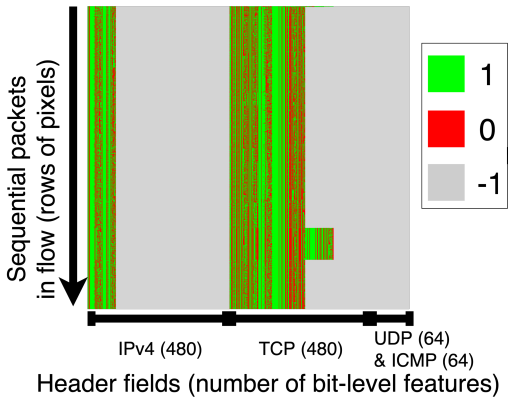
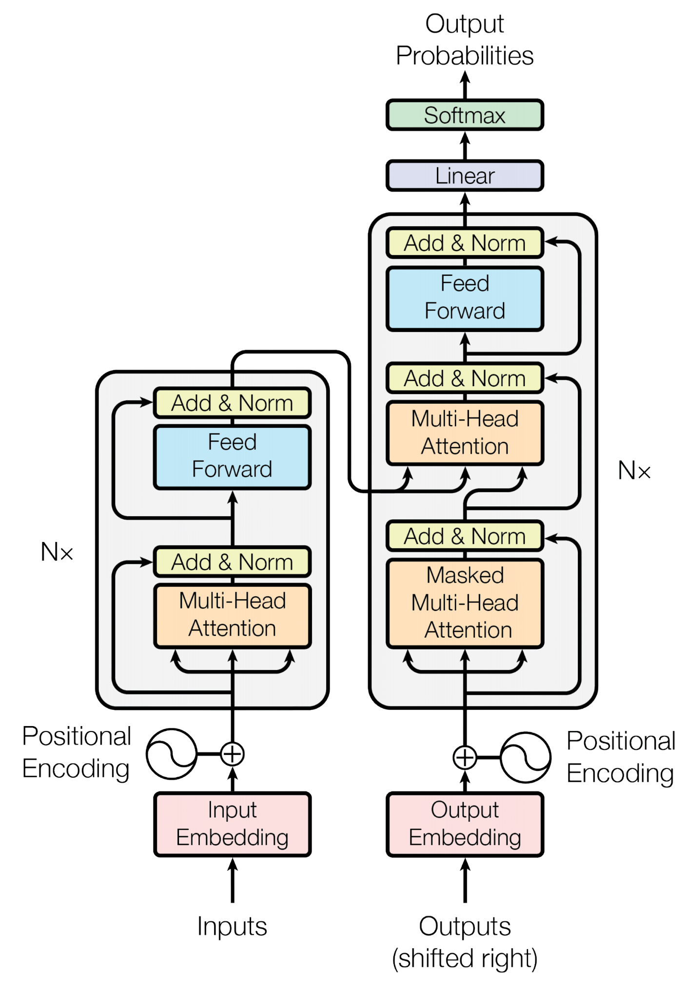
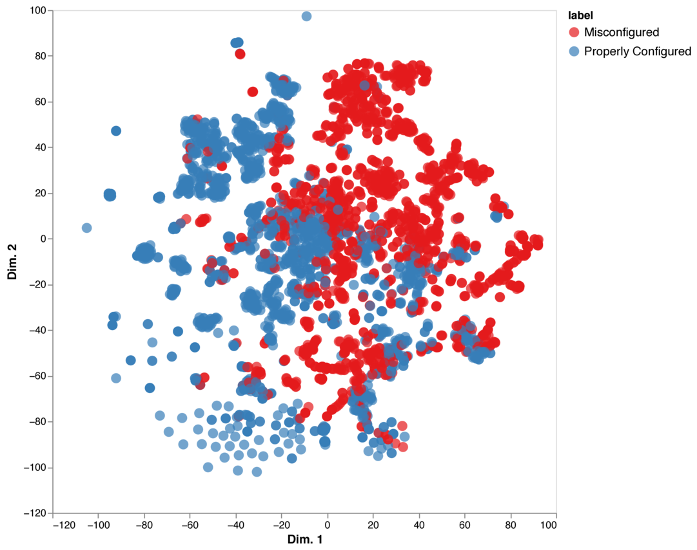

# Why Generate Network Data? {.center}

> Labeled network traces are scarce.
> Generative models let us *create* the data we need.

::: {.notes}
Open with the core motivation: everything downstream — classifiers, anomaly
detectors, protocol testers — depends on training data. Network data is
uniquely hard to obtain: it's sensitive, stateful, high-volume, and
non-tabular. Generative models close the gap. See Chapter 7 ("Generative
Models") in *Machine Learning for Networking*.
:::

## Why Network Data Is Scarce

::: {.columns}
::: {.column width="50%"}
**Collection barriers**

- Privacy and regulatory constraints limit sharing raw packet captures
- High-volume traces require expensive infrastructure
- Rare events (attacks, failures) are under-represented
- Labeled examples are especially hard to acquire
:::
::: {.column width="50%"}
**Downstream consequences**

- ML classifiers trained on thin data generalize poorly
- Minority-class accuracy (rare attacks) degrades first
- Network simulators lack realistic traffic diversity
- Privacy-preserving sharing of pcaps is nearly impossible
:::
:::

::: {.notes}
Sommer & Paxson (2010) famously argued that ML doesn't work well outside
the training distribution — and labeled network data is almost always
narrow in coverage. The scarcity problem is structural: operators don't
share pcaps, rare events are rare, and labeling flows at scale is
expensive. See *Machine Learning for Networking*, Chapter 7 introduction.
:::

## What Generative Models Offer

**Four practical benefits** (Chapter 7 framing):

| Use case | What the model does |
|---|---|
| **Traffic augmentation** | Create synthetic minority-class examples to re-balance training data |
| **Simulation and testing** | Feed network simulators / device test benches without live traffic |
| **Privacy-preserving sharing** | Publish statistical lookalikes instead of real pcaps |
| **What-if analysis** | Synthesize hypothetical scenarios (new attack vectors, protocol versions) |

::: {.notes}
Walk through each row with a concrete example. Augmentation: imagine you
have 50 examples of a DDoS attack pattern and 50,000 of normal traffic —
the classifier will ignore the minority class. Simulation/testing: firmware
teams need traffic to stress-test a new NIC driver. Privacy: a research
consortium wants to share ISP traces without leaking subscriber behavior.
What-if: generating TLS 1.3 traffic from a model trained on TLS 1.2. See
Chapter 7 intro of *Machine Learning for Networking*.
:::

# Architecture Landscape {.center}

> GANs → Diffusion Models → Transformers → State Space Models
> Each generation addressed the limits of the last.

::: {.notes}
Frame the chapter as an evolution story. Each architecture was motivated
by concrete failures of the previous one. This arc also mirrors the broader
deep-learning literature, so students can connect it to what they know.
See Chapter 7 of *Machine Learning for Networking* for the full arc.
:::

## Generative Adversarial Networks (GANs) {.smaller}

::: {.columns}
::: {.column width="55%"}
**Core idea** (Goodfellow et al., 2014):

- A **generator** $G(z)$ transforms random noise into synthetic data
- A **discriminator** $D(x)$ tries to tell real from fake
- Trained **adversarially**: generator tries to fool the discriminator;
  discriminator tries to catch it
- Training ends when neither can improve — Nash equilibrium

**Training objective:**

$$\min_G \max_D \; \mathbb{E}[\log D(x)] + \mathbb{E}[\log(1 - D(G(z)))]$$
:::
::: {.column width="45%"}

:::
:::

::: {.notes}
The GAN idea is elegant but training is famously tricky. Mode collapse
(the generator learns to produce only one type of output) and oscillation
(the two networks never converge) are the classic failure modes. Explain
the minimax objective: the discriminator maximizes the probability it
assigns to real data while minimizing the probability it assigns to fakes;
the generator minimizes the probability the discriminator is right. See
Chapter 7, "Early Approaches: Generative Adversarial Networks."
:::

## GANs for Network Traffic: DoppelGANger and NetShare

**Applied to networking:**

- **DoppelGANger** (Lin et al., 2020): generates time-series attributes of network flows
- **NetShare** (Zhang et al., 2022): generates NetFlow-style flow statistics
- Both preserve **aggregate statistical properties** of real traffic

::: {.columns}
::: {.column width="50%"}
**Strengths**

- Generative: introduces variation, not just replay
- High statistical resemblance to real flow records
- Useful for downstream ML training augmentation
:::
::: {.column width="50%"}
**Limitations**

- Generate only **flow-level statistics** (not raw pcaps)
- Suffer from **mode collapse** and training instability
- ML models trained on GAN data often underperform vs. real data
- Do not enforce protocol rules — generated records may be protocol-invalid
:::
:::

::: {.notes}
Concretely: NetShare generates a table of flow tuples (srcip, dstip,
srcport, dstport, proto, bytes, duration). This is useful for traffic
matrix estimation but useless for testing a DPI engine or protocol
analyzer. The accuracy gap: models trained only on NetShare-generated data
achieve markedly lower accuracy on real test sets compared to models
trained on real data. See Chapter 7, "Early Approaches: GANs" and
"NetDiffusion" sections.
:::

# Diffusion Models {.center}

> Instead of adversarial training, learn to **reverse noise**.

::: {.notes}
Transition: GANs are hard to train stably and produce only statistical
summaries for network data. Diffusion models offer a fundamentally
different approach that sidesteps mode collapse and produces much
higher-fidelity outputs. See Chapter 7, "Diffusion Models."
:::

## How Diffusion Models Work

::: {.columns}
::: {.column width="55%"}
**Forward process:** progressively add noise to training data until it
becomes pure Gaussian noise

**Reverse process:** train a neural network to denoise, step by step —
starting from pure noise and recovering the original structure

**Key advantages over GANs:**

- No adversarial training instability
- No mode collapse
- Supports **conditional generation** via text prompts or other context
:::
::: {.column width="45%"}
**Stable Diffusion** (Rombach et al., 2022):

- Runs diffusion in a **compressed latent space** (not raw pixels)
- Accepts text prompts to steer generation
- Pre-trained on billions of images → adaptable via fine-tuning
:::
:::

::: {.notes}
Ho et al. (2020) introduced DDPM (denoising diffusion probabilistic models).
The key insight: rather than pitting two networks against each other, train
a single network to denoise, which is a well-posed supervised problem.
Stable Diffusion adds two ideas: latent-space compression (fast) and text
conditioning (controllable). Both are central to how NetDiffusion works.
See Chapter 7, "Diffusion Models" and "How Diffusion Models Work."
:::

## NetDiffusion: Text-to-Traffic Synthesis {.smaller}

**Core idea:** represent a network flow as an **image**, then use a text-to-image
diffusion model to generate synthetic flows.

::: {.columns}
::: {.column width="55%"}
**Four-stage pipeline:**

1. **Traffic → image** via nPrint encoding:
   each packet is a row of pixels;
   bit fields map to green (1), red (0), gray (absent)
2. **Fine-tune** Stable Diffusion 1.5 with LoRA on traffic images +
   text prompts (e.g., "TCP Amazon traffic")
3. **Controlled generation** with ControlNet: edge detection on an example
   image enforces which protocol header fields are valid
4. **Image → pcap** with post-processing dependency trees to enforce
   intra-packet and inter-packet protocol rules
:::
::: {.column width="45%"}

:::
:::

::: {.notes}
Walk through each stage carefully. Stage 1: nPrint turns each packet header
into a fixed-size bit vector (480 bits for IPv4, 480 for TCP, 64 for UDP/ICMP).
Arranging packets as rows gives a 1024×1088 image for a 1024-packet flow.
Stage 2: LoRA (Low Rank Adaptation) updates only a small fraction of the
model's parameters — making fine-tuning tractable on modest hardware.
Stage 3: ControlNet does Canny edge detection on a real example; the edges
mask which pixel columns the generation should populate — this prevents the
model from "inventing" TCP bits in the UDP region. Stage 4: dependency
trees handle checksum fields, sequence numbers, IP addresses. See Chapter 7,
"NetDiffusion: Applying Diffusion to Network Traffic."
:::

## NetDiffusion Pipeline Overview

::: {.notes}
This is the full pipeline diagram from the NetDiffusion paper (Liu et al.,
2024, published in ACM SIGMETRICS / POMACS). The three rows correspond to
the three phases described on the previous slide. Point out the flow from
real pcaps (top-left) all the way to synthetic pcaps (bottom-right). The
post-generation heuristic is what allows the synthetic pcaps to open
cleanly in Wireshark and replay via TCPreplay. See Chapter 7, "NetDiffusion."
:::

## NetDiffusion: Protocol Compliance via Post-Processing

**Two classes of rules enforced by dependency trees:**

::: {.columns}
::: {.column width="50%"}
**Intra-packet rules** *(within one packet)*

- Checksum consistency with payload
- Valid field relationships (e.g., header length ≥ minimum)
- Mandatory flag combinations (e.g., SYN+FIN is invalid)
:::
::: {.column width="50%"}
**Inter-packet rules** *(across packets in a flow)*

- TCP three-way handshake ordering
- Sequence / acknowledgment number progression
- Source/destination IP and port consistency (majority vote)
:::
:::

**Goal:** minimal modifications to preserve the generative model's output while
ensuring compatibility with tools like Wireshark and TCPreplay.

::: {.notes}
The post-processing pass traverses the dependency tree bottom-up: fix
intra-packet issues first (so each packet is individually valid), then
enforce inter-packet constraints (so the flow is semantically coherent).
For fields that should be constant (like source IP) but vary due to
generation randomness, majority voting selects the dominant value. This is
a pragmatic engineering fix, not a principled one — it motivates the
shift to SSMs later. See Chapter 7, "Post-Processing with Dependency Trees."
:::

## NetDiffusion: Evaluation Results

::: {.columns}
::: {.column width="50%"}
**Statistical similarity** vs. NetShare (baseline GAN):

- **>70% improvement** across all generated fields
- **>30% improvement** on shared (common) fields

**ML accuracy** (train on synthetic, test on real):

- **>60% improvement** in traffic classification accuracy
- Class balancing: generating synthetic minority-class flows
  further improves accuracy for rare applications (Zoom, Facebook Meet)
:::
::: {.column width="50%"}

:::
:::

::: {.notes}
These numbers come from the ACM SIGMETRICS 2024 paper (Liu et al., 2024).
Evaluation uses 10 applications across 3 macro-service classes (video
streaming, video conferencing, social media). The train-on-synthetic /
test-on-real scenario is the hardest test: if synthetic data is truly
realistic, you should be able to learn from it without seeing any real
data. The class balancing result is perhaps the most practically important:
for underrepresented classes, adding NetDiffusion-generated samples
significantly boosts classification F1. See Chapter 7, "Evaluation and
Results."
:::

## Limitations of Diffusion Models for Networking

**Four structural challenges** (Chapter 7):

| Limitation | Why it matters for networking |
|---|---|
| **Sequence length cap** | Images limited to ~1024 packets; real flows span thousands |
| **External compliance** | Protocol rules enforced by post-processing, not the model itself |
| **No explicit state** | TCP state machines not modeled; complex state transitions are hard |
| **Fidelity vs. diversity** | Memorization vs. novelty trade-off; optimal balance is an open problem |

::: {.notes}
These limitations directly motivate the move to transformers and state
space models. The sequence length issue is acute: 1024 packets is a few
seconds for a busy flow. The lack of explicit state modeling means
NetDiffusion can produce individually-valid packets that are semantically
incoherent as a flow (e.g., DATA packets before the handshake). The
fidelity-diversity trade-off interacts with privacy: synthetic data must
be different enough to protect privacy yet similar enough to be useful.
See Chapter 7, "Limitations of Diffusion Models."
:::

# Transformers and LLMs {.center}

> Attention mechanisms capture contextual relationships —
> but scale **quadratically** with sequence length.

::: {.notes}
Transformers are the dominant architecture of the 2020s. Understanding
them is essential both for their direct networking applications (TLS
misconfiguration detection, protocol analysis) and because their
scalability limitations motivate state space models. See Chapter 7,
"Transformers and Large Language Models."
:::

## Embeddings: Words, Packets, and Flows

**The word vector idea** (word2vec, Mikolov et al., 2013):

- Each word is a point in a high-dimensional vector space
- Words with similar *meaning* are near each other: "cat" ≈ "lion"
- Simple arithmetic captures analogies: king − man + woman ≈ queen

**Extended to networking:**

- **nPrint**: each packet → fixed-size bit-level vector; preserve protocol structure
- **IP2Vec**: IP addresses → vectors; addresses in similar flow contexts are nearby
- **ET-BERT**: packet byte sequences as tokens; self-supervised pre-training on
  unlabeled encrypted traffic (Lin et al., 2022)

::: {.notes}
The analogy between words-in-sentences and packets-in-flows is powerful:
both are sequences of discrete tokens where meaning comes from context.
nPrint gives us a deterministic, protocol-aware tokenization. ET-BERT
then applies BERT pre-training to unlabeled traffic, learning contextual
embeddings that transfer to classification tasks. See Chapter 7, "Vectors
and Embeddings."
:::

## The Transformer Architecture

::: {.columns}
::: {.column width="55%"}
**Two core components:**

**Attention layer** — each token attends to all others:

$$\text{Attention}(Q, K, V) = \text{softmax}\!\left(\frac{QK^\top}{\sqrt{d_k}}\right)V$$

- Query $Q$: what am I looking for?
- Key $K$: what do I offer?
- Value $V$: what information do I carry?
- Multi-head: multiple attention heads learn different relationships

**Feed-forward layer** — processes concatenated attention output;
captures patterns from training.
:::
::: {.column width="45%"}

:::
:::

::: {.notes}
Vaswani et al. (2017), "Attention Is All You Need." Walk through the
encoder-decoder split: the encoder reads the input and builds
context-aware representations; the decoder generates output tokens
autoregressively. BERT uses encoder only (bidirectional context, good
for classification). GPT uses decoder only (unidirectional, good for
generation). For networking: in a TLS handshake, the query for the
ciphersuite token attends to the protocol version and certificate chain
tokens — exactly the relationships we want to detect misconfiguration.
See Chapter 7, "The Transformer Architecture."
:::

## BERT for TLS Misconfiguration Detection {.smaller}

**Problem:** TLS has 360 cipher suites, 44 elliptic curves, 40 extensions,
6 protocol versions — a combinatorially large, interacting configuration space.
Rule-based tools miss subtle interactions.

::: {.columns}
::: {.column width="55%"}
**Approach** (Chu et al., 2023):

1. **Pre-train BERT from scratch** on parsed TLS handshakes (tokenized
   as space-delimited strings): 5 GB, ~395 M words, 98.8% masked-LM accuracy
2. **Fine-tune** on Qualys SSL-graded sites:
   - Binary classification (misconfigured vs. properly configured)
   - Multi-label classification (certificate issue, weak cipher, etc.)

**Results:**
- Binary classification: **97.6% accuracy**, F1 = 97.6%
- Multi-label classification: **96.7% accuracy**, MCC = 0.953
:::
::: {.column width="45%"}

:::
:::

::: {.notes}
This is the TLS BERT work from the source extract (Slides 14–22). Key
insight: BERT's unsupervised pre-training on TLS handshake strings forces
the model to learn the semantic relationships between protocol fields —
e.g., that certain ciphersuites are incompatible with certain certificate
types. The t-SNE plot shows that fine-tuned embeddings cleanly separate
misconfigured from properly configured sites, and within misconfigured
sites, clusters correspond to distinct failure modes. See Chapter 7,
"Configuration Management with Transformers."
:::

## The Scaling Problem: O(n²) Attention

**Critical bottleneck** for applying transformers to network traffic:

$$\text{Attention cost} = O(n^2) \text{ operations for sequence length } n$$

::: {.columns}
::: {.column width="50%"}
**Why this hurts networking:**

- A few seconds of traffic → hundreds to thousands of packets
- A single TCP flow → tens of thousands of packets
- Multi-flow traces → millions of packets

| Sequence length | Attention operations |
|---|---|
| 1,000 packets | 10⁶ |
| 10,000 packets | 10⁸ |
| 100,000 packets | 10¹⁰ |
:::
::: {.column width="50%"}
**Also: no explicit state modeling**

Network protocols are **state machines**:
TCP transitions SYN_SENT → SYN_RECEIVED → ESTABLISHED → FIN_WAIT

Transformers learn state *implicitly* from spatial patterns.
This is brittle for long flows where state transitions
are widely separated in the sequence.

Context windows in modern LLMs now exceed 1M tokens, but the
**quadratic cost** means very long contexts remain expensive.
:::
:::

::: {.notes}
This is the key motivation for state space models (the subject of Deck 18).
Even with flash attention and other algorithmic improvements, the O(n²)
wall is real for networking-scale sequences. Compare: GPT-3 handled ~4K
tokens; current frontier models handle ~1M tokens, but that is still only
a few thousand packets for a busy flow. See Chapter 7, "The Scaling
Problem with Transformers."
:::

# State Space Models {.center}

> Maintain a **compact state** — no pairwise attention needed.

::: {.notes}
This section bridges to Deck 18 (NetSSM). SSMs are the motivation for
that full lecture; here we give just enough context to complete the
architecture survey. See Chapter 7, "State Space Models."
:::

## State Space Models and Mamba

**Core idea:** instead of O(n²) pairwise attention, maintain a
**hidden state** $h_t$ that summarizes all past inputs:

$$h_t = \mathbf{A} h_{t-1} + \mathbf{B} x_t \qquad y_t = \mathbf{C} h_t$$

::: {.columns}
::: {.column width="55%"}
**Mamba** (Gu & Dao, 2024):

- Makes the state-update matrices $\mathbf{A}, \mathbf{B}, \mathbf{C}$
  **input-dependent** — selective retention vs. forgetting
- Hardware-aware parallel scan: efficient on GPU
- **O(n) complexity** — scales linearly with sequence length

**Why this fits networking:**

- TCP, UDP, QUIC are state machines → SSM hidden state mirrors protocol state
- Long flows (thousands of packets) are tractable
:::
::: {.column width="45%"}
**Comparison**

| Property | Transformer | SSM (Mamba) |
|---|---|---|
| Complexity | O(n²) | O(n) |
| State | Implicit | Explicit |
| Long traces | Expensive | Efficient |
| Protocol compliance | External | Natural |
:::
:::

::: {.notes}
The SSM equations look like a discrete linear dynamical system. Mamba's
key innovation: A, B, C are functions of the current input x_t, not fixed
matrices. This lets the model selectively discard irrelevant packets
(e.g., background traffic from another flow) and retain relevant ones
(e.g., the SYN that initiated this connection). See Chapter 7, "State
Space Models" and "How State Space Models Work."
:::

## NetSSM: State-Aware Traffic Generation

**NetSSM** (Chu et al., 2025, *ACM Proceedings on Networking*) applies
Mamba to raw packet-level network trace generation.

::: {.columns}
::: {.column width="55%"}
**Key advances over NetDiffusion:**

- **Multi-flow sessions** — generates interleaved flows from a session,
  capturing inter-flow dependencies unexplored by prior work
- **8× and 78× longer traces** than prior transformer-based approaches
- No image representation needed — processes packets natively as sequences
- Protocol state machines modeled in the hidden state — fewer external
  heuristics needed for compliance

**Results:**

- Outperforms prior approaches on statistical similarity benchmarks
- High semantic similarity to real data on protocol-compliance metrics
:::
::: {.column width="45%"}
**Architecture comparison:**

| Model | Data format | Length | State |
|---|---|---|---|
| NetShare | Flow stats | Unlimited | None |
| NetDiffusion | Image | ~1024 pkts | External |
| NetSSM | Raw packets | 8–78× longer | Implicit SSM |
:::
:::

::: {.notes}
NetSSM is the subject of Deck 18 — this slide is deliberately brief to
avoid duplication. The key point here is that SSMs complete the
architectural evolution story: GANs → Diffusion → Transformers → SSMs,
each addressing the previous generation's most acute limitation. See
Chapter 7, "NetSSM: State Space Models for Network Traffic."
:::

# Broader Applications {.center}

> Beyond traffic generation: LLMs and foundation models
> are reshaping how we *manage* networks.

::: {.notes}
The chapter ends with applications that go beyond synthetic data
generation. These are relevant to current industry deployment and frame
where the field is heading. See Chapter 7, "Applications and Future
Directions."
:::

## NetLLM: Adapting LLMs to Networking Tasks

**NetLLM** (Wu et al., 2024) — rather than train from scratch, fine-tune
existing LLMs for three networking tasks:

::: {.columns}
::: {.column width="55%"}
**Tasks addressed:**

- **Viewport prediction** for 360° video streaming
- **Adaptive bitrate (ABR) selection** — choose video quality given bandwidth
- **Cluster job scheduling** — allocate compute/network resources

**Approach:**

1. Multimodal encoder converts networking time-series to LLM-readable tokens
2. Fine-tune the LLM to output task-specific decisions

**Results:** significantly outperforms task-specific algorithms; strong
generalization to new network environments.
:::
::: {.column width="45%"}
**Key insight:**

LLMs trained on text have learned **general reasoning patterns** that
transfer to sequential decision-making in networking.

The engineering challenge is the **multimodal gap**: network data is
time-series, not text — the encoder bridge makes it work.
:::
:::

::: {.notes}
NetLLM is an important existence proof that you don't have to train a
foundation model from scratch to get benefit from LLMs in networking.
The generalization result is surprising: fine-tuning on one network
environment and testing on a different one still outperforms algorithms
hand-crafted for that environment. This suggests the LLM's general
reasoning is doing real work, not just memorizing the training environment.
See Chapter 7, "Adapting LLMs for Networking Tasks."
:::

## Privacy in Synthetic Data: The Privacy-Utility Trade-off {.smaller}

**Synthetic data is not automatically private.**

::: {.columns}
::: {.column width="55%"}
**Membership inference attacks:**
An adversary with access to synthetic traffic may be able to determine
whether a specific user's flows were in the training set — by exploiting
statistical differences in how the model treats training vs. unseen data.

**Differential privacy:**
Adds calibrated noise during training so no single training example
significantly influences model outputs (Dwork et al., 2014).

**The fundamental tension:**

$$\text{Privacy} \uparrow \implies \text{Noise} \uparrow \implies \text{Data Quality} \downarrow$$

Stronger privacy guarantees degrade statistical fidelity; weaker guarantees
risk leaking real user behavior.
:::
::: {.column width="45%"}
**Three competing requirements:**

1. **Similar enough** to real traffic → useful for downstream ML
2. **Different enough** from real traffic → protects individual privacy
3. **Diverse enough** → provides new information beyond training data

All three must hold simultaneously.
Balancing them for protocol-constrained, temporally-dependent network
data remains an **open problem**.
:::
:::

::: {.notes}
This is a critical caveat to the entire chapter. Students sometimes
assume that synthetic data automatically solves the privacy problem —
that assumption is wrong. Membership inference attacks (Shokri et al.,
2017) apply directly to generative models. Differential privacy is the
principled solution, but the noise required to achieve strong guarantees
(epsilon < 1) degrades data quality substantially. For network data,
the temporal dependencies make DP even harder to apply correctly. See
Chapter 7, "Privacy-Preserving Models."
:::

## Current Events: NetSSM in 2025 {.smaller}

::: {.vignette}
**March 2025 — NetSSM published in ACM Proceedings on Networking**

Chu et al. published "NetSSM: Multi-Flow and State-Aware Network Trace
Generation using State-Space Models" (arXiv:2503.22663, March 28 2025;
DOI: 10.1145/3786289). NetSSM generates raw packet-level traces using the
Mamba SSM architecture, producing traces **8× to 78× longer** than prior
transformer-based approaches while maintaining higher statistical fidelity
and protocol compliance than GAN or diffusion baselines. The paper is the
first to explicitly model **multi-flow session** structure — capturing how
concurrent flows in a session interact. This closes the most significant
remaining gap identified in the NetDiffusion evaluation: sequence length
and stateful modeling.
:::

**Thought question:** NetSSM handles longer traces without quadratic cost.
What *other* limitation from the diffusion model list does it still share?

::: {.notes}
Cold-call: the fidelity-diversity trade-off and the privacy-utility
trade-off are not solved by the SSM architecture — they are data-level
challenges independent of the generator's architecture. Also: SSMs may
be less effective at capturing fine-grained local spatial patterns that
diffusion models handle well via the image representation. The best
architecture depends on whether long-range temporal coherence or
fine-grained structural fidelity matters more for a given application.
Update this vignette if a NetSSM follow-on or a competing approach
publishes stronger results.
:::

## Architecture Summary and Tradeoffs {.smaller}

| Architecture | Exemplar | Format | Seq. Length | Protocol State | Strengths | Limitations |
|---|---|---|---|---|---|---|
| **GAN** | NetShare | Flow stats | Unlimited | None | Simple, fast | Low fidelity, mode collapse |
| **Diffusion** | NetDiffusion | Image (pcap) | ~1024 pkts | External heuristics | High fidelity, uses pretrained SD | Short sequences, no state |
| **Transformer** | ET-BERT | Token sequences | O(n²) cost | Implicit | Strong context modeling | Quadratic scaling, brittle state |
| **SSM** | NetSSM | Raw packets | O(n), very long | Implicit (selective) | Efficient, long traces, protocol-aware | Less spatial fidelity than diffusion |

::: {.notes}
This table is the take-home summary for the chapter. Emphasize that there
is no universally best architecture: the right choice depends on whether
the application needs packet-level detail (use diffusion or SSM), long
trace lengths (use SSM), contextual protocol analysis (use transformer),
or just flow statistics (GAN is sufficient). The field is moving toward
hybrid approaches. See Chapter 7, "Summary."
:::

## Open Challenges and Future Directions

::: {.columns}
::: {.column width="50%"}
**Technical open problems**

- **Context transfer:** can a model trained on VPN-encrypted Netflix traffic
  generalize to VPN-encrypted YouTube without retraining?
- **Foundation model for networking:** a "Stable Diffusion for packets" —
  pre-trained on diverse traffic, fine-tuned for any task (NetFound, Guthula et al., 2023)
- **Longer sequences:** even SSMs struggle beyond ~10,000 packets for complex sessions
- **Protocol compliance without post-processing:** integrate rules into the generator
:::
::: {.column width="50%"}
**Deployment challenges**

- **Evaluation gap:** statistical similarity metrics don't always predict
  downstream ML performance
- **Privacy-utility trade-off** remains unsolved at scale
- **Adversarial robustness:** can synthetic-data-trained classifiers be fooled
  by adversarially crafted real traffic?
- **Generalization:** models trained on one network may not generalize to
  another with different traffic mixes
:::
:::

::: {.notes}
Close the lecture by returning to the open problems in Chapter 7. The
context transfer question is the most interesting for networking: it is
analogous to zero-shot or few-shot learning in NLP — can we generate
traffic for a scenario we've never seen, by combining components we have
seen? The foundation model question (NetFound) mirrors the development of
GPT and BERT: a single large model for all networking tasks. Whether
network data has the right properties for this is still an open question.
See Chapter 7, "Applications and Future Directions."
:::

# Summary {.center}

> Generative models close the labeled-data gap —
> but the right architecture depends on the task.

::: {.notes}
Closing frame: bring it back to the opening question (why do we need to
generate data?) and map each architecture to the use cases it serves best.
Leave students with the three-way trade-off: fidelity, diversity, privacy.
All three chapters of this arc (GANs, Diffusion, Transformers/SSMs) will
appear on the final exam.
:::
