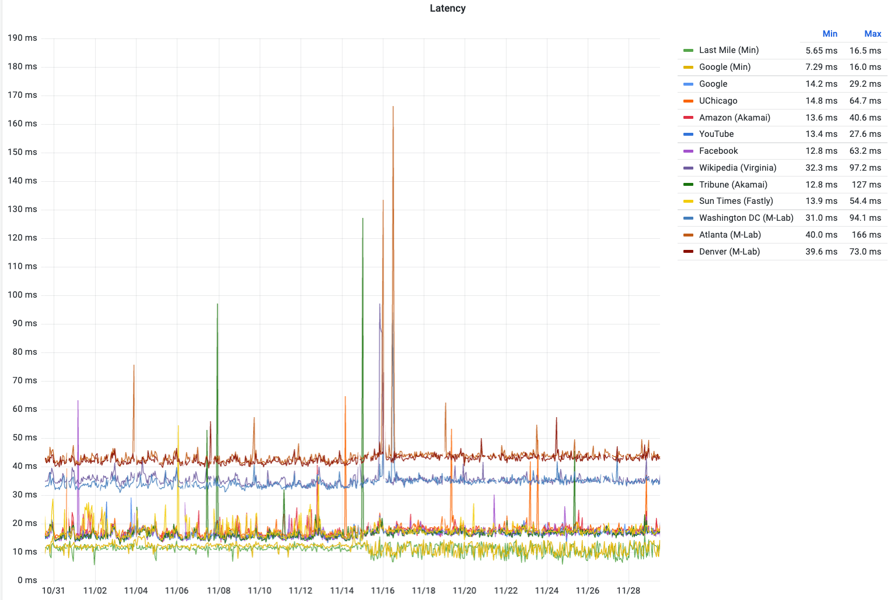
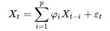
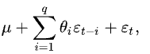
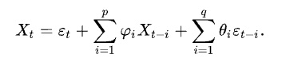

# Why Time Matters in Networks {.center}

> Network data is not just a collection of measurements — it is a **sequence** in time. The order of observations carries as much information as the observations themselves.

::: {.notes}
Open by asking students: "What makes network data different from, say, a static snapshot of a database?" The answer is temporality. Traffic volumes, latency, packet inter-arrival times, and error rates all evolve. The story of an attack is told by the *sequence* of events, not any single event. See the Recurrent Neural Networks section of Chapter 5 (Supervised Learning) in "Machine Learning for Networking."
:::

## Time-Series Data in Networking

::: {.columns}
::: {.column width="50%"}
**What we measure over time**

- Link utilization and throughput
- Round-trip latency (per destination)
- Packet loss rate
- DNS query rates
- BGP update counts
- Number of active flows
:::
::: {.column width="50%"}
**Why forecasting and anomaly detection matter**

- **Capacity planning**: Will a link saturate in the next hour?
- **Fault detection**: Is that latency spike an outlier or a trend?
- **Security**: Is that query-rate surge a DDoS ramp-up?
- **SLA monitoring**: How often do we breach thresholds?
:::
:::

::: {.notes}
The latency time series in `images/s02-i01.png` is a real-world example showing multiple destinations monitored simultaneously — this is the raw material for anomaly detection and forecasting. Draw attention to the spikes for "Last Mile (Att)" and "Wikipedia" — those are the kind of events we want to detect automatically.
:::

## Network Latency: A Real Time Series {.smaller}

::: {.notes}
Walk through what the audience sees: most series are stable (CDN nodes close to the monitoring point), but individual ISP and Wikipedia spikes are visible. Questions to ask: Is the spike a measurement artifact? A route change? A DDoS attack? The answer requires more than a single snapshot — it requires reasoning about the *history* of the series.
:::

## Properties of a Time Series

- **Trend**: long-run increase or decrease (e.g., steady traffic growth)
- **Seasonality**: regular, predictable cycles (daily, weekly, academic-year)
- **Residual / noise**: what remains after removing trend and seasonality
- **Stationarity**: statistical properties (mean, variance) constant over time

> Most classical models require **stationarity**. Many real network time series are *not* stationary out of the box.

::: {.notes}
Stationarity is the key prerequisite for ARMA/ARIMA. Use the campus-network example: a Monday-morning traffic surge is *seasonal* (weekly), while long-term growth in streaming video is a *trend*. Both must be accounted for before fitting a classical model. Cold-call: "If you see a time series whose mean is clearly rising, is it stationary?"
:::

## Making a Series Stationary

::: {.columns}
::: {.column width="50%"}
**Differencing**

Replace $X_t$ with $X_t - X_{t-1}$.

- First-order difference removes a linear trend
- Second-order difference removes a quadratic trend
- The **d** parameter in ARIMA counts how many times you difference
:::
::: {.column width="50%"}
**Seasonal decomposition**

Decompose into:

$$X_t = T_t + S_t + R_t$$

- $T_t$: trend component
- $S_t$: seasonal component
- $R_t$: residual (stationary)

Model the residual; add trend/season back at prediction time.
:::
:::

::: {.notes}
Differencing is the "I" in ARIMA. Seasonal decomposition is the diagnostic tool that precedes fitting a SARIMA model (the book's Seasonal ARIMA discussion). Emphasize: decomposing first reveals which components actually need to be modeled, preventing you from fitting a trend into the AR terms.
:::

# Classical Models: ARMA and ARIMA {.center}

## Autoregressive Models (AR)

An **AR(p)** model predicts the current value as a linear combination of the past $p$ values:

$$X_t = \sum_{i=1}^{p} \varphi_i X_{t-i} + \varepsilon_t$$

- $\varphi_i$: learned coefficients (how much each lag matters)
- $\varepsilon_t$: white noise at time $t$
- $p$: the **lag order** — how far back we look

::: {.notes}
The image shows the AR equation rendered cleanly. The intuition: tomorrow's traffic is mostly like today's (high $\varphi_1$) plus a little noise. Key assumption: the series is *stationary* and future values are a linear function of the past. Stress "implicitly assumes the future resembles the past" — a point worth questioning for bursty attack traffic.
:::

## Moving-Average Models (MA)

An **MA(q)** model predicts the current value as a linear combination of the past $q$ *error terms*:

$$X_t = \mu + \sum_{i=1}^{q} \theta_i \varepsilon_{t-i} + \varepsilon_t$$

- $\theta_i$: learned coefficients on past shocks
- $\varepsilon_{t-i}$: previous white-noise errors ("random shocks")
- $q$: the **moving-average order** — how many past shocks matter

::: {.notes}
MA models are about *shock propagation*. A sudden DDoS volley at time $t$ creates an error $\varepsilon_t$; an MA(q) model says that shock ripples through the next $q$ time steps. Contrast with AR: AR depends on past *values* (slow-moving trends), MA depends on past *errors* (sudden shocks). The two are complementary.
:::

## ARMA: Putting It Together

**ARMA(p, q)** combines both polynomials:

$$X_t = \varepsilon_t + \sum_{i=1}^{p} \varphi_i X_{t-i} + \sum_{i=1}^{q} \theta_i \varepsilon_{t-i}$$

| Component | Symbol | Captures |
|---|---|---|
| Autoregressive | $p$ | long-term trends via past values |
| Moving average | $q$ | short-term shocks via past errors |

::: {.notes}
Show the image: it is the full ARMA equation. Walk through: the first sum is the AR part (memory of past values), the second sum is the MA part (memory of past errors). Together they model both slow trends and sudden shocks. Requires stationarity — hence the extension to ARIMA.
:::

## ARIMA: Adding Integration (Differencing)

**ARIMA(p, d, q)** extends ARMA with $d$ rounds of differencing to enforce stationarity:

| Parameter | Meaning |
|---|---|
| **p** | lag order — how many past values enter the AR term |
| **d** | degree of differencing — how many times we subtract $X_{t-1}$ |
| **q** | moving-average order — how many past errors enter the MA term |

> Rule of thumb: start with $d=1$ (one difference), then check for stationarity. Most network time series need at most $d=1$ or $d=2$.

::: {.notes}
ARIMA(1,1,0) is a common starting point: one lag of differenced values, no MA terms. ARIMA(0,1,1) is also popular — it is equivalent to exponential smoothing. The textbook walk-through: pick $d$ by differencing until stationarity tests pass, then use ACF/PACF plots to choose $p$ and $q$.
:::

## Seasonal ARIMA (SARIMA)

Real network traffic has strong **seasonality** — daily peaks, weekly patterns, academic-year cycles:

- **AR**: captures long-term trends from past values
- **MA**: captures sudden shocks from past errors
- **I**: differencing to enforce stationarity
- **S (seasonal)**: an additional ARIMA structure at the seasonal period $m$

**Notation:** SARIMA$(p, d, q)(P, D, Q)_m$

> Fit the seasonal structure *separately* by first doing **seasonal decomposition** — decompose into trend + seasonality + residual, then model the residual.

::: {.notes}
The "S" stands for seasonal; the seasonal parameters $(P, D, Q)_m$ are a second ARIMA applied at lag $m$ (e.g., $m=96$ for 15-minute bins in a 24-hour day). The decomposition step is diagnostic: if the seasonal component is large relative to the residual, you need SARIMA rather than plain ARIMA. Source: the original SLIDE 7 speaker notes and the book's treatment of feature representations for time-series network data.
:::

## Fitting and Diagnosing ARIMA {.smaller}

::: {.columns}
::: {.column width="55%"}
**Choosing p and q: ACF and PACF plots**

- **ACF** (autocorrelation function): correlation between $X_t$ and $X_{t-k}$
  - Significant lags suggest MA order $q$
- **PACF** (partial autocorrelation): direct correlation at lag $k$ controlling for shorter lags
  - Significant lags suggest AR order $p$

**Information criteria for model selection**

- **AIC** / **BIC**: penalize model complexity; lower is better
- Grid-search over $(p, d, q)$ and pick lowest AIC/BIC
:::
::: {.column width="45%"}
**Stationarity tests**

- **ADF test** (Augmented Dickey-Fuller): null = unit root (non-stationary); want $p < 0.05$
- **KPSS test**: null = stationary; complements ADF

**Residual diagnostics**

- Residuals should look like **white noise** (zero mean, constant variance, no autocorrelation)
- Ljung-Box test for remaining autocorrelation in residuals
:::
:::

::: {.notes}
This is the practitioner workflow: difference until ADF says stationary; read ACF/PACF to get candidate $p$ and $q$; fit several models; pick lowest AIC; check residuals. In Python, `statsmodels.tsa` implements all of this. For network data, automated search (e.g., `pmdarima.auto_arima`) is practical at scale.
:::

# Deep Learning for Time Series {.center}

> Classical ARIMA captures linear structure. **Deep learning** extends to non-linear temporal dependencies and multi-variate series.

## Recurrent Neural Networks (RNNs)

**RNNs** were designed for sequences: process one timestep at a time, maintaining a hidden state:

- Hidden state $h_t$ encodes memory of all past inputs
- At each step: $h_t = f(W_h h_{t-1} + W_x x_t + b)$
- Output at each step or at the end of the sequence

**Problem: vanishing gradients**

- Gradients shrink through long sequences → RNN "forgets" distant past
- Vanilla RNNs struggle with dependencies spanning more than ~30 timesteps

::: {.notes}
The book (Chapter 5, Recurrent Neural Networks) introduces RNNs in this exact framing. Stress the recurrence relation: $h_t$ depends on $h_{t-1}$, which depends on $h_{t-2}$, and so on. The vanishing gradient problem is analogous to — but worse than — the same problem in deep feedforward networks, because the same weight matrix is applied at every timestep. This motivates LSTM and GRU.
:::

## LSTM and GRU: Gating Mechanisms {.smaller}

::: {.columns}
::: {.column width="50%"}
**Long Short-Term Memory (LSTM)**

Three learned gates control information flow:

- **Forget gate**: what to discard from cell state
- **Input gate**: what new information to write
- **Output gate**: what portion of cell state to expose

Cell state $c_t$ runs as a dedicated memory channel — gradients flow cleanly, enabling learning across hundreds of timesteps.
:::
::: {.column width="50%"}
**Gated Recurrent Unit (GRU)**

Simplified design with two gates:

- **Update gate**: combines forget + input gate
- **Reset gate**: controls how much prior state to use

Fewer parameters than LSTM; similar performance for most tasks; faster to train.

**When to use what:**

- GRU: smaller datasets, faster iteration
- LSTM: potentially better on very long sequences
:::
:::

::: {.notes}
See Chapter 5 (LSTM and GRU Architectures). The key pedagogical point: both architectures solve the vanishing gradient problem by creating a *highway* (cell state in LSTM, or the update gate in GRU) along which gradients can flow without being squashed. In networking, LSTM has been applied to intrusion detection (Yin et al., 2017) and traffic volume prediction. LSTMs and GRUs have largely been supplanted by transformer-based foundation models for new work, but understanding them is essential for reading the older literature.
:::

## RNNs for Networking Tasks

Network traffic is inherently sequential; RNNs and LSTMs are natural fits:

::: {.columns}
::: {.column width="50%"}
**Supervised tasks**

- Predict future traffic volume (regression)
- Classify flows from variable-length packet sequences
- Detect intrusions via anomalous temporal patterns
:::
::: {.column width="50%"}
**Operational considerations**

- Input: sliding window of $T$ timesteps
- Output: one step ahead (or $k$ steps ahead)
- **Multi-variate**: ingest multiple metrics simultaneously
- Online vs. batch: stream updates vs. periodic refit
:::
:::

::: {.notes}
The book explicitly lists these three networking applications (Chapter 5, "RNNs for Networking"). The key engineering question for students: how do you frame a network forecast as a supervised learning problem? Answer: create input windows of length $T$ with target = the value at $T+1$. This turns an unsupervised forecasting problem into a standard regression task.
:::

# Anomaly Detection in Time Series {.center}

## What Is an Anomaly?

A **time-series anomaly** is a point (or subsequence) whose value is inconsistent with what the model predicts given the history:

::: {.columns}
::: {.column width="50%"}
**Point anomaly**

- A single value far from the predicted range
- Example: latency spike of 500 ms when baseline is 40 ms

**Contextual anomaly**

- Value is normal in isolation but abnormal given context
- Example: 3 Gbps traffic at 3 AM on a university network
:::
::: {.column width="50%"}
**Collective anomaly**

- A subsequence that is anomalous as a whole
- Example: slow-and-low port scan: each packet is normal, the pattern is not

**Approach:**

1. Fit a forecasting model to normal traffic
2. Flag observations where residual exceeds a threshold
:::
:::

::: {.notes}
The taxonomy (point / contextual / collective) is standard and appears in major survey papers. The key insight for networking: most interesting network security anomalies are *collective* or *contextual*, not point anomalies. A single SYN packet is not an attack; ten thousand SYN packets in ten seconds is. This motivates sequence models over simple threshold rules.
:::

## Anomaly Detection: Forecasting-Based Approach

**Algorithm:**

1. Train a model (ARIMA, LSTM, or foundation model) on a **normal-behavior window**
2. For each new timestep $t$, compute **prediction error** $e_t = X_t - \hat{X}_t$
3. Flag $t$ as anomalous if $|e_t| > k \cdot \sigma_e$ for some threshold $k$

**Key design choices:**

- How long is the training window? (Need enough history to capture seasonality)
- What counts as "normal"? (Rolling window vs. fixed baseline)
- How to set threshold $k$? (Fixed vs. adaptive; precision-recall tradeoff)

::: {.notes}
This is the bridge between forecasting and anomaly detection — the same model does both. Walk through the tradeoff: low $k$ catches more anomalies but generates more false positives (alert fatigue); high $k$ misses subtle but real attacks. In operational systems, adaptive thresholds (based on rolling $\sigma_e$) outperform fixed ones. See also the DBSCAN anomaly detection discussion in the Clustering lecture.
:::

## Current Events: Large-Scale Network Time-Series Benchmarking {.smaller}

::: {.vignette}
**CESNET-TimeSeries24** — *Scientific Data*, February 2025

Researchers at the Czech Education and Science Network (CESNET) released a public benchmark dataset of 40 weeks of traffic time series from 275,000 IP addresses on the CESNET3 ISP network, derived from 66 billion IP flows (≈3.7 PB of traffic). The dataset captures real-world anomalies across all major categories — DDoS, scanning, network outages, and misconfiguration — and is designed specifically to stress-test forecasting and anomaly detection algorithms under realistic conditions. The authors note that most prior evaluation datasets are too small or too clean, causing published anomaly detection results to be *optimistic* relative to production performance.

Published in *Scientific Data* (Nature): doi:10.1038/s41597-025-04603-x
:::

**Thought question:** If your anomaly detector is trained on clean lab data but deployed on a messy ISP backbone, what types of anomalies will it miss?

::: {.notes}
This is a verified 2025 publication in a peer-reviewed journal. The dataset is publicly available on Zenodo (record 13382427). The key teaching point: benchmark datasets shape what algorithms we optimize for — if the benchmark is too clean, we over-engineer for lab conditions. Swap for a newer dataset or result in future years if a stronger benchmark emerges. Source: https://www.nature.com/articles/s41597-025-04603-x
:::

# Foundation Models for Time Series {.center}

## The Rise of Pretrained Forecasters

Recent years have seen **large pretrained models** applied to time series, analogous to LLMs for text:

| Model | Org | Architecture | Scale |
|---|---|---|---|
| **TimesFM** | Google | Decoder-only transformer | ~200M params, $10^{11}$ training points |
| **Chronos** | Amazon | T5-based, tokenized series | Multiple sizes (Mini to Large) |
| **Moirai** | Salesforce | Masked encoder-decoder | Trained on diverse corpora |

**Key capability:** **zero-shot forecasting** — predict on a new domain (e.g., network traffic) without fine-tuning.

::: {.notes}
This is the frontier as of 2025-2026. The analogy to LLMs is explicit: pretrain on a huge diverse corpus of time series, then apply zero-shot or fine-tune. For networking, the question is whether these models transfer to the distinctive statistical properties of network traffic (heavy tails, sudden bursts, strong diurnal seasonality). Note: LSTM/GRU (prior slides) have largely been supplanted for new research by these foundation models — see Chapter 5 summary in the book and Chapter 7 (Generative Models).
:::

## Do Foundation Models Work for Network Traffic?

::: {.columns}
::: {.column width="50%"}
**Potential advantages**

- No manual feature engineering
- Zero-shot transfer to new network environments
- Handle multivariate series natively
- Long context windows capture long-range seasonality
:::
::: {.column width="50%"}
**Open questions**

- Network traffic is **heavy-tailed** and **bursty** — training corpora (mostly financial/weather) may not cover this
- Are the pretrained representations transferable?
- Inference cost: a 200M-parameter model for every link?
- Security: can adversaries fool the model with crafted traffic?
:::
:::

::: {.notes}
This is a live research frontier. MamNet (arxiv 2507.00304, 2025) is a recent example of a hybrid Mamba/attention model targeting network traffic specifically. The NeurIPS 2025 workshop "Recent Advances in Time Series Foundation Models: Have We Reached the 'BERT Moment'?" directly addressed the gap between generic time-series benchmarks and domain-specific deployment. Push students to think critically: "zero-shot" sounds good, but who audited whether the training distribution matches ISP traffic?
:::

## Choosing the Right Model {.smaller}

| Scenario | Recommended approach | Why |
|---|---|---|
| Single stationary metric, interpretability needed | **ARIMA(p,d,q)** | Well-understood, fast to fit, explainable coefficients |
| Strong seasonality | **SARIMA** or decomposition + ARIMA | Captures periodic patterns explicitly |
| Multiple correlated metrics | **LSTM / GRU** or **VAR** (vector AR) | Handles multivariate dependencies |
| New domain, no labeled data | **Pretrained foundation model** (zero-shot) | Avoids need for per-domain training |
| Anomaly detection, labeled attacks rare | **Forecasting-based residual method** | Does not require anomaly labels |
| Real-time, resource-constrained (router) | **Streaming ARIMA / lightweight ARMA** | Low memory and compute footprint |

::: {.notes}
This is the practitioner decision tree. Key point: "bigger is not always better." A router monitoring link utilization on an embedded processor cannot run Chronos. ARIMA still has a strong operational role. Walk through one or two rows as cold-call scenarios: "You're monitoring 50,000 IP addresses in real time on an ISP backbone — what do you use?"
:::

## Practical Pitfalls

::: {.columns}
::: {.column width="50%"}
**Data-related**

- **Non-stationarity**: fit ARIMA, not plain linear regression
- **Concept drift**: network behavior changes over time; retrain periodically
- **Missing data**: gaps in monitoring streams break lag calculations
- **Imbalanced anomalies**: anomalies are rare → threshold tuning is critical
:::
::: {.column width="50%"}
**Model-related**

- **Look-ahead bias**: never use future data in features
- **Leakage from test period**: train on true past only
- **Overfitting to seasonal patterns**: a new traffic mix (VPN surge, streaming event) will fool a tight seasonal model
- **Alert fatigue**: too-sensitive detectors cause operators to ignore alerts
:::
:::

::: {.notes}
Concept drift is the time-series version of distribution shift, and it is endemic in networking: infrastructure upgrades, user behavior changes, pandemic lockdowns, new streaming services all shift the baseline. The remedy is periodic re-training or online learning. Look-ahead bias is a subtle bug that causes unrealistically good test performance — always check that your lag features use only data available at prediction time.
:::

## Summary: Time Series in Networking

::: {.columns}
::: {.column width="50%"}
**Classical pipeline**

1. Explore and visualize the series
2. Test for stationarity (ADF / KPSS)
3. Difference to remove trend ($d$)
4. Decompose to identify seasonality
5. Fit ARIMA / SARIMA; select $p, q$ by ACF/PACF and AIC
6. Validate on held-out window
7. Deploy residual-based anomaly detector
:::
::: {.column width="50%"}
**Deep learning / modern pipeline**

1. Frame as supervised regression (sliding windows)
2. Use **LSTM** or **GRU** for sequence modeling
3. Or fine-tune a **foundation model** (TimesFM, Chronos)
4. Monitor for concept drift; retrain periodically
5. Set adaptive anomaly threshold based on rolling residual variance

**Key tension:** interpretability vs. power
:::
:::

::: {.notes}
Close with the two-column summary as a synthesis. Ask: "When would you choose classical ARIMA over an LSTM?" Good answers: when you have few data points, when you need explainability (regulatory or operations), when compute is constrained, or when you want to reason about whether the model is correct. See Chapter 5 summary in the book for the broader framing of deep learning vs. classical supervised models.
:::

# What's Next {.center}

**Generative models** for network data: beyond prediction, toward *synthesis* — generating realistic synthetic traffic, traces, and configurations.

See Chapter 7 of "Machine Learning for Networking."
