# Why Deployed Models Decay {.center}

> A model is not finished when it ships. It is finished when it is retired. Everything in between is **maintenance**.

::: {.notes}
This is the course closer. Every previous lecture ended at "evaluate on the held-out set." Today is about what happens after: the world moves, the model does not, and someone has to notice, explain, and fix it, without blowing the operator's compute budget. Three papers from this group anchor the lecture: LEAF (drift in a cellular network), CATO (the systems cost of serving a model on live traffic), and AC-DC (adapting a classifier pool to changing load and memory), with a short detour into ServeFlow for serving-time design.
:::

## Roadmap {.smaller}

::: {.columns}
::: {.column width="50%"}
1. **Why deployed models decay**: the pipeline's last loop; what concept drift is and the kinds of drift networks see
2. **LEAF** (Liu et al., CoNEXT 2023): four years of cellular KPIs; drift everywhere; why periodic retraining fails; detect, explain, mitigate; cost vs. accuracy of retraining
3. **The systems cost of staying accurate**, CATO (Wan et al.): representation as a cost knob; a profiler plus an optimizer; Pareto fronts of accuracy vs. latency
:::
::: {.column width="50%"}
4. **Adapting at serving time**: AC-DC (Jiang et al.), a pool of classifiers and a scheduler that follows load and memory; ServeFlow, cheap model first
5. **A maintenance playbook**: what to monitor, when to retrain, how to pick an operating point under a budget
6. Summary; the math is in the appendix
:::
:::

This deck leans on three papers from this research group; the speaker notes file has a per-paper cheat sheet.

::: {.notes}
Set expectations: this is the closer, it is long, and it is built around real results rather than toy examples. Tell them which parts are exam-relevant (the ideas in parts 1 and 5, the LEAF story) and which are there for depth (the CATO and AC-DC numbers).
:::

## The Pipeline's Last Loop

::: {.columns}
::: {.column width="50%"}
**The pipeline we have built all quarter**

1. **Measure**: collect traffic, logs, KPIs
2. **Represent**: choose features, packet depth
3. **Model**: train, tune, validate
4. **Deploy**: serve predictions on live data
:::
::: {.column width="50%"}
**The loop we have mostly ignored**

5. **Monitor**: is the model still right?
6. **Diagnose**: if not, *why* and *where*?
7. **Retrain**: with what data, how often, at what cost?
8. Go to step 4

> Steps 5 through 8 are where most of the operational cost of ML in networks lives.
:::
:::

::: {.notes}
Draw the loop on the board. Ask: "What in the network changes between the day you train and the day you deploy?" Firmware, capacity, users, applications, adversaries, seasons. Each one is a potential source of drift. The point of the lecture is that the loop must be *engineered*, not left to a cron job that retrains every Sunday.
:::

## We Have Seen This Before

- **COVID-19 traffic shift** (Data lecture): daytime residential load, video conferencing, campus traffic vanishing overnight
- **Adversaries adapt** (Security lecture): a detector trained on last year's botnet sees this year's evasions
- **Spurious features** (Features and nPrint lectures): TTL and source IP "worked" on the training capture because they were artifacts of that capture, not of the phenomenon
- **Look-ahead bias and seasonality** (Time-Series lecture): a model tuned to one season is wrong in the next

> Common thread: the **test set is never the deployment set**. Time is a distribution shift you cannot shuffle away.

::: {.notes}
Tie back explicitly to earlier lectures. The TTL/source-IP example: a classifier learned that a particular subnet meant "malicious" because all the malware in the capture came from one lab machine. That is a feature that drifts the moment the model leaves the lab. COVID is the clearest example of an exogenous shock; LEAF measures exactly what it did to a forecasting model.
:::

## What Is Concept Drift?

::: {.columns}
::: {.column width="50%"}
**Three things that can move**

- **Data drift** (covariate shift): the distribution of inputs changes; the rule mapping inputs to outputs does not
- **Concept drift**: the *relationship* between features and target changes; same inputs, different right answer
- **Label drift** (prior shift): the base rate of the target changes, e.g., attacks become more common
:::
::: {.column width="50%"}
**Why the distinction matters**

- Data drift is detectable **without labels**: compare input distributions
- Concept drift is only visible through **errors**, so you need (delayed) ground truth
- Label drift changes what "good precision" means

In practice, LEAF uses the word *concept drift* for any degradation of model accuracy over time and detects it from the **error stream**.
:::
:::

::: {.notes}
Formally: data drift is a change in P(X), concept drift is a change in P(Y|X), label drift is a change in P(Y). Say this in words rather than symbols. The operational consequence: you can build an input-distribution monitor on day one, but an error monitor needs labels that in a forecasting task arrive only when the forecast horizon elapses. LEAF forecasts 180 days ahead, so the error for today's prediction is not known for six months. That delay is itself a design constraint.
:::

## A Taxonomy of Drift {.smaller}

::: {.columns}
::: {.column width="25%"}
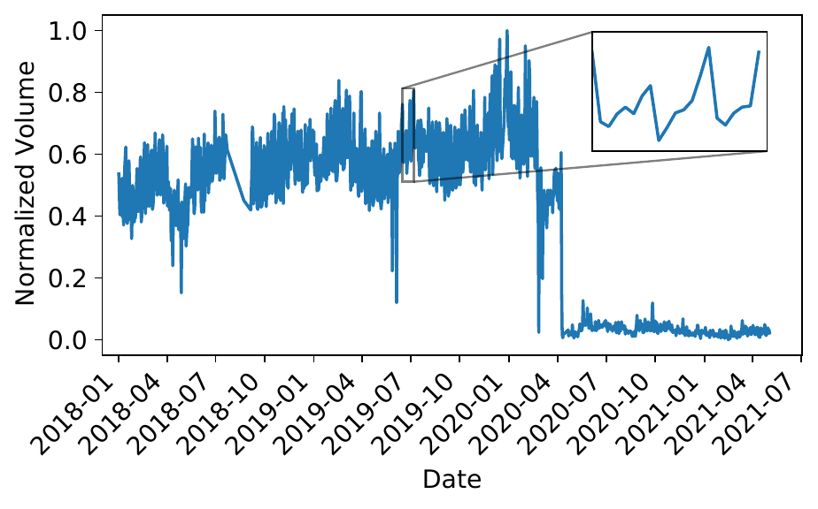{height="210px"}
:::
::: {.column width="25%"}
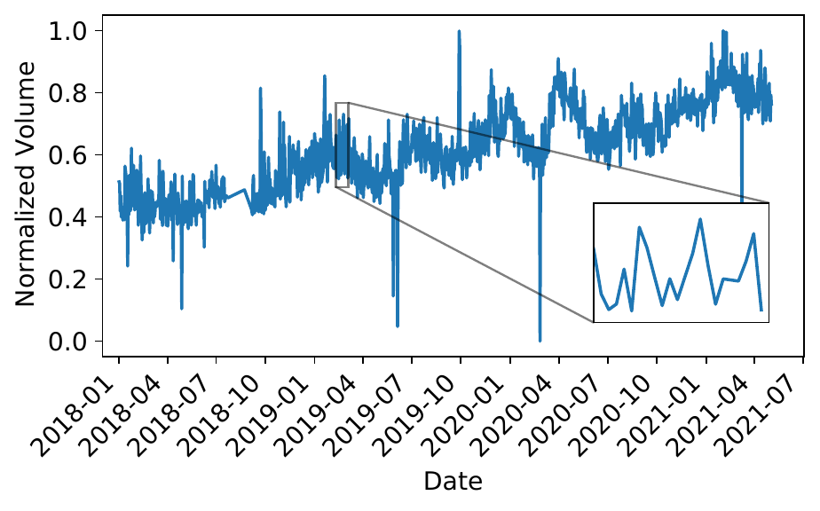{height="210px"}
:::
::: {.column width="25%"}
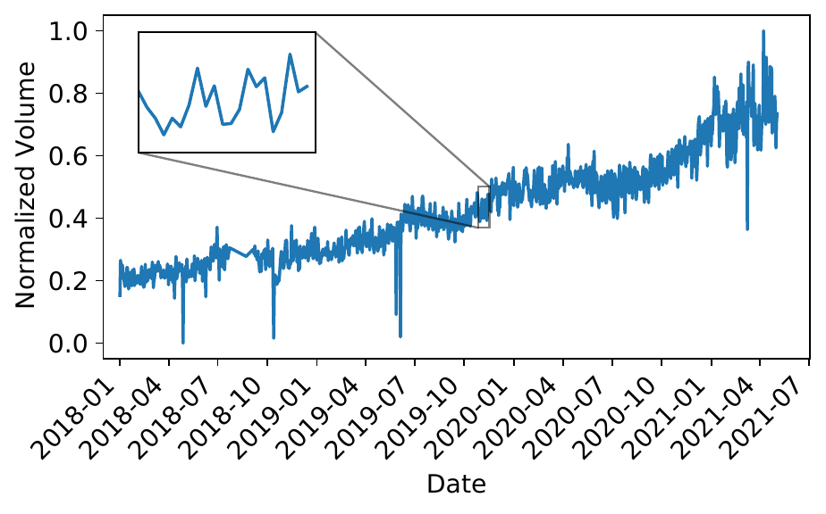{height="210px"}
:::
::: {.column width="25%"}
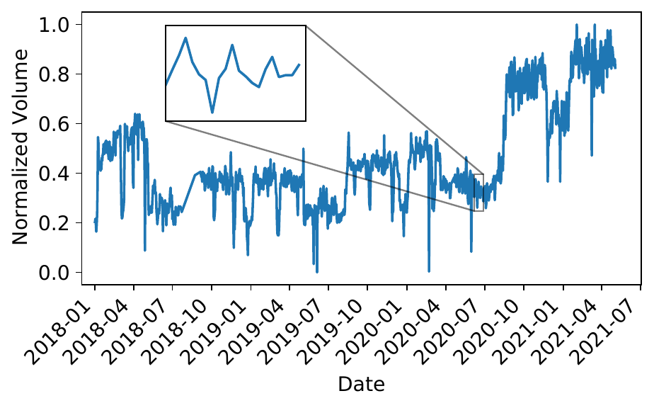{height="210px"}
:::
:::

- **Sudden**: one-step collapse. **Gradual**: slow rise with the weekly cycle intact. **Incremental**: steady trend. **Recurring**: a new regime that comes and goes
- **Plus seasonal**: the 7-day period in every panel; a model can be right on average and wrong every weekend
- Per-eNodeB volume series from the LEAF dataset (authors' source figures, not in the published figure set)

::: {.notes}
These four panels are real per-eNodeB volume series from the LEAF dataset (they ship with the paper source but were cut from the CoNEXT version). Walk the taxonomy: sudden (a decommissioned sector or a software change), gradual (population growth in a suburb), incremental (steady capacity additions), recurring (a stadium, or a semester). Ask which of these periodic retraining handles well (gradual and incremental) and which it handles badly (sudden, especially if the retrain schedule misses the change, and recurring, where the "new" data is actually the old regime).
:::

## Why Networks Are Especially Drift-Prone

- **Periodicity**: diurnal and 7-day cycles in volume, users, and call quality
- **Gradual evolution**: new base stations, capacity upgrades, new handsets
- **Exogenous shocks**: software upgrades, KPI redefinitions, a pandemic
- **Environment**: weather and interference change the radio channel itself
- **Predictions are continuous**: not one object classified once, but a system forecast every day, 180 days ahead

> Drift in images and text is about slowly changing objects. Drift in networks is about a **system that changes underneath the model** while the model keeps running.

::: {.notes}
This is LEAF's argument for why prior drift work (mostly classification of fixed objects) does not transfer. Also note the operator's constraint: capacity planning needs a 180-day horizon because that is how long it takes to plan, permit, and install infrastructure. A model that is only accurate for the next week is not useful for that decision.
:::

# LEAF: Drift in a Large Cellular Network {.center}

**Local Error Approximation of Features**. Liu, Bronzino, Schmitt, Bhagoji, Feamster, et al. Proc. ACM on Networking (CoNEXT), 2023. arXiv 2109.03011.

## The Setting: Four Years of Cellular KPIs {.smaller}

::: {.columns}
::: {.column width="50%"}
| | |
|---|---|
| **Collection period** | Jan. 1st 2018 to March 28th 2022 |
| **Identifiers** | eNodeB ID and time stamp |
| **Number of KPIs** | 224 |
| **Groups of KPIs** | Resource utilization; Network performance; User experience |
| **Number of eNBs** | Fixed: 412 common eNBs; Evolving: 898 eNBs |
| **Number of logs** | Fixed: 699,381; Evolving: 1,084,837 |

: Summary of datasets (LEAF, Table 1)
:::
::: {.column width="50%"}
**What an eNodeB log is**

- One row per base station per day
- 224 KPIs: counters and ratios the operator already collects
- A major US carrier, one large metro area (urban, suburban, rural)

**Two datasets**

- **Fixed**: the same 412 eNodeBs throughout, an apples-to-apples view of internal drift
- **Evolving**: up to 898 eNodeBs as the network grows, adding infrastructure drift
:::
:::

::: {.notes}
Table 1 in the paper. Emphasize scale and duration: four years is what makes it possible to see both the COVID shock and the slow recovery, and to compare retraining strategies whose periods are measured in months. Point out that the "features" are the operator's own KPIs, so the model is forecasting the network from the network.
:::

## Six Forecasting Targets {.smaller}

| Property | DVol | PU | DTP | REst | CDR | GDR |
|---|:-:|:-:|:-:|:-:|:-:|:-:|
| Std/Mean | 0.81 | 1.76 | 0.59 | 0.85 | 2.48 | 8.52 |
| Periodic | ✓ | ✓ | ✓ | ✓ | ✓ | ✓ |
| Bursty | | ✓ | | | ✓ | ✓ |
| Data Lost | | ✓ | | | | |
| Balanced | | ✓ | | ✓ | | |

: Characteristics of target KPIs in the Evolving dataset (LEAF, Table 2). DVol: Downlink volume; PU: Peak active UEs; DTP: Downlink Throughput; REst: RRC establishment success; CDR: S1-U call drop rate; GDR: RTP gap duration ratio.

::: {.columns}
::: {.column width="50%"}
**The task**: regression. Given all KPIs up to today, forecast each target KPI **180 days ahead**, per eNodeB, with one model per KPI.
:::
::: {.column width="50%"}
**The metric**: **NRMSE**, RMSE normalized by the KPI's range, so a volume model and a drop-rate model are comparable. Under 0.1 is "good." *(Definitions in the appendix.)*
:::
:::

::: {.notes}
Two KPIs from each of the three groups. The dispersion row (Std/Mean) is the single most predictive property for how hard a KPI will be to keep accurate: CDR and GDR are bursty, high-dispersion, and turn out to be the hardest to mitigate later. Also note "Data Lost" for PU: some data went missing between July 2019 and January 2020, which shows up as a huge error spike in the next figure.
:::

## Drift Is Everywhere, Regardless of Model {.smaller}

::: {.columns}
::: {.column width="50%"}
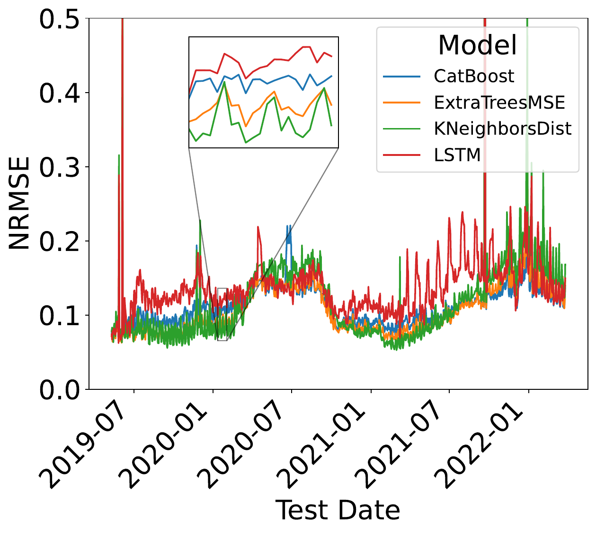{height="340px"}
:::
::: {.column width="50%"}
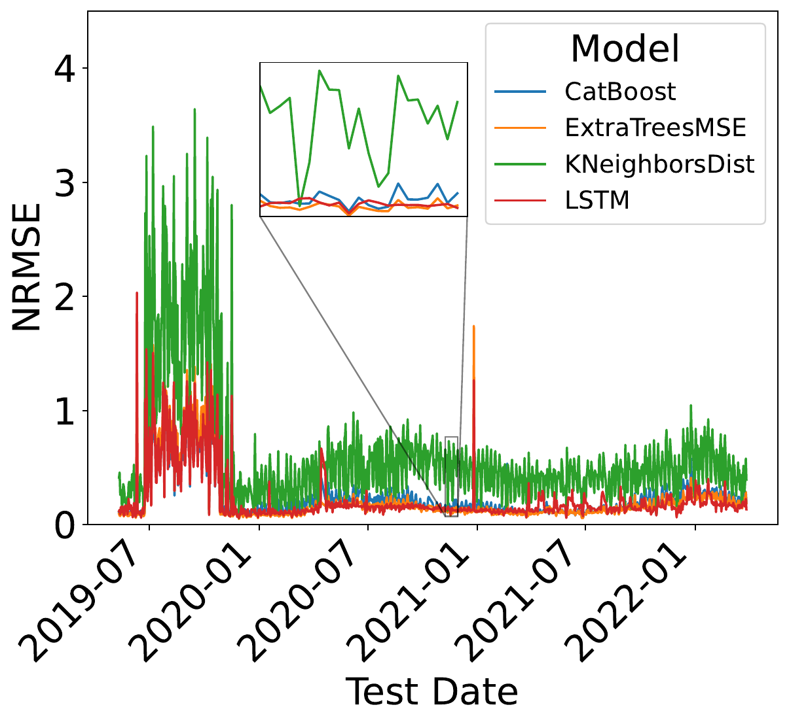{height="340px"}
:::
:::

- Every model family (boosting, bagging, distance-based, LSTM) drifts **in the same pattern**
- The inset shows a 3-week window: a **weekly** rhythm in error, not just in traffic

::: {.notes}
Figure 1 in the paper (four panels; the other two are on the next slide). Key observation: the drift is a property of the *data*, not of the model choice. Between April and October 2020 all models see a rise in NRMSE (lockdown); after March 2021 there is a gradual increase peaking January 2022. Because the models behave alike, the authors use CatBoost for the rest of the paper. For at least one year, some model has NRMSE under 0.1 for every KPI, so the models are not bad, they are decaying.
:::

## Drift Patterns Differ by KPI {.smaller}

::: {.columns}
::: {.column width="25%"}
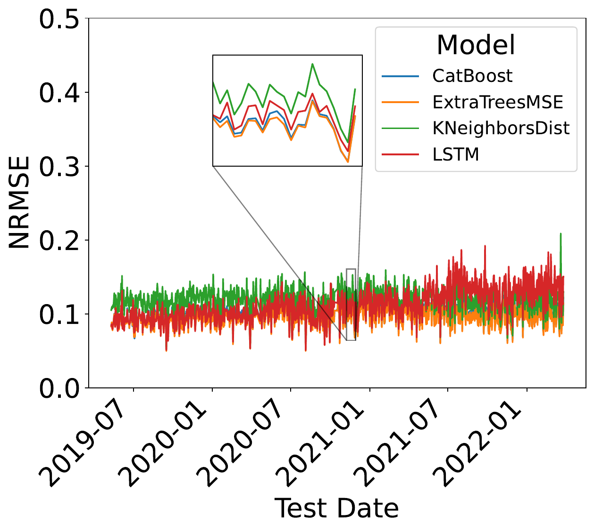{height="250px"}
:::
::: {.column width="25%"}
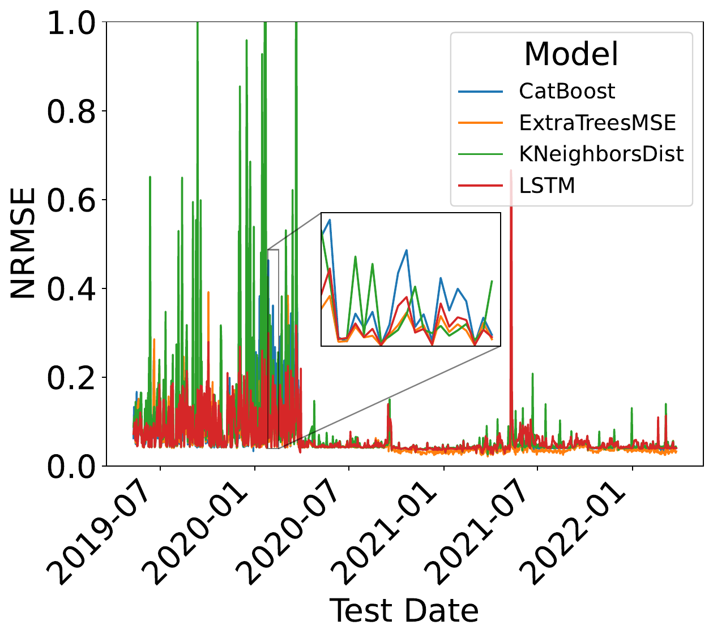{height="250px"}
:::
::: {.column width="25%"}
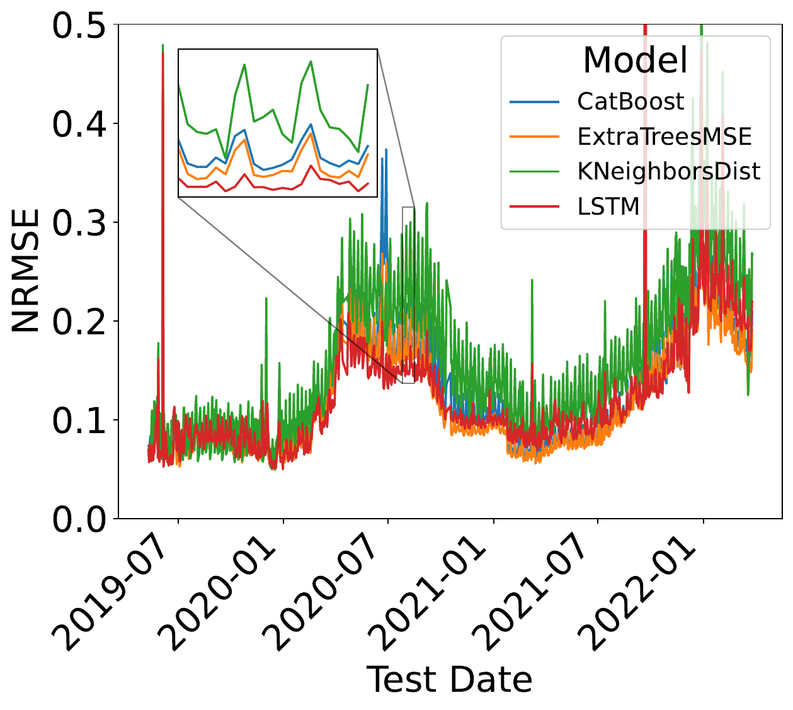{height="250px"}
:::
::: {.column width="25%"}
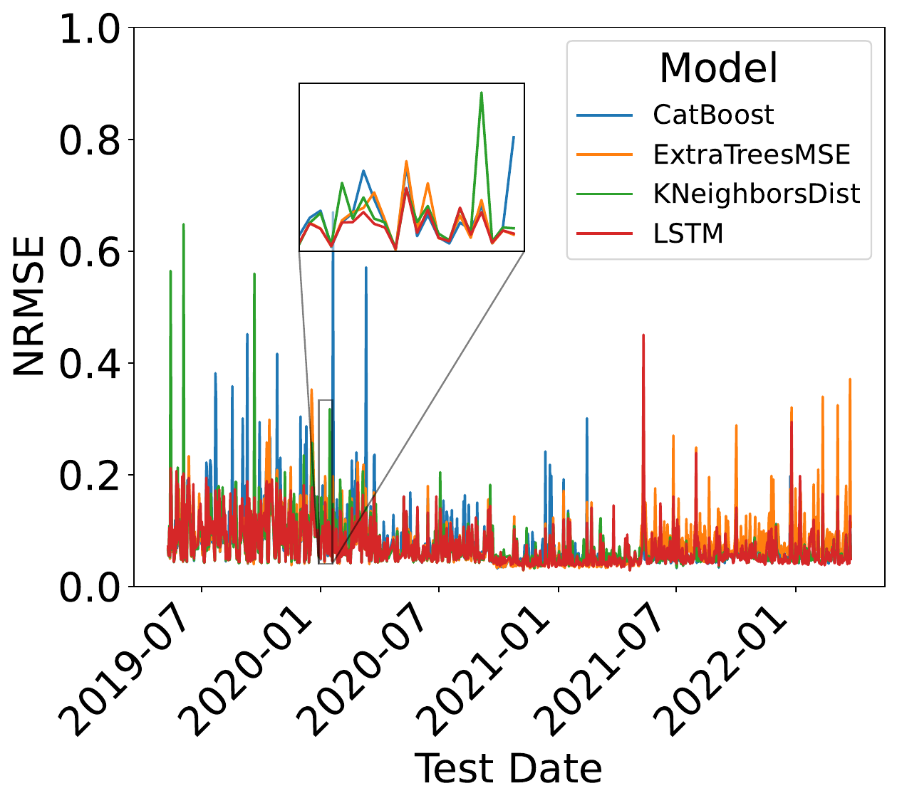{height="250px"}
:::
:::

- **GDR**: frequent short-lived error bursts and no weekly pattern
- **CDR**: high early error that *improves* after April 2020
- Same models and training window as the previous slide; y-axes differ

::: {.notes}
Uncorrelated KPIs drift differently: the timing of error deviations differs, and the high-frequency structure differs. STFT analysis finds no weekly pattern in CDR and GDR error, but clear weekly patterns in the others. The lesson for a monitoring system: there is no single drift signature to look for across KPIs, so detection has to be per-model and data-driven.
:::

## Drift Persists Regardless of Training Set Size or Period {.smaller}

::: {.columns}
::: {.column width="50%"}
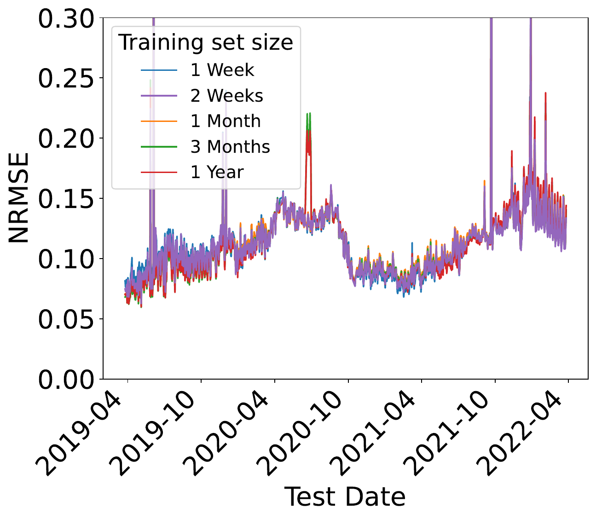{height="340px"}
:::
::: {.column width="50%"}
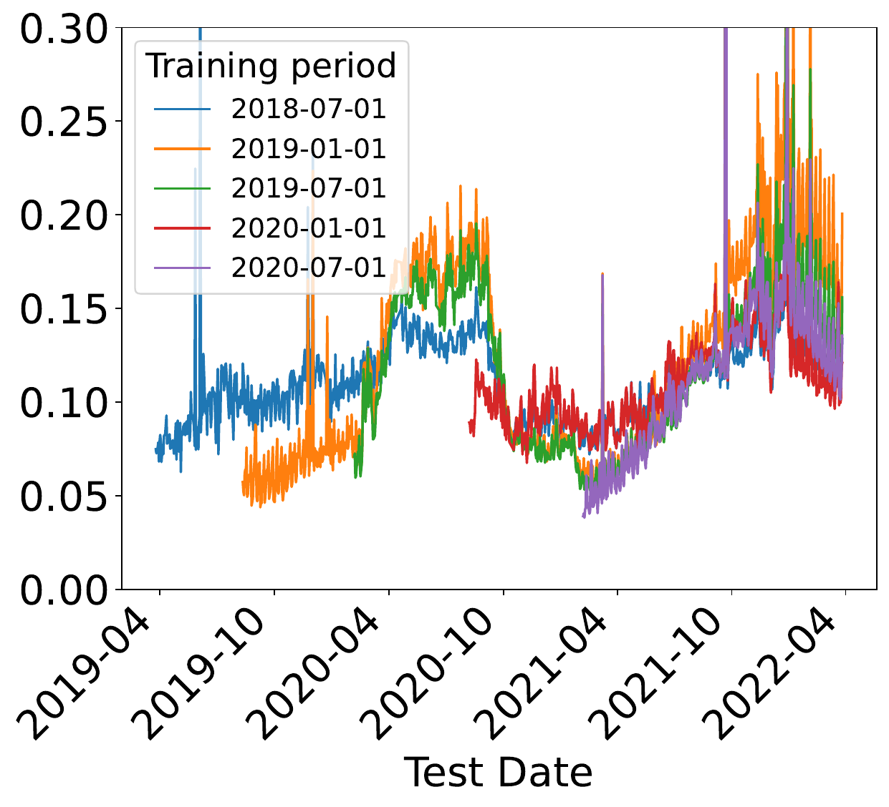{height="340px"}
:::
:::

- Two weeks of training data performs about like one year, and trains **18x faster**, so the paper uses 14-day windows
- Models trained on more recent periods **do not necessarily do better**: after a sudden change, the new distribution may look more like the *old* past than the recent past

::: {.notes}
Figure 2. This is the setup for the retraining result: if "more recent" does not mean "more accurate," then a policy of "retrain on the last two weeks every N days" has no guarantee of helping. The 18x training-time saving from 14-day windows is the first cost number in the lecture; keep a running tally of cost.
:::

## Naive Periodic Retraining Is Not Enough {.smaller}

| Retraining Period | DVol | PU | DTP | REst | CDR | GDR | #Retrains |
|---|--:|--:|--:|--:|--:|--:|--:|
| Static | – | – | – | – | – | – | 0 |
| 7 days | −40.34% | −55.36% | −27.21% | −48.00% | 47.79% | −0.38% | 169 |
| 30 days | −30.66% | −43.73% | −21.40% | −40.12% | −0.75% | 2.75% | 39 |
| 90 days | −16.83% | −16.12% | −19.07% | −27.33% | 7.89% | 42.24% | 13 |
| 180 days | −12.22% | −0.34% | −14.85% | −18.82% | −4.20% | 76.28% | 6 |
| 365 days | −2.27% | −5.13% | −10.65% | −11.53% | −5.97% | 6.07% | 3 |

: Change in average NRMSE relative to a never-retrained model, and number of retrains, for periodic retraining with CatBoost on the last 14 days of data (LEAF, Table 3). Negative is better.

- Low-dispersion KPIs (DVol, DTP, REst): more frequent is better, but 7-day retraining costs **169 retrains**
- Bursty KPIs: weekly retraining makes CDR **47.79% worse**; for GDR, yearly beats quarterly

::: {.notes}
Table 3. This is the "conventional practice is wrong" slide. Why does naive retraining fail? (1) It fires on a calendar, but drift is irregular, so retrains happen when nothing changed and miss the moment something did. (2) It assumes recent data is best (previous slide shows it is not). (3) It replaces the whole training set, throwing away useful older samples and any fine-grained information about *which* samples are wrong. Cold-call: "If you were the operator, which row would you pick for CDR?" There is no good row: that is the point.
:::

## The LEAF Framework

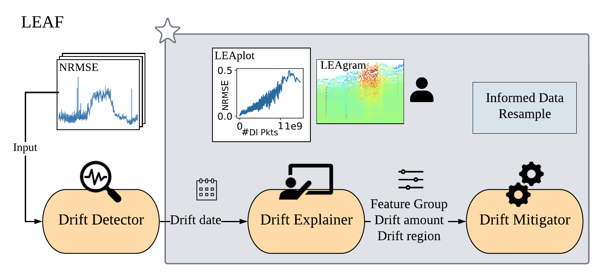{height="380px"}

- **Model-agnostic**: needs only the old training set, the new data, and the model's outputs
- Three stages: **detect** when, **explain** which features and where, **mitigate** with targeted data

::: {.notes}
Figure 3. Stress the model-agnostic design: LEAF never opens the model. It watches the error time series, then looks at inputs and outputs. That is what makes it deployable next to any regressor the operator already runs, including the AutoGluon-selected ensembles used here. The detector is deliberately off-the-shelf; the explainer and mitigator are the research.
:::

## Step 1: Detect Drift from the Error Stream

::: {.columns}
::: {.column width="55%"}
{height="420px"}
:::
::: {.column width="45%"}
**Kolmogorov-Smirnov Windowing (KSWIN)**

- Keep a sliding window of recent NRMSE values
- Compare the newest sub-window against the older part with a **KS test**: has the error distribution changed?
- Non-parametric, no assumption about the error distribution
- Also tried: ADWIN, DDM, HDDM, EDDM, Page-Hinkley. KSWIN worked best on these series

*(KS statistic in the appendix.)*
:::
:::

::: {.notes}
Detection is not the paper's contribution, but it is the trigger for everything else. Two subtleties to raise. First, the input is the *error*, which requires ground truth; with a 180-day horizon, alarms are inherently delayed. Second, there is no ground-truth "drift" label in the dataset, so the authors validate the detector against known events: the mid-2019 data loss, December 2019, April 2021, and the beginning and end of the quarantine period. The annotated figure here comes from the authors' source files; the published paper describes KSWIN in Appendix B without a figure.
:::

## Step 2: Explain Drift with Local Error Approximation

**Goal**: for a black-box regressor, find *which features*, *where in their range*, and *how much* error has moved.

1. Rank features by **permutation importance**
2. **Group** correlated features; keep the top-ranked feature of each group as its representative
3. For a representative feature, split samples into **N quantile bins**
4. Compute **NRMSE per bin**: a vector describing where in feature space the model is wrong

> **Local Error Approximation (LEA)** is a partial-dependence plot for *error* instead of for prediction.

::: {.notes}
Connect to the interpretability material from the Trees/Ensembles lecture: partial dependence and accumulated local effects plot the model's output against a feature; LEA plots the model's error against a feature. Grouping matters because a 224-KPI dataset is full of near-duplicates (bytes, packets, sessions all move together); you want one representative per group so mitigation does not double-count. In the case study, Group 1 has 32 features and its representative is the history of downlink volume itself.
:::

## LEAplot: Where in Feature Space the Error Lives {.smaller}

::: {.columns}
::: {.column width="50%"}
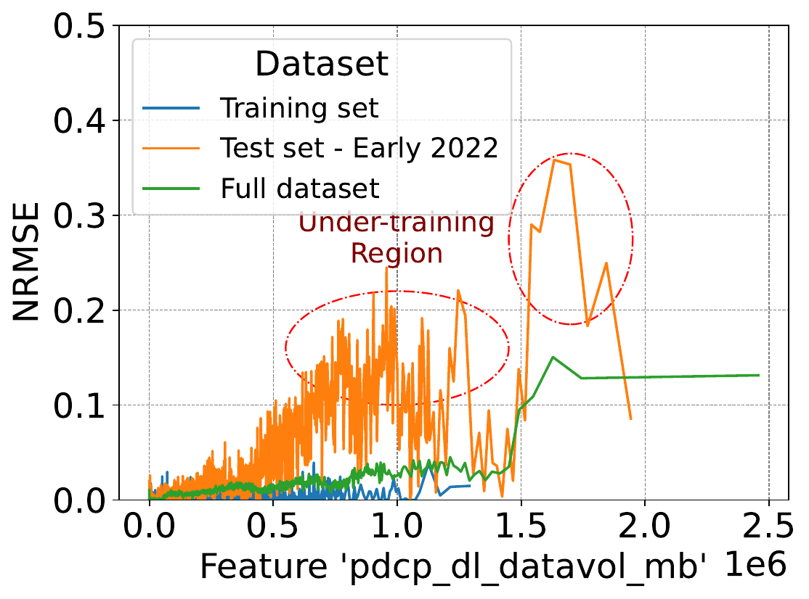{height="320px"}
:::
::: {.column width="50%"}
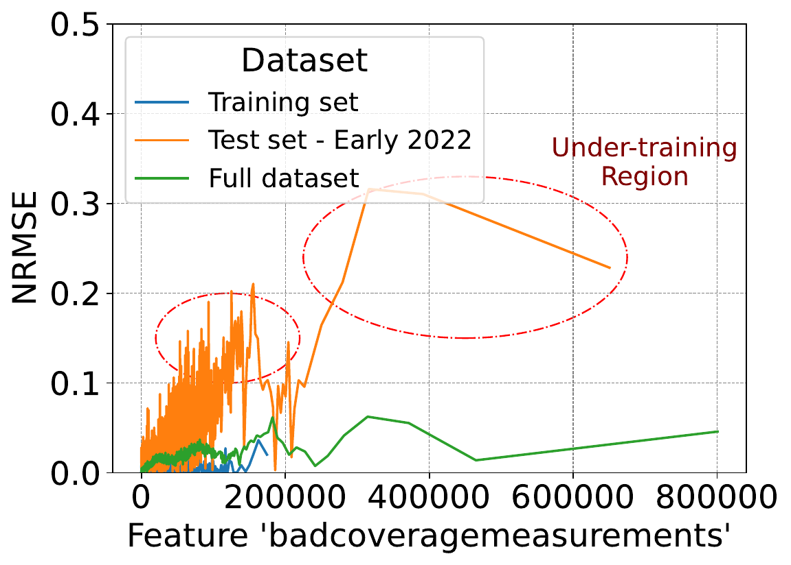{height="320px"}
:::
:::

- The two groups have **different high-error regions**, which is what makes multi-group mitigation possible
- Tracing the top 5% errors back to eNodeBs: mostly **suburban** sites whose mobility patterns changed after the winter break

::: {.notes}
Figure 4 (main text) and Figure 8 (appendix). The LEAplot answers "where is the model under-trained?" Note the two distinct causes: a region where the training set exists but is stale (0.6e6 to 1.3e6) versus a region the training set never covered (above 1.5e6). Both fixes involve data, not model architecture. The third representative feature in the case study was RTP gap ratio, i.e., VoLTE packet loss, which affects delivered volume.
:::

## LEAgram: Error Over Time and Feature Value {.smaller}

::: {.columns}
::: {.column width="45%"}
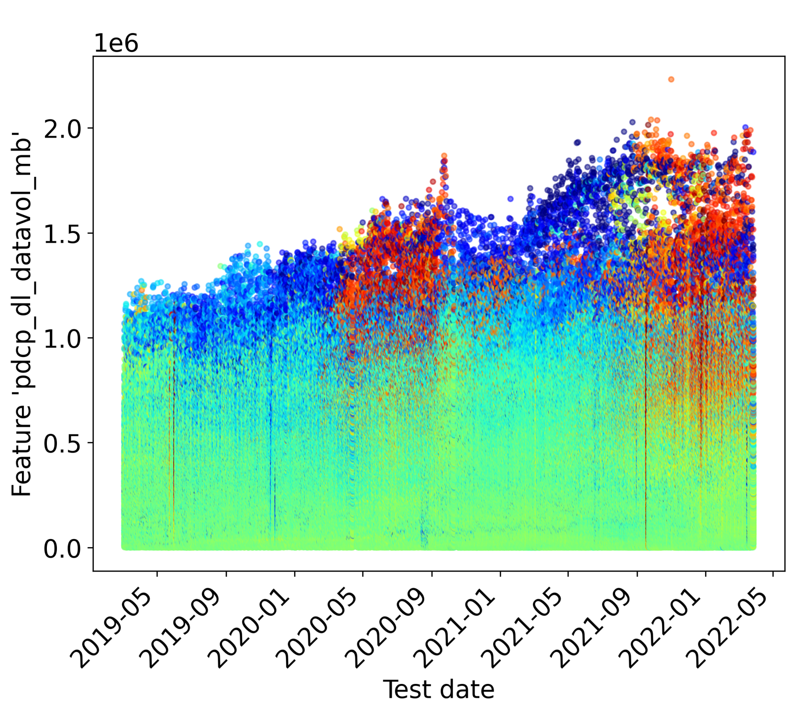{height="330px"}
:::
::: {.column width="55%"}
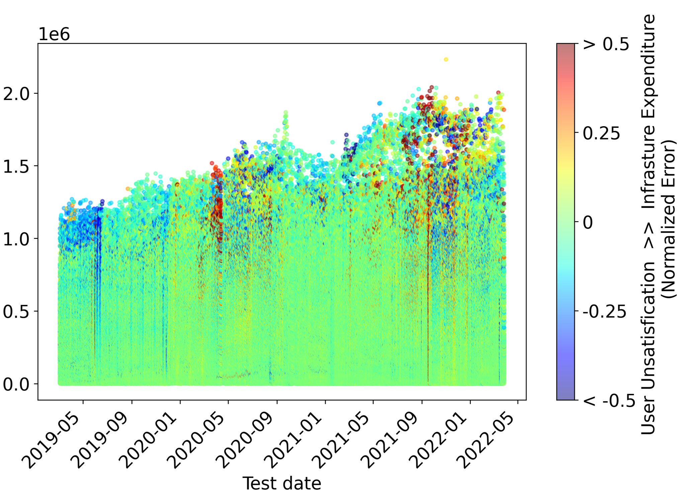{height="330px"}
:::
:::

- March 15 to Nov 1, 2020, feature above 1e6: large **positive** errors. The model overestimates demand because users moved to home Wi-Fi
- Overestimation returns after October 2021 above 0.6e6
- **Sign matters** to an operator: overestimate and you build towers you do not need; underestimate and users suffer

::: {.notes}
Figure 5. The LEAgram adds time to the LEAplot and keeps the sign of the error (Normalized Error rather than NRMSE). This is the explanation an operator can act on: a block of red during lockdown, at high-volume sites, means the forecasting model would have justified capacity spending that the pandemic made unnecessary. Ask students to read the after-mitigation panel: which errors remain? Mostly the tail, and some vertical stripes that are data glitches.
:::

## Step 3: Mitigate with Forgetting and Over-Sampling

::: {.columns}
::: {.column width="50%"}
**Forget**

- From the *last* training set, drop samples in high-error bins that carry low weight
- Weights come from the LEA error vector of the newest data

**Over-sample**

- From all collected data, including the drifting samples, draw extra samples in proportion to the error vector
- Then **retrain** on the restructured set; repeat on each alarm
:::
::: {.column width="50%"}
**How aggressive? Let dispersion decide**

| KPI dispersion (Std/Mean) | Forgetting | Over-sampling |
|---|---|---|
| **High** (PU, CDR, GDR) | linear weights | **cubic** weights on high-error regions |
| **Low** (DVol, DTP, REst) | drop samples with over 95% error | linear weights |

> Retraining is triggered **only when drift is detected**, and the retraining set is chosen by *where* the error is, not just *when*.
:::
:::

::: {.notes}
The key contrast with naive retraining: same amount of data per retrain (controlled in the evaluation), but chosen to cover the under-trained region rather than "the last 14 days." Multi-group LEAF repeats the resampling for the top 3 or 5 representative features. The thresholds are tuned to this dataset; say so. Cold-call: "Why cubic weights for high-dispersion KPIs?" Because bursty KPIs have sparse, extreme error regions; you want to concentrate samples there rather than spread them.
:::

## Cost vs. Accuracy: The Retraining Trade-Off {.smaller}

::: {.columns}
::: {.column width="50%"}
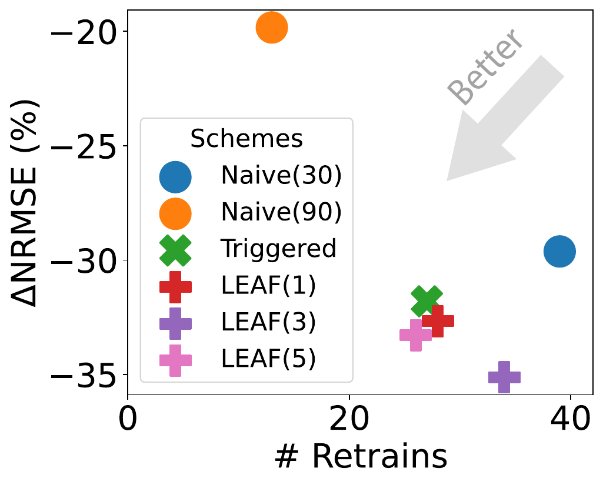{height="330px"}
:::
::: {.column width="50%"}
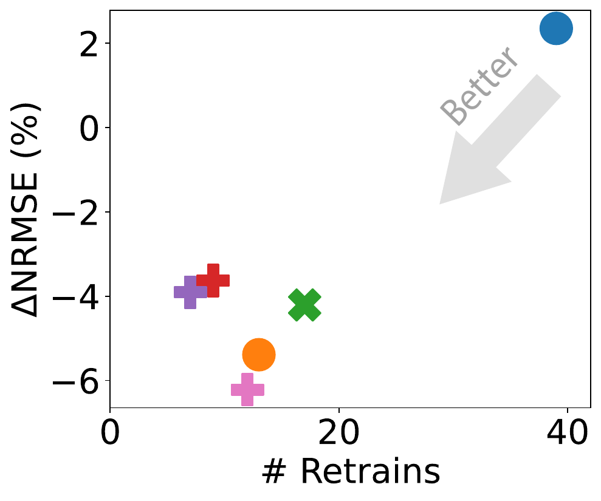{height="330px"}
:::
:::

- **x-axis**: number of retrains (cost). **y-axis**: change in average NRMSE (accuracy). Bottom-left wins
- **Triggered** retraining (retrain on the latest data whenever the detector fires) sits in the middle and never wins on either axis; for GDR it makes error *worse*

::: {.notes}
Figure 6 (the other four KPIs are in Figure 10, next slides in the notes). This is the slide that frames the whole course-closing question: accuracy per retrain. Triggered retraining is the natural baseline for "we added a detector": it fixes the *when* but not the *what data*. LEAF fixes both. For CDR the 90-day naive scheme looks competitive, but it does not reach the best mitigation, and you could not have known that in advance without running all schemes for four years.
:::

## The Trade-Off for the Other Four KPIs {.smaller}

::: {.columns}
::: {.column width="25%"}
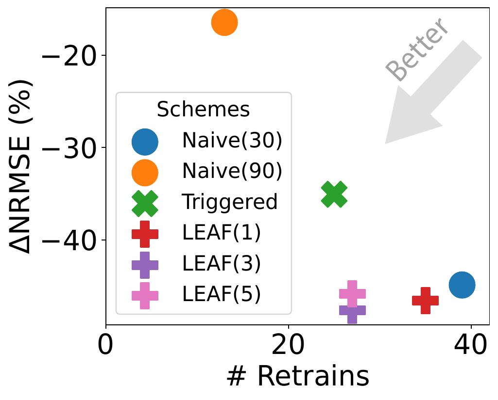{height="230px"}
:::
::: {.column width="25%"}
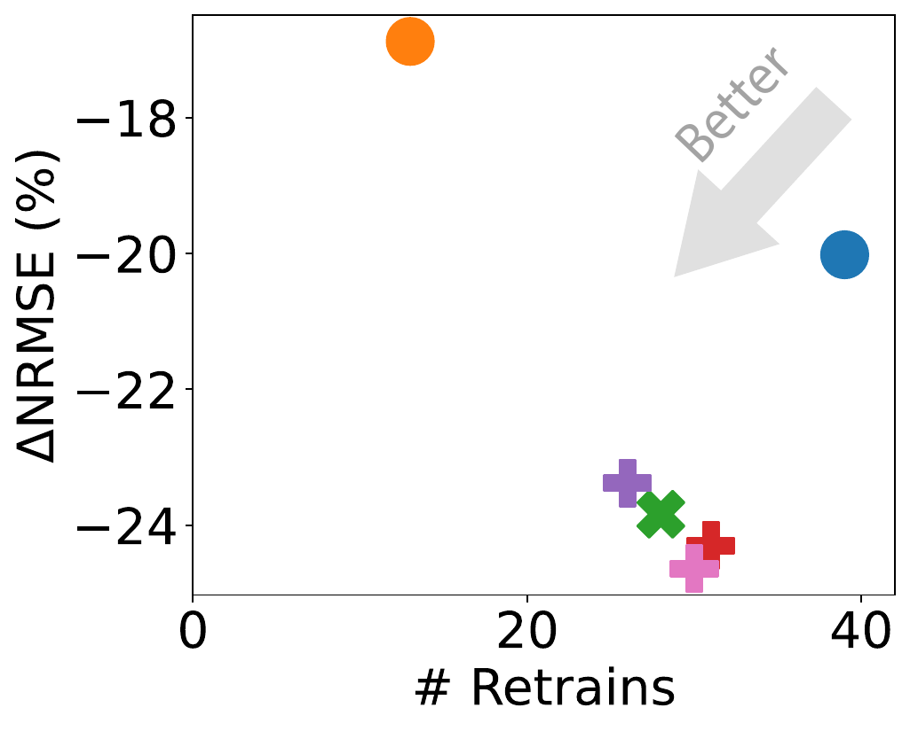{height="230px"}
:::
::: {.column width="25%"}
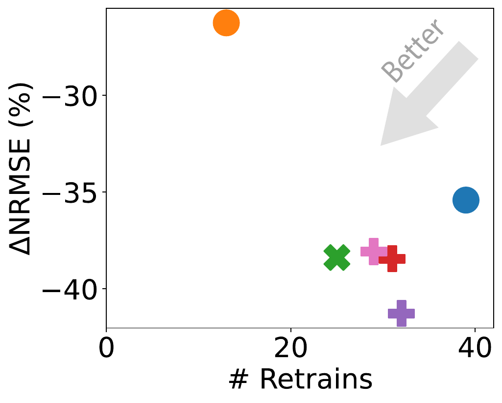{height="230px"}
:::
::: {.column width="25%"}
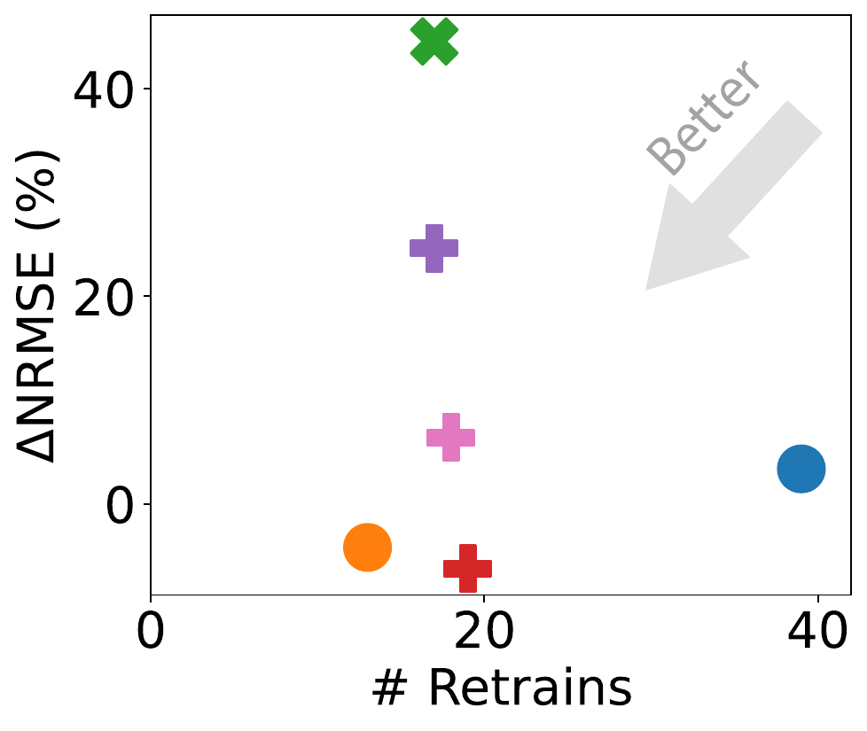{height="230px"}
:::
:::

- Same axes as the previous slide; parentheses give the naive period in days or the number of LEAF feature groups
- Multi-group LEAF mitigates 0.34% to 2.83% more error than single-group; the best group count differs by KPI (3 for DVol, PU, REst; 5 for DTP, CDR; 1 for GDR)

::: {.notes}
Appendix Figure 10. Small on a slide; the point is the shape, not the numbers. Note GDR, where triggered retraining lands far up the y-axis (44.56% worse than static) and only single-group LEAF and naive 90-day retraining are below zero. If time is short, skip this slide and refer to Table 4.
:::

## Results Across Models and KPIs: Tree Ensembles {.smaller}

| Model | KPI | Naive₃₀ | Triggered | LEAF |
|---|---|--:|--:|--:|
| CatBoost | DVol | −29.62% (39) | −31.80% (27) | **−32.67% (28)** |
| | PU | −44.88% (39) | −35.06% (25) | **−46.59% (35)** |
| | DTP | −20.02% (39) | −23.84% (28) | **−24.30% (31)** |
| | REst | −35.41% (39) | −38.38% (25) | **−38.44% (31)** |
| | CDR | 2.35% (39) | **−4.21% (17)** | −3.63% (9) |
| | GDR | 3.37% (39) | 44.56% (17) | **−6.24% (19)** |
| ExtraTrees | DVol | −24.77% (39) | −28.17% (32) | **−30.64% (32)** |
| | PU | −44.26% (39) | **−50.76% (26)** | −45.83% (27) |
| | DTP | −18.13% (39) | −21.63% (32) | **−22.59% (23)** |
| | REst | −31.95% (39) | −34.29% (22) | **−36.13% (29)** |
| | CDR | 2.10% (39) | 8.08% (20) | **−0.20% (11)** |
| | GDR | −0.58% (39) | 33.67% (17) | **−14.26% (19)** |

: Change in average NRMSE (number of retrains) on the Fixed dataset; bold is the best scheme per row (LEAF, Table 4, first half)

::: {.notes}
Table 4, tree-ensemble half. Read one row aloud: CatBoost on GDR, naive 30-day retraining makes things 3.37% worse, triggered retraining 44.56% worse, LEAF 6.24% better with 19 retrains. LEAF's ΔNRMSE is negative in every row: it never hurts. The baselines cannot say that. Retrain savings versus naive-30: 10.3% to 76.9% fewer for CatBoost, 17% to 71.8% fewer for ExtraTrees. LightGBM and Random Forest show the same pattern (mentioned in text, not tabulated).
:::

## Results Across Models and KPIs: LSTM and KNN {.smaller}

| Model | KPI | Naive₃₀ | Triggered | LEAF |
|---|---|--:|--:|--:|
| LSTM | DVol | **0.54% (39)** | 14.12% (21) | 2.67% (19) |
| | PU | 37.11% (39) | 3.76% (25) | **−20.48% (18)** |
| | DTP | 17.08% (39) | −0.82% (14) | **−37.13% (20)** |
| | REst | 6.78% (39) | 5.78% (27) | **4.21% (26)** |
| | CDR | −33.22% (39) | −21.39% (10) | **−71.52% (11)** |
| | GDR | 0.41% (39) | −8.58% (14) | **−16.29% (13)** |
| KNeighbors | DVol | **−8.26% (39)** | −4.11% (16) | −4.47% (24) |
| | PU | −34.09% (39) | **−37.99% (16)** | −18.11% (20) |
| | DTP | **−4.73% (39)** | −4.03% (18) | −1.53% (22) |
| | REst | **−26.69% (39)** | −25.86% (25) | −22.10% (16) |
| | CDR | 9.44% (39) | 7.35% (11) | **4.69% (12)** |
| | GDR | −8.13% (39) | −23.40% (19) | **−6.12% (13)** |

: Change in average NRMSE (number of retrains), Fixed dataset, bold is best per row (LEAF, Table 4, second half)

::: {.notes}
Table 4, second half. Say it out loud: for LSTM, recent-data retraining often hurts, and LEAF cuts CDR error 71.52% with 11 retrains; for KNeighbors, LEAF does not help a lazy, memorizing model. Two teaching points. First, deep sequence models are fragile under naive retraining (37% worse on PU) and benefit most from targeted data. Second, the failure case: distance-based models memorize the training set, so over-sampling one region degrades the regions that were fine. Bagging and boosting train learners that absorb new samples more independently. Mitigation strategy has to match model family.
:::

## LEAF Over Time: Before and After {.smaller}

::: {.columns}
::: {.column width="33%"}
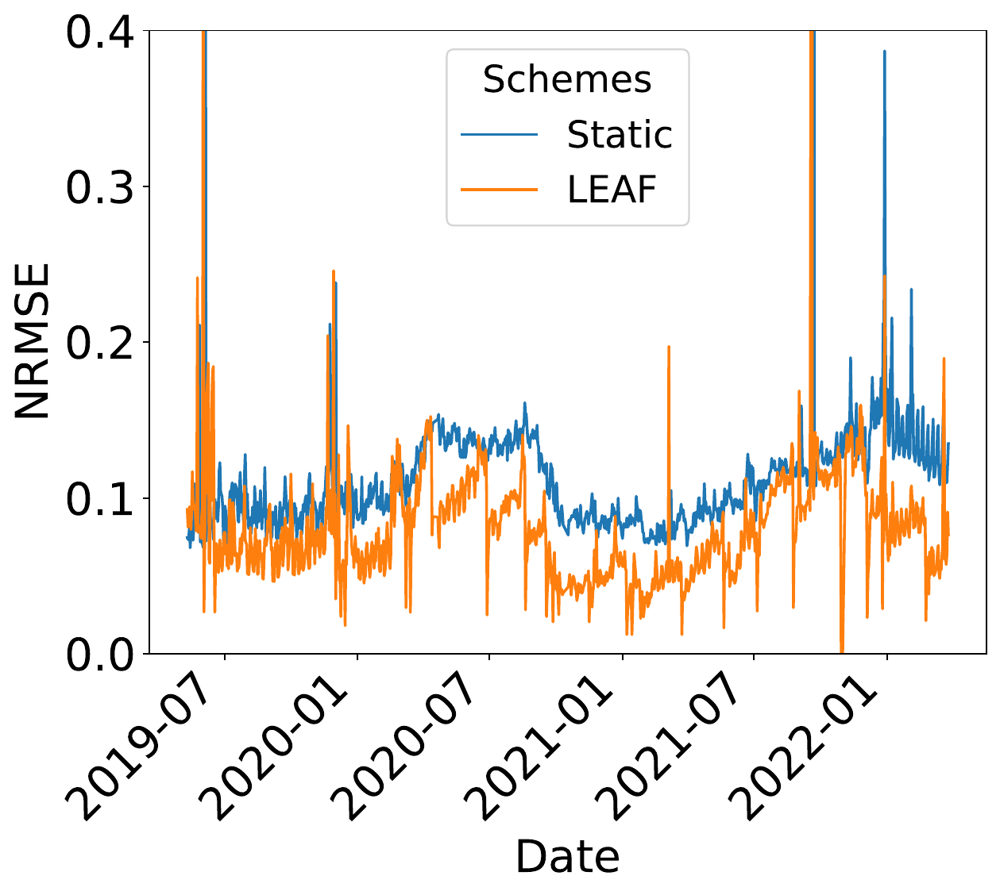{height="200px"}
:::
::: {.column width="33%"}
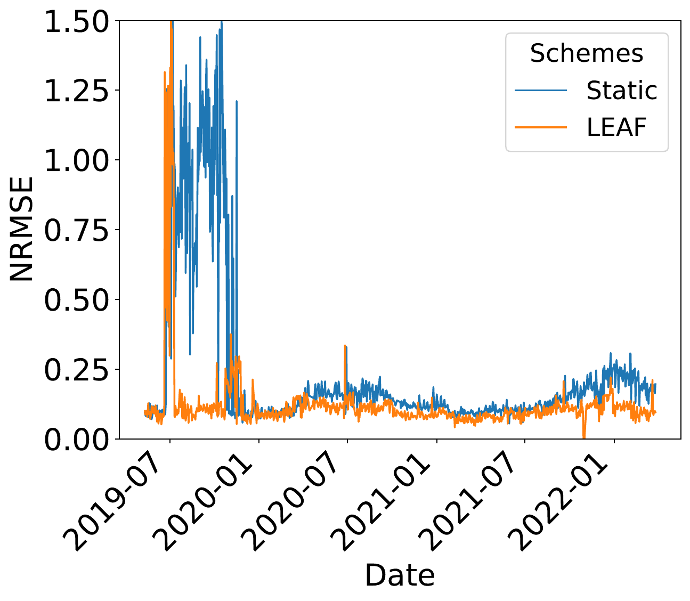{height="200px"}
:::
::: {.column width="33%"}
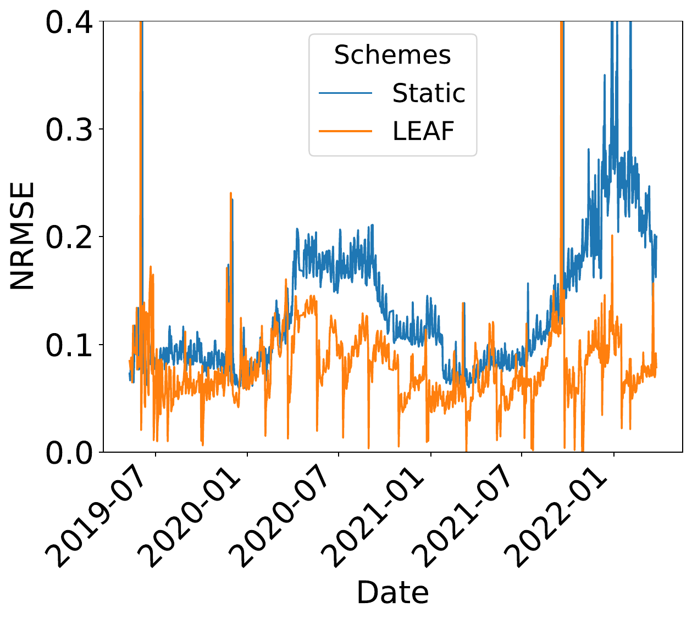{height="200px"}
:::
:::

| 95th-percentile error | DVol | PU | DTP | REst | CDR | GDR |
|---|--:|--:|--:|--:|--:|--:|
| Static | 0.29 | 0.86 | 0.17 | 0.33 | 0.24 | 0.27 |
| LEAF | 0.19 | 0.27 | 0.13 | 0.18 | 0.23 | 0.27 |

: Normalized error at the 95th percentile, CatBoost (LEAF, Table 7)

- **DVol**: LEAF (orange) stays under 0.125 except for data-error spikes. **PU**: the static model's error stays high for half a year after the mid-2019 data loss, LEAF's for about a week
- **CDR and GDR** barely move: dispersion 2x to 4x higher than the others

::: {.notes}
Appendix Figure 9 and Table 7. Most error lives in the tail, so the 95th percentile is the honest metric. PU from 0.86 to 0.27 is the headline. CDR and GDR barely move: their dispersion is 2x to 4x that of the others, and LEAF only slightly improves them. Say clearly that LEAF does not solve bursty KPIs; it stops making them worse. Figure 9f (GDR) shows two bursty spikes even with LEAF, around December 2020 and August 2021.
:::

## Does It Hold When the Network Grows? (1/2) {.smaller}

| Dataset | KPI | Triggered | LEAF | LEAF* (best multi-group) |
|---|---|--:|--:|--:|
| Fixed | DVol | −31.80% (27) | −32.67% (28) | **−35.12% (34)** |
| | PU | −35.06% (25) | −46.59% (35) | **−47.62% (27)** |
| | DTP | −23.84% (28) | −24.30% (31) | **−24.64% (30)** |
| | REst | −38.38% (25) | −38.44% (31) | **−41.27% (32)** |
| | CDR | −4.21% (17) | −3.63% (9) | **−6.22% (12)** |
| | GDR | 44.56% (17) | **−6.24% (19)** | **−6.24% (19)** |

: Change in average NRMSE (number of retrains), CatBoost, Fixed dataset (LEAF, Table 5)

- On the fixed set of eNodeBs, LEAF and LEAF* are the best scheme on every KPI

## Does It Hold When the Network Grows? (2/2) {.smaller}

| Dataset | KPI | Triggered | LEAF | LEAF* (best multi-group) |
|---|---|--:|--:|--:|
| Evolving | DVol | −30.76% (24) | −32.09% (37) | **−32.80% (30)** |
| | PU | −50.89% (24) | −45.75% (24) | **−51.72% (26)** |
| | DTP | −22.19% (30) | **−22.58% (27)** | **−22.58% (27)** |
| | REst | −44.01% (25) | −43.66% (26) | **−48.01% (33)** |
| | CDR | −6.79% (7) | −1.33% (9) | **−7.15% (8)** |
| | GDR | **−13.21% (15)** | −2.06% (13) | −11.99% (17) |

: Change in average NRMSE (number of retrains), CatBoost, Evolving dataset: new eNodeBs appear over time (LEAF, Table 5)

- On the Evolving dataset, **triggered** retraining improves a lot: a timely detector captures newly deployed eNodeBs
- LEAF and LEAF* stay consistent across datasets and remain the best scheme

::: {.notes}
Table 5. The evolving dataset adds a different kind of drift: new sites with no history. Any scheme with a detector benefits, because "new eNodeB appears" is exactly the kind of sudden change a KS test catches. LEAF's edge narrows but holds. The takeaway for practitioners: a detector alone buys you a lot when the drift is "new entities"; targeted resampling buys you more when the drift is "old entities behaving differently."
:::

## When the World Changed Overnight

::: {.vignette}
**April 2020, a major US cellular network.** In LEAF's four-year KPI dataset, the NRMSE of every downlink-volume forecasting model, boosting, bagging, k-NN, and LSTM alike, jumps in April 2020 as lockdowns begin, stays elevated through October 2020, and then recovers. The LEAgram shows why: at high-volume sites the models kept **overestimating** demand, because users had moved to home Wi-Fi. An operator trusting those forecasts would have provisioned capacity for traffic that never came. The same detector also caught the mid-2019 data loss and the gradual drift that peaked in January 2022. (LEAF, Figs. 1, 5; Proc. ACM on Networking, CoNEXT 2023.)
:::

**Thought question:** the forecast horizon is 180 days. The first day you can *measure* the April 2020 error is October 2020. What should a monitoring system have watched instead?

::: {.notes}
This is the deck's dated real-world hook; it is drawn from the paper rather than a news story, because a web search in September 2026 did not turn up a verifiable, public post-mortem of a production network model failing from drift (see coverage-notes). The thought question is the bridge to the playbook: with delayed labels you must also monitor inputs (the KPIs themselves shifted in April 2020, visible immediately) and prediction distributions.
:::

# The Systems Cost of Staying Accurate {.center}

**CATO: End-to-End Optimization of ML-Based Traffic Analysis Pipelines**. Wan, Liu, Bronzino, Feamster, Durumeric. arXiv 2402.06099. Code: github.com/stanford-esrg/cato.

## Accuracy Is Not the Only Objective

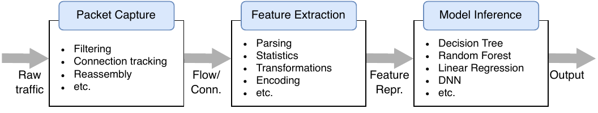{height="220px"}

- Real-time traffic analysis needs **sub-second** reactions and **hundreds of Gbps** without packet loss
- Models built without measuring serving cost "often turn out to be unusable in practice"
- **Traffic Refinery** (Bronzino et al., 2021) made the case first: profile the cost of each feature class and let the operator trade accuracy for cost, by hand

::: {.notes}
CATO Figure 1. This section answers the other half of maintenance: even a perfectly accurate model is useless if the pipeline that feeds it drops packets. Traffic Refinery is this group's earlier system; it introduced cost profiling of features (packet counters, timing, TCP counters) but required manual exploration. CATO automates the search. Connect to LEAF: retraining cost and serving cost are two budgets the same operator has to manage.
:::

## Representation Is a Cost Knob {.smaller}

::: {.columns}
::: {.column width="50%"}
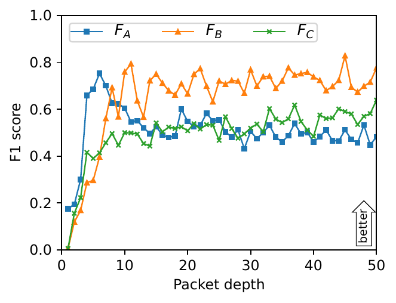{height="330px"}
:::
::: {.column width="50%"}
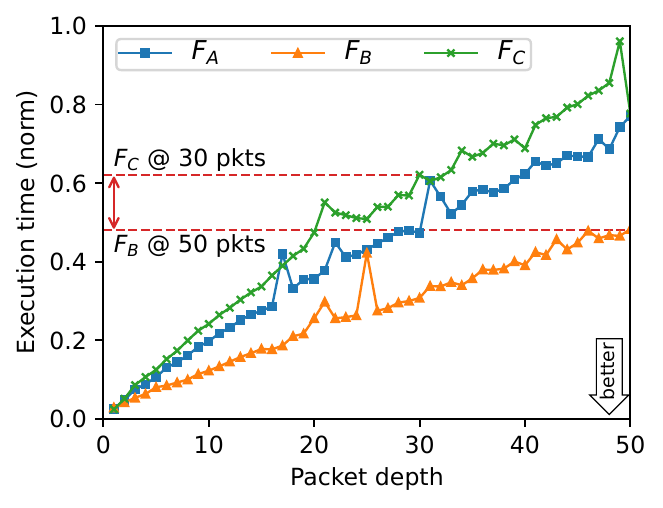{height="330px"}
:::
:::

- Two knobs: **which features** and **how many packets** (the *connection depth*) to wait for before extracting them
- Exhaustively measuring all 2⁶ × 50 = 3,200 configurations took **5 days**; with 25 candidate features it would take **over 7,000 years**
- Prior work picks 10, 50, or 100 packets with little justification, or waits for the whole flow

::: {.notes}
CATO Figure 2. The non-linearity is the whole point: you cannot optimize features and depth separately, and you cannot predict the cost of a feature set from the cost of its members (shared parsing, sums that come for free). This is a search problem with an expensive, black-box objective, which is exactly the setting of Bayesian optimization from the hyperparameter-tuning lecture.
:::

## CATO: A Multi-Objective Optimizer Plus a Profiler {.smaller}

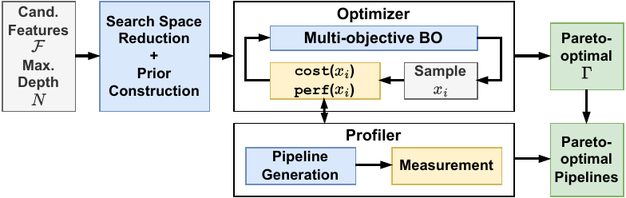{height="250px"}

::: {.columns}
::: {.column width="50%"}
**Optimizer**

- Search space: every subset of the candidate features × depth up to N
- Two objectives: minimize cost, maximize performance. Output is a **Pareto front**, not one point
- Tailored BO: drop zero-mutual-information features; **priors** favor informative features and shallow depths
:::
::: {.column width="50%"}
**Profiler**

- **Conditional compilation** (Rust, built on Retina) yields a binary with only the operations the chosen features need
- Trains a fresh model per candidate; measures latency, zero-loss throughput, or CPU time on real or replayed traffic
- Same measurement both **guides** the search and **validates** the result
:::
:::

::: {.notes}
CATO Figure 3. Why a Pareto front rather than "maximize accuracy subject to a latency budget"? Because the budget is rarely known in advance and changes with traffic; a front lets the operator move the operating point later without re-running the search. Why measure rather than estimate cost? Because feature extraction steps overlap (parsing to the TCP header is shared; a mean needs a sum), and resource contention and burstiness change costs unpredictably. Implementation: HyperMapper with a random-forest surrogate, πBO-style priors, 67 candidate features in 1,600 lines of Rust.
:::

## Use Cases and What the Optimizer Found {.smaller}

| Use Case | Type | Traffic | Model |
|---|---|---|---|
| app-class | Classification | Live | Decision Tree |
| iot-class | Classification | Dataset | Random Forest |
| startup-inf | Regression | Dataset | Deep Neural Network |

: Evaluation use cases (CATO, Table 2)

::: {.columns}
::: {.column width="50%"}
**Baselines**: all features; top-10 by recursive feature elimination; top-10 by mutual information; each at packet depths 10, 50, and all
:::
::: {.column width="50%"}
**Headline**: on iot-class, RFE with 10 packets reaches F1 0.970 at 7.9 s latency; CATO finds a different feature set at **3 packets** with F1 0.979 and **0.1 s** latency
:::
:::

- Latency reductions on iot-class: 11–79x vs. 10-packet baselines, 817–2000x vs. 50-packet, over **3600x** vs. waiting for the whole connection
- On app-class: zero-loss throughput up **1.6–3.7x** vs. end-of-connection, after exploring only 50 of 2⁶⁷ × 50 configurations

::: {.notes}
Table 2 plus the headline numbers from Section 5.2. Application classification is live campus traffic labeled by TLS SNI (Netflix, Twitch, Zoom, Teams, Facebook, Twitter, other); IoT is the UNSW Sivanathan dataset with 28 device types; startup delay is the YouTube dataset from Bronzino et al. Why is latency dominated by packet depth? Because end-to-end latency includes the time waiting for packets to arrive, and inter-arrival times dwarf compute. This is the same insight ServeFlow builds on.
:::

## Pareto Fronts in Practice: Latency {.smaller}

::: {.columns}
::: {.column width="50%"}
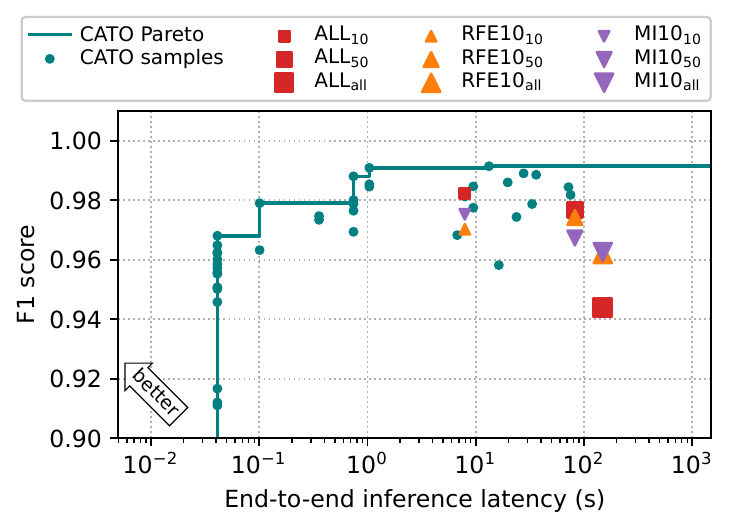{height="330px"}
:::
::: {.column width="50%"}
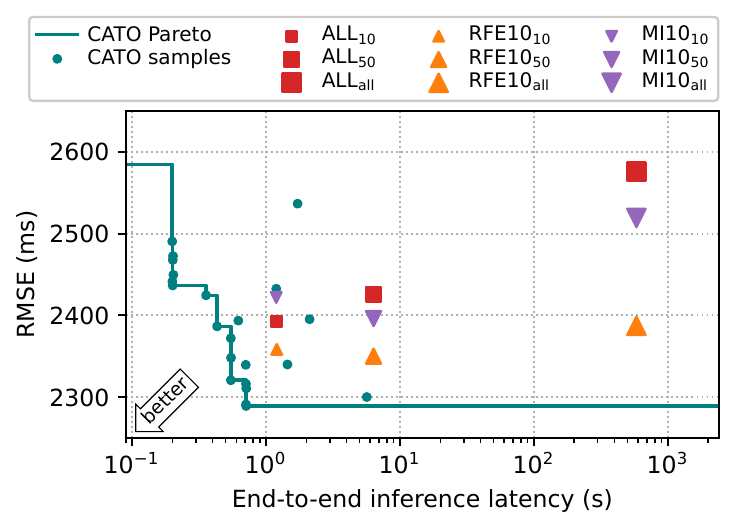{height="330px"}
:::
:::

- Gray points are candidates CATO explored; the front is the set of non-dominated ones
- Note the log-scale x-axis: the wins come from **waiting for fewer packets**, not from a faster model

::: {.notes}
CATO Figure 5a and 5b. Ask students to locate the "all features, all packets" baseline: far right, and not even the most accurate. The regression case matters because it shows the framework is not tied to classification or to tree models (the DNN is trained in TensorFlow).
:::

## Pareto Fronts in Practice: Live Traffic {.smaller}

::: {.columns}
::: {.column width="50%"}
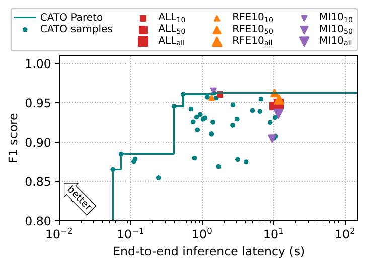{height="330px"}
:::
::: {.column width="50%"}
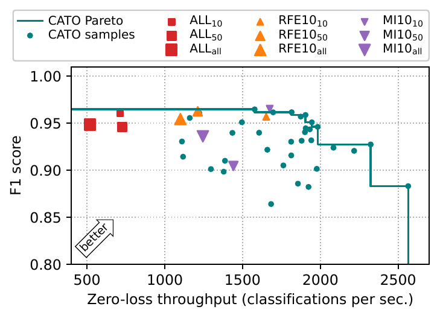{height="330px"}
:::
:::

- Throughput is measured by lowering the NIC's flow-sampling rate until **no packet is dropped for 30 s**
- Single core on purpose, so no configuration saturates the campus ingress; Retina scales per core

::: {.notes}
CATO Figure 5c and 5d. The throughput plot is the one operators care about: it is the x-axis of "can I run this on the box I have." The 37% throughput gain for 0.03 of F1 is an operating-point decision, which is why a front is the right output. Mention the ethics footnote: only aggregate flow statistics and SNI were collected, no payloads, no client IPs.
:::

## How Good Is the Search? {.smaller}

::: {.columns}
::: {.column width="50%"}
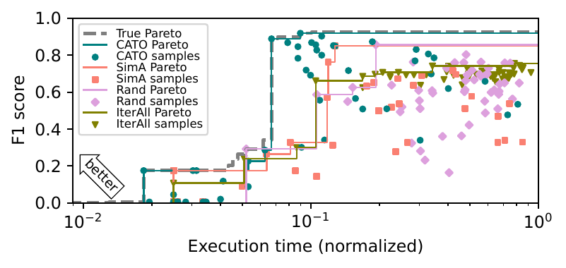{height="280px"}
:::
::: {.column width="50%"}
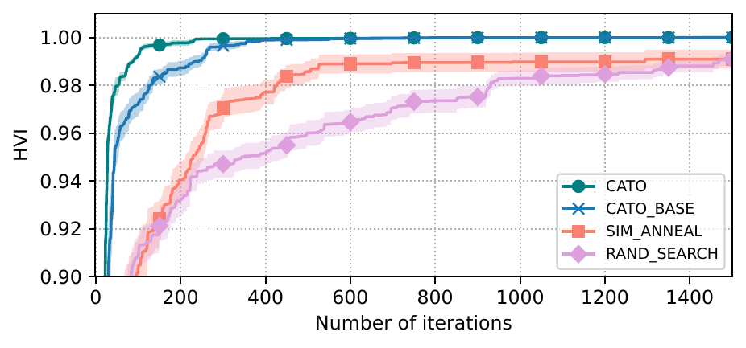{height="280px"}
:::
:::

- CATO samples **under 1.6%** of the search space to approximate the true front
- Restricting to F1 ≥ 0.8: HVI 0.95 for CATO, 0.39 for annealing and random, 0 for iterate-all

::: {.notes}
CATO Figures 7 and 8. The ground-truth front exists only because the six-feature mini candidate set (dur, s_load, s_pkt_cnt, s_bytes_sum, s_bytes_mean, s_iat_mean) is small enough to measure exhaustively. The 2.76x speedup over plain BO comes from the priors: mutual-information priors over features and a linearly decaying prior over depth. CATO is not strictly dominant everywhere (around F1 0.3 the others do fine) but wins at the extremes operators actually use.
:::

## Why Measure Instead of Estimate the Cost? {.smaller}

::: {.columns}
::: {.column width="55%"}
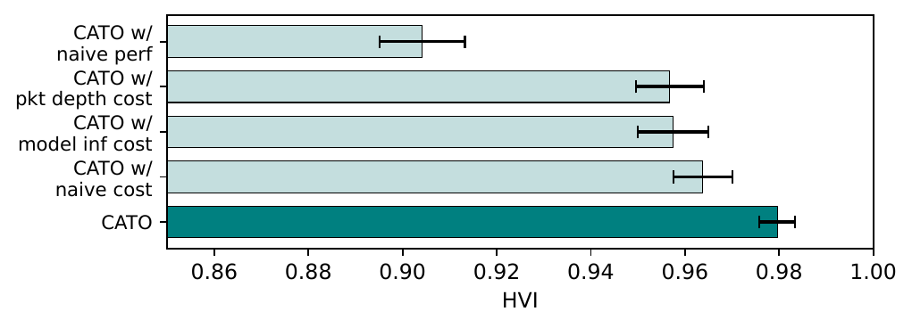{height="330px"}
:::
::: {.column width="45%"}
**Each heuristic fails a different way**

- **Naive cost** (sum of per-feature costs) ignores shared parsing: overestimates
- **Model-inference cost** ignores capture and extraction: underestimates
- **Packet depth as cost** and **MI as performance** give no deployable numbers at all

> A heuristic can lead you to deploy a pipeline that cannot keep up. Only measurement **validates** the operating point.
:::
:::

::: {.notes}
CATO Figure 9. The subtle argument: even if a heuristic found the same front, it could not tell you the actual throughput of the chosen point, so you would still have to build and measure it. CATO folds that validation into the search. Wall-clock cost (Table 5 in the appendix): 9.5 hours for app-class with 67 features and throughput as the cost metric, 2 hours for the six-feature IoT case; most of it is the Profiler measuring cost (546.7 s per iteration for live throughput).
:::

## Packet Depth: How Long to Wait {.smaller}

| Max depth N | Best-F1: n | F1 | Time (µs) | Lowest-time: n | F1 | Time (µs) |
|--:|--:|--:|--:|--:|--:|--:|
| 3 | 3 | 0.959 | 1.37 | 1 | 0.310 | 0.2 |
| 5 | 4 | 0.983 | 1.30 | 1 | 0.520 | 0.26 |
| 10 | 7 | 0.994 | 2.04 | 1 | 0.520 | 0.26 |
| 25 | 7 | 0.989 | 2.61 | 1 | 0.520 | 0.26 |
| 50 | 7 | 0.993 | 2.10 | 1 | 0.461 | 0.27 |
| 100 | 10 | 0.990 | 3.01 | 1 | 0.005 | 0.24 |
| ∞ | 42k | 0.984 | 28.2 | 52k | 0.944 | 16.5 |

: Pareto-optimal solutions with the highest F1 and the lowest execution time for different maximum packet depths, iot-class with 67 candidate features (CATO, Table 3)

- Cap depth at 3 and no solution reaches F1 0.99; allow up to 100 and CATO still picks **7–10 packets**
- Leave depth **unbounded** and the optimizer wanders to 42k packets: bound the search space

::: {.notes}
CATO Table 3. The depth result is the practical takeaway: "how many packets" is a learnable quantity, and it is usually small, but you have to give the optimizer a ceiling. With N unbounded the optimizer can pick any depth up to the longest flow in the training set and fails to converge to a cheap point.
:::

## Sensitivity and Wall-Clock Cost {.smaller}

::: {.columns}
::: {.column width="50%"}
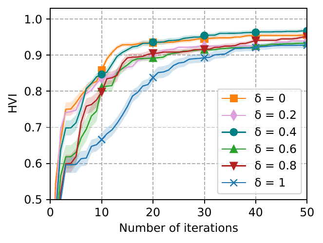{height="200px"}
:::
::: {.column width="50%"}
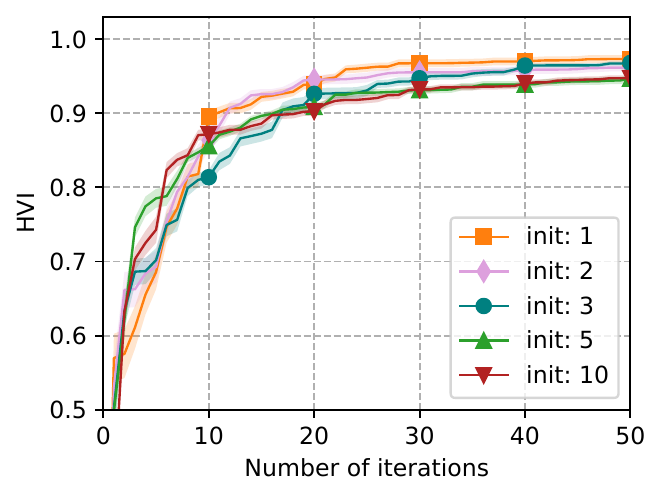{height="200px"}
:::
:::

| Use case / # cand. features, cost metric | app-class / 67, zero-loss throughput | iot-class / 6, processing time |
|---|--:|--:|
| Preprocessing | 22.4 s | 4.1 s |
| Opt. iteration (50x): BO sample | 55.5 s | 1.4 s |
| Opt. iteration (50x): Pipeline generation | 53.1 s | 46.5 s |
| Opt. iteration (50x): Measure perf(x) | 29.6 s | 26.4 s |
| Opt. iteration (50x): Measure cost(x) | 546.7 s | 70.3 s |
| **Total elapsed** | **9.5 h** | **2 h** |

: CATO optimization wall-clock times (CATO, Table 5, appendix)

::: {.notes}
CATO Figure 10 and appendix Table 5. Skip live unless someone asks about hyperparameters. The wall-clock table is worth a sentence: the optimizer itself is cheap; the cost is measuring each candidate pipeline on live traffic, which is exactly the validation you want. Nine and a half hours to find a deployable front for a 67-feature space is a one-time cost per model version, but note it recurs every time a retrain changes the feature set.
:::

## CATO vs. Traffic Refinery {.smaller}

::: {.columns}
::: {.column width="55%"}
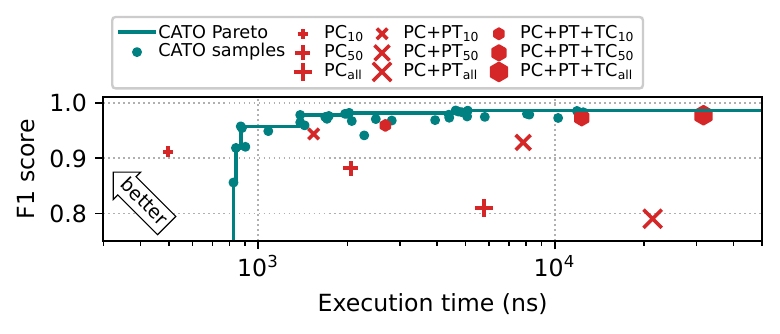{height="330px"}
:::
::: {.column width="45%"}
**What changed between the two systems**

- Traffic Refinery: **manual** exploration over coarse feature classes, per-feature cost profiles
- CATO: **automated** search over individual features *and* depth, end-to-end cost
- For PC₁₀, CATO finds a similar-F1 alternative at a **344 ns** higher execution time
- Adding timing and TCP state raises F1 but costs much more; finding that by hand is trial and error
:::
:::

::: {.notes}
CATO Figure 6. Be fair to Traffic Refinery: it is the paper that established cost-aware feature engineering for network ML, and its cheap packet-counter class at 10 packets happens to be an excellent point. The difference is systematic coverage of the space. Traffic Refinery also profiles state and storage cost, which CATO does not; execution time is the shared metric here.
:::

# Adapting at Serving Time: AC-DC and ServeFlow {.center}

**AC-DC: Adaptive Ensemble Classification for Network Traffic Identification**. Jiang, Liu, Naama, Bronzino, Schmitt, Feamster. arXiv 2302.11718.

**ServeFlow: A Fast-Slow Model Architecture for Network Traffic Analysis**. Liu, Shaowang, Wan, Chae, Marques, Krishnan, Feamster. arXiv 2402.03694.

## AC-DC: The Environment Drifts Too {.smaller}

::: {.columns}
::: {.column width="50%"}
| Classifier Type | F1-Score | TTD (s) | Memory (GB) |
|---|--:|--:|--:|
| Flow-statistics (GMM) | 0.391 | 0.023 | 0.503 |
| Packet-capture (CNN) | 0.977 | 19.689 | 82.463 |

: Flow statistics win on efficiency, packet capture on accuracy (AC-DC, Table 1)

- **Time-to-decision (TTD)**: preprocessing plus inference. The CNN is ~855x slower and needs ~163x more memory
- In both, **feature preprocessing** is the bottleneck: 76.3% of TTD for the GMM, 74.7% for the CNN; model execution never exceeds 30%
:::
::: {.column width="50%"}
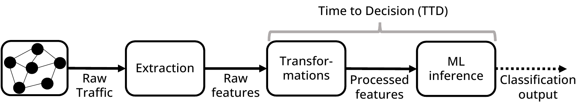{height="200px"}

**What drifts here is the operating environment**: traffic rate and available memory change through the day. A classifier that fits at 500 flows/s may exhaust memory at 7,000.

**AC-DC's idea**: keep a *pool* of classifiers with different feature requirements and switch among them as the load changes.
:::
:::

::: {.notes}
AC-DC Table 1 and Figure 1. Frame it against LEAF: LEAF handles the data changing under a fixed model; AC-DC handles the *system* changing under a fixed accuracy goal. Both are maintenance problems, and both answer with adaptation rather than a single static choice. The "ensemble" here is not the usual bagging-of-algorithms: every member is the same LightGBM, trained on a different subset of nPrint header features, so members differ in cost, not in inductive bias. Flow-statistics baseline is Bernaille et al.'s GMM on the first four packets' sizes and inter-arrival times; packet-capture baseline is Deep Packet's 1D CNN on the first 1500 bytes of the first three packets.
:::

## AC-DC: A Pool of Classifiers and an Adaptive Scheduler {.smaller}

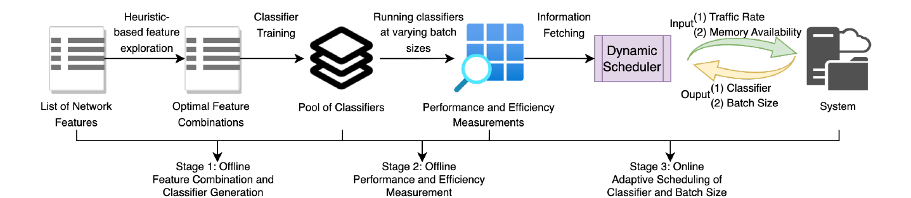{height="190px"}

::: {.columns}
::: {.column width="33%"}
**1. Build the pool (offline)**

- 32 nPrint header fields from the first 3 packets
- Rank features by **importance per bit**; importance correlates with marginal F1 gain (0.753), bits with TTD and memory (above 0.99)
- Take the top combinations at each size 1–9: **90 classifiers**
:::
::: {.column width="33%"}
**2. Measure (offline)**

- For every classifier and **batch size** (flows collected before one inference call): F1, TTD, per-instance memory
- Concurrent instances needed = TTD divided by the time to fill a batch; total memory scales with that count *(formula in the appendix)*
:::
::: {.column width="33%"}
**3. Schedule (online)**

- Inputs: current traffic rate, free memory
- Drop combinations that would exceed memory
- Pick the highest **F1-to-TTD ratio**, optionally above a **minimum performance requirement (MPR)**
- Re-evaluate as rate and memory change
:::
:::

::: {.notes}
AC-DC Figure 2 and Section 3. The heuristic replaces an exhaustive search over all feature subsets (sum over k of 33 choose k) with a ranking by feature importance divided by bit width, justified by two measured correlations. Batch size is the second knob: larger batches amortize preprocessing but delay decisions and let fewer instances run concurrently. The scheduler is Algorithm 1 in the paper: filter by memory, then maximize F1/TTD. Cold-call: "Why not just always pick the most accurate classifier?" Because at 15,000 flows/s its TTD means dozens of concurrent instances and the memory bill explodes.
:::

## AC-DC Results: Throughput and Accuracy {.smaller}

::: {.columns}
::: {.column width="48%"}
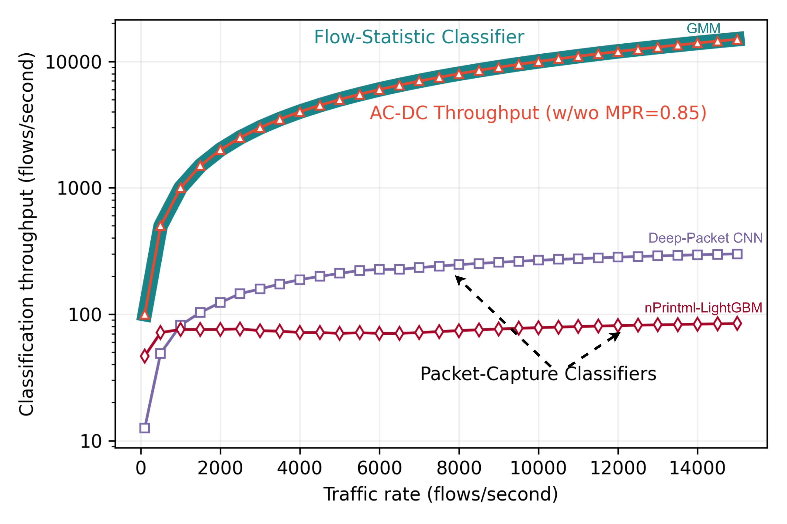{height="250px"}

- F1 **117% higher** than flow statistics; 0.089 and 0.12 below the packet-capture models. Without an MPR, AC-DC still reaches F1 0.80
:::
::: {.column width="52%"}
| Classifier | Model | Avg. F1 | Max. F1 | Min. F1 | Avg. TTD (s) |
|---|---|--:|--:|--:|--:|
| Flow-statistics | GMM | 0.394 | 0.465 | 0.338 | 0.039 |
| **AC-DC** | **LightGBM** | **0.855** | **0.869** | **0.853** | **0.235** |
| Packet-capture | LightGBM | 0.944 | 0.948 | 0.939 | 96.097 |
| Packet-capture | CNN | 0.975 | 0.988 | 0.961 | 30.486 |

: No memory constraint, MPR = 0.85 (AC-DC, Table 3)

- With unlimited memory the scheduler picks the best F1-to-TTD classifier at **batch size 1** and spawns as many instances as the rate requires
:::
:::

::: {.notes}
AC-DC Figure 3, Table 3, and Table 2. With unlimited memory the scheduler picks the best F1/TTD classifier at batch size 1 and spawns as many instances as needed, so throughput tracks the input rate. The accuracy gap to the packet-capture models is the price of using a handful of header fields; the MPR lets the operator set that price. Note the dataset spans 2018 to 2022 collections, which is itself a mild drift test across the three macro services.
:::
## AC-DC: The Dataset Behind the Results {.smaller}

| Macro service | Flows | Applications (flows) | Collected |
|----------------|-----:|-----------------------------------------------------------------------|------------|
| Video streaming | 9465 | Netflix 4104, YouTube 2702, Amazon 1509, Twitch 1150 | 2018-06-01 |
| Video conferencing | 6511 | MS Teams 3886, Google Meet 1313, Zoom 1312 | 2020-05-05 |
| Social media | 3610 | Facebook 1477, Twitter 1260, Instagram 873 | 2022-02-08 |

: The 10-class application dataset, all TLS-encrypted (AC-DC, Table 2)

- Ten applications in three macro-service classes, collected over four years; every flow is TLS-encrypted, so only headers, sizes, and timing are available
- Class imbalance across applications (Netflix 4104 flows vs. Instagram 873) is part of why average and minimum F1 both matter in the results table

::: {.notes}
AC-DC Table 2. Point out the collection dates: three snapshots four years apart is itself a drift story, and the paper trains and tests within the same collection, so the results do not measure drift across years.
:::

## AC-DC Results: Memory and the Balance Point {.smaller}

::: {.columns}
::: {.column width="50%"}
{height="330px"}
:::
::: {.column width="50%"}
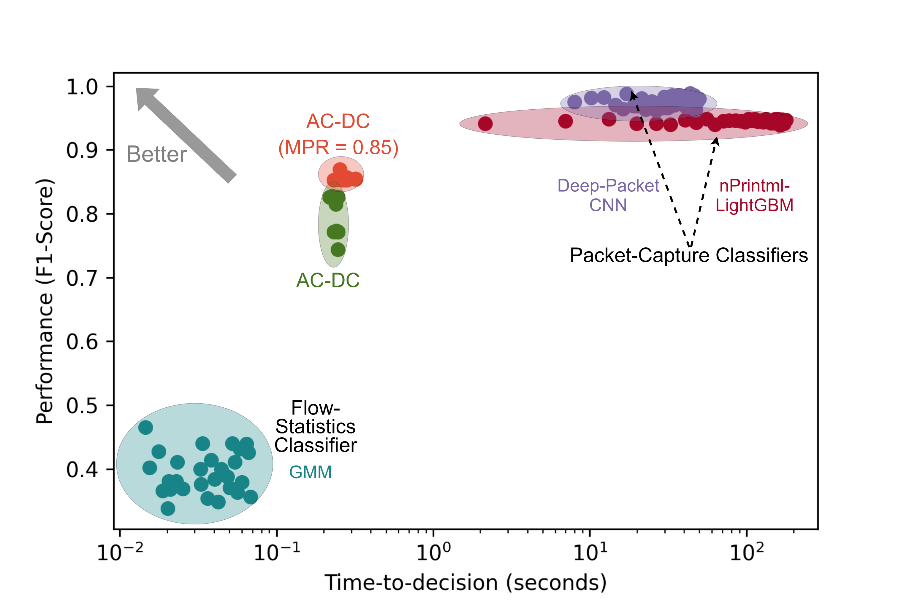{height="330px"}
:::
:::

- Memory requirement is measured by shrinking a Linux cgroup limit by binary search until the classifier misbehaves
- Same shape as CATO and LEAF: the operator picks a **point** (here via the MPR), the system holds it as conditions move

::: {.notes}
AC-DC Figures 4 and 5. Figure 5 is the summary picture: three clusters on a log TTD axis, with AC-DC two orders of magnitude left of the packet-capture models and two to three times more accurate than the GMM. Ask why the packet-capture clusters are wide horizontally: their TTD grows with traffic rate because batch equals rate; AC-DC's does not because the scheduler changes the batch size and classifier.
:::

## AC-DC Adapts as Conditions Change {.smaller}

::: {.columns}
::: {.column width="50%"}
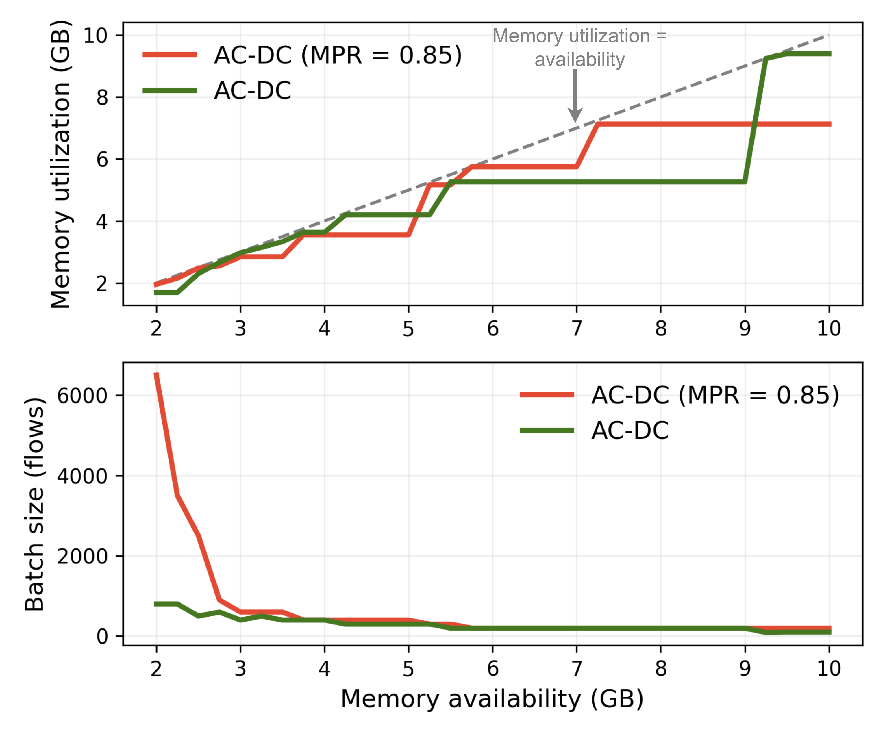{height="330px"}
:::
::: {.column width="50%"}
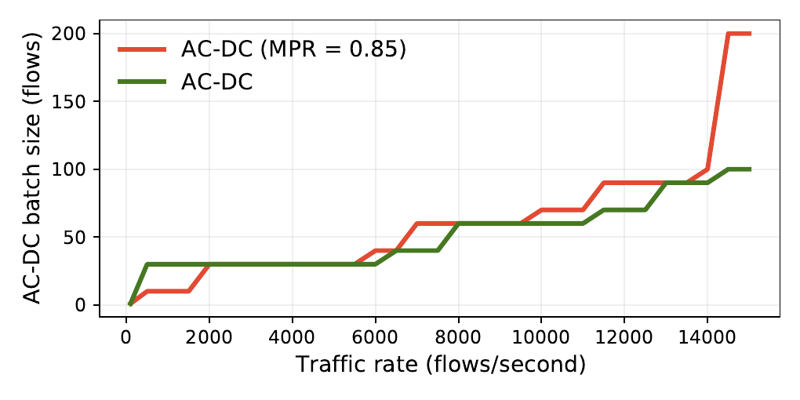{height="300px"}
:::
:::

- The scheduler's objective is a ratio, so it spends resources on **shorter decisions** when it can and on **fewer instances** when it must
- Throughput stays at 100% of the input rate throughout both experiments

::: {.notes}
AC-DC Figures 6 and 7. These are the "is the controller doing what we said" plots. Tie back to the maintenance loop: this is monitoring and adaptation on a timescale of seconds, versus LEAF's weeks to months. Both need the same three ingredients: a signal to watch, a pool of alternatives measured in advance, and a rule for switching. Limitations to mention: header-only features, one model family, and no treatment of data drift itself, which the authors leave to future work.
:::

## Most Flows Are Easy; Waiting Is the Cost {.smaller}

::: {.columns}
::: {.column width="50%"}
| Application | Model | F1 (1 pkt) | F1 (5 pkts) | F1 (10 pkts) |
|---|---|--:|--:|--:|
| Service Recognition | DT | 0.845 | 0.907 | 0.909 |
| | LGBM | 0.921 | 0.967 | 0.973 |
| | CNN | 0.887 | 0.929 | 0.930 |
| Device Identification | DT | 0.812 | 0.824 | 0.827 |
| | LGBM | 0.913 | 0.918 | 0.919 |
| | CNN | 0.881 | 0.910 | 0.911 |
| QoE Inference | DT | 0.715 | 0.740 | 0.745 |
| | LGBM | 0.723 | 0.769 | 0.773 |
| | CNN | 0.710 | 0.752 | 0.764 |

: More packets raise weighted F1 (ServeFlow, Table 1)
:::
::: {.column width="50%"}
| Application | Model | 1 Pkt | 5 Pkts | 10 Pkts |
|---|---|--:|--:|--:|
| Feature Computation | | 0.012 | 0.058 | 0.139 |
| Service Rec. | DT | 0.052 | 0.142 | 0.251 |
| | LGBM | 0.139 | 0.237 | 0.358 |
| | CNN | 0.481 | 3.815 | 7.345 |
| Device Id. | DT | 0.053 | 0.145 | 0.275 |
| | LGBM | 0.210 | 0.322 | 0.460 |
| | CNN | 0.491 | 3.277 | 6.446 |
| VCA QoE | DT | 0.053 | 0.095 | 0.164 |
| | LGBM | 0.162 | 0.218 | 0.298 |
| | CNN | 0.385 | 3.290 | 6.543 |

: Median feature-compute and inference time, ms (ServeFlow, Table 2)
:::
:::

- Inference takes **0.05 to 7 ms**; waiting for the 2nd packet takes tens of ms at the median and up to 10³–10⁶ ms
- Inference time across models differs by **1.8x to 141.3x** for the same task

::: {.notes}
ServeFlow Tables 1 and 2. The same insight as CATO (waiting dominates), now turned into a serving architecture rather than a feature search. Features here are nPrint bit representations of raw headers (recall the nPrint lecture). A single-packet LightGBM already gets F1 0.921 on service recognition, so for most flows the extra nine packets buy 0.05 of F1 at a huge latency cost. The opportunity: spend the wait only on the flows that need it.
:::

## ServeFlow: Cheap Model First, Expensive Model Only When Needed {.smaller}

::: {.columns}
::: {.column width="58%"}
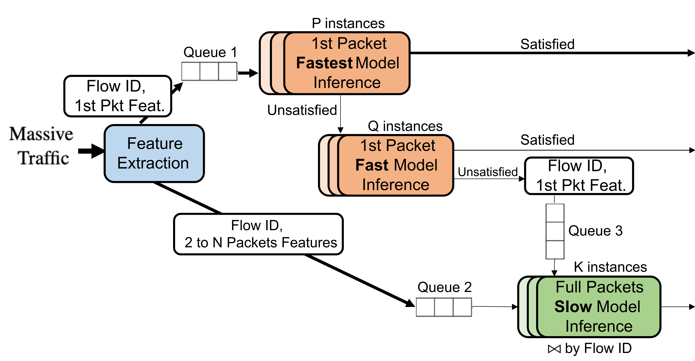{height="260px"}
:::
::: {.column width="42%"}
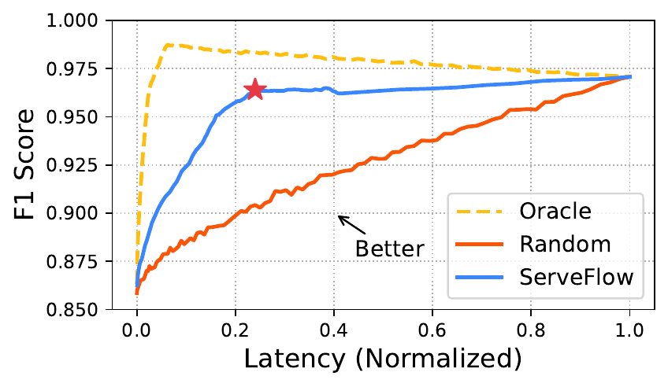{height="240px"}
:::
:::

- Tiers come from the Pareto front of F1 vs. latency over models and packet depths: decision tree on packet 1, LightGBM on packet 1, LightGBM on 10 packets
- Reported: **76.3%** of flows answered in under 16 ms, **40.5x** lower median end-to-end latency at similar accuracy, over **48.5k new flows/s** on a 16-core server

::: {.notes}
ServeFlow Figures 4 and 2, plus the abstract's headline numbers. The assignment rule is uncertainty in the fast model's prediction; an oracle that knew which predictions were wrong is the upper bound. Queues decouple the stages so partial-flow state is handled explicitly, which general-purpose serving systems like TF Serving or Clipper do not do. Connect the four papers: LEAF gives a curve of accuracy versus retrains; CATO a curve of accuracy versus serving cost per feature representation; AC-DC a scheduler that holds an accuracy floor as load and memory change; ServeFlow a curve of accuracy versus latency per flow. Maintenance is choosing and re-choosing points on those curves as the network changes.
:::

# Putting It Together {.center}

## A Maintenance Playbook {.smaller}

::: {.columns}
::: {.column width="50%"}
**What to monitor**

- **Input distributions**: per-feature KS or PSI tests against the training window; catches data drift the day it happens
- **Prediction distributions**: a classifier that suddenly predicts one class 90% of the time is telling you something
- **Delayed labels and errors**: the NRMSE stream, once ground truth arrives; the only direct signal for concept drift
- **Serving metrics**: latency, drop rate, zero-loss throughput; a model that falls behind is wrong too

**When to retrain**

- On a **trigger**, not a calendar; naive periodic retraining can make bursty targets worse
- With data chosen by **where** the error is, not just when
:::
::: {.column width="50%"}
**How to choose an operating point**

- Keep the **Pareto front**, not one model: accuracy vs. retrains (LEAF), accuracy vs. cost (CATO), accuracy vs. latency (ServeFlow)
- Keep a **pool** and a switching rule for load and memory (AC-DC); measure every member in advance
- Re-measure cost after retraining: a new feature set changes the pipeline
- Bound the search: cap packet depth; cap retrains per month

**Humans in the loop**

- Explanations (LEAplot, LEAgram) exist so an operator can **confirm** a cause: lockdown, firmware, data loss
- Keep the old model; roll back if the retrained one is worse
- Match mitigation to model family: resampling helps trees and LSTMs, hurts k-NN
:::
:::

::: {.notes}
Make this concrete with the course project: for whatever model the students built, ask what they would monitor, what the label delay is, and what a retrain costs. Most projects have no monitoring at all; that is normal and it is the gap this lecture is meant to close. Point out the asymmetry: input drift is cheap to detect and label-free, but only error tells you the model is wrong; you need both.
:::

## Summary (1/2)

- **Deployed models decay.** In four years of cellular KPIs, every model family drifted, regardless of training size or period, through sudden (COVID), gradual, and recurring changes
- **Periodic retraining is not a solution.** It is either costly (169 retrains) or harmful (47.79% worse on call-drop rate), because it ignores when, where, and why drift occurs
- **LEAF**: detect from the error stream (KSWIN), explain with Local Error Approximation (LEAplot, LEAgram), mitigate by forgetting and over-sampling. Best or near-best across models and KPIs with 10–77% fewer retrains, and never worse than static

## Summary (2/2)

- **Accuracy has a serving cost.** CATO searches features and packet depth jointly with multi-objective BO and a real profiler: up to 3600x lower latency and 3.7x higher throughput at equal or better accuracy
- **The environment drifts too.** AC-DC keeps a pool of classifiers with different feature costs and a scheduler that switches classifier and batch size as traffic rate and memory change: F1 117% above flow statistics, throughput up to 177x above packet-capture models, 118.8x less memory
- **ServeFlow**: cheap model first, expensive model only for uncertain flows; 76.3% of flows answered in under 16 ms
- **Maintenance is choosing points on curves**, and re-choosing them as the network changes

::: {.notes}
Close the course: the pipeline from Lecture 1 was measure, represent, model, deploy. Today added monitor, diagnose, retrain, and the budgets that constrain them. The three papers are from this research group, so students can ask about what did not make it into the papers: which thresholds were hand-tuned, what the operator actually did with the LEAgrams, what happened when the pipeline was moved to another network.
:::

# Appendix: The Math {.center}

## Normalized RMSE and Its Drift

For model $M$, date $t$, target KPI $k$, and $N_t$ samples on that date:

$$
\mathrm{NRMSE}(M, t) = \frac{\sqrt{\frac{1}{N_t}\sum_{j=1}^{N_t} \left( M(k_{tj}) - \hat{M}(k_{tj}) \right)^2}}{\max_j(k_{tj}) - \min_j(k_{tj})}
$$

The mitigation metric compares a mitigated model $M_1$ against the static model $M_0$ using the time-averaged NRMSE:

$$
\Delta\overline{\mathrm{NRMSE}}(M_1, M_0) = \frac{\overline{\mathrm{NRMSE}}(M_1) - \overline{\mathrm{NRMSE}}(M_0)}{\overline{\mathrm{NRMSE}}(M_0)} \times 100\%
$$

::: {.notes}
NRMSE definition from LEAF Section 2.3 (commented in the source, given in words in the paper) and Equation 1 for the delta. Normalizing by range makes a call-drop-rate model (values under 1) comparable to a volume model (values over 300,000). The paper reports that all phenomena also hold for R², MAE, MAPE, and others.
:::

## The Kolmogorov-Smirnov Test Behind KSWIN

KSWIN keeps a window of the most recent $n$ NRMSE values and compares the newest $r$ of them against the rest. With empirical CDFs $F_{\text{old}}$ and $F_{\text{new}}$, the statistic is

$$
D = \sup_x \left| F_{\mathrm{old}}(x) - F_{\mathrm{new}}(x) \right|
$$

Drift is flagged when $D$ exceeds the critical value for the chosen significance level, roughly

$$
D > \sqrt{-\tfrac{1}{2}\ln\alpha \cdot \tfrac{n + r}{n r}}
$$

::: {.notes}
Standard two-sample KS; KSWIN (Raab et al., 2020) applies it to a sliding window. Non-parametric, which matters because NRMSE series are heavy-tailed and bursty. LEAF describes the detector in Appendix B and cites Raab et al. and Togbe et al.
:::

## CATO's Feature Priors

CATO biases the Bayesian optimizer toward informative features. The prior probability that feature $f$ belongs to a Pareto-optimal representation $x = (F, n)$ is

$$
\mathbb{P}(f \in F \mid x \in \Gamma) = (1 - \delta)\,\frac{I(f)}{I_{\max}} + \frac{\delta}{2}
$$

where $I(f)$ is the mutual information of $f$ with the target, $I_{\max}$ the largest such value, and $\delta$ a damping coefficient ($\delta = 0$: pure MI; $\delta = 1$: uniform). CATO uses $\delta = 0.4$.

The prior over connection depth is a linearly decaying probability mass function (a Beta(1, 2) in the implementation), favoring shallow depths.

::: {.notes}
From CATO Section 3.3 and Section 4. The search space is $\mathbb{X} = \mathcal{P}(\mathcal{F}) \times N$ with $|\mathcal{F}| + 1$ dimensions: one binary indicator per feature plus the depth. The objective is to minimize cost(F, n) and −perf(F, n) jointly; the output is the set Γ of non-dominated points. Figure 10a in the paper shows the sensitivity to δ.
:::

## AC-DC's Memory Model

For classifier $C$ at batch size $B_t$ and traffic rate $R_t$, with measured time-to-decision $\mathrm{TTD}_C(B_t)$ and per-instance memory $m_C(B_t)$, the number of instances that can be running at once is

$$
N_t(B_t, R_t, \mathrm{TTD}_C) = \lceil \mathrm{TTD}_C(B_t) \cdot R_t / B_t \rceil
$$

and the total memory the scheduler must budget for is

$$
M_t(N_t, m_C) = N_t \cdot m_C
$$

Worked example from the paper: memory availability 5 GB, rate 1500 flows/s, TTD 1.5 s, batch 500 flows, 1.5 GB per instance gives ⌈1.5 / (500/1500)⌉ × 1.5 = 6.75 GB (the paper's figure; 7.5 GB if the ceiling is applied first), so that combination is filtered out.

::: {.notes}
AC-DC Equations 1 and 2, Section 3.3. The denominator is the time to fill one batch; if the classifier takes longer than that to finish, batches pile up and instances overlap. Raising the batch size lowers N at the cost of a longer wait per decision, which is exactly the lever Figures 6 and 7 show the scheduler pulling.
:::
